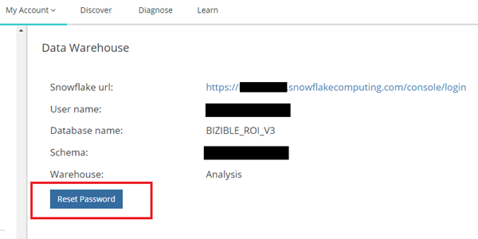
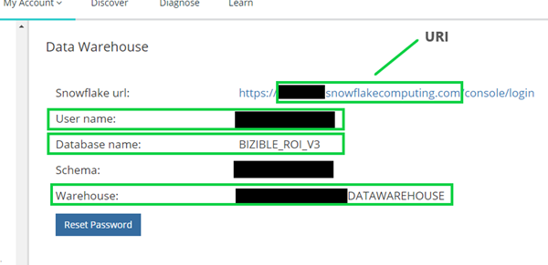

# Acceso a Data Warehouse: Cuenta de Reader {#data-warehouse-access-reader-account}

## Vínculo de acceso de Snowflake {#snowflake-access-link}

Para acceder a Snowflake Data Warehouse, deberá ir a la URL específica de su cuenta de Snowflake. Puede encontrar este vínculo de acceso iniciando sesión en [!DNL Marketo Measure] y siga los pasos a continuación para navegar a la página de información de Data Warehouse.

1. Entrada [!DNL Marketo Measure], en la parte superior de la página, haga clic en **[!UICONTROL Mi cuenta]** > **[!UICONTROL Configuración]**.

   

1. En el menú del lado izquierdo, debajo de Seguridad, haga clic en **[!UICONTROL Data Warehouse]**.

   

1. En esta página encontrará el enlace a su almacén de datos de Snowflake y su nombre de usuario.

   

   >[!NOTE]
   >
   >Se trata de una cuenta de solo lectura disponible para su organización, no solo para un usuario individual. Cualquier usuario de su organización que tenga acceso a [!DNL Marketo Measure] Puede utilizar esta cuenta para iniciar sesión en la cuenta de lector de Datas Warehouse de Snowflake.

1. Haga clic en el enlace proporcionado en la URL del Snowflake, esto le llevará a la página de inicio de sesión del Snowflake donde introducirá su nombre de usuario y contraseña. _Si no tiene su contraseña, consulte los pasos a continuación para restablecerla_.

   

1. Cuando haya iniciado sesión, haga clic en **[!UICONTROL Hojas]** en la parte superior de la página.

   

1. Los objetos de base de datos BIZIBLE_ROI_V3 se encuentran en el lado izquierdo de la pantalla. Introduzca el almacén, la base de datos y el esquema en las opciones desplegables de la parte superior de la ventana de consulta. Solo debe haber una opción para cada uno. Ahora está listo para ejecutar consultas dentro del editor de consultas del Snowflake.

   

## Restablezca su contraseña {#reset-your-password}

[!DNL Marketo Measure] no tiene acceso a la contraseña de inicio de sesión de Snowflake. Si necesita restablecer la contraseña, haga clic en el botón [!UICONTROL Restablecer contraseña] en la página de información de la Data Warehouse y siga las instrucciones. Se mostrará inmediatamente una contraseña temporal en la interfaz de usuario. Se le pedirá que cree su propia contraseña en el próximo inicio de sesión de Data Warehouse.

>[!NOTE]
>
>* Restablecer la contraseña lo restablece para todos [!DNL Marketo Measure] usuarios de su organización, no solo el usuario que ha iniciado sesión actualmente.
>* Solo se muestra la contraseña temporal en la interfaz de usuario. No se enviará un correo electrónico.

## Conexión al Snowflake mediante herramientas de terceros {#connecting-to-snowflake-via-third-party-tools}

deberá introducir algunos datos para conectar el data warehouse de Snowflake con una herramienta de terceros.

>[!NOTE]
>
>Cada herramienta tiene diferentes requisitos de conexión; se recomienda que consulte la documentación de la herramienta específica que está intentando conectar.

* **URI** (siempre obligatorio)
   * Es el nombre de dominio de la cuenta de Snowflake.  Está contenido en una parte del vínculo de inicio de sesión del Snowflake.
* **Nombre de usuario** (siempre obligatorio)
   * El nombre de usuario aparece en la página de información de Data Warehouse de [!DNL Marketo Measure].
* **Contraseña** (siempre obligatorio)
   * Esta es la contraseña que configuró la primera vez que inició sesión en su cuenta de Snowflake.  Para restablecer la contraseña, consulte los pasos descritos anteriormente.
* **Nombre base datos** (no siempre obligatorio)
   * La base de datos es la que almacena los datos en el Snowflake. Es el recurso de almacenamiento. El nombre de la base de datos aparece en la página de información de Data Warehouse de [!DNL Marketo Measure].
* **Nombre del almacén** (no siempre obligatorio)
   * El almacén es lo que ejecuta consultas en Snowflake. Es el recurso de cálculo.  El nombre del almacén aparece en la página de información de Data Warehouse de [!DNL Marketo Measure].

  
