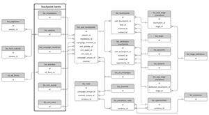

# Esquema de Data Warehouse {#data-warehouse-schema}

La Data Warehouse le permite rastrear todo lo que desee, informar sobre los datos de atribución donde quiera y conectarlos a otros conjuntos de datos.

>[!IMPORTANT]
>
>Las filas con un valor para _DELETED_DATE se conservarán durante 15 días y, a continuación, se eliminarán del Snowflake. Las zonas horarias Snowflake están en UTC.

>[!NOTE]
>
>[Haga clic aquí](#sample-queries) para ver consultas de ejemplo en la parte inferior de este artículo.

## Diagramas de relación de entidades {#entity-relationship-diagrams}

La variable _Modelo de datos de Data Warehouse_ ERD muestra cómo se pretende que los datos del almacén de datos fluyan y se vinculen entre sí. Este diagrama no incluye todas las tablas disponibles en el almacén de datos porque algunas de ellas representan tablas de asignación, vistas de otras tablas ya presentes o tablas obsoletas que ya no se recomienda utilizar. Consulte las descripciones detalladas de las tablas y columnas presentes en el almacén de datos a continuación. Muchas de estas tablas contienen campos no normalizados, sin embargo, este diagrama es el modelo de datos recomendado, aprovechando los datos de las tablas dimensionales en su lugar.

El _Modelo de datos dimensional de anuncios_ ERD presenta una visión de cómo las tablas para dimensiones específicas de anuncios pueden ser mejor vinculadas a las tablas en el modelo de datos principal. Aunque las dimensiones de los anuncios también están desnormalizadas en otras tablas, esto representa el modelo recomendado para unir estas dimensiones.

_Haga clic en una imagen para su versión de tamaño completo_

<table style="table-layout:auto"> 
 <colgroup> 
  <col> 
  <col> 
 </colgroup> 
 <tbody> 
  <tr> 
   <td><strong>Modelo de datos de Data Warehouse</strong></td> 
   <td><strong>Modelo de datos dimensional de anuncios</strong></td> 
  </tr> 
  <tr> 
   <td> 
    <div> 
     <p><a href="assets/data-warehouse-data-model.pdf"></a></p> 
    </div></td>
   <td> 
    <div> 
     <p><a href="assets/ads-dimensional-data-model.pdf"></a></p>
    </div></td> 
  </tr> 
 </tbody> 
</table>

## Vistas {#views}

### BIZ_ACCOUNTS {#biz-accounts}

Cuentas importadas desde el sistema de origen.

<table>
  <tbody>
    <tr>
      <th><strong>Columna</strong></th>
      <th><strong>Tipo de datos</strong></th>
      <th><strong>Descripción</strong></th>
      <th><strong>Datos de muestra</strong></th>
    </tr>
    <tr>
      <td>Identificación</td>
      <td>varchar</td>
      <td>El Id. de cuenta del sistema de origen.</td>
      <td>0013100001kpAZxAAM</td>
    </tr>
    <tr>
      <td>CREATED_DATE</td>
      <td>timestamp_ntz</td>
      <td>La fecha de creación de la Cuenta, desde el sistema de origen.</td>
      <td>2016-08-28 00:32:55.000</td>
    </tr>
    <tr>
      <td>MODIFIED_DATE</td>
      <td>timestamp_ntz</td>
      <td>Fecha de la última modificación de la Cuenta, desde el sistema de origen.</td>
      <td>2018-08-01 17:38:30.000</td>
    </tr>
    <tr>
      <td>NAME</td>
      <td>varchar</td>
      <td>Nombre de la cuenta, desde el sistema de origen.</td>
      <td>[!DNL Marketo Measure]</td>
    </tr>
    <tr>
      <td>WEB_SITE</td>
      <td>varchar</td>
      <td>El sitio web de la cuenta, tal como se registra en el sistema de origen, se utiliza para la asignación de posibles clientes a cuentas.</td>
      <td>www.adobe.com</td>
    </tr>
    <tr>
      <td>ENGAGEMENT_RATING</td>
      <td>varchar</td>
      <td>Un grado de letra (A, B, C, D, N/A) generado a partir del [!DNL Marketo Measure] Modelo de aprendizaje automático. Esto será nulo si ABM está deshabilitado.</td>
      <td>B</td>
    </tr>
    <tr>
      <td>ENGAGEMENT_SCORE</td>
      <td>número(38,19)</td>
      <td>Una puntuación numérica calculada por [!DNL Marketo Measure] Aprendizaje automático para generar la puntuación de participación predictiva (Engagement_Rating). Esto será nulo si ABM está deshabilitado.</td>
      <td>0.1417350147058800000</td>
    </tr>
    <tr>
      <td>DOMINIO</td>
      <td>varchar</td>
      <td>Versión analizada del sitio web que solo almacena el dominio.</td>
      <td>adobe</td>
    </tr>
    <tr>
      <td>IS_DELETED</td>
      <td>booleano</td>
      <td>Indica si el registro se elimina o no en el sistema de origen.</td>
      <td>falso</td>
    </tr>
    <tr>
      <td>CUSTOM_PROPERTIES</td>
      <td>varchar</td>
      <td>Propiedades personalizadas que [!DNL Marketo Measure] se ha importado del sistema de origen, en formato JSON.</td>
      <td>{"Account_Type__c": "Seguridad", "Foo":"Barra"}</td>
    </tr>
    <tr>
      <td>_CREATED_DATE</td>
      <td>timestamp_ntz</td>
      <td>Fecha en la que se creó el registro en el Snowflake.</td>
      <td>2020-01-01 01:01:00.000</td>
    </tr>
    <tr>
      <td>_MODIFIED_DATE</td>
      <td>timestamp_ntz</td>
      <td>Fecha en la que se modificó el registro por última vez en Snowflake.</td>
      <td>2020-01-01 01:01:00.000</td>
    </tr>
    <tr>
      <td>_DELETED_DATE</td>
      <td>timestamp_ntz</td>
      <td>Fecha en la que se marcó el registro como eliminado en el Snowflake.</td>
      <td>2020-01-01 01:01:00.000</td>
    </tr>
  </tbody>
</table>

### BIZ_ACCOUNT_TO_EMAILS {#biz-account-to-emails}

Tabla de asignación entre direcciones de correo electrónico de posible cliente/contacto y cuentas conocidas. Esta tabla estará vacía si ABM está deshabilitado.

<table>
  <tbody>
    <tr>
    <th><strong>Columna</strong></th>
      <th><strong>Tipo de datos</strong></th>
      <th><strong>Descripción</strong></th>
      <th><strong>Datos de muestra</strong></th>
    </tr>
    <tr>
      <td>Identificación</td>
      <td>varchar</td>
      <td>Un identificador único para el registro.</td>
      <td>0013800001MMPPiAAP_person@adobe.com|2022-01-05 17:22:13 000</td>
    </tr>
    <tr>
      <td>
        <p>ACCOUNT_ID</p>
      </td>
      <td>
        <p>varchar</p>
      </td>
      <td>
        <p>Identificador de cuenta del sistema de origen.</p>
      </td>
      <td>
        <p>0013100001phrBAAAY</p>
      </td>
    </tr>
    <tr>
      <td>
        <p>CORREO ELECTRÓNICO</p>
      </td>
      <td>
        <p>varchar</p>
      </td>
      <td>
        <p>Dirección de correo electrónico asignada a la cuenta, ya sea a través de relaciones de contacto o de la asignación de posibles clientes a cuentas .</p>
      </td>
      <td>
        <p>person@adobe.com</p>
      </td>
    </tr>
    <tr>
      <td>
        <p>MODIFIED_DATE</p>
      </td>
      <td>
        <p>timestamp_ntz</p>
      </td>
      <td>
        <p>Fecha de la última modificación de la Cuenta, desde el sistema de origen.</p>
      </td>
      <td>
        <p>2018-08-31 23:53:39.000</p>
      </td>
    </tr>
    <tr>
      <td>
        <p>CREATED_DATE</p>
      </td>
      <td>
        <p>timestamp_ntz</p>
      </td>
      <td>
        <p>La fecha de creación de la Cuenta, desde el sistema de origen.</p>
      </td>
      <td>
        <p>2018-08-18 22:01:32.000</p>
      </td>
    </tr>
    <tr>
      <td>
        <p>IS_DELETED</p>
      </td>
      <td>
        <p>booleano</p>
      </td>
      <td>
        <p>Indica si el registro se considera eliminado o no.</p>
      </td>
      <td>
        <p>falso</p>
      </td>
    </tr>
    <tr>
      <td>_CREATED_DATE</td>
      <td>timestamp_ntz</td>
      <td>Fecha en la que se creó el registro en el Snowflake.</td>
      <td>2020-01-01 01:01:00.000</td>
    </tr>
    <tr>
      <td>_MODIFIED_DATE</td>
      <td>timestamp_ntz</td>
      <td>Fecha en la que se modificó el registro por última vez en Snowflake.</td>
      <td>2020-01-01 01:01:00.000</td>
    </tr>
    <tr>
      <td>_DELETED_DATE</td>
      <td>timestamp_ntz</td>
      <td>Fecha en la que se marcó el registro como eliminado en el Snowflake.</td>
      <td>2020-01-01 01:01:00.000</td>
    </tr>
  </tbody>
</table>

### BIZ_ACTIVITIES {#biz-activities}

Actividades importadas desde un sistema de origen o una cuenta de anuncio conectada.

<table>
  <tbody>
  <tr>
    <th><strong>Columna</strong></th>
    <th><strong>Tipo de datos</strong></th>
    <th><strong>Descripción</strong></th>
    <th><strong>Datos de muestra</strong></th>
    </tr>
    <tr>
      <td>
        <p>Identificación</p>
      </td>
      <td>
        <p>varchar</p>
      </td>
      <td>
        <p>El ID de actividad del sistema de origen.</p>
      </td>
      <td>
        <p>1678625515</p>
      </td>
    </tr>
    <tr>
      <td>
        <p>LEAD_ID</p>
      </td>
      <td>
        <p>varchar</p>
      </td>
      <td>Id del posible cliente asociado a la actividad.</td>
      <td>
        <p>15530482</p>
      </td>
    </tr>
    <tr>
      <td>
        <p>CONTACT_ID</p>
      </td>
      <td>
        <p>varchar</p>
      </td>
      <td>
        <p>Id del contacto asociado a la actividad.</p>
      </td>
      <td>
        <p>13792552</p>
      </td>
    </tr>
    <tr>
      <td>
        <p>ACTIVITY_TYPE_ID</p>
      </td>
      <td>
        <p>varchar</p>
      </td>
      <td>
        <p>Id. del tipo de actividad, del sistema de origen.</p>
      </td>
      <td>
        <p>104</p>
      </td>
    </tr>
    <tr>
      <td>ACTIVITY_TYPE_NAME</td>
      <td>varchar</td>
      <td>Nombre de la actividad, desde el sistema de origen.</td>
      <td>
        <p>estado de cambio en la progresión</p>
      </td>
    </tr>
    <tr>
      <td>START_DATE</td>
      <td>timestamp_ntz</td>
      <td>Fecha de inicio de la actividad, desde el sistema de origen.</td>
      <td>2020-01-01 01:01:00.000</td>
    </tr>
    <tr>
      <td>END_DATE</td>
      <td>timestapm_ntz</td>
      <td>Fecha de finalización de la actividad, desde el sistema de origen.</td>
      <td>2020-01-01 01:01:00.000</td>
    </tr>
    <tr>
      <td>CAMPAIGN_ID</td>
      <td>varchar</td>
      <td>Id de la campaña de la que forma parte la actividad desde el sistema de origen.</td>
      <td>
        <p>li.508038570.147643566</p>
      </td>
    </tr>
    <tr>
      <td>SOURCE_SYSTEM</td>
      <td>varchar</td>
      <td>Identifica el tipo de sistema de origen.</td>
      <td>Marketo</td>
    </tr>
    <tr>
      <td>CREATED_DATE</td>
      <td>timestamp_ntz</td>
      <td>Fecha en la que se creó la fila en el sistema de origen.</td>
      <td>2020-01-01 01:01:00.000</td>
    </tr>
    <tr>
      <td>MODIFIED_DATE</td>
      <td>timestamp_ntz</td>
      <td>Fecha en la que se modificó la fila por última vez en el sistema de origen.</td>
      <td>2020-01-01 01:01:00.000</td>
    </tr>
    <tr>
      <td>IS_DELETD</td>
      <td>booleano</td>
      <td>Indica si el registro se considera eliminado en el sistema de origen.</td>
      <td>falso</td>
    </tr>
    <tr>
      <td>AD_FORM_ID</td>
      <td>varchar</td>
      <td>Id del formulario de publicidad del que forma parte la actividad, desde el sistema de origen.</td>
      <td>li.507063119.3757704</td>
    </tr>
    <tr>
      <td>_CREATED_DATE</td>
      <td>timestamp_ntz</td>
      <td>Fecha en la que se creó el registro en el Snowflake.</td>
      <td>2020-01-01 01:01:00.000</td>
    </tr>
    <tr>
      <td>_MODIFIED_DATE</td>
      <td>timestamp_ntz</td>
      <td>Fecha en la que se modificó el registro por última vez en Snowflake.</td>
      <td>2020-01-01 01:01:00.000</td>
    </tr>
    <tr>
      <td>_DELETED_DATE</td>
      <td>timestamp_ntz</td>
      <td>Fecha en la que se marcó el registro como eliminado en el Snowflake.</td>
      <td>2020-01-01 01:01:00.000</td>
    </tr>
  </tbody>
</table>

### BIZ_ADS {#biz-ads}

Anuncios importados desde cualquier cuenta de anuncio conectada.

<table>
  <tbody>
    <tr>
      <th>
        <p><strong>Columna</strong></p>
      </th>
      <th>
        <p><strong>Tipo de datos</strong></p>
      </th>
      <th>
        <p><strong>Descripción</strong></p>
      </th>
      <th>
        <p><strong>Datos de muestra</strong></p>
      </th>
    </tr>
    <tr>
      <td>
        <p>Identificación</p>
      </td>
      <td>
        <p>varchar</p>
      </td>
      <td>
        <p>Un identificador único para el anuncio.</p>
      </td>
      <td>
        <p>fb.106851586409075.6052044288804.6052044290004.6053457 66804</p>
      </td>
    </tr>
    <tr>
      <td>
        <p>DISPLAY_ID</p>
      </td>
      <td>
        <p>varchar</p>
      </td>
      <td>
        <p>El ID de anuncio del sistema de origen.</p>
      </td>
      <td>
        <p>6053457066804</p>
      </td>
    </tr>
    <tr>
      <td>
        <p>AD_ACCOUNT_UNIQUE_ID</p>
      </td>
      <td>
        <p>varchar</p>
      </td>
      <td>
        <p>Id de la cuenta de anuncio desde la que se importó el anuncio.</p>
      </td>
      <td>
        <p>fb.106851586409075</p>
      </td>
    </tr>
    <tr>
      <td>
        <p>AD_ACCOUNT_NAME</p>
      </td>
      <td>
        <p>varchar</p>
      </td>
      <td>
        <p>Nombre de la cuenta de anuncio desde la que se importó el anuncio.</p>
      </td>
      <td>
        <p>[!DNL Marketo Measure] Cuenta</p>
      </td>
    </tr>
    <tr>
      <td>
        <p>ADVERTISER_UNIQUE_ID</p>
      </td>
      <td>
        <p>varchar</p>
      </td>
      <td>
        <p>Id del anunciante para el anuncio, específicamente para Doubleclick.</p>
      </td>
      <td>
        <p>300181641</p>
      </td>
    </tr>
    <tr>
      <td>
        <p>ADVERTISER_NAME</p>
      </td>
      <td>
        <p>varchar</p>
      </td>
      <td>
        <p>Nombre del Anunciante para el Anuncio, específicamente para Doubleclick.</p>
      </td>
      <td>
        <p>Marketing Analytics</p>
      </td>
    </tr>
    <tr>
      <td>
        <p>AD_GROUP_UNIQUE_ID</p>
      </td>
      <td>
        <p>varchar</p>
      </td>
      <td>
        <p>Id del grupo de publicidad para la publicidad.</p>
      </td>
      <td>
        <p>fb.106851586409075.6052044288804.6052044290004</p>
      </td>
    </tr>
    <tr>
      <td>
        <p>AD_GROUP_NAME</p>
      </td>
      <td>
        <p>varchar</p>
      </td>
      <td>
        <p>Nombre del grupo de publicidad para la publicidad.</p>
      </td>
      <td>
        <p>Conjunto de anuncios para el anuncio B</p>
      </td>
    </tr>
    <tr>
      <td>
        <p>AD_CAMPAIGN_UNIQUE_ID</p>
      </td>
      <td>
        <p>varchar</p>
      </td>
      <td>
        <p>Id de la campaña para la publicidad.</p>
      </td>
      <td>
        <p>fb.106851586409075.6052044288804</p>
      </td>
    </tr>
    <tr>
      <td>
        <p>AD_CAMPAIGN_NAME</p>
      </td>
      <td>
        <p>varchar</p>
      </td>
      <td>
        <p>Nombre de la campaña de la publicidad.</p>
      </td>
      <td>
        <p>Campaña de generación de posibles clientes</p>
      </td>
    </tr>
    <tr>
      <td>
        <p>IS_ACTIVE</p>
      </td>
      <td>
        <p>booleano</p>
      </td>
      <td>
        <p>Indica si el anuncio sigue activo o no en el sistema de origen.</p>
      </td>
      <td>
        <p>falso</p>
      </td>
    </tr>
    <tr>
      <td>
        <p>IS_DELETED</p>
      </td>
      <td>
        <p>booleano</p>
      </td>
      <td>
        <p>Indica si el anuncio se ha eliminado o no en el sistema de origen.</p>
      </td>
      <td>
        <p>falso</p>
      </td>
    </tr>
    <tr>
      <td>
        <p>MODIFIED_DATE</p>
      </td>
      <td>
        <p>timestamp_ntz</p>
      </td>
      <td>
        <p>Fecha de la última modificación del registro.</p>
      </td>
      <td>
        <p>2018-08-02 06:35:59.000</p>
      </td>
    </tr>
    <tr>
      <td>
        <p>FIRST_IMPORTED</p>
      </td>
      <td>
        <p>timestamp_ntz</p>
      </td>
      <td>
        <p>Fecha en la que se importó por primera vez el registro desde el sistema de origen.</p>
      </td>
      <td>
        <p>2018-08-02 06:35:59.000</p>
      </td>
    </tr>
    <tr>
      <td>
        <p>NAME</p>
      </td>
      <td>
        <p>varchar</p>
      </td>
      <td>
        <p>Nombre del anuncio, del sistema de origen.</p>
      </td>
      <td>
        <p>Anuncio 2</p>
      </td>
    </tr>
    <tr>
      <td>
        <p>NEEDS_UPDATE</p>
      </td>
      <td>
        <p>booleano</p>
      </td>
      <td>
        <p>Si la publicidad debe actualizarse o no para [!DNL Marketo Measure] etiquetado.</p>
        <p>(Campo de diagnóstico, utilizado por el procesamiento interno).</p>
      </td>
      <td>
        <p>falso</p>
      </td>
    </tr>
    <tr>
      <td>
        <p>GROUPING_KEY</p>
      </td>
      <td>
        <p>varchar</p>
      </td>
      <td>Campo de diagnóstico, utilizado para el procesamiento interno.</td>
      <td>
        <p>fb.106851586409075.6052044288804.6052044290004</p>
      </td>
    </tr>
    <tr>
      <td>
        <p>ENTITY_TYPE</p>
      </td>
      <td>
        <p>varchar</p>
      </td>
      <td>
        <p>El objeto o entidad principal de esta tabla. En este caso, "Ad".</p>
      </td>
      <td>
        <p>Anuncio</p>
      </td>
    </tr>
    <tr>
      <td>
        <p>PROVIDER_TYPE</p>
      </td>
      <td>
        <p>varchar</p>
      </td>
      <td>
        <p>Nombre del proveedor de publicidad para el anuncio.</p>
      </td>
      <td>
        <p>Facebook</p>
      </td>
    </tr>
    <tr>
      <td>
        <p>URL_CURRENT</p>
      </td>
      <td>
        <p>varchar</p>
      </td>
      <td>
        <p>Dirección URL de la página de aterrizaje.</p>
        <p>(Campo de diagnóstico, para procesamiento interno).</p>
      </td>
      <td></td>
    </tr>
    <tr>
      <td>
        <p>URL_OLD</p>
      </td>
      <td>
        <p>varchar</p>
      </td>
      <td>
        <p>Valor anterior para URL_CURRENT.</p>
        <p>(Campo de diagnóstico, para procesamiento interno).</p>
      </td>
      <td></td>
    </tr>
    <tr>
      <td>
        <p>URL_REQUESTED</p>
      </td>
      <td>
        <p>varchar</p>
      </td>
      <td>
        <p>Con qué se decorará la dirección URL [!DNL Marketo Measure] parámetros.</p>
        <p>(Campo de diagnóstico, para procesamiento interno).</p>
      </td>
      <td></td>
    </tr>
    <tr>
      <td>
        <p>URL_ALTENATIVES</p>
      </td>
      <td>
        <p>varchar</p>
      </td>
      <td>
        <p>Importado desde el sistema de origen.</p>
        <p>(Campo de diagnóstico, para procesamiento interno).</p>
      </td>
      <td></td>
    </tr>
    <tr>
      <td>
        <p>ROW_KEY</p>
      </td>
      <td>
        <p>número(38,0)</p>
      </td>
      <td>
        <p>Clave externa de la vista Biz_Facts.</p>
      </td>
      <td>
        <p>6008900572523230000</p>
      </td>
    </tr>
    <tr>
      <td>_CREATED_DATE</td>
      <td>timestamp_ntz</td>
      <td>Fecha en la que se creó el registro en el Snowflake.</td>
      <td>2020-01-01 01:01:00.000</td>
    </tr>
    <tr>
      <td>_MODIFIED_DATE</td>
      <td>timestamp_ntz</td>
      <td>Fecha en la que se modificó el registro por última vez en Snowflake.</td>
      <td>2020-01-01 01:01:00.000</td>
    </tr>
    <tr>
      <td>_DELETED_DATE</td>
      <td>timestamp_ntz</td>
      <td>Fecha en la que se marcó el registro como eliminado en el Snowflake.</td>
      <td>2020-01-01 01:01:00.000</td>
    </tr>
  </tbody>
</table>

### BIZ_ADVERTISERS {#biz-advertisers}

Anunciantes importados desde cualquier cuenta de publicidad conectada.

<table>
  <tbody>
    <tr>
      <th>
        <p>Columna</p>
      </th>
      <th>
        <p>Tipo de datos</p>
      </th>
      <th>
        <p>Descripción</p>
      </th>
      <th>
        <p>Datos de muestra</p>
      </th>
    </tr>
    <tr>
      <td>
        <p>Identificación</p>
      </td>
      <td>
        <p>varchar</p>
      </td>
      <td>
        <p>Un identificador único para el anunciante.</p>
      </td>
      <td>
        <p>dc.6114.9143143</p>
      </td>
    </tr>
    <tr>
      <td>
        <p>DISPLAY_ID</p>
      </td>
      <td>
        <p>varchar</p>
      </td>
      <td>El ID del anunciante del sistema de origen.</td>
      <td>9143143</td>
    </tr>
    <tr>
      <td>
        <p>AD_ACCOUNT_UNIQUE_ID</p>
      </td>
      <td>
        <p>varchar</p>
      </td>
      <td>
        <p>Id de la cuenta de anuncio desde la que se importó el anuncio.</p>
      </td>
      <td>
        <p>fb.106851586409075</p>
      </td>
    </tr>
    <tr>
      <td>
        <p>AD_ACCOUNT_NAME</p>
      </td>
      <td>
        <p>varchar</p>
      </td>
      <td>
        <p>Nombre de la cuenta de anuncio desde la que se importó el anuncio.</p>
      </td>
      <td>
        <p>[!DNL Marketo Measure] Cuenta</p>
      </td>
    </tr>
    <tr>
      <td>
        <p>ADVERTISER_UNIQUE_ID</p>
      </td>
      <td>
        <p>varchar</p>
      </td>
      <td>
        <p>Id del Anunciante, específicamente para Doubleclick.</p>
      </td>
      <td>
        <p>300181641</p>
      </td>
    </tr>
    <tr>
      <td>
        <p>ADVERTISER_NAME</p>
      </td>
      <td>
        <p>varchar</p>
      </td>
      <td>
        <p>Nombre del Anunciante, específicamente para Doubleclick.</p>
      </td>
      <td>
        <p>[!DNL Marketo Measure] Marketing Analytics</p>
      </td>
    </tr>
    <tr>
      <td>
        <p>AD_GROUP_UNIQUE_ID</p>
      </td>
      <td>
        <p>varchar</p>
      </td>
      <td>
        <p>Se espera que sea nulo, ya que no hay ningún grupo de anuncios por encima del anunciante en ninguna jerarquía de anuncios.</p>
      </td>
      <td>
        <p>nulo</p>
      </td>
    </tr>
    <tr>
      <td>
        <p>AD_GROUP_NAME</p>
      </td>
      <td>
        <p>varchar</p>
      </td>
      <td>
        <p>Se espera que sea nulo, ya que no hay ningún grupo de anuncios por encima del anunciante en ninguna jerarquía de anuncios.</p>
      </td>
      <td>
        <p>nulo</p>
      </td>
    </tr>
    <tr>
      <td>
        <p>AD_CAMPAIGN_UNIQUE_ID</p>
      </td>
      <td>
        <p>varchar</p>
      </td>
      <td>
        <p>Se espera que sea nulo, ya que no hay ninguna campaña de publicidad por encima del Anunciante en ninguna jerarquía de anuncios.</p>
      </td>
      <td>
        <p>nulo</p>
      </td>
    </tr>
    <tr>
      <td>
        <p>AD_CAMPAIGN_NAME</p>
      </td>
      <td>
        <p>varchar</p>
      </td>
      <td>
        <p>Se espera que sea nulo, ya que no hay ninguna campaña por encima del Anunciante de publicidad en ninguna jerarquía de anuncios.</p>
      </td>
      <td>
        <p>nulo</p>
      </td>
    </tr>
    <tr>
      <td>
        <p>IS_ACTIVE</p>
      </td>
      <td>
        <p>booleano</p>
      </td>
      <td>
        <p>Indica si el Anunciante sigue activo o no en el sistema de origen.</p>
      </td>
      <td>
        <p>verdadero</p>
      </td>
    </tr>
    <tr>
      <td>
        <p>IS_DELETED</p>
      </td>
      <td>
        <p>booleano</p>
      </td>
      <td>
        <p>Indica si el Anunciante se ha eliminado o no en el sistema de origen.</p>
      </td>
      <td>
        <p>falso</p>
      </td>
    </tr>
    <tr>
      <td>
        <p>MODIFIED_DATE</p>
      </td>
      <td>
        <p>timestamp_ntz</p>
      </td>
      <td>
        <p>Fecha de la última modificación del registro.</p>
      </td>
      <td>
        <p>2018-08-02 06:35:59.000</p>
      </td>
    </tr>
    <tr>
      <td>
        <p>FIRST_IMPORTED</p>
      </td>
      <td>
        <p>timestamp_ntz</p>
      </td>
      <td>
        <p>Fecha en la que se importó por primera vez el registro desde el sistema de origen.</p>
      </td>
      <td>
        <p>2018-08-02 06:35:59.000</p>
      </td>
    </tr>
    <tr>
      <td>
        <p>NAME</p>
      </td>
      <td>
        <p>varchar</p>
      </td>
      <td>
        <p>Nombre del Anunciante, del sistema de origen.</p>
      </td>
      <td>
        <p>[!DNL Marketo Measure] Marketing Analytics</p>
      </td>
    </tr>
    <tr>
      <td>
        <p>NEEDS_UPDATE</p>
      </td>
      <td>
        <p>booleano</p>
      </td>
      <td>
        <p>Si el anunciante debe actualizarse o no para [!DNL Marketo Measure] etiquetado.</p>
        <p>(Campo de diagnóstico, utilizado por el procesamiento interno).</p>
      </td>
      <td>
        <p>falso</p>
      </td>
    </tr>
    <tr>
      <td>
        <p>GROUPING_KEY</p>
      </td>
      <td>
        <p>varchar</p>
      </td>
      <td>Campo de diagnóstico, utilizado para el procesamiento interno.</td>
      <td></td>
    </tr>
    <tr>
      <td>
        <p>ENTITY_TYPE</p>
      </td>
      <td>
        <p>varchar</p>
      </td>
      <td>
        <p>El objeto o entidad principal de esta tabla. En este caso, "Anunciante".</p>
      </td>
      <td>
        <p>Anunciante</p>
      </td>
    </tr>
    <tr>
      <td>
        <p>PROVIDER_TYPE</p>
      </td>
      <td>
        <p>varchar</p>
      </td>
      <td>
        <p>El proveedor de publicidad para el anunciante.</p>
      </td>
      <td>
        <p>Doubleclick</p>
      </td>
    </tr>
    <tr>
      <td>
        <p>ROW_KEY</p>
      </td>
      <td>
        <p>número(38,0)</p>
      </td>
      <td>
        <p>Clave externa de la vista Biz_Facts.</p>
      </td>
      <td>
        <p>6008900572523230000</p>
      </td>
    </tr>
    <tr>
      <td>_CREATED_DATE</td>
      <td>timestamp_ntz</td>
      <td>Fecha en la que se creó el registro en el Snowflake.</td>
      <td>2020-01-01 01:01:00.000</td>
    </tr>
    <tr>
      <td>_MODIFIED_DATE</td>
      <td>timestamp_ntz</td>
      <td>Fecha en la que se modificó el registro por última vez en Snowflake.</td>
      <td>2020-01-01 01:01:00.000</td>
    </tr>
    <tr>
      <td>_DELETED_DATE</td>
      <td>timestamp_ntz</td>
      <td>Fecha en la que se marcó el registro como eliminado en el Snowflake.</td>
      <td>2020-01-01 01:01:00.000</td>
    </tr>
  </tbody>
</table>

### BIZ_AD_ACCOUNTS {#biz-ad-accounts}

Cuentas de publicidad importadas desde cualquier cuenta de publicidad conectada.

<table>
  <tbody>
    <tr>
      <th>
        <p>Columna</p>
      </th>
      <th>
        <p>Tipo de datos</p>
      </th>
      <th>
        <p>Descripción</p>
      </th>
      <th>
        <p>Datos de muestra</p>
      </th>
    </tr>
    <tr>
      <td>
        <p>Identificación</p>
      </td>
      <td>
        <p>varchar</p>
      </td>
      <td>
        <p>Identificador único de la cuenta de anuncio.</p>
      </td>
      <td>
        <p>aw.6601259029</p>
      </td>
    </tr>
    <tr>
      <td>
        <p>DISPLAY_ID</p>
      </td>
      <td>
        <p>varchar</p>
      </td>
      <td>El ID de cuenta de anuncio del sistema de origen.</td>
      <td>
        <p>6601259029</p>
      </td>
    </tr>
    <tr>
      <td>
        <p>AD_ACCOUNT_UNIQUE_ID</p>
      </td>
      <td>
        <p>varchar</p>
      </td>
      <td>Se espera que sea nulo, ya que este es el registro de las cuentas de publicidad en la jerarquía de anuncios.</td>
      <td>nulo</td>
    </tr>
    <tr>
      <td>
        <p>AD_ACCOUNT_NAME</p>
      </td>
      <td>
        <p>varchar</p>
      </td>
      <td>Se espera que sea nulo, ya que este es el registro de las cuentas de publicidad en la jerarquía de anuncios.</td>
      <td>nulo</td>
    </tr>
    <tr>
      <td>
        <p>ADVERTISER_UNIQUE_ID</p>
      </td>
      <td>
        <p>varchar</p>
      </td>
      <td>
        <p>Se espera que sea nulo, ya que no hay ningún Anunciante por encima de las cuentas de publicidad en ninguna jerarquía de anuncios.</p>
      </td>
      <td>nulo</td>
    </tr>
    <tr>
      <td>
        <p>ADVERTISER_NAME</p>
      </td>
      <td>
        <p>varchar</p>
      </td>
      <td>
        <p>Se espera que sea nulo, ya que no hay ningún Anunciante por encima de las cuentas de publicidad en ninguna jerarquía de anuncios.</p>
      </td>
      <td>nulo</td>
    </tr>
    <tr>
      <td>
        <p>AD_GROUP_UNIQUE_ID</p>
      </td>
      <td>
        <p>varchar</p>
      </td>
      <td>
        <p>Se espera que sea nulo porque no hay ningún grupo de anuncios por encima de las cuentas de publicidad en ninguna jerarquía de anuncios.</p>
      </td>
      <td>nulo</td>
    </tr>
    <tr>
      <td>
        <p>AD_GROUP_NAME</p>
      </td>
      <td>
        <p>varchar</p>
      </td>
      <td>
        <p>Se espera que sea nulo porque no hay ningún grupo de anuncios por encima de las cuentas de publicidad en ninguna jerarquía de anuncios.</p>
      </td>
      <td>nulo</td>
    </tr>
    <tr>
      <td>
        <p>AD_CAMPAIGN_UNIQUE_ID</p>
      </td>
      <td>
        <p>varchar</p>
      </td>
      <td>
        <p>Se espera que sea nulo, ya que no hay ninguna campaña de publicidad por encima de las cuentas de publicidad en ninguna jerarquía de anuncios.</p>
      </td>
      <td>nulo</td>
    </tr>
    <tr>
      <td>
        <p>AD_CAMPAIGN_NAME</p>
      </td>
      <td>
        <p>varchar</p>
      </td>
      <td>
        <p>Se espera que sea nulo, ya que no hay ninguna campaña de publicidad por encima de las cuentas de publicidad en ninguna jerarquía de anuncios.</p>
      </td>
      <td>nulo</td>
    </tr>
    <tr>
      <td>
        <p>IS_ACTIVE</p>
      </td>
      <td>
        <p>booleano</p>
      </td>
      <td>
        <p>Indica si la cuenta de anuncio sigue activa o no en el sistema de origen.</p>
      </td>
      <td>
        <p>verdadero</p>
      </td>
    </tr>
    <tr>
      <td>
        <p>IS_DELETED</p>
      </td>
      <td>
        <p>booleano</p>
      </td>
      <td>
        <p>Indica si la cuenta de anuncio se ha eliminado o no en el sistema de origen.</p>
      </td>
      <td>
        <p>falso</p>
      </td>
    </tr>
    <tr>
      <td>
        <p>MODIFIED_DATE</p>
      </td>
      <td>
        <p>timestamp_ntz</p>
      </td>
      <td>
        <p>Fecha de la última modificación del registro.</p>
      </td>
      <td>
        <p>2018-09-06 12:54:37.000</p>
      </td>
    </tr>
    <tr>
      <td>
        <p>FIRST_IMPORTED</p>
      </td>
      <td>
        <p>timestamp_ntz</p>
      </td>
      <td>
        <p>Fecha en la que se importó por primera vez el registro desde el sistema de origen.</p>
      </td>
      <td>
        <p>2018-08-02 06:35:58.000</p>
      </td>
    </tr>
    <tr>
      <td>
        <p>NAME</p>
      </td>
      <td>
        <p>varchar</p>
      </td>
      <td>Nombre de la cuenta de publicidad, del sistema de origen.</td>
      <td>
        <p>[!DNL Marketo Measure] Agregar cuenta</p>
      </td>
    </tr>
    <tr>
      <td>
        <p>NEEDS_UPDATE</p>
      </td>
      <td>
        <p>booleano</p>
      </td>
      <td>
        <p>Si el anunciante debe actualizarse o no para [!DNL Marketo Measure] etiquetado.</p>
        <p>(Campo de diagnóstico, utilizado por el procesamiento interno).</p>
      </td>
      <td>
        <p>falso</p>
      </td>
    </tr>
    <tr>
      <td>
        <p>GROUPING_KEY</p>
      </td>
      <td>
        <p>varchar</p>
      </td>
      <td>Campo de diagnóstico, utilizado para el procesamiento interno.</td>
      <td></td>
    </tr>
    <tr>
      <td>
        <p>ENTITY_TYPE</p>
      </td>
      <td>
        <p>varchar</p>
      </td>
      <td>
        <p>El objeto o entidad principal de esta tabla. En este caso, "Cuenta".</p>
      </td>
      <td>
        <p>Cuenta</p>
      </td>
    </tr>
    <tr>
      <td>
        <p>PROVIDER_TYPE</p>
      </td>
      <td>
        <p>varchar</p>
      </td>
      <td>
        <p>Nombre del proveedor de publicidad para la cuenta de publicidad.</p>
      </td>
      <td>
        <p>AdWords</p>
      </td>
    </tr>
    <tr>
      <td>
        <p>ACCOUNT_CURRENCY_UNIT</p>
      </td>
      <td>
        <p>varchar</p>
      </td>
      <td>
        <p>El código de moneda utilizado para la cuenta de anuncio, desde el sistema de origen.</p>
      </td>
      <td>
        <p>USD</p>
      </td>
    </tr>
    <tr>
      <td>
        <p>COMPANY_ID</p>
      </td>
      <td>
        <p>varchar</p>
      </td>
      <td>Se utiliza para el procesamiento interno.</td>
      <td>1933789</td>
    </tr>
    <tr>
      <td>
        <p>ORIGEN</p>
      </td>
      <td>
        <p>varchar</p>
      </td>
      <td>Analizado desde la dirección URL desde utm_source.</td>
      <td>
        <p>Social</p>
      </td>
    </tr>
    <tr>
      <td>
        <p>MEDIO</p>
      </td>
      <td>
        <p>varchar</p>
      </td>
      <td>Analizado desde la dirección URL desde utm_medium.</td>
      <td>
        <p>lisu07261601</p>
      </td>
    </tr>
    <tr>
      <td>
        <p>LAST_30_DAYS_COST</p>
      </td>
      <td>
        <p>número(38,19)</p>
      </td>
      <td>
        <p>Cantidad de gasto importada durante los últimos 30 días, solo aplicable a AdWords.</p>
      </td>
      <td>
        <p>17260.000000000000000000</p>
      </td>
    </tr>
    <tr>
      <td>
        <p>LAST_30_DAYS_IMPRESSIONS</p>
      </td>
      <td>
        <p>número(38,0)</p>
      </td>
      <td>
        <p>El número de impresiones de los últimos 30 días, solo aplicable a AdWords.</p>
      </td>
      <td>
        <p>730060</p>
      </td>
    </tr>
    <tr>
      <td>
        <p>LAST_30_DAYS_CLICKS</p>
      </td>
      <td>
        <p>número(38,0)</p>
      </td>
      <td>
        <p>El número de clics de los últimos 30 días, solo aplicable a AdWords.</p>
      </td>
      <td>
        <p>3400</p>
      </td>
    </tr>
    <tr>
      <td>
        <p>LAST_30_DAYS_CONVERSIONS</p>
      </td>
      <td>
        <p>número(38,0)</p>
      </td>
      <td>
        <p>El número de conversiones notificadas de los últimos 30 días, solo aplicable a AdWords.</p>
      </td>
      <td>
        <p>180</p>
      </td>
    </tr>
    <tr>
      <td>
        <p>TRACKING_URL_TEMPLATE</p>
      </td>
      <td>
        <p>varchar</p>
      </td>
      <td>Se utiliza para diagnósticos internos.</td>
      <td>
        <p>http://cdn.adobe.com/redir?lp={lpurl}&amp;_bt={creative}&amp;_bk={keyword}&amp;_bm={matchType}</p>
      </td>
    </tr>
    <tr>
      <td>
        <p>TRACKING_URL_TEMPLATE_OLD</p>
      </td>
      <td>
        <p>varchar</p>
      </td>
      <td>Se utiliza para diagnósticos internos.</td>
      <td></td>
    </tr>
    <tr>
      <td>
        <p>TRACKING_URL_TEMPLATE_REQUESTED</p>
      </td>
      <td>
        <p>varchar</p>
      </td>
      <td>Se utiliza para diagnósticos internos.</td>
      <td></td>
    </tr>
    <tr>
      <td>
        <p>TRACKING_URL_TEMPLATE_APPLIED</p>
      </td>
      <td>
        <p>varchar</p>
      </td>
      <td>
        <p>La plantilla de seguimiento agregada en el nivel de cuenta de anuncio para AdWords o Bing para etiquetar páginas de aterrizaje.</p>
      </td>
      <td>
        <p>http://cdn.adobe.com/redir?lp={lpurl}&amp;_bt={creative}&amp;_bk={keyword}&amp;_bm={matchType}</p>
      </td>
    </tr>
    <tr>
      <td>
        <p>ROW_KEY</p>
      </td>
      <td>
        <p>número(38,0)</p>
      </td>
      <td>
        <p>Clave externa de la vista Biz_Facts.</p>
      </td>
      <td>
        <p>-4609512587744160000</p>
      </td>
    </tr>
    <tr>
      <td>_CREATED_DATE</td>
      <td>timestamp_ntz</td>
      <td>Fecha en la que se creó el registro en el Snowflake.</td>
      <td>2020-01-01 01:01:00.000</td>
    </tr>
    <tr>
      <td>_MODIFIED_DATE</td>
      <td>timestamp_ntz</td>
      <td>Fecha en la que se modificó el registro por última vez en Snowflake.</td>
      <td>2020-01-01 01:01:00.000</td>
    </tr>
    <tr>
      <td>_DELETED_DATE</td>
      <td>timestamp_ntz</td>
      <td>Fecha en la que se marcó el registro como eliminado en el Snowflake.</td>
      <td>2020-01-01 01:01:00.000</td>
    </tr>
  </tbody>
</table>

### BIZ_AD_CAMPAIGNS {#biz-ad-campaigns}

Campañas importadas desde cuentas de anuncios conectadas, sistemas de origen, utm y autoinformes.

<table>
  <tbody>
    <tr>
      <th>
        <p>Columna</p>
      </th>
      <th>
        <p>Tipo de datos</p>
      </th>
      <th>
        <p>Descripción</p>
      </th>
      <th>
        <p>Datos de muestra</p>
      </th>
    </tr>
    <tr>
      <td>
        <p>Identificación</p>
      </td>
      <td>
        <p>varchar</p>
      </td>
      <td>
        <p>ID único para la campaña.</p>
      </td>
      <td>
        <p>aw.6601259029.285114995</p>
      </td>
    </tr>
    <tr>
      <td>
        <p>DISPLAY_ID</p>
      </td>
      <td>
        <p>varchar</p>
      </td>
      <td>El ID de campaña del sistema de origen.</td>
      <td>
        <p>285114995</p>
      </td>
    </tr>
    <tr>
      <td>
        <p>AD_ACCOUNT_UNIQUE_ID</p>
      </td>
      <td>
        <p>varchar</p>
      </td>
      <td>
        <p>Id de la cuenta de anuncio desde la que se importó la campaña.</p>
      </td>
      <td>
        <p>aw.6601259029</p>
      </td>
    </tr>
    <tr>
      <td>
        <p>AD_ACCOUNT_NAME</p>
      </td>
      <td>
        <p>varchar</p>
      </td>
      <td>
        <p>Nombre de la cuenta de anuncio desde la que se importó la campaña.</p>
      </td>
      <td>
        <p>[!DNL Marketo Measure]</p>
      </td>
    </tr>
    <tr>
      <td>
        <p>ADVERTISER_UNIQUE_ID</p>
      </td>
      <td>
        <p>varchar</p>
      </td>
      <td>
        <p>Id del anunciante para la campaña, específicamente para Doubleclick.</p>
      </td>
      <td>
        <p>300181641</p>
      </td>
    </tr>
    <tr>
      <td>
        <p>ADVERTISER_NAME</p>
      </td>
      <td>
        <p>varchar</p>
      </td>
      <td>
        <p>Nombre del Anunciante para la campaña, específicamente para Doubleclick.</p>
      </td>
      <td>
        <p>Marketing Analytics</p>
      </td>
    </tr>
    <tr>
      <td>
        <p>AD_GROUP_UNIQUE_ID</p>
      </td>
      <td>
        <p>varchar</p>
      </td>
      <td>
        <p>Se espera que sea nulo, ya que no hay ningún grupo de anuncios por encima de la campaña en ninguna jerarquía de anuncios.</p>
      </td>
      <td>
        <p>nulo</p>
      </td>
    </tr>
    <tr>
      <td>
        <p>AD_GROUP_NAME</p>
      </td>
      <td>
        <p>varchar</p>
      </td>
      <td>
        <p>Se espera que sea nulo, ya que no hay ningún grupo de anuncios por encima de la campaña en ninguna jerarquía de anuncios.</p>
      </td>
      <td>nulo</td>
    </tr>
    <tr>
      <td>
        <p>AD_CAMPAIGN_UNIQUE_ID</p>
      </td>
      <td>
        <p>varchar</p>
      </td>
      <td>
        <p>Id único para la campaña, utilice el campo Id en su lugar.</p>
      </td>
      <td></td>
    </tr>
    <tr>
      <td>
        <p>AD_CAMPAIGN_NAME</p>
      </td>
      <td>
        <p>varchar</p>
      </td>
      <td>
        <p>Nombre de la campaña, utilice el campo Nombre en su lugar.</p>
      </td>
      <td></td>
    </tr>
    <tr>
      <td>
        <p>IS_ACTIVE</p>
      </td>
      <td>
        <p>booleano</p>
      </td>
      <td>
        <p>Indica si la campaña sigue activa o no en el sistema de origen.</p>
      </td>
      <td>
        <p>verdadero</p>
      </td>
    </tr>
    <tr>
      <td>
        <p>IS_DELETED</p>
      </td>
      <td>
        <p>booleano</p>
      </td>
      <td>
        <p>Indica si la campaña se ha eliminado o no en el sistema de origen.</p>
      </td>
      <td>
        <p>falso</p>
      </td>
    </tr>
    <tr>
      <td>
        <p>MODIFIED_DATE</p>
      </td>
      <td>
        <p>timestamp_ntz</p>
      </td>
      <td>
        <p>Fecha de la última modificación del registro.</p>
      </td>
      <td>
        <p>2018-08-02 06:35:58.000</p>
      </td>
    </tr>
    <tr>
      <td>
        <p>FIRST_IMPORTED</p>
      </td>
      <td>
        <p>timestamp_ntz</p>
      </td>
      <td>
        <p>Fecha en la que se importó por primera vez el registro desde el sistema de origen.</p>
      </td>
      <td>
        <p>2018-08-02 06:35:58.000</p>
      </td>
    </tr>
    <tr>
      <td>
        <p>NAME</p>
      </td>
      <td>
        <p>varchar</p>
      </td>
      <td>
        <p>Nombre de la campaña.</p>
      </td>
      <td>
        <p>Redireccionamiento de socios</p>
      </td>
    </tr>
    <tr>
      <td>
        <p>NEEDS_UPDATE</p>
      </td>
      <td>
        <p>booleano</p>
      </td>
      <td>
        <p>Si la campaña debe actualizarse o no para [!DNL Marketo Measure] etiquetado.</p>
        <p>(Campo de diagnóstico, utilizado por el procesamiento interno).</p>
      </td>
      <td>
        <p>falso</p>
      </td>
    </tr>
    <tr>
      <td>
        <p>GROUPING_KEY</p>
      </td>
      <td>
        <p>varchar</p>
      </td>
      <td>Campo de diagnóstico, utilizado para el procesamiento interno.</td>
      <td></td>
    </tr>
    <tr>
      <td>
        <p>ENTITY_TYPE</p>
      </td>
      <td>
        <p>varchar</p>
      </td>
      <td>
        <p>El objeto o entidad principal de esta tabla. En este caso, "Campaign".</p>
      </td>
      <td>
        <p>Campaña</p>
      </td>
    </tr>
    <tr>
      <td>
        <p>PROVIDER_TYPE</p>
      </td>
      <td>
        <p>varchar</p>
      </td>
      <td>
        <p>Nombre del proveedor de publicidad para la campaña.</p>
      </td>
      <td>
        <p>AdWords</p>
      </td>
    </tr>
    <tr>
      <td>
        <p>DAILY_BUDGET</p>
      </td>
      <td>
        <p>número(38,19)</p>
      </td>
      <td>
        <p>El presupuesto diario que se establece en la plataforma de publicidad de la campaña.</p>
      </td>
      <td>
        <p>0.0000000000000000000</p>
      </td>
    </tr>
    <tr>
      <td>
        <p>TRACKING_URL_TEMPLATE</p>
      </td>
      <td>
        <p>varchar</p>
      </td>
      <td>Se utiliza para diagnósticos internos.</td>
      <td></td>
    </tr>
    <tr>
      <td>
        <p>TRACKING_URL_TEMPLATE_OLD</p>
      </td>
      <td>
        <p>varchar</p>
      </td>
      <td>Se utiliza para diagnósticos internos.</td>
      <td></td>
    </tr>
    <tr>
      <td>
        <p>TRACKING_URL_TEMPLATE_REQUESTED</p>
      </td>
      <td>
        <p>varchar</p>
      </td>
      <td>Se utiliza para diagnósticos internos.</td>
      <td></td>
    </tr>
    <tr>
      <td>
        <p>TRACKING_URL_TEMPLATE_APPLIED</p>
      </td>
      <td>
        <p>varchar</p>
      </td>
      <td>
        <p>La plantilla de seguimiento agregada en el nivel de campaña para AdWords o Bing para etiquetar páginas de aterrizaje.</p>
      </td>
      <td>
        <p>http://cdn.adobe.com/redir?lp={lpurl}&amp;_bt={creative}&amp;_bk={keyword}&amp;_bm={matchType}</p>
      </td>
    </tr>
    <tr>
      <td>
        <p>ROW_KEY</p>
      </td>
      <td>
        <p>número(38,0)</p>
      </td>
      <td>
        <p>Clave externa de la vista Biz_Facts.</p>
      </td>
      <td>
        <p>-6008900572523230000</p>
      </td>
    </tr>
    <tr>
      <td>_CREATED_DATE</td>
      <td>timestamp_ntz</td>
      <td>Fecha en la que se creó el registro en el Snowflake.</td>
      <td>2020-01-01 01:01:00.000</td>
    </tr>
    <tr>
      <td>_MODIFIED_DATE</td>
      <td>timestamp_ntz</td>
      <td>Fecha en la que se modificó el registro por última vez en Snowflake.</td>
      <td>2020-01-01 01:01:00.000</td>
    </tr>
    <tr>
      <td>_DELETED_DATE</td>
      <td>timestamp_ntz</td>
      <td>Fecha en la que se marcó el registro como eliminado en el Snowflake.</td>
      <td>2020-01-01 01:01:00.000</td>
    </tr>
  </tbody>
</table>

### BIZ_AD_FORMS {#biz-ad-forms}

Forms de publicidad importado de cualquier cuenta de publicidad conectada.

<table>
  <tr>
    <th>
      <p>Columna</p>
    </th>
    <th>
      <p>Tipo de datos</p>
    </th>
    <th>
      <p>Descripción</p>
    </th>
    <th>
      <p>Datos de muestra</p>
    </th>
  </tr>
  <tbody>
    <tr>
      <td>
        <p>Identificación</p>
      </td>
      <td>
        <p>varchar</p>
      </td>
      <td>
        <p>Un identificador único para el formulario de publicidad.</p>
      </td>
      <td>
        <p>li.507063119.3757704</p>
      </td>
    </tr>
    <tr>
      <td>
        <p>AD_ACCOUNT_UNIQUE_ID</p>
      </td>
      <td>
        <p>varchar</p>
      </td>
      <td>
        <p>Id de la cuenta de publicidad desde la que se importó el formulario de publicidad.</p>
      </td>
      <td>
        <p>li.507063119</p>
      </td>
    </tr>
    <tr>
      <td>
        <p>AD_ACCOUNT_NAME</p>
      </td>
      <td>
        <p>varchar</p>
      </td>
      <td>
        <p>Nombre de la cuenta de publicidad desde la que se importó el formulario de publicidad.</p>
      </td>
      <td>
        <p>[!DNL Marketo Measure]</p>
      </td>
    </tr>
    <tr>
      <td>
        <p>IS_DELETED</p>
      </td>
      <td>
        <p>booleano</p>
      </td>
      <td>
        <p>Estado eliminado del sistema de origen. Se establece como eliminado si el estado es Borrador, Archivado o Cancelado.</p>
      </td>
      <td>
        <p>falso</p>
      </td>
    </tr>
    <tr>
      <td>
        <p>MODIFIED_DATE</p>
      </td>
      <td>
        <p>timestamp_ntz</p>
      </td>
      <td>
        <p>Fecha de la última modificación del registro.</p>
      </td>
      <td>
        <p>2018-08-02 06:35:58.000</p>
      </td>
    </tr>
    <tr>
      <td>
        <p>FIRST_IMPORTED</p>
      </td>
      <td>
        <p>timestamp_ntz</p>
      </td>
      <td>
        <p>Fecha en la que se importó por primera vez el registro desde el sistema de origen.</p>
      </td>
      <td>
        <p>2018-08-02 06:35:58.000</p>
      </td>
    </tr>
    <tr>
      <td>
        <p>NAME</p>
      </td>
      <td>
        <p>varchar</p>
      </td>
      <td>
        <p>Nombre del formulario de publicidad.</p>
      </td>
      <td>
        <p>NSPA Ebook LGF (mayo de 2020)</p>
      </td>
    </tr>
    <tr>
      <td>
        <p>ENTITY_TYPE</p>
      </td>
      <td>
        <p>varchar</p>
      </td>
      <td>
        <p>El objeto o entidad principal de esta tabla. En este caso, "AdForm".</p>
      </td>
      <td>
        <p>Formulario de publicidad</p>
      </td>
    </tr>
    <tr>
      <td>
        <p>PROVIDER_TYPE</p>
      </td>
      <td>
        <p>varchar</p>
      </td>
      <td>
        <p>Nombre del proveedor de publicidad para el formulario de publicidad.</p>
      </td>
      <td>
        <p>LinkedIn</p>
      </td>
    </tr>
    <tr>
      <td>
        <p>DESCRIPCIÓN</p>
      </td>
      <td>
        <p>varchar</p>
      </td>
      <td>
        <p>Descripción del formulario de publicidad.</p>
      </td>
      <td>
        <p>Aprenda cómo la automatización inteligente puede aumentar la eficacia del proceso en las aplicaciones de préstamos de refinanciación hipotecaria.</p>
      </td>
    </tr>
    <tr>
      <td>
        <p>TITULAR</p>
      </td>
      <td>
        <p>varchar</p>
      </td>
      <td>Titular del formulario de publicidad.</td>
      <td>
        <p>Es hora de automatizar el proceso de solicitud de refinanciación</p>
      </td>
    </tr>
    <tr>
      <td>
        <p>LANDING_URL</p>
      </td>
      <td>
        <p>varchar</p>
      </td>
      <td>URL de aterrizaje del formulario de publicidad.</td>
      <td>
        <p>https://adobe.com/blog/refinancing-application-process/</p>
      </td>
    </tr>
    <tr>
      <td>
        <p>PREGUNTAS</p>
      </td>
      <td>
        <p>varchar</p>
      </td>
      <td>Lista de preguntas para el formulario de publicidad.</td>
      <td>
        <p>Nombre:Apellido:Dirección de correo electrónico:País/Región:Puesto de trabajo:Nombre de la empresa</p>
      </td>
    </tr>
    <tr>
      <td>
        <p>ESTADO</p>
      </td>
      <td>
        <p>varchar</p>
      </td>
      <td>
        <p>Estado del formulario de publicidad.</p>
      </td>
      <td>
        <p>enviado</p>
      </td>
    </tr>
    <tr>
      <td>_CREATED_DATE</td>
      <td>timestamp_ntz</td>
      <td>Fecha en la que se creó el registro en el Snowflake.</td>
      <td>2020-01-01 01:01:00.000</td>
    </tr>
    <tr>
      <td>_MODIFIED_DATE</td>
      <td>timestamp_ntz</td>
      <td>Fecha en la que se modificó el registro por última vez en Snowflake.</td>
      <td>2020-01-01 01:01:00.000</td>
    </tr>
    <tr>
      <td>_DELETED_DATE</td>
      <td>timestamp_ntz</td>
      <td>Fecha en la que se marcó el registro como eliminado en el Snowflake.</td>
      <td>2020-01-01 01:01:00.000</td>
    </tr>
    <tr>
      <td>SOURCE_ID</td>
      <td>varchar</td>
      <td>Id. del origen del registro.</td>
      <td>aw.3284209</td>
    </tr>
  </tbody>
</table>

### BIZ_AD_GROUPS {#biz-ad-groups}

Grupos de publicidad importados desde cualquier cuenta de publicidad conectada.

<table>
  <tbody>
    <tr>
      <th>
        <p>Columna</p>
      </th>
      <th>
        <p>Tipo de datos</p>
      </th>
      <th>
        <p>Descripción</p>
      </th>
      <th>
        <p>Datos de muestra</p>
      </th>
    </tr>
    <tr>
      <td>
        <p>Identificación</p>
      </td>
      <td>
        <p>varchar</p>
      </td>
      <td>
        <p>Un identificador único para el grupo de publicidad.</p>
      </td>
      <td>
        <p>aw.6601259029.317737955.23105326115</p>
      </td>
    </tr>
    <tr>
      <td>
        <p>DISPLAY_ID</p>
      </td>
      <td>
        <p>varchar</p>
      </td>
      <td>El ID del grupo de anuncios del sistema de origen.</td>
      <td>
        <p>23105326115</p>
      </td>
    </tr>
    <tr>
      <td>
        <p>AD_ACCOUNT_UNIQUE_ID</p>
      </td>
      <td>
        <p>varchar</p>
      </td>
      <td>
        <p>Id de la cuenta de publicidad desde la que se importó el grupo de publicidad.</p>
      </td>
      <td>
        <p>aw.6601259029</p>
      </td>
    </tr>
    <tr>
      <td>
        <p>AD_ACCOUNT_NAME</p>
      </td>
      <td>
        <p>varchar</p>
      </td>
      <td>
        <p>Nombre de la cuenta de publicidad desde la que se importó el grupo de publicidad.</p>
      </td>
      <td>
        <p>[!DNL Marketo Measure]</p>
      </td>
    </tr>
    <tr>
      <td>
        <p>ADVERTISER_UNIQUE_ID</p>
      </td>
      <td>
        <p>varchar</p>
      </td>
      <td>
        <p>Se espera que sea nulo porque no hay ningún grupo de anuncios en la jerarquía de anuncios de Doubleclick.</p>
      </td>
      <td>
        <p>nulo</p>
      </td>
    </tr>
    <tr>
      <td>
        <p>ADVERTISER_NAME</p>
      </td>
      <td>
        <p>varchar</p>
      </td>
      <td>
        <p>Se espera que sea nulo porque no hay ningún grupo de anuncios en la jerarquía de anuncios de Doubleclick.</p>
      </td>
      <td>
        <p>nulo</p>
      </td>
    </tr>
    <tr>
      <td>
        <p>AD_GROUP_UNIQUE_ID</p>
      </td>
      <td>
        <p>varchar</p>
      </td>
      <td>
        <p>Se espera que sea nulo, ya que este es el registro del grupo de publicidad en la jerarquía.</p>
      </td>
      <td>
        <p>nulo</p>
      </td>
    </tr>
    <tr>
      <td>
        <p>AD_GROUP_NAME</p>
      </td>
      <td>
        <p>varchar</p>
      </td>
      <td>
        <p>Se espera que sea nulo, ya que este es el registro del grupo de publicidad en la jerarquía.</p>
      </td>
      <td>
        <p>nulo</p>
      </td>
    </tr>
    <tr>
      <td>
        <p>AD_CAMPAIGN_UNIQUE_ID</p>
      </td>
      <td>
        <p>varchar</p>
      </td>
      <td>
        <p>Id de la campaña para el grupo de publicidad.</p>
      </td>
      <td>
        <p>aw.6601259029.317737955</p>
      </td>
    </tr>
    <tr>
      <td>
        <p>AD_CAMPAIGN_NAME</p>
      </td>
      <td>
        <p>varchar</p>
      </td>
      <td>
        <p>Nombre de la campaña para el grupo de publicidad.</p>
      </td>
      <td>
        <p>Atribución de ingresos</p>
      </td>
    </tr>
    <tr>
      <td>
        <p>IS_ACTIVE</p>
      </td>
      <td>
        <p>booleano</p>
      </td>
      <td>
        <p>Indica si la cuenta de anuncio sigue activa o no en el sistema de origen.</p>
      </td>
      <td>
        <p>verdadero</p>
      </td>
    </tr>
    <tr>
      <td>
        <p>IS_DELETED</p>
      </td>
      <td>
        <p>booleano</p>
      </td>
      <td>
        <p>Indica si la cuenta de anuncio se ha eliminado o no en el sistema de origen.</p>
      </td>
      <td>
        <p>falso</p>
      </td>
    </tr>
    <tr>
      <td>
        <p>MODIFIED_DATE</p>
      </td>
      <td>
        <p>timestamp_ntz</p>
      </td>
      <td>
        <p>Fecha de la última modificación del registro.</p>
      </td>
      <td>
        <p>2018-08-02 06:36:14.000</p>
      </td>
    </tr>
    <tr>
      <td>
        <p>FIRST_IMPORTED</p>
      </td>
      <td>
        <p>timestamp_ntz</p>
      </td>
      <td>
        <p>Fecha en la que se importó por primera vez el registro desde el sistema de origen.</p>
      </td>
      <td>
        <p>2018-08-02 06:36:14.000</p>
      </td>
    </tr>
    <tr>
      <td>
        <p>NAME</p>
      </td>
      <td>
        <p>varchar</p>
      </td>
      <td>
        <p>Nombre del grupo de publicidad.</p>
      </td>
      <td>
        <p>Atribución de ingresos: Basado en cuenta</p>
      </td>
    </tr>
    <tr>
      <td>
        <p>NEEDS_UPDATE</p>
      </td>
      <td>
        <p>booleano</p>
      </td>
      <td>
        <p>Si el anunciante debe actualizarse o no para [!DNL Marketo Measure] etiquetado.</p>
        <p>(Campo de diagnóstico, utilizado por el procesamiento interno).</p>
      </td>
      <td>
        <p>falso</p>
      </td>
    </tr>
    <tr>
      <td>
        <p>GROUPING_KEY</p>
      </td>
      <td>
        <p>varchar</p>
      </td>
      <td>Campo de diagnóstico, utilizado para el procesamiento interno.</td>
      <td></td>
    </tr>
    <tr>
      <td>
        <p>ENTITY_TYPE</p>
      </td>
      <td>
        <p>varchar</p>
      </td>
      <td>
        <p>El objeto o entidad principal de esta tabla. En este caso, "AdGroup".</p>
      </td>
      <td>
        <p>AdGroup</p>
      </td>
    </tr>
    <tr>
      <td>
        <p>PROVIDER_TYPE</p>
      </td>
      <td>
        <p>varchar</p>
      </td>
      <td>
        <p>Nombre del proveedor de publicidad para el grupo de publicidad.</p>
      </td>
      <td>
        <p>AdWords</p>
      </td>
    </tr>
    <tr>
      <td>
        <p>AD_NETWORK_TYPE</p>
      </td>
      <td>
        <p>varchar</p>
      </td>
      <td>
        <p>Los medios en los que se ejecuta el grupo de publicidad.</p>
      </td>
      <td>
        <p>Buscar, Mostrar, YouTube_Search, YouTube_Watch</p>
      </td>
    </tr>
    <tr>
      <td>
        <p>TRACKING_URL_TEMPLATE</p>
      </td>
      <td>
        <p>varchar</p>
      </td>
      <td>Se utiliza para diagnósticos internos.</td>
      <td></td>
    </tr>
    <tr>
      <td>
        <p>TRACKING_URL_TEMPLATE_OLD</p>
      </td>
      <td>
        <p>varchar</p>
      </td>
      <td>Se utiliza para diagnósticos internos.</td>
      <td></td>
    </tr>
    <tr>
      <td>
        <p>TRACKING_URL_TEMPLATE_REQUESTED</p>
      </td>
      <td>
        <p>varchar</p>
      </td>
      <td>Se utiliza para diagnósticos internos.</td>
      <td></td>
    </tr>
    <tr>
      <td>
        <p>TRACKING_URL_TEMPLATE_APPLIED</p>
      </td>
      <td>
        <p>varchar</p>
      </td>
      <td>
        <p>La plantilla de seguimiento agregada en el nivel de cuenta de anuncio para AdWords o Bing para etiquetar páginas de aterrizaje.</p>
      </td>
      <td>
        <p>http://cdn.adobe.com/redir?lp={lpurl}&amp;_bt={creative}&amp;_bk={keyword}&amp;_bm={matchType}</p>
      </td>
    </tr>
    <tr>
      <td>
        <p>ROW_KEY</p>
      </td>
      <td>
        <p>número(38,0)</p>
      </td>
      <td>
        <p>Clave externa de la vista Biz_Facts.</p>
      </td>
      <td>
        <p>-5594512713562690000</p>
      </td>
    </tr>
    <tr>
      <td>_CREATED_DATE</td>
      <td>timestamp_ntz</td>
      <td>Fecha en la que se creó el registro en el Snowflake.</td>
      <td>2020-01-01 01:01:00.000</td>
    </tr>
    <tr>
      <td>_MODIFIED_DATE</td>
      <td>timestamp_ntz</td>
      <td>Fecha en la que se modificó el registro por última vez en Snowflake.</td>
      <td>2020-01-01 01:01:00.000</td>
    </tr>
    <tr>
      <td>_DELETED_DATE</td>
      <td>timestamp_ntz</td>
      <td>Fecha en la que se marcó el registro como eliminado en el Snowflake.</td>
      <td>2020-01-01 01:01:00.000</td>
    </tr>
  </tbody>
</table>

### BIZ_AD_PROVIDERS

<p>Proveedores de publicidad de cualquier cuenta de publicidad conectada, incluida una entrada para que se informe usted mismo, si corresponde.</p>

<table>
  <tbody>
    <tr>
      <th>
        <p>Columna</p>
      </th>
      <th>
        <p>Tipo de datos</p>
      </th>
      <th>
        <p>Descripción</p>
      </th>
      <th>
        <p>Datos de muestra</p>
      </th>
    </tr>
    <tr>
      <td>
        <p>Identificación</p>
      </td>
      <td>
        <p>varchar</p>
      </td>
      <td>
        <p>Un identificador único para el proveedor de publicidad.</p>
      </td>
      <td>
        <p>Bing</p>
      </td>
    </tr>
    <tr>
      <td>
        <p>NAME</p>
      </td>
      <td>
        <p>varchar</p>
      </td>
      <td>
        <p>Nombre del proveedor de publicidad.</p>
      </td>
      <td>
        <p>Bing</p>
      </td>
    </tr>
    <tr>
      <td>
        <p>ROW_KEY</p>
      </td>
      <td>
        <p>número(38,0)</p>
      </td>
      <td>
        <p>Clave externa de la vista Biz_Facts.</p>
      </td>
      <td>
        <p>4783788151269206864</p>
      </td>
    </tr>
    <tr>
      <td>_CREATED_DATE</td>
      <td>timestamp_ntz</td>
      <td>Fecha en la que se creó el registro en el Snowflake.</td>
      <td>2020-01-01 01:01:00.000</td>
    </tr>
    <tr>
      <td>_MODIFIED_DATE</td>
      <td>timestamp_ntz</td>
      <td>Fecha en la que se modificó el registro por última vez en Snowflake.</td>
      <td>2020-01-01 01:01:00.000</td>
    </tr>
    <tr>
      <td>_DELETED_DATE</td>
      <td>timestamp_ntz</td>
      <td>Fecha en la que se marcó el registro como eliminado en el Snowflake.</td>
      <td>2020-01-01 01:01:00.000</td>
    </tr>
  </tbody>
</table>

### BIZ_ATTRIBUTION_TOUCHPOINTS {#biz-attribution-touchpoints}

<p>Puntos de contacto de atribución del comprador, todos los puntos de contacto asociados con una oportunidad.</p>
<table>
  <tbody>
    <tr>
      <th>
        <p>Columna</p>
      </th>
      <th>
        <p>Tipo de datos</p>
      </th>
      <th>
        <p>Descripción</p>
      </th>
      <th>
        <p>Datos de muestra</p>
      </th>
    </tr>
    <tr>
      <td>
        <p>Identificación</p>
      </td>
      <td>
        <p>varchar</p>
      </td>
      <td>
        <p>Un identificador único para el punto de contacto de atribución del comprador (BAT).</p>
      </td>
      <td>
        <p>BAT2_0060Z00000lFHtOQAW_</p>
        <p>0030Z00003K5bpKQAR_2017-06-20:01-05-20-619330.0b5c567807c</p>
      </td>
    </tr>
    <tr>
      <td>
        <p>MODIFIED_DATE</p>
      </td>
      <td>
        <p>timestamp_ntz</p>
      </td>
      <td>
        <p>Fecha de la última modificación del registro.</p>
      </td>
      <td>
        <p>2018-09-01 04:53:53.000</p>
      </td>
    </tr>
    <tr>
      <td>
        <p>OPPORTUNITY_ID</p>
      </td>
      <td>
        <p>varchar</p>
      </td>
      <td>
        <p>Id de la oportunidad a la que se atribuye la MTD.</p>
      </td>
      <td>
        <p>0060Z00000lFHtOQAW</p>
      </td>
    </tr>
    <tr>
      <td>
        <p>CONTACT_ID</p>
      </td>
      <td>
        <p>varchar</p>
      </td>
      <td>
        <p>Id. del contacto asociado con la MTD.</p>
      </td>
      <td>
        <p>0030Z00003K5bpKQAR</p>
      </td>
    </tr>
    <tr>
      <td>CORREO ELECTRÓNICO</td>
      <td>varchar</td>
      <td>Dirección de correo electrónico asociada a la MTD.</td>
      <td>person@adobe.com</td>
    </tr>
    <tr>
      <td>
        <p>ACCOUNT_ID</p>
      </td>
      <td>
        <p>varchar</p>
      </td>
      <td>
        <p>Id de la cuenta a la que se atribuye la MTD.</p>
      </td>
      <td>
        <p>0013100001otbIAAAY</p>
      </td>
    </tr>
    <tr>
      <td>
        <p>USER_TOUCHPOINT_ID</p>
      </td>
      <td>
        <p>varchar</p>
      </td>
      <td>
        <p>Id. del punto de contacto del usuario que generó la MTD.</p>
      </td>
      <td>
        <p>person@adobe.com_00v1B00003ZbWzHQAV</p>
      </td>
    </tr>
    <tr>
      <td>
        <p>TOUCHPOINT_DATE</p>
      </td>
      <td>
        <p>timestamp_ntz</p>
      </td>
      <td>
        <p>Fecha del punto de contacto.</p>
      </td>
      <td>
        <p>2017-06-20 01:05:20.000</p>
      </td>
    </tr>
    <tr>
      <td>VISITOR_ID</td>
      <td>varchar</td>
      <td>Id del visitante asociado con la MTD.</td>
      <td>v_277d79d01678498fea067c9b631bf6df</td>
    </tr>
    <tr>
      <td>
        <p>MARKETING_TOUCH_TYPE</p>
      </td>
      <td>
        <p>varchar</p>
      </td>
      <td>
        <p>El tipo de actividad, visita web, formulario web, conversación web, llamada telefónica, campaña [CRM] o actividad [CRM]. Se denomina en CRM "Tipo de punto de contacto".</p>
      </td>
      <td>
        <p>Formulario web</p>
      </td>
    </tr>
    <tr>
      <td>
        <p>CANAL</p>
      </td>
      <td>
        <p>varchar</p>
      </td>
      <td>
        <p>El canal en el que cae el punto de contacto, tal como se define en las definiciones de canal personalizadas dentro de la variable [!DNL Marketo Measure] Aplicación. En CRM, denominado "Canal de marketing - Ruta".</p>
      </td>
      <td>
        <p>Social.LinkedIn</p>
      </td>
    </tr>
    <tr>
      <td>
        <p>CATEGORY1</p>
      </td>
      <td>
        <p>varchar</p>
      </td>
      <td>
        <p>El valor del segmento para la primera categoría en la que entra el punto de contacto, tal como se define en las definiciones de segmentos dentro de la variable [!DNL Marketo Measure] Aplicación. En CRM, denominado "Segmentos".</p>
      </td>
      <td>
        <p>ABC</p>
      </td>
    </tr>
    <tr>
      <td>
        <p>CATEGORY2</p>
      </td>
      <td>
        <p>varchar</p>
      </td>
      <td>
        <p>El valor del segmento para la segunda categoría en la que entra el punto de contacto, tal como se define en las definiciones de segmentos dentro de la variable [!DNL Marketo Measure] Aplicación. En CRM, denominado "Segmentos".</p>
      </td>
      <td>
        <p>Sí</p>
      </td>
    </tr>
    <tr>
      <td>
        <p>CATEGORY3</p>
      </td>
      <td>
        <p>varchar</p>
      </td>
      <td>
        <p>El valor del segmento para la tercera categoría en la que entra el punto de contacto, tal como se define en las definiciones de segmentos dentro de la variable [!DNL Marketo Measure] Aplicación. En CRM, denominado "Segmentos".</p>
      </td>
      <td>
        <p>SMB</p>
      </td>
    </tr>
    <tr>
      <td>
        <p>CATEGORY4</p>
      </td>
      <td>
        <p>varchar</p>
      </td>
      <td>El valor del segmento para la cuarta categoría en la que entra el punto de contacto, tal como se define en las definiciones de segmentos dentro de la variable [!DNL Marketo Measure] Aplicación. En CRM, denominado "Segmentos".</td>
      <td>
        <p>Nuevo negocio</p>
      </td>
    </tr>
    <tr>
      <td>
        <p>CATEGORY5</p>
      </td>
      <td>
        <p>varchar</p>
      </td>
      <td>El valor del segmento para la quinta categoría en la que entra el punto de contacto, tal como se define en las definiciones de segmentos dentro de la variable [!DNL Marketo Measure] Aplicación. En CRM, denominado "Segmentos".</td>
      <td></td>
    </tr>
    <tr>
      <td>
        <p>CATEGORY6</p>
      </td>
      <td>
        <p>varchar</p>
      </td>
      <td>El valor del segmento para la sexta categoría en la que entra el punto de contacto, tal como se define en las definiciones de segmentos dentro de la variable [!DNL Marketo Measure] Aplicación. En CRM, denominado "Segmentos".</td>
      <td></td>
    </tr>
    <tr>
      <td>
        <p>CATEGORY7</p>
      </td>
      <td>
        <p>varchar</p>
      </td>
      <td>El valor del segmento para la séptima categoría en la que cae el punto de contacto, tal como se define en las definiciones de segmentos dentro de la variable [!DNL Marketo Measure] Aplicación. En CRM, denominado "Segmentos".</td>
      <td></td>
    </tr>
    <tr>
      <td>
        <p>CATEGORY8</p>
      </td>
      <td>
        <p>varchar</p>
      </td>
      <td>El valor del segmento para la octava categoría en la que entra el punto de contacto, tal como se define en las definiciones de segmentos dentro de la variable [!DNL Marketo Measure] Aplicación. En CRM, denominado "Segmentos".</td>
      <td></td>
    </tr>
    <tr>
      <td>
        <p>CATEGORY9</p>
      </td>
      <td>
        <p>varchar</p>
      </td>
      <td>El valor del segmento para la novena categoría en la que entra el punto de contacto, tal como se define en las definiciones de segmentos dentro de la variable [!DNL Marketo Measure] Aplicación. En CRM, denominado "Segmentos".</td>
      <td></td>
    </tr>
    <tr>
      <td>
        <p>CATEGORY10</p>
      </td>
      <td>
        <p>varchar</p>
      </td>
      <td>El valor del segmento para la décima categoría en la que entra el punto de contacto, tal como se define en las definiciones de segmentos dentro de la variable [!DNL Marketo Measure] Aplicación. En CRM, denominado "Segmentos".</td>
      <td></td>
    </tr>
    <tr>
      <td>
        <p>CATEGORY11</p>
      </td>
      <td>
        <p>varchar</p>
      </td>
      <td>El valor del segmento para la undécima categoría en la que entra el punto de contacto, tal como se define en las definiciones de segmentos dentro de la variable [!DNL Marketo Measure] Aplicación. En CRM, denominado "Segmentos".</td>
      <td></td>
    </tr>
    <tr>
      <td>
        <p>CATEGORY12</p>
      </td>
      <td>
        <p>varchar</p>
      </td>
      <td>El valor del segmento para la duodécima categoría en la que entra el punto de contacto, tal como se define en las definiciones de segmentos dentro de la variable [!DNL Marketo Measure] Aplicación. En CRM, denominado "Segmentos".</td>
      <td></td>
    </tr>
    <tr>
      <td>
        <p>CATEGORY13</p>
      </td>
      <td>
        <p>varchar</p>
      </td>
      <td>El valor del segmento para la 13ª categoría en la que entra el punto de contacto, tal como se define en las definiciones de segmentos dentro de la variable [!DNL Marketo Measure] Aplicación. En CRM, denominado "Segmentos".</td>
      <td></td>
    </tr>
    <tr>
      <td>
        <p>CATEGORY14</p>
      </td>
      <td>
        <p>varchar</p>
      </td>
      <td>El valor del segmento para la decimocuarta categoría en la que entra el punto de contacto, tal como se define en las definiciones de segmentos dentro de la variable [!DNL Marketo Measure] Aplicación. En CRM, denominado "Segmentos".</td>
      <td></td>
    </tr>
    <tr>
      <td>
        <p>CATEGORY15</p>
      </td>
      <td>
        <p>varchar</p>
      </td>
      <td>El valor del segmento para la 15ª categoría en la que entra el punto de contacto, tal como se define en las definiciones de segmentos dentro de la variable [!DNL Marketo Measure] Aplicación. En CRM, denominado "Segmentos".</td>
      <td></td>
    </tr>
    <tr>
      <td>
        <p>NOMBRE DEL EXPLORADOR</p>
      </td>
      <td>
        <p>varchar</p>
      </td>
      <td>
        <p>Desde el JavaScript y la dirección IP, el explorador detectado en el que se encontraba el usuario durante la sesión.</p>
      </td>
      <td>
        <p>Chrome</p>
      </td>
    </tr>
    <tr>
      <td>
        <p>BROWSER_VERSION</p>
      </td>
      <td>
        <p>varchar</p>
      </td>
      <td>
        <p>Desde la dirección IP y javascript, la versión detectada del explorador en el que se encontraba el usuario durante la sesión.</p>
      </td>
      <td>
        <p>58</p>
      </td>
    </tr>
    <tr>
      <td>
        <p>PLATFORM_NAME</p>
      </td>
      <td>
        <p>varchar</p>
      </td>
      <td>
        <p>Desde la dirección IP y javascript, la plataforma detectada en la que se encontraba el usuario durante la sesión.</p>
      </td>
      <td>
        <p>Mac</p>
      </td>
    </tr>
    <tr>
      <td>
        <p>PLATFORM_VERSION</p>
      </td>
      <td>
        <p>varchar</p>
      </td>
      <td>
        <p>Desde la dirección IP y javascript, la versión detectada de la plataforma en la que se encontraba el usuario durante la sesión.</p>
      </td>
      <td>
        <p>10_12</p>
      </td>
    </tr>
    <tr>
      <td>
        <p>LANDING_PAGE</p>
      </td>
      <td>
        <p>varchar</p>
      </td>
      <td>
        <p>Primera página de aterrizaje de la sesión que dio como resultado un punto de contacto. En CRM, denominado "página de aterrizaje".</p>
      </td>
      <td>
        <p>http://www.adobe.com/blog/uncover- verdad-detrás-coste-por-posible-cliente</p>
      </td>
    </tr>
    <tr>
      <td>
        <p>LANDING_PAGE_RAW</p>
      </td>
      <td>
        <p>varchar</p>
      </td>
      <td>
        <p>Primera página de aterrizaje de la sesión que dio como resultado un punto de contacto. Una página de aterrizaje sin procesar contendrá todos los parámetros de consulta en la dirección URL. En CRM, denominado "Página de aterrizaje - Sin procesar".</p>
      </td>
      <td>
        <p>http://www.adobe.com/blog/uncover-truth?utm_content=27322869&amp;utm_ medium=social&amp;utm_source=linkedin</p>
      </td>
    </tr>
    <tr>
      <td>
        <p>REFERRER_PAGE</p>
      </td>
      <td>
        <p>varchar</p>
      </td>
      <td>
        <p>Normalmente, la página de aterrizaje externa inmediatamente antes de que el usuario entre en el sitio web. Se denomina en CRM "página de referente".</p>
      </td>
      <td>
        <p>https://www.linkedin.com/</p>
      </td>
    </tr>
    <tr>
      <td>
        <p>REFERRER_PAGE_RAW</p>
      </td>
      <td>
        <p>varchar</p>
      </td>
      <td>
        <p>Normalmente, la página de aterrizaje externa inmediatamente antes de que el usuario entre en el sitio web. Una página de referente sin procesar puede contener parámetros de consulta en la dirección URL. Denominada en CRM "Página de referente - Sin procesar".</p>
      </td>
      <td>
        <p>https://www.linkedin.com/</p>
      </td>
    </tr>
    <tr>
      <td>
        <p>FORM_PAGE</p>
      </td>
      <td>
        <p>varchar</p>
      </td>
      <td>
        <p>El primer formulario registrado en una sesión que resultó en un punto de contacto. Los envíos de formularios posteriores no aparecerán en la tabla Attribution_Touchpoints, sino en la tabla Form_Submits. En CRM, denominado "URL del formulario".</p>
      </td>
      <td>
        <p>http://info.adobe.com/intro-guide-b2b-marketing-attribution</p>
      </td>
    </tr>
    <tr>
      <td>
        <p>FORM_PAGE_RAW</p>
      </td>
      <td>
        <p>varchar</p>
      </td>
      <td>
        <p>El primer formulario registrado en una sesión que resultó en un punto de contacto. Los envíos de formularios posteriores no aparecerán en la tabla Attribution_Touchpoints, sino en la tabla Form_Submits. Una página de formulario sin procesar puede contener parámetros de consulta en la dirección URL. Se denomina en CRM "URL del formulario - Sin procesar".</p>
      </td>
      <td>
        <p>http://info.adobe.com/intro-guide-b2b-marketing-attribution</p>
      </td>
    </tr>
    <tr>
      <td>
        <p>FORM_DATE</p>
      </td>
      <td>
        <p>timestamp_ntz</p>
      </td>
      <td>
        <p>Fecha en la que se realizó el envío del formulario.</p>
      </td>
      <td>
        <p>2017-06-20 01:06:41.000</p>
      </td>
    </tr>
    <tr>
      <td>
        <p>CIUDAD</p>
      </td>
      <td>
        <p>varchar</p>
      </td>
      <td>
        <p>Desde la dirección IP y javascript, la ciudad detectada en la que se encontraba el usuario durante la sesión.</p>
      </td>
      <td>
        <p>San Francisco</p>
      </td>
    </tr>
    <tr>
      <td>
        <p>REGIÓN</p>
      </td>
      <td>
        <p>varchar</p>
      </td>
      <td>
        <p>Desde la dirección IP y javascript, la región detectada en la que se encontraba el usuario durante la sesión.</p>
      </td>
      <td>
        <p>California</p>
      </td>
    </tr>
    <tr>
      <td>
        <p>PAÍS</p>
      </td>
      <td>
        <p>varchar</p>
      </td>
      <td>
        <p>Desde la dirección javascript e IP, el país detectado en el que se encontraba el usuario durante la sesión.</p>
      </td>
      <td>
        <p>Estados Unidos</p>
      </td>
    </tr>
    <tr>
      <td>
        <p>MEDIO</p>
      </td>
      <td>
        <p>varchar</p>
      </td>
      <td>
        <p>Se utiliza para definir el medio que resultó en el punto de contacto. Esto se puede analizar desde la dirección URL desde utm_medium. O, si [!DNL Marketo Measure] puede resolver un anuncio, pueden ser valores como "cpc" o "visualización".</p>
      </td>
      <td>
        <p>social</p>
      </td>
    </tr>
    <tr>
      <td>
        <p>WEB_SOURCE</p>
      </td>
      <td>
        <p>varchar</p>
      </td>
      <td>
        <p>Se utiliza para definir el origen que dio como resultado el punto de contacto. Esto se puede analizar desde la dirección URL desde utm_source, establecer genéricamente como "Campaña CRM" si se sincronizó desde CRM o si [!DNL Marketo Measure] puede resolver una publicidad; puede tratarse de valores como "Google AdWords" o "Facebook". Se denomina en CRM "origen de punto de contacto".</p>
      </td>
      <td>
        <p>linkedin</p>
      </td>
    </tr>
    <tr>
      <td>
        <p>SEARCH_PHRASE</p>
      </td>
      <td>
        <p>varchar</p>
      </td>
      <td>
        <p>Valor que el usuario ingresó en el explorador para buscar y que terminó en el sitio web. Dependiendo de las compras de palabras clave, esto puede o no coincidir con las palabras clave compradas en la plataforma Búsqueda paga.</p>
      </td>
      <td>
        <p>google [!DNL Marketo Measure]</p>
      </td>
    </tr>
    <tr>
      <td>
        <p>AD_PROVIDER</p>
      </td>
      <td>
        <p>varchar</p>
      </td>
      <td>
        <p>Plataforma de publicidad [!DNL Marketo Measure] pudo resolver desde, normalmente uno de nuestros socios de integración.</p>
      </td>
      <td>
        <p>Google</p>
      </td>
    </tr>
    <tr>
      <td>
        <p>ACCOUNT_UNIQUE_ID</p>
      </td>
      <td>
        <p>varchar</p>
      </td>
      <td>
        <p>Id de la cuenta de anuncio desde la que se resolvió el anuncio.</p>
      </td>
      <td>
        <p>aw.6601259029</p>
      </td>
    </tr>
    <tr>
      <td>
        <p>ACCOUNT_NAME</p>
      </td>
      <td>
        <p>varchar</p>
      </td>
      <td>
        <p>Nombre de la cuenta de anuncio desde la que se resolvió el anuncio.</p>
      </td>
      <td>
        <p>[!DNL Marketo Measure]</p>
      </td>
    </tr>
    <tr>
      <td>
        <p>ADVERTISER_UNIQUE_ID</p>
      </td>
      <td>
        <p>varchar</p>
      </td>
      <td>
        <p>Id del anunciante desde la cuenta de anuncio desde la que se resolvió el anuncio. Esto solo se aplica a Doubleclick Campaign Manager.</p>
      </td>
      <td>
        <p>300181641</p>
      </td>
    </tr>
    <tr>
      <td>
        <p>ADVERTISER_NAME</p>
      </td>
      <td>
        <p>varchar</p>
      </td>
      <td>
        <p>Nombre del anunciante desde la cuenta de anuncio desde la que se resolvió el anuncio. Esto solo se aplica a Doubleclick Campaign Manager.</p>
      </td>
      <td>
        <p>[!DNL Marketo Measure] Marketing Analytics</p>
      </td>
    </tr>
    <tr>
      <td>
        <p>SITE_UNIQUE_ID</p>
      </td>
      <td>
        <p>varchar</p>
      </td>
      <td>
        <p>Id del sitio desde la cuenta de anuncio desde la que se resolvió el anuncio. Esto solo se aplica a Doubleclick Campaign Manager.</p>
      </td>
      <td>
        <p>1695651</p>
      </td>
    </tr>
    <tr>
      <td>
        <p>SITE_NAME</p>
      </td>
      <td>
        <p>varchar</p>
      </td>
      <td>
        <p>Nombre del sitio desde la cuenta de anuncio desde la que se resolvió el anuncio. Esto solo se aplica a Doubleclick Campaign Manager.</p>
      </td>
      <td>
        <p>Quora.com</p>
      </td>
    </tr>
    <tr>
      <td>
        <p>PLACEMENT_UNIQUE_ID</p>
      </td>
      <td>
        <p>varchar</p>
      </td>
      <td>
        <p>Id de la colocación de la cuenta de anuncio desde la que se resolvió el anuncio. Esto solo se aplica a Doubleclick Campaign Manager.</p>
      </td>
      <td>
        <p>120839827</p>
      </td>
    </tr>
    <tr>
      <td>
        <p>PLACEMENT_NAME</p>
      </td>
      <td>
        <p>varchar</p>
      </td>
      <td>
        <p>Nombre de la colocación de la cuenta de anuncio desde la que se resolvió el anuncio. Esto solo se aplica a Doubleclick Campaign Manager.</p>
      </td>
      <td>
        <p>barricada</p>
      </td>
    </tr>
    <tr>
      <td>
        <p>CAMPAIGN_UNIQUE_ID</p>
      </td>
      <td>
        <p>varchar</p>
      </td>
      <td>
        <p>Id de la campaña desde la cuenta de anuncio desde la que se resolvió el anuncio.</p>
      </td>
      <td>
        <p>aw.6601259029.317738075</p>
      </td>
    </tr>
    <tr>
      <td>
        <p>CAMPAIGN_NAME</p>
      </td>
      <td>
        <p>varchar</p>
      </td>
      <td>
        <p>Nombre de la campaña de la cuenta de anuncio desde la que se resolvió el anuncio.</p>
      </td>
      <td>
        <p>Atribución de marketing</p>
      </td>
    </tr>
    <tr>
      <td>
        <p>AD_GROUP_UNIQUE_ID</p>
      </td>
      <td>
        <p>varchar</p>
      </td>
      <td>
        <p>Id del grupo de publicidad de la cuenta de publicidad desde la que se resolvió el anuncio. Esto solo se aplica a Google Adwords.</p>
      </td>
      <td>
        <p>aw.6601259029.317738075.23105327435</p>
      </td>
    </tr>
    <tr>
      <td>
        <p>AD_GROUP_NAME</p>
      </td>
      <td>
        <p>varchar</p>
      </td>
      <td>
        <p>Nombre del grupo de publicidad de la cuenta de publicidad desde la que se resolvió el anuncio. Esto solo se aplica a Google AdWords.</p>
      </td>
      <td>
        <p>Atribución de marketing - General</p>
      </td>
    </tr>
    <tr>
      <td>
        <p>AD_UNIQUE_ID</p>
      </td>
      <td>
        <p>varchar</p>
      </td>
      <td>
        <p>Id del anuncio desde la cuenta de anuncio desde la que se resolvió el anuncio. Esto se aplica a Doubleclick Campaign Manager y Facebook (visualización).</p>
      </td>
      <td>
        <p>dc.6114.8882972.25272734.492579576</p>
      </td>
    </tr>
    <tr>
      <td>
        <p>AD_NAME</p>
      </td>
      <td>
        <p>varchar</p>
      </td>
      <td>
        <p>Nombre del anuncio desde la cuenta de anuncio desde la que se resolvió el anuncio. Esto se aplica a Doubleclick Campaign Manager y Facebook (visualización).</p>
      </td>
      <td>
        <p>Seminario web sobre presupuesto: barra lateral</p>
      </td>
    </tr>
    <tr>
      <td>
        <p>CREATIVE_UNIQUE_ID</p>
      </td>
      <td>
        <p>varchar</p>
      </td>
      <td>
        <p>Id del creativo desde la cuenta de anuncio desde la que se resolvió el anuncio. Esto se aplica a Google AdWords y Bing Ads (búsqueda).</p>
      </td>
      <td>
        <p>aw.6601259029.317738075.23105327435.182716179597</p>
      </td>
    </tr>
    <tr>
      <td>
        <p>CREATIVE_NAME</p>
      </td>
      <td>
        <p>varchar</p>
      </td>
      <td>
        <p>Nombre del creativo desde la cuenta de anuncio desde la que se resolvió el anuncio. Esto se aplica a Google AdWords y Bing Ads (búsqueda).</p>
      </td>
      <td>
        <p>Atribución de marketing B2B</p>
      </td>
    </tr>
    <tr>
      <td>
        <p>CREATIVE_DESCRIPTION_1</p>
      </td>
      <td>
        <p>varchar</p>
      </td>
      <td>
        <p>La primera línea del creativo desde la publicidad de búsqueda, extraída de la cuenta de publicidad desde la que se resolvió la publicidad. Esto se aplica a Google AdWords y Bing Ads (búsqueda).</p>
      </td>
      <td>
        <p>Descargar la guía de CMO</p>
      </td>
    </tr>
    <tr>
      <td>
        <p>CREATIVE_DESCRIPTION_2</p>
      </td>
      <td>
        <p>varchar</p>
      </td>
      <td>
        <p>La segunda línea del creativo de la publicidad de búsqueda, extraída de la cuenta de publicidad desde la que se resolvió la publicidad. Esto se aplica a Google AdWords y Bing Ads (búsqueda).</p>
      </td>
      <td>
        <p>Descubra cómo la atribución mide el ROI conectando las actividades de marketing con los ingresos</p>
      </td>
    </tr>
    <tr>
      <td>
        <p>CREATIVE_DESTINATION_URL</p>
      </td>
      <td>
        <p>varchar</p>
      </td>
      <td>
        <p>La página de aterrizaje a la que se hace clic desde el anuncio de búsqueda, extraída de la cuenta de anuncio desde la que se resolvió el anuncio. Esto se aplica a Google AdWords y Bing Ads (búsqueda).</p>
      </td>
      <td>
        <p>http://info.adobe.com/cmos-guide-to-b2b-marketing-attribution</p>
      </td>
    </tr>
    <tr>
      <td>
        <p>CREATIVE_DISPLAY_URL</p>
      </td>
      <td>
        <p>varchar</p>
      </td>
      <td>
        <p>El nombre descriptivo de la dirección URL que se muestra en la publicidad de búsqueda, extraído de la cuenta de publicidad desde la que se resolvió la publicidad. Esto se aplica a Google AdWords y Bing Ads (búsqueda).</p>
      </td>
      <td>
        <p>http://info.adobe.com/CMOs-Guide</p>
      </td>
    </tr>
    <tr>
      <td>
        <p>PALABRA CLAVE_ÚNICA_ID</p>
      </td>
      <td>
        <p>varchar</p>
      </td>
      <td>
        <p>Id de la palabra clave comprada en la compra Búsqueda paga, extraída de la cuenta de publicidad desde la que se resolvió la publicidad. Esto se aplica a Google AdWords y Bing Ads (búsqueda).</p>
      </td>
      <td>
        <p>aw.6601259029.317738075.23105327435.4838421670</p>
      </td>
    </tr>
    <tr>
      <td>
        <p>KEYWORD_NAME</p>
      </td>
      <td>
        <p>varchar</p>
      </td>
      <td>
        <p>Nombre de la palabra clave comprada en la compra Búsqueda paga, extraída de la cuenta de publicidad desde la que se resolvió la publicidad. Esto se aplica a Google AdWords y Bing Ads (búsqueda)</p>
      </td>
      <td>
        <p>"atribución de marketing"</p>
      </td>
    </tr>
    <tr>
      <td>
        <p>PALABRA CLAVE_MATCH_TYPE</p>
      </td>
      <td>
        <p>varchar</p>
      </td>
      <td>
        <p>Tipo de coincidencia encontrada entre la frase de búsqueda y la palabra clave comprada.</p>
      </td>
      <td>
        <p>Exacto</p>
      </td>
    </tr>
    <tr>
      <td>
        <p>IS_FIRST_TOUCH</p>
      </td>
      <td>
        <p>booleano</p>
      </td>
      <td>
        <p>Si este punto de contacto se trata o no como el primer contacto del recorrido de oportunidad.</p>
      </td>
      <td>
        <p>falso</p>
      </td>
    </tr>
    <tr>
      <td>
        <p>IS_LEAD_CREATION_TOUCH</p>
      </td>
      <td>
        <p>booleano</p>
      </td>
      <td>
        <p>Si este punto de contacto se trata o no como el contacto de creación de posibles clientes del recorrido de oportunidad.</p>
      </td>
      <td>
        <p>falso</p>
      </td>
    </tr>
    <tr>
      <td>
        <p>IS_OPP_CREATION_TOUCH</p>
      </td>
      <td>
        <p>booleano</p>
      </td>
      <td>
        <p>Si este punto de contacto se trata o no como el toque de creación de oportunidades del recorrido de oportunidades.</p>
      </td>
      <td>
        <p>falso</p>
      </td>
    </tr>
    <tr>
      <td>
        <p>IS_CLOSED_TOUCH</p>
      </td>
      <td>
        <p>booleano</p>
      </td>
      <td>
        <p>Si este punto de contacto se trata o no como el toque cerrado del recorrido de oportunidad.</p>
      </td>
      <td>
        <p>falso</p>
      </td>
    </tr>
    <tr>
      <td>
        <p>STAGES_TOUCHED</p>
      </td>
      <td>varchar</td>
      <td>Este campo está en desuso. Utilice las tablas Stage_Transitions para obtener información del escenario.</td>
      <td>nulo</td>
    </tr>
    <tr>
      <td>
        <p>IS_FORM_SUBMISSION_TOUCH</p>
      </td>
      <td>
        <p>booleano</p>
      </td>
      <td>
        <p>Indica si este punto de contacto tuvo o no un relleno de formulario durante la sesión.</p>
      </td>
      <td>
        <p>verdadero</p>
      </td>
    </tr>
    <tr>
      <td>
        <p>IS_IMPRESSION_TOUCH</p>
      </td>
      <td>
        <p>booleano</p>
      </td>
      <td>
        <p>Si este punto de contacto se trata o no como el primer contacto de impresión del recorrido de oportunidad</p>
      </td>
      <td>
        <p>falso</p>
      </td>
    </tr>
    <tr>
      <td>
        <p>FIRST_CLICK_PERCENTAGE</p>
      </td>
      <td>
        <p>número(22,19)</p>
      </td>
      <td>
        <p>El porcentaje calculado asignado a este punto de contacto porque es un primer contacto (consulte Is_First_Touch).</p>
      </td>
      <td>
        <p>0.0000000000000000000</p>
      </td>
    </tr>
    <tr>
      <td>
        <p>LAST_ANON_CLICK_PERCENTAGE</p>
      </td>
      <td>
        <p>número(22,19)</p>
      </td>
      <td>
        <p>El porcentaje calculado asignado a este punto de contacto porque es un contacto de creación de posibles clientes (consulte Is_Lead_Creation_Touch).</p>
      </td>
      <td>
        <p>0.0000000000000000000</p>
      </td>
    </tr>
    <tr>
      <td>
        <p>U_SHAPE_PERCENTAGE</p>
      </td>
      <td>
        <p>número(22,19)</p>
      </td>
      <td>
        <p>El porcentaje calculado asignado a este punto de contacto porque forma parte de un contacto en forma de u (consulte Is_First_Touch y Is_Lead_Creation_Touch).</p>
      </td>
      <td>
        <p>0.0000000000000000000</p>
      </td>
    </tr>
    <tr>
      <td>
        <p>W_SHAPE_PERCENTAGE</p>
      </td>
      <td>
        <p>número(22,19)</p>
      </td>
      <td>
        <p>El porcentaje calculado asignado a este punto de contacto porque forma parte de un contacto en forma de w (consulte Is_First_Touch, Is_Lead_Creation_Touch y Is_Opp_Creation_Touch).</p>
      </td>
      <td>
        <p>0.0153374234214425</p>
      </td>
    </tr>
    <tr>
      <td>
        <p>FULL_PATH_PERCENTAGE</p>
      </td>
      <td>
        <p>número(22,19)</p>
      </td>
      <td>
        <p>El porcentaje calculado asignado a este punto de contacto porque forma parte de un modelo de ruta completa (Consulte Is_First_Touch, Is_Lead_Creation_Touch, Is_Opp_Creation_Touch, Is_Closed_Touch).</p>
      </td>
      <td>
        <p>0.0143061513081193</p>
      </td>
    </tr>
    <tr>
      <td>
        <p>CUSTOM_MODEL_PERCENTAGE</p>
      </td>
      <td>número(22,19)</td>
      <td>El porcentaje calculado asignado a este punto de contacto porque forma parte de un modelo personalizado (consulte Is_First_Touch, Is_Lead_Creation_Touch, Is_Opp_Creation_Touch, Is_Closed_Touch).</td>
      <td>0.0143061513081193</td>
    </tr>
    <tr>
      <td>
        <p>IS_DELETED</p>
      </td>
      <td>
        <p>booleano</p>
      </td>
      <td>
        <p>Si se elimina este punto de contacto.</p>
      </td>
      <td>
        <p>falso</p>
      </td>
    </tr>
    <tr>
      <td>
        <p>ROW_KEY</p>
      </td>
      <td>
        <p>número(38,0)</p>
      </td>
      <td>
        <p>Clave externa de la vista Biz_Facts.</p>
      </td>
      <td>
        <p>-2712935512233520000</p>
      </td>
    </tr>
    <tr>
      <td>
        <p>OPPORTUNITY_ROW_KEY</p>
      </td>
      <td>
        <p>número(38,0)</p>
      </td>
      <td></td>
      <td></td>
    </tr>
    <tr>
      <td>LANDING_PAGE_KEY</td>
      <td>número(38,0)</td>
      <td></td>
      <td></td>
    </tr>
    <tr>
      <td>REFERRER_PAGE_KEY</td>
      <td>número(38,0)</td>
      <td></td>
      <td></td>
    </tr>
    <tr>
      <td>FORM_PAGE_KEY</td>
      <td>número(38,0)</td>
      <td></td>
      <td></td>
    </tr>
    <tr>
      <td>ACCOUNT_ROW_KEY</td>
      <td>número(38,0)</td>
      <td></td>
      <td></td>
    </tr>
    <tr>
      <td>ADVERTISER_ROW_KEY</td>
      <td>número(38,0)</td>
      <td></td>
      <td></td>
    </tr>
    <tr>
      <td>SITE_ROW_KEY</td>
      <td>número(38,0)</td>
      <td></td>
      <td></td>
    </tr>
    <tr>
      <td>
        <p>PLACEMENT_ROW_KEY</p>
      </td>
      <td>número(38,0)</td>
      <td></td>
      <td></td>
    </tr>
    <tr>
      <td>CAMPAIGN_ROW_KEY</td>
      <td>número(38,0)</td>
      <td></td>
      <td></td>
    </tr>
    <tr>
      <td>AD_ROW_KEY</td>
      <td>número(38,0)</td>
      <td></td>
      <td></td>
    </tr>
    <tr>
      <td>AD_GROUP_ROW_KEY</td>
      <td>número(38,0)</td>
      <td></td>
      <td></td>
    </tr>
    <tr>
      <td>CREATIVE_ROW_KEY</td>
      <td>número(38,0)</td>
      <td></td>
      <td></td>
    </tr>
    <tr>
      <td>PALABRA CLAVE_FILA_CLAVE</td>
      <td>número(38,0)</td>
      <td></td>
      <td></td>
    </tr>
    <tr>
      <td>_CREATED_DATE</td>
      <td>timestamp_ntz</td>
      <td>Fecha en la que se creó el registro en el Snowflake.</td>
      <td>2020-01-01 01:01:00.000</td>
    </tr>
    <tr>
      <td>_MODIFIED_DATE</td>
      <td>timestamp_ntz</td>
      <td>Fecha en la que se modificó el registro por última vez en Snowflake.</td>
      <td>2020-01-01 01:01:00.000</td>
    </tr>
    <tr>
      <td>_DELETED_DATE</td>
      <td>timestamp_ntz</td>
      <td>Fecha en la que se marcó el registro como eliminado en el Snowflake.</td>
      <td>2020-01-01 01:01:00.000</td>
    </tr>
  </tbody>
</table>

### BIZ_CAMPAIGN_MEMBERS {#biz-campaign-members}

Miembros de campaña importados desde el sistema de origen. Esta tabla estará vacía si la sincronización de campañas está deshabilitada.

<table>
  <tbody>
    <tr>
      <th>
        <p>Columna</p>
      </th>
      <th>
        <p>Tipo de datos</p>
      </th>
      <th>
        <p>Descripción</p>
      </th>
      <th>
        <p>Datos de muestra</p>
      </th>
    </tr>
    <tr>
      <td>
        <p>Identificación</p>
      </td>
      <td>
        <p>varchar</p>
      </td>
      <td>
        <p>El ID de miembro de campaña del sistema de origen.</p>
      </td>
      <td>
        <p>00v0Z00001VVzdLQAT</p>
      </td>
    </tr>
    <tr>
      <td>
        <p>MODIFIED_DATE</p>
      </td>
      <td>
        <p>timestamp_ntz</p>
      </td>
      <td>
        <p>Fecha de la última modificación del miembro de la campaña, desde el sistema de origen.</p>
      </td>
      <td>
        <p>2018-08-31 20:49:54.000</p>
      </td>
    </tr>
    <tr>
      <td>
        <p>CREATED_DATE</p>
      </td>
      <td>
        <p>timestamp_ntz</p>
      </td>
      <td>
        <p>La fecha de creación del miembro de la campaña, a partir del sistema de origen.</p>
      </td>
      <td>
        <p>2018-08-31 20:49:54.000</p>
      </td>
    </tr>
    <tr>
      <td>
        <p>BIZIBLE_TOUCH_POINT_DATE</p>
      </td>
      <td>
        <p>timestamp_ntz</p>
      </td>
      <td>
        <p>Fecha y hora que el cliente configura para anular la fecha de campaña y utilice este valor para la fecha de punto de contacto.</p>
      </td>
      <td>
        <p>2018-08-30 18:00:00.000</p>
      </td>
    </tr>
    <tr>
      <td>
        <p>LEAD_ID</p>
      </td>
      <td>
        <p>varchar</p>
      </td>
      <td>
        <p>Id del posible cliente al que está vinculado el miembro de la campaña.</p>
      </td>
      <td>
        <p>00Q0Z000013dw4GUAQ</p>
      </td>
    </tr>
    <tr>
      <td>
        <p>LEAD_EMAIL</p>
      </td>
      <td>
        <p>varchar</p>
      </td>
      <td>
        <p>Correo electrónico del posible cliente al que está vinculado el miembro de la campaña.</p>
      </td>
      <td>
        <p>persona@adobe.com</p>
      </td>
    </tr>
    <tr>
      <td>
        <p>CONTACT_ID</p>
      </td>
      <td>
        <p>varchar</p>
      </td>
      <td>
        <p>El ID del miembro de la campaña de Contacto está vinculado a .</p>
      </td>
      <td>
        <p>00331000032hMxRAAU</p>
      </td>
    </tr>
    <tr>
      <td>
        <p>CONTACT_EMAIL</p>
      </td>
      <td>
        <p>varchar</p>
      </td>
      <td>
        <p>Correo electrónico para el miembro de Contacto de la campaña al que está vinculado.</p>
      </td>
      <td>
        <p>persona@adobe.com</p>
      </td>
    </tr>
    <tr>
      <td>
        <p>ESTADO</p>
      </td>
      <td>
        <p>varchar</p>
      </td>
      <td>
        <p>Estado del miembro de la campaña, normalmente establecido en Enviado o Respondido u otro valor personalizado. Este estado está vinculado a Campaign_Sync_Type para determinar para qué miembros de campaña crear puntos de contacto.</p>
      </td>
      <td>
        <p>Enviado</p>
      </td>
    </tr>
    <tr>
      <td>
        <p>HAS_RESPONDED</p>
      </td>
      <td>
        <p>booleano</p>
      </td>
      <td>
        <p>Indica si el miembro de la campaña se ha marcado como "Respondido" desde el selector de estado.</p>
      </td>
      <td>
        <p>verdadero</p>
      </td>
    </tr>
    <tr>
      <td>
        <p>FIRST_RESPONDED_DATE</p>
      </td>
      <td>
        <p>timestamp_ntz</p>
      </td>
      <td>
        <p>Fecha en la que el miembro de la campaña respondió por primera vez.</p>
      </td>
      <td>
        <p>2018-08-30 07:00:00.000</p>
      </td>
    </tr>
    <tr>
      <td>
        <p>CAMPAIGN_NAME</p>
      </td>
      <td>
        <p>varchar</p>
      </td>
      <td>
        <p>Nombre de la campaña relacionada de la que forma parte el miembro de la campaña.</p>
      </td>
      <td>
        <p>Entrevistas rápidas de CMO</p>
      </td>
    </tr>
    <tr>
      <td>
        <p>CAMPAIGN_ID</p>
      </td>
      <td>
        <p>varchar</p>
      </td>
      <td>
        <p>Id de la campaña relacionada de la que forma parte el miembro de la campaña.</p>
      </td>
      <td>
        <p>7010Z000001TcKlQAK</p>
      </td>
    </tr>
    <tr>
      <td>
        <p>CAMPAIGN_TYPE</p>
      </td>
      <td>
        <p>varchar</p>
      </td>
      <td>
        <p>Tipo seleccionado en la campaña relacionada de la que forma parte el miembro de la campaña. El tipo se utiliza para asignar el canal de marketing.</p>
      </td>
      <td>
        <p>Sin conexión</p>
      </td>
    </tr>
    <tr>
      <td>
        <p>CAMPAIGN_SYNC_TYPE</p>
      </td>
      <td>
        <p>varchar</p>
      </td>
      <td>
        <p>Determina para qué miembros de campaña crear puntos de contacto. Los valores posibles son: Include_All, Include_Responded, Exclude_All.</p>
      </td>
      <td>
        <p>Include_All</p>
      </td>
    </tr>
    <tr>
      <td>
        <p>LEAD_SYNC_STATUS</p>
      </td>
      <td>
        <p>varchar</p>
      </td>
      <td>
        <p>Campo de auditoría, indica si se generó o no un punto de contacto de comprador para el posible cliente. Si no se creó ningún punto de contacto, se indica la razón por la que no se clasificó.</p>
      </td>
      <td>
        <p>Sin punto de contacto: Modelo de fecha exterior</p>
      </td>
    </tr>
    <tr>
      <td>
        <p>CONTACT_SYNC_STATUS</p>
      </td>
      <td>
        <p>varchar</p>
      </td>
      <td>
        <p>Campo Audit , indica si se ha generado o no un punto de contacto de comprador para el contacto. Si no se creó ningún punto de contacto, se indica la razón por la que no se clasificó.</p>
      </td>
      <td>
        <p>Touchpoint creado</p>
      </td>
    </tr>
    <tr>
      <td>
        <p>OPP_SYNC_STATUS</p>
      </td>
      <td>
        <p>varchar</p>
      </td>
      <td>
        <p>Campo de auditoría, indica si se generó o no un punto de contacto de atribución de comprador para la oportunidad. Si no se creó ningún punto de contacto, se indica la razón por la que no se clasificó.</p>
      </td>
      <td>
        <p>Touchpoint creado</p>
      </td>
    </tr>
    <tr>
      <td>
        <p>IS_DELETED</p>
      </td>
      <td>
        <p>booleano</p>
      </td>
      <td>
        <p>Indica si el registro se considera eliminado en el sistema de origen .</p>
      </td>
      <td>
        <p>falso</p>
      </td>
    </tr>
    <tr>
      <td>CUSTOM_PROPERTIES</td>
      <td>varchar</td>
      <td>Propiedades personalizadas que [!DNL Marketo Measure] se ha importado del sistema de origen, en formato JSON.</td>
      <td>{"Campaign_Type__c":"Cenas","Foo":"Bar"}</td>
    </tr>
    <tr>
      <td>_CREATED_DATE</td>
      <td>timestamp_ntz</td>
      <td>Fecha en la que se creó el registro en el Snowflake.</td>
      <td>2020-01-01 01:01:00.000</td>
    </tr>
    <tr>
      <td>_MODIFIED_DATE</td>
      <td>timestamp_ntz</td>
      <td>Fecha en la que se modificó el registro por última vez en Snowflake.</td>
      <td>2020-01-01 01:01:00.000</td>
    </tr>
    <tr>
      <td>_DELETED_DATE</td>
      <td>timestamp_ntz</td>
      <td>Fecha en la que se marcó el registro como eliminado en el Snowflake.</td>
      <td>2020-01-01 01:01:00.000</td>
    </tr>
  </tbody>
</table>

### BIZ_CHANNELS {#biz-channels}

Canales de marketing, tal como se crea en la variable [!DNL Marketo Measure] aplicación.

<table>
  <tbody>
    <tr>
      <th>
        <p>Columna</p>
      </th>
      <th>
        <p>Tipo de datos</p>
      </th>
      <th>
        <p>Descripción</p>
      </th>
      <th>
        <p>Datos de muestra</p>
      </th>
    </tr>
    <tr>
      <td>
        <p>Identificación</p>
      </td>
      <td>
        <p>varchar</p>
      </td>
      <td>
        <p>Un identificador único para el canal.</p>
      </td>
      <td>
        <p>Búsqueda orgánica.Google</p>
      </td>
    </tr>
    <tr>
      <td>
        <p>NAME</p>
      </td>
      <td>
        <p>varchar</p>
      </td>
      <td>
        <p>Nombre del canal.</p>
      </td>
      <td>
        <p>Búsqueda orgánica.Google</p>
      </td>
    </tr>
    <tr>
      <td>
        <p>ROW_KEY</p>
      </td>
      <td>
        <p>número(38,0)</p>
      </td>
      <td>
        <p>Clave externa de la vista Biz_Facts.</p>
      </td>
      <td>
        <p>6008900572523230000</p>
      </td>
    </tr>
    <tr>
      <td>_CREATED_DATE</td>
      <td>timestamp_ntz</td>
      <td>La fecha en la que se creó el registro en el Snowflake.</td>
      <td>2020-01-01 01:01:00.000</td>
    </tr>
    <tr>
      <td>_MODIFIED_DATE</td>
      <td>timestamp_ntz</td>
      <td>Fecha en la que se modificó el registro por última vez en Snowflake.</td>
      <td>2020-01-01 01:01:00.000</td>
    </tr>
    <tr>
      <td>_DELETED_DATE</td>
      <td>timestamp_ntz</td>
      <td>La fecha en la que se marcó el registro como eliminado en el Snowflake.</td>
      <td>2020-01-01 01:01:00.000</td>
    </tr>
  </tbody>
</table>

### BIZ_CONTACTS {#biz-contacts}

Contactos importados del sistema de origen.

<table>
  <tbody>
    <tr>
      <th>
        <p>Columna</p>
      </th>
      <th>
        <p>Tipo de datos</p>
      </th>
      <th>
        <p>Descripción</p>
      </th>
      <th>
        <p>Datos de muestra</p>
      </th>
    </tr>
    <tr>
      <td>
        <p>Identificación</p>
      </td>
      <td>
        <p>varchar</p>
      </td>
      <td>
        <p>El Id. de contacto del sistema de origen.</p>
      </td>
      <td>
        <p>0030Z00003OzioeQAB</p>
      </td>
    </tr>
    <tr>
      <td>
        <p>MODIFIED_DATE</p>
      </td>
      <td>
        <p>timestamp_ntz</p>
      </td>
      <td>
        <p>Fecha de la última modificación del registro de contacto, desde el sistema de origen.</p>
      </td>
      <td>
        <p>2018-09-05 05:17:53.000</p>
      </td>
    </tr>
    <tr>
      <td>
        <p>CREATED_DATE</p>
      </td>
      <td>
        <p>timestamp_ntz</p>
      </td>
      <td>
        <p>Fecha en la que se creó el registro de contacto, a partir del sistema de origen.</p>
      </td>
      <td>
        <p>2018-09-05 05:17:51.000</p>
      </td>
    </tr>
    <tr>
      <td>
        <p>CORREO ELECTRÓNICO</p>
      </td>
      <td>
        <p>varchar</p>
      </td>
      <td>
        <p>Dirección de correo electrónico del contacto, desde el sistema de origen.</p>
      </td>
      <td>
        <p>persona@adobe.com</p>
      </td>
    </tr>
    <tr>
      <td>
        <p>ACCOUNTID</p>
      </td>
      <td>
        <p>varchar</p>
      </td>
      <td>
        <p>Id de la cuenta relacionada con el contacto.</p>
      </td>
      <td>
        <p>0013100001b44aGAAQ</p>
      </td>
    </tr>
    <tr>
      <td>
        <p>LEAD_SOURCE</p>
      </td>
      <td>
        <p>varchar</p>
      </td>
      <td>
        <p>Origen en el que se creó el posible cliente.</p>
      </td>
      <td>
        <p>Anuncio</p>
      </td>
    </tr>
    <tr>
      <td>
        <p>BIZIBLE_STAGE</p>
      </td>
      <td>
        <p>varchar</p>
      </td>
      <td>
        <p>Fase actual del contacto, reconocido como una etapa personalizada que se puede crear en la variable [!DNL Marketo Measure] aplicación.</p>
      </td>
      <td>
        <p>Demostración programada</p>
      </td>
    </tr>
    <tr>
      <td>
        <p>BIZIBLE_STAGE_PREVIOUS</p>
      </td>
      <td>
        <p>varchar</p>
      </td>
      <td>
        <p>Todas las etapas anteriores del contacto, reconocidas como etapas personalizadas que se pueden crear en la variable [!DNL Marketo Measure] aplicación.</p>
      </td>
      <td>
        <p>Abrir: contacto</p>
      </td>
    </tr>
    <tr>
      <td>
        <p>ODDS_OF_CONVERSION</p>
      </td>
      <td>
        <p>número(38,19)</p>
      </td>
      <td>
        <p>La variable [!DNL Marketo Measure] algoritmo de estimación de si un Contacto ayudará a cerrar una oportunidad en función de la edad y la etapa</p>
      </td>
      <td>
        <p>.290034</p>
      </td>
    </tr>
    <tr>
      <td>
        <p>BIZIBLE_COOKIE_ID</p>
      </td>
      <td>
        <p>varchar</p>
      </td>
      <td>
        <p>La variable [!DNL Marketo Measure] ID de cookie utilizado para rellenar desde un socio de integración para asignar un evento sin conexión a una sesión web. Requisito: Habilitar seguimiento de llamadas: True</p>
      </td>
      <td>
        <p>08c1063cb0a64349ad0d2d862f5cc700</p>
      </td>
    </tr>
    <tr>
      <td>
        <p>IS_DELETED</p>
      </td>
      <td>
        <p>booleano</p>
      </td>
      <td>
        <p>Indica si el registro se elimina o no en el sistema de origen.</p>
      </td>
      <td>falso</td>
    </tr>
    <tr>
      <td>IS_DUPLICATE</td>
      <td>booleano</td>
      <td>Se utiliza para deduplicar registros si se ha configurado una integración de CRM y Marketo. Si hay duplicados, el contacto de Marketo se marca como verdadero.</td>
      <td>falso</td>
    </tr>
    <tr>
      <td>SOURCE_SYSTEM</td>
      <td>varchar</td>
      <td>Indica si el registro procede de una integración de CRM o Marketo.</td>
      <td>Crm</td>
    </tr>
    <tr>
      <td>OTHER_SYSTEM_ID</td>
      <td>varchar</td>
      <td>Asigna a una persona de una integración de Marketo con un contacto desde una integración de CRM. Si existe una integración de CRM y Marketo, el valor es el Id correspondiente.</td>
      <td>1234 / 00Q0Z00001OohgTUAR</td>
    </tr>
    <tr>
      <td>CUSTOM_PROPERTIES</td>
      <td>varchar</td>
      <td>Propiedades personalizadas que [!DNL Marketo Measure] se ha importado del sistema de origen en formato JSON.</td>
      <td>{"Contact_Type__c":"CMO", "Foo":"Bar"}</td>
    </tr>
    <tr>
      <td>
        <p>ROW_KEY</p>
      </td>
      <td>
        <p>número(38,0)</p>
      </td>
      <td>
        <p>Clave externa de la vista Biz_Facts.</p>
      </td>
      <td>
        <p>3263982503087870000</p>
      </td>
    </tr>
    <tr>
      <td>_CREATED_DATE</td>
      <td>timestamp_ntz</td>
      <td>Fecha en la que se creó el registro en el Snowflake.</td>
      <td>2020-01-01 01:01:00.000</td>
    </tr>
    <tr>
      <td>_MODIFIED_DATE</td>
      <td>timestamp_ntz</td>
      <td>Fecha en la que se modificó el registro por última vez en Snowflake.</td>
      <td>2020-01-01 01:01:00.000</td>
    </tr>
    <tr>
      <td>_DELETED_DATE</td>
      <td>timestamp_ntz</td>
      <td>Fecha en la que se marcó el registro como eliminado en el Snowflake.</td>
      <td>2020-01-01 01:01:00.000</td>
    </tr>
  </tbody>
</table>

### BIZ_CONVERSION_RATES {#biz-conversion-rates}

Tasas de conversión de moneda importadas desde el sistema de origen.

<table>
  <tbody>
    <tr>
      <th>Columna</th>
      <th>Tipo de datos</th>
      <th>Descripción</th>
      <th>Datos de muestra</th>
    </tr>
    <tr>
      <td>Identificación</td>
      <td>número(38,0)</td>
      <td>Un identificador único para el registro.</td>
      <td>-5942345438803054604</td>
    </tr>
    <tr>
      <td>CURRENCY_ID</td>
      <td>número(38,0)</td>
      <td>Valor de identificador para la moneda.</td>
      <td>7493833133899044458</td>
    </tr>
    <tr>
      <td>SOURCE_ISO_CODE</td>
      <td>varchar</td>
      <td>Código ISO de moneda, del sistema de origen.</td>
      <td>USD</td>
    </tr>
    <tr>
      <td>START_DATE</td>
      <td>timestamp_ntz</td>
      <td>Fecha de inicio de la tasa de conversión.</td>
      <td>2018-11-01 00:00:00.000</td>
    </tr>
    <tr>
      <td>END_DATE</td>
      <td>timestamp_ntz</td>
      <td>Fecha de inicio siguiente para la tasa de conversión. (La fecha de finalización de la tasa de conversión es end_date menos 1 día).</td>
      <td>2018-09-01 00:00:00.000</td>
    </tr>
    <tr>
      <td>CONVERSION_RATE</td>
      <td>número(38,0)</td>
      <td>Tasa utilizada para convertir la moneda a la moneda corporativa.</td>
      <td>0.76728300</td>
    </tr>
    <tr>
      <td>IS_CURRENT</td>
      <td>booleano</td>
      <td>La semántica de este campo se ha dañado. No usar.</td>
      <td>verdadero</td>
    </tr>
    <tr>
      <td>CREATED_DATE</td>
      <td>timestamp_ntz</td>
      <td>Fecha en la que se creó el registro en el sistema de origen.</td>
      <td>2019-03-30 00:54:50.000</td>
    </tr>
    <tr>
      <td>MODIFIED_DATE</td>
      <td>timestamp_ntz</td>
      <td>Fecha de la última modificación del registro en el sistema de origen.</td>
      <td>2019-03-30 00:54:50.000</td>
    </tr>
    <tr>
      <td>IS_DELETED</td>
      <td>booleano</td>
      <td>Indica si el registro se considera eliminado en el sistema de origen.</td>
      <td>falso</td>
    </tr>
    <tr>
      <td>_CREATED_DATE</td>
      <td>timestamp_ntz</td>
      <td>Fecha en la que se creó el registro en el Snowflake.</td>
      <td>2020-01-01 01:01:00.000</td>
    </tr>
    <tr>
      <td>_MODIFIED_DATE</td>
      <td>timestamp_ntz</td>
      <td>Fecha en la que se modificó el registro por última vez en Snowflake.</td>
      <td>2020-01-01 01:01:00.000</td>
    </tr>
    <tr>
      <td>_DELETED_DATE</td>
      <td>timestamp_ntz</td>
      <td>Fecha en la que se marcó el registro como eliminado en el Snowflake.</td>
      <td>2020-01-01 01:01:00.000</td>
    </tr>
  </tbody>
</table>

### BIZ_COSTS {#biz-costs}

Datos de costes importados desde cuentas de anuncios conectadas o gasto de marketing independiente.

<table>
  <tbody>
    <tr>
      <th>Columna</th>
      <th>Tipo de datos</th>
      <th>Descripción</th>
      <th>Datos de muestra</th>
    </tr>
    <tr>
      <td>Identificación</td>
      <td>varchar</td>
      <td>Un identificador único para el registro de coste.</td>
      <td>aw.6601259029.285114995.21703163075.[Visualización de AdWords]_2018-09-06</td>
    </tr>
    <tr>
      <td>MODIFIED_DATE</td>
      <td>timestamp_ntz</td>
      <td>Fecha de la última modificación del registro.</td>
      <td>2018-09-06 12:22:45.000</td>
    </tr>
    <tr>
      <td>COST_DATE</td>
      <td>timestamp_ntz</td>
      <td>Fecha en la que se incurrió en el costo (o se atribuyó a).</td>
      <td>2018-09-06 00:00:00.000</td>
    </tr>
    <tr>
      <td>ORIGEN</td>
      <td>varchar</td>
      <td>Fuente del Coste registrado.</td>
      <td>[Pantalla de AdWords]</td>
    </tr>
    <tr>
      <td>COST_IN_MICRO</td>
      <td>número(38,0)</td>
      <td>Cantidad de costos en millones. El usuario tendrá que dividir el valor por 100000.</td>
      <td>1410000</td>
    </tr>
    <tr>
      <td>Clics</td>
      <td>número(38,0)</td>
      <td>Número de clics registrados para el grupo durante el día.</td>
      <td>4</td>
    </tr>
    <tr>
      <td>IMPRESIONES</td>
      <td>número(38,0)</td>
      <td>Número de impresiones notificadas para el grupo durante el día.</td>
      <td>4187</td>
    </tr>
    <tr>
      <td>ESTIMATED_TOTAL_POSSIBLE_IMPRESSIONS</td>
      <td>número(38,0)</td>
      <td>Número total de impresiones estimadas desde DCM para el grupo durante el día.</td>
      <td>5024</td>
    </tr>
    <tr>
      <td>AD_PROVIDER</td>
      <td>varchar</td>
      <td>Proveedor para el cual se extrajo el costo.</td>
      <td>Google</td>
    </tr>
    <tr>
      <td>CHANNEL_UNIQUE_ID</td>
      <td>varchar</td>
      <td>ID del canal de marketing, creado por [!DNL Marketo Measure].</td>
      <td>Display.Google</td>
    </tr>
    <tr>
      <td>CHANNEL_NAME</td>
      <td>varchar</td>
      <td>Nombre del canal de marketing creado por el cliente en la variable [!DNL Marketo Measure] aplicación.</td>
      <td>Display.Google</td>
    </tr>
    <tr>
      <td>CHANNEL_IS_AGGREGATABLE_COST</td>
      <td>booleano</td>
      <td>Indica si la fila contiene Coste, que se puede resumir en Canal. (es decir, para obtener Coste de canal, sume filas donde esta columna es igual a verdadero).</td>
      <td>falso</td>
    </tr>
    <tr>
      <td>ADVERTISER_UNIQUE_ID</td>
      <td>varchar</td>
      <td>Id del anunciante extraído de la conexión de anuncio, específicamente para las conexiones de Doubleclick.</td>
      <td>300181641</td>
    </tr>
    <tr>
      <td>ADVERTISER_NAME</td>
      <td>varchar</td>
      <td>Nombre del anunciante extraído de la conexión de anuncio, específicamente para las conexiones de Doubleclick.</td>
      <td>[!DNL Marketo Measure] Marketing Analytics</td>
    </tr>
    <tr>
      <td>ADVERTISER_IS_AGGREGATABLE_COST</td>
      <td>booleano</td>
      <td>Indica si la fila contiene Coste, que el anunciante puede resumir. (es decir, para obtener Coste del anunciante, sume filas donde esta columna sea igual a verdadero).</td>
      <td>falso</td>
    </tr>
    <tr>
      <td>
        <p>ACCOUNT_UNIQUE_ID</p>
      </td>
      <td>
        <p>varchar</p>
      </td>
      <td>
        <p>Id de la cuenta de anuncio extraída de la conexión de anuncio.</p>
      </td>
      <td>
        <p>aw.6601259029</p>
      </td>
    </tr>
    <tr>
      <td>
        <p>ACCOUNT_NAME</p>
      </td>
      <td>
        <p>varchar</p>
      </td>
      <td>
        <p>Nombre de la cuenta del anuncio extraída de la conexión del anuncio.</p>
      </td>
      <td>
        <p>[!DNL Marketo Measure]</p>
      </td>
    </tr>
    <tr>
      <td>
        <p>ACCOUNT_IS_AGGREGATABLE_COST</p>
      </td>
      <td>
        <p>booleano</p>
      </td>
      <td>
        <p>Indica si la fila contiene Coste que se puede resumir en Cuenta. (es decir, para obtener Costo de cuenta, sume filas donde esta columna es igual a verdadero).</p>
      </td>
      <td>
        <p>falso</p>
      </td>
    </tr>
    <tr>
      <td>
        <p>CAMPAIGN_UNIQUE_ID</p>
      </td>
      <td>
        <p>varchar</p>
      </td>
      <td>
        <p>Id de la campaña extraída de la conexión de publicidad.</p>
      </td>
      <td>
        <p>aw.6601259029.285114995</p>
      </td>
    </tr>
    <tr>
      <td>
        <p>CAMPAIGN_NAME</p>
      </td>
      <td>
        <p>varchar</p>
      </td>
      <td>
        <p>Nombre de la campaña extraída de la conexión de anuncio.</p>
      </td>
      <td>
        <p>Redireccionamiento de socios</p>
      </td>
    </tr>
    <tr>
      <td>
        <p>CAMPAIGN_IS_AGGREGATABLE_COST</p>
      </td>
      <td>
        <p>booleano</p>
      </td>
      <td>
        <p>Indica si la fila contiene Coste que Campaign puede resumir. (es decir, para obtener Coste de campaña, sume filas donde esta columna sea igual a verdadero).</p>
      </td>
      <td>
        <p>verdadero</p>
      </td>
    </tr>
    <tr>
      <td>
        <p>AD_GROUP_UNIQUE_ID</p>
      </td>
      <td>
        <p>varchar</p>
      </td>
      <td>
        <p>Id del grupo de publicidad extraído de la conexión de publicidad.</p>
      </td>
      <td>
        <p>aw.6601259029.285114995.21703163075</p>
      </td>
    </tr>
    <tr>
      <td>
        <p>AD_GROUP_NAME</p>
      </td>
      <td>
        <p>varchar</p>
      </td>
      <td>
        <p>Nombre del grupo de publicidad extraído de la conexión de publicidad.</p>
      </td>
      <td>
        <p>Software de administración de atribuciones | Frase</p>
      </td>
    </tr>
    <tr>
      <td>
        <p>AD_GROUP_IS_AGGREGATABLE_COST</p>
      </td>
      <td>
        <p>booleano</p>
      </td>
      <td>
        <p>Indica si la fila contiene Coste, que puede resumirse en Grupo de publicidad. (es decir, para obtener Coste del grupo de anuncios, sume filas donde esta columna sea igual a verdadero).</p>
      </td>
      <td>
        <p>falso</p>
      </td>
    </tr>
    <tr>
      <td>
        <p>AD_UNIQUE_ID</p>
      </td>
      <td>
        <p>varchar</p>
      </td>
      <td>
        <p>Id del anuncio extraído de la conexión de anuncio.</p>
      </td>
      <td>
        <p>dc.6114.9131003.24149929.467969200</p>
      </td>
    </tr>
    <tr>
      <td>
        <p>AD_NAME</p>
      </td>
      <td>
        <p>varchar</p>
      </td>
      <td>
        <p>Nombre del anuncio extraído de la conexión de anuncio.</p>
      </td>
      <td>
        <p>Nombre del anuncio: Ad3-320x50.gif; 320 x 50</p>
      </td>
    </tr>
    <tr>
      <td>
        <p>AD_IS_AGGREGATABLE_COST</p>
      </td>
      <td>
        <p>booleano</p>
      </td>
      <td>
        <p>Indica si la fila contiene Coste, que se puede resumir con Anuncio. (es decir, para obtener Coste de publicidad, sume filas donde esta columna sea igual a verdadero).</p>
      </td>
      <td>
        <p>falso</p>
      </td>
    </tr>
    <tr>
      <td>
        <p>CREATIVE_UNIQUE_ID</p>
      </td>
      <td>
        <p>varchar</p>
      </td>
      <td>
        <p>Id del creativo extraído de la conexión de anuncio.</p>
      </td>
      <td>
        <p>aw.6601259029.285114995.51749608028.266050115160</p>
      </td>
    </tr>
    <tr>
      <td>
        <p>CREATIVE_NAME</p>
      </td>
      <td>
        <p>varchar</p>
      </td>
      <td>
        <p>Nombre del elemento creativo extraído de la conexión de anuncio.</p>
      </td>
      <td>
        <p>Cuadrante Mágico Gartner 2019</p>
      </td>
    </tr>
    <tr>
      <td>
        <p>CREATIVE_IS_AGGREGATABLE_COST</p>
      </td>
      <td>
        <p>booleano</p>
      </td>
      <td>
        <p>Indica si la fila contiene Coste que Creative puede resumir. (es decir, para obtener Coste creativo, sume filas donde esta columna sea igual a verdadero).</p>
      </td>
      <td>
        <p>falso</p>
      </td>
    </tr>
    <tr>
      <td>
        <p>PALABRA CLAVE_ÚNICA_ID</p>
      </td>
      <td>
        <p>varchar</p>
      </td>
      <td>
        <p>Id de la palabra clave extraída de la conexión de anuncio.</p>
      </td>
      <td>
        <p>aw.6601259029.669328935.39419128772.99608705795</p>
      </td>
    </tr>
    <tr>
      <td>
        <p>KEYWORD_NAME</p>
      </td>
      <td>
        <p>varchar</p>
      </td>
      <td>
        <p>Nombre de la palabra clave extraída de la conexión de anuncio.</p>
      </td>
      <td>
        <p>atribución de marketing sfdc</p>
      </td>
    </tr>
    <tr>
      <td>
        <p>PALABRA CLAVE_IS_AGGREGATABLE_COST</p>
      </td>
      <td>
        <p>booleano</p>
      </td>
      <td>
        <p>Indica si la fila contiene Coste que se puede resumir con Palabra clave. (es decir, para obtener Costo de palabra clave, sume filas donde esta columna es igual a verdadero).</p>
      </td>
      <td>
        <p>falso</p>
      </td>
    </tr>
    <tr>
      <td>
        <p>PLACEMENT_UNIQUE_ID</p>
      </td>
      <td>
        <p>varchar</p>
      </td>
      <td>
        <p>Id de la ubicación extraída de la conexión de anuncio.</p>
      </td>
      <td>
        <p>120839827</p>
      </td>
    </tr>
    <tr>
      <td>
        <p>PLACEMENT_NAME</p>
      </td>
      <td>
        <p>varchar</p>
      </td>
      <td>
        <p>Nombre de la colocación extraída de la conexión de anuncio.</p>
      </td>
      <td>
        <p>barricada</p>
      </td>
    </tr>
    <tr>
      <td>
        <p>PLACEMENT_IS_AGGREGATABLE_COST</p>
      </td>
      <td>
        <p>booleano</p>
      </td>
      <td>
        <p>Indica si la fila contiene Coste, que se puede resumir con Colocación. (es decir, para obtener Coste de colocación, sume filas donde esta columna es igual a verdadero).</p>
      </td>
      <td>
        <p>falso</p>
      </td>
    </tr>
    <tr>
      <td>
        <p>SITE_UNIQUE_ID</p>
      </td>
      <td>
        <p>varchar</p>
      </td>
      <td>
        <p>Id del sitio extraído de la conexión de publicidad.</p>
      </td>
      <td>
        <p>1695651</p>
      </td>
    </tr>
    <tr>
      <td>
        <p>SITE_NAME</p>
      </td>
      <td>
        <p>varchar</p>
      </td>
      <td>
        <p>Nombre del sitio extraído de la conexión de anuncio.</p>
      </td>
      <td>
        <p>Quora.com</p>
      </td>
    </tr>
    <tr>
      <td>
        <p>SITE_IS_AGGREGATABLE_COST</p>
      </td>
      <td>
        <p>booleano</p>
      </td>
      <td>
        <p>Indica si la fila contiene Coste que se puede resumir en Sitio . (es decir, para obtener Coste del sitio, sume las filas donde esta columna es igual a verdadero).</p>
      </td>
      <td>
        <p>falso</p>
      </td>
    </tr>
    <tr>
      <td>
        <p>IS_DELETED</p>
      </td>
      <td>
        <p>booleano</p>
      </td>
      <td>
        <p>Indica si el registro se considera eliminado en el sistema de origen .</p>
      </td>
      <td>
        <p>falso</p>
      </td>
    </tr>
    <tr>
      <td>ISO_CURRENCY_CODE</td>
      <td>varchar</td>
      <td>Código ISO para la moneda, importado del sistema de origen.</td>
      <td>USD</td>
    </tr>
    <tr>
      <td>SOURCE_ID</td>
      <td>varchar</td>
      <td>Id. del origen del registro.</td>
      <td>aw.3284209</td>
    </tr>
    <tr>
      <td>ROW_KEY</td>
      <td>número(38,0)</td>
      <td>
        <p>Clave externa de la vista Biz_Facts.</p>
      </td>
      <td>6008900572523230000</td>
    </tr>
    <tr>
      <td>
        <p>ACCOUNT_ROW_KEY</p>
      </td>
      <td>número(38,0)</td>
      <td></td>
      <td></td>
    </tr>
    <tr>
      <td>ADVERTISER_ROW_KEY</td>
      <td>número(38,0)</td>
      <td></td>
      <td></td>
    </tr>
    <tr>
      <td>SITE_ROW_KEY</td>
      <td>número(38,0)</td>
      <td></td>
      <td></td>
    </tr>
    <tr>
      <td>PLACEMENT_ROW_KEY</td>
      <td>número(38,0)</td>
      <td></td>
      <td></td>
    </tr>
    <tr>
      <td>CAMPAIGN_ROW_KEY</td>
      <td>número(38,0)</td>
      <td></td>
      <td></td>
    </tr>
    <tr>
      <td>AD_ROW_KEY</td>
      <td>número(38,0)</td>
      <td></td>
      <td></td>
    </tr>
    <tr>
      <td>AD_GROUP_ROW_KEY</td>
      <td>número(38,0)</td>
      <td></td>
      <td></td>
    </tr>
    <tr>
      <td>CREATIVE_ROW_KEY</td>
      <td>número(38,0)</td>
      <td></td>
      <td></td>
    </tr>
    <tr>
      <td>PALABRA CLAVE_FILA_CLAVE</td>
      <td>número(38,0)</td>
      <td></td>
      <td></td>
    </tr>
    <tr>
      <td>CURRENCY_ID</td>
      <td>número(38,0)</td>
      <td>Valor de identificación de la moneda para el registro.</td>
      <td>
        <p>-3253183181619994799</p>
      </td>
    </tr>
    <tr>
      <td>_CREATED_DATE</td>
      <td>timestamp_ntz</td>
      <td>Fecha en la que se creó el registro en el Snowflake.</td>
      <td>2020-01-01 01:01:00.000</td>
    </tr>
    <tr>
      <td>_MODIFIED_DATE</td>
      <td>timestamp_ntz</td>
      <td>Fecha en la que se modificó el registro por última vez en Snowflake.</td>
      <td>2020-01-01 01:01:00.000</td>
    </tr>
    <tr>
      <td>_DELETED_DATE</td>
      <td>timestamp_ntz</td>
      <td>Fecha en la que se marcó el registro como eliminado en el Snowflake.</td>
      <td>2020-01-01 01:01:00.000</td>
    </tr>
  </tbody>
</table>

### BIZ_CREATIVES {#biz-creatives}

Elementos creativos importados desde cualquier cuenta de anuncio conectada.

<table>
  <tbody>
    <tr>
      <th>
        <p>Columna</p>
      </th>
      <th>
        <p>Tipo de datos</p>
      </th>
      <th>
        <p>Descripción</p>
      </th>
      <th>
        <p>Datos de muestra</p>
      </th>
    </tr>
    <tr>
      <td>
        <p>Identificación</p>
      </td>
      <td>
        <p>varchar</p>
      </td>
      <td>
        <p>Un identificador único para el creativo.</p>
      </td>
      <td>
        <p>ba.3284209.132855866.4556709270.10426699711</p>
      </td>
    </tr>
    <tr>
      <td>
        <p>DISPLAY_ID</p>
      </td>
      <td>
        <p>varchar</p>
      </td>
      <td>El ID de creativo del sistema de origen.</td>
      <td>
        <p>10426699711</p>
      </td>
    </tr>
    <tr>
      <td>
        <p>AD_ACCOUNT_UNIQUE_ID</p>
      </td>
      <td>
        <p>varchar</p>
      </td>
      <td>
        <p>Id de la cuenta de anuncio desde la que se importó el elemento creativo.</p>
      </td>
      <td>fb.106851586409075</td>
    </tr>
    <tr>
      <td>
        <p>AD_ACCOUNT_NAME</p>
      </td>
      <td>
        <p>varchar</p>
      </td>
      <td>
        <p>Nombre de la cuenta de anuncio desde la que se importó el elemento creativo.</p>
      </td>
      <td>
        <p>[!DNL Marketo Measure]</p>
      </td>
    </tr>
    <tr>
      <td>
        <p>ADVERTISER_UNIQUE_ID</p>
      </td>
      <td>
        <p>varchar</p>
      </td>
      <td>
        <p>Id del anunciante para el creativo, específicamente para Doubleclick.</p>
      </td>
      <td>
        <p>300181641</p>
      </td>
    </tr>
    <tr>
      <td>
        <p>ADVERTISER_NAME</p>
      </td>
      <td>
        <p>varchar</p>
      </td>
      <td>
        <p>Nombre del Anunciante para el Creativo, específicamente para Doubleclick.</p>
      </td>
      <td>
        <p>[!DNL Marketo Measure] Marketing Analytics</p>
      </td>
    </tr>
    <tr>
      <td>
        <p>AD_GROUP_UNIQUE_ID</p>
      </td>
      <td>
        <p>varchar</p>
      </td>
      <td>
        <p>Id del grupo de publicidad para el creativo.</p>
      </td>
      <td>fb.106851586409075.6052044288804.6052044290004</td>
    </tr>
    <tr>
      <td>
        <p>AD_GROUP_NAME</p>
      </td>
      <td>
        <p>varchar</p>
      </td>
      <td>
        <p>Nombre del grupo de publicidad para el creativo.</p>
      </td>
      <td>Conjunto de anuncios para el anuncio B</td>
    </tr>
    <tr>
      <td>
        <p>AD_CAMPAIGN_UNIQUE_ID</p>
      </td>
      <td>
        <p>varchar</p>
      </td>
      <td>
        <p>Id de la campaña para el creativo.</p>
      </td>
      <td>
        <p>ba.3284209.132855866</p>
      </td>
    </tr>
    <tr>
      <td>
        <p>AD_CAMPAIGN_NAME</p>
      </td>
      <td>
        <p>varchar</p>
      </td>
      <td>
        <p>Nombre de la campaña para el creativo.</p>
      </td>
      <td>
        <p>PipelineMarketing.com</p>
      </td>
    </tr>
    <tr>
      <td>
        <p>IS_ACTIVE</p>
      </td>
      <td>
        <p>booleano</p>
      </td>
      <td>
        <p>Indica si el creativo sigue activo o no en el sistema de origen.</p>
      </td>
      <td>
        <p>verdadero</p>
      </td>
    </tr>
    <tr>
      <td>
        <p>IS_DELETED</p>
      </td>
      <td>
        <p>booleano</p>
      </td>
      <td>
        <p>Indica si el creativo se ha eliminado o no en el sistema de origen.</p>
      </td>
      <td>
        <p>falso</p>
      </td>
    </tr>
    <tr>
      <td>
        <p>MODIFIED_DATE</p>
      </td>
      <td>
        <p>timestamp_ntz</p>
      </td>
      <td>
        <p>Fecha de la última modificación del registro.</p>
      </td>
      <td>
        <p>2018-08-02 06:36:25.000</p>
      </td>
    </tr>
    <tr>
      <td>
        <p>FIRST_IMPORTED</p>
      </td>
      <td>
        <p>timestamp_ntz</p>
      </td>
      <td>
        <p>Fecha en la que se importó por primera vez el registro desde el sistema de origen.</p>
      </td>
      <td>
        <p>2018-08-02 06:36:25.000</p>
      </td>
    </tr>
    <tr>
      <td>
        <p>NAME</p>
      </td>
      <td>
        <p>varchar</p>
      </td>
      <td>
        <p>Nombre del creativo, del sistema de origen.</p>
      </td>
      <td>
        <p>PipelineMarketing.com</p>
      </td>
    </tr>
    <tr>
      <td>
        <p>NEEDS_UPDATE</p>
      </td>
      <td>
        <p>booleano</p>
      </td>
      <td>
        <p>Si el creativo debe actualizarse o no para [!DNL Marketo Measure] etiquetado.</p>
        <p>(Campo de diagnóstico, utilizado por el procesamiento interno).</p>
      </td>
      <td>
        <p>falso</p>
      </td>
    </tr>
    <tr>
      <td>
        <p>GROUPING_KEY</p>
      </td>
      <td>
        <p>varchar</p>
      </td>
      <td>Campo de diagnóstico, para procesamiento interno.</td>
      <td></td>
    </tr>
    <tr>
      <td>
        <p>ENTITY_TYPE</p>
      </td>
      <td>
        <p>varchar</p>
      </td>
      <td>
        <p>El objeto o entidad principal de esta tabla. En este caso, "Creative".</p>
      </td>
      <td>
        <p>Creativo</p>
      </td>
    </tr>
    <tr>
      <td>
        <p>PROVIDER_TYPE</p>
      </td>
      <td>
        <p>varchar</p>
      </td>
      <td>
        <p>Nombre del proveedor de publicidad para el creativo.</p>
      </td>
      <td>
        <p>BingAds</p>
      </td>
    </tr>
    <tr>
      <td>
        <p>URL_CURRENT</p>
      </td>
      <td>
        <p>varchar</p>
      </td>
      <td>
        <p>La versión actual de la dirección URL, incluidas todas las etiquetas.</p>
        <p>(Campo de diagnóstico, para procesamiento interno).</p>
      </td>
      <td>
        <p>cdn.adobe.com/redir?lp=http%3a%2f%2fwww.pipelinemarketing.com%2f&amp;_bt={creative}&amp;_bk={keyword}&amp;_bm={matchType}&amp;utm_content={adid}&amp;utm_term={keyword}&amp;utm_campaign=PipelineMarketing.com&amp;utm_source=bing&amp;utm_medium=cpc</p>
      </td>
    </tr>
    <tr>
      <td>
        <p>URL_DISPLAY</p>
      </td>
      <td>
        <p>varchar</p>
      </td>
      <td>
        <p>La URL abreviada y descriptiva que se muestra en el Creativo.</p>
      </td>
      <td>
        <p>PipelineMarketing.com</p>
      </td>
    </tr>
    <tr>
      <td>
        <p>URL_OLD</p>
      </td>
      <td>
        <p>varchar</p>
      </td>
      <td>
        <p>Valor anterior para URL_CURRENT.</p>
        <p>(Campo de diagnóstico, para procesamiento interno).</p>
      </td>
      <td></td>
    </tr>
    <tr>
      <td>
        <p>URL_REQUESTED</p>
      </td>
      <td>
        <p>varchar</p>
      </td>
      <td>
        <p>Con qué se decorará la dirección URL [!DNL Marketo Measure] parámetros.</p>
        <p>(Campo de diagnóstico, para procesamiento interno).</p>
      </td>
      <td></td>
    </tr>
    <tr>
      <td>
        <p>URL_SHORTENED</p>
      </td>
      <td>
        <p>varchar</p>
      </td>
      <td>La URL abreviada y descriptiva que se muestra en el Creativo. (Solo se usa para LinkedIn Ads).</td>
      <td></td>
    </tr>
    <tr>
      <td>
        <p>AD_TYPE</p>
      </td>
      <td>
        <p>varchar</p>
      </td>
      <td>
        <p>El tipo de creativo, que puede ser Texto o Visualización</p>
      </td>
      <td>
        <p>Texto</p>
      </td>
    </tr>
    <tr>
      <td>
        <p>IS_UPGRADED_URL</p>
      </td>
      <td>
        <p>booleano</p>
      </td>
      <td>
        <p>Indica si el creativo está usando o no URL actualizadas.</p>
      </td>
      <td>
        <p>falso</p>
      </td>
    </tr>
    <tr>
      <td>
        <p>TITULAR</p>
      </td>
      <td>
        <p>varchar</p>
      </td>
      <td>
        <p>La línea superior (titular) del creativo</p>
      </td>
      <td>
        <p>PipelineMarketing.com</p>
      </td>
    </tr>
    <tr>
      <td>
        <p>DESCRIPTION_LINE_1</p>
      </td>
      <td>
        <p>varchar</p>
      </td>
      <td>
        <p>La copia de la primera línea del creativo</p>
      </td>
      <td>
        <p>Conéctese y aprenda de los especialistas en marketing B2B impulsados por los ingresos. Únase a la comunidad.</p>
      </td>
    </tr>
    <tr>
      <td>
        <p>DESCRIPTION_LINE_2</p>
      </td>
      <td>
        <p>varchar</p>
      </td>
      <td>
        <p>La copia de la segunda línea del creativo</p>
      </td>
      <td>
        <p>¿Ha Utilizado Analytics? ¡Dejen una reseña hoy!</p>
      </td>
    </tr>
    <tr>
      <td>
        <p>TRACKING_URL_TEMPLATE</p>
      </td>
      <td>
        <p>varchar</p>
      </td>
      <td>Campo Diagnósticos para procesamiento interno.</td>
      <td></td>
    </tr>
    <tr>
      <td>
        <p>TRACKING_URL_TEMPLATE_OLD</p>
      </td>
      <td>
        <p>varchar</p>
      </td>
      <td>Campo Diagnósticos para procesamiento interno.</td>
      <td></td>
    </tr>
    <tr>
      <td>
        <p>TRACKING_URL_TEMPLATE_REQUESTED</p>
      </td>
      <td>
        <p>varchar</p>
      </td>
      <td>Campo Diagnósticos para procesamiento interno.</td>
      <td></td>
    </tr>
    <tr>
      <td>
        <p>TRACKING_URL_TEMPLATE_APPLIED</p>
      </td>
      <td>
        <p>varchar</p>
      </td>
      <td>
        <p>Campo Diagnósticos para procesamiento interno.</p>
      </td>
      <td>
        <p>http://cdn.adobe.com/redir?lp={lpurl}&amp;_bt={creative}&amp;_bk={keyword}&amp;_bm={matchType}</p>
      </td>
    </tr>
    <tr>
      <td>
        <p>SHARE_URN</p>
      </td>
      <td>
        <p>varchar</p>
      </td>
      <td>
        <p>El Id. del recurso compartido. (Solo se usa para LinkedIn Ads).</p>
      </td>
      <td>
        <p>urn:li:share:6376987561897848832</p>
      </td>
    </tr>
    <tr>
      <td>
        <p>ROW_KEY</p>
      </td>
      <td>
        <p>número(38,0)</p>
      </td>
      <td>
        <p>Clave externa de la vista Biz_Facts.</p>
      </td>
      <td>6008900572523230000</td>
    </tr>
    <tr>
      <td>_CREATED_DATE</td>
      <td>timestamp_ntz</td>
      <td>Fecha en la que se creó el registro en el Snowflake.</td>
      <td>2020-01-01 01:01:00.000</td>
    </tr>
    <tr>
      <td>_MODIFIED_DATE</td>
      <td>timestamp_ntz</td>
      <td>Fecha en la que se modificó el registro por última vez en Snowflake.</td>
      <td>2020-01-01 01:01:00.000</td>
    </tr>
    <tr>
      <td>_DELETED_DATE</td>
      <td>timestamp_ntz</td>
      <td>Fecha en la que se marcó el registro como eliminado en el Snowflake.</td>
      <td>2020-01-01 01:01:00.000</td>
    </tr>
  </tbody>
</table>

### BIZ_CRM_EVENTS {#biz-crm-events}

Eventos importados desde el sistema de origen. Esta tabla estará vacía si la sincronización de actividades está deshabilitada.

<table>
  <tbody>
    <tr>
      <th>
        <p>Columna</p>
      </th>
      <th>
        <p>Tipo de datos</p>
      </th>
      <th>
        <p>Descripción</p>
      </th>
      <th>
        <p>Datos de muestra</p>
      </th>
    </tr>
    <tr>
      <td>
        <p>Identificación</p>
      </td>
      <td>
        <p>varchar</p>
      </td>
      <td>
        <p>El ID de evento del sistema de origen.</p>
      </td>
      <td>
        <p>00U3100000VLUnEEAX</p>
      </td>
    </tr>
    <tr>
      <td>
        <p>CREATED_DATE</p>
      </td>
      <td>
        <p>timestamp_ntz</p>
      </td>
      <td>
        <p>Fecha de creación del evento, a partir del sistema de origen.</p>
      </td>
      <td>
        <p>2016-12-12 19:32:53.000</p>
      </td>
    </tr>
    <tr>
      <td>
        <p>MODIFIED_DATE</p>
      </td>
      <td>
        <p>timestamp_ntz</p>
      </td>
      <td>
        <p>Fecha de la última modificación del evento, desde el sistema de origen.</p>
      </td>
      <td>
        <p>2018-09-03 08:39:51.000</p>
      </td>
    </tr>
    <tr>
      <td>
        <p>LEAD_ID</p>
      </td>
      <td>
        <p>varchar</p>
      </td>
      <td>
        <p>Id del posible cliente asociado al evento.</p>
      </td>
      <td>
        <p>00Q0Z000013eVrxUAE</p>
      </td>
    </tr>
    <tr>
      <td>
        <p>LEAD_EMAIL</p>
      </td>
      <td>
        <p>varchar</p>
      </td>
      <td>
        <p>Correo electrónico del posible cliente asociado con el evento.</p>
      </td>
      <td>
        <p>person@adobe.com</p>
      </td>
    </tr>
    <tr>
      <td>
        <p>CONTACT_ID</p>
      </td>
      <td>
        <p>varchar</p>
      </td>
      <td>
        <p>Id del contacto asociado al evento.</p>
      </td>
      <td>
        <p>0030Z00003OyjbOQAR</p>
      </td>
    </tr>
    <tr>
      <td>
        <p>CONTACT_EMAIL</p>
      </td>
      <td>
        <p>varchar</p>
      </td>
      <td>
        <p>Correo electrónico del contacto asociado al evento.</p>
      </td>
      <td>
        <p>person@adobe.com</p>
      </td>
    </tr>
    <tr>
      <td>
        <p>BIZIBLE_COOKIE_ID</p>
      </td>
      <td>
        <p>varchar</p>
      </td>
      <td>
        <p>La variable [!DNL Marketo Measure] ID de cookie utilizado para rellenar desde un socio de integración para asignar un evento sin conexión a una sesión web. Requisito: Habilitar seguimiento de llamadas: True</p>
      </td>
      <td>
        <p>08c1063cb0a64349ad0d2d862f5cc700</p>
      </td>
    </tr>
    <tr>
      <td>
        <p>ACTIVITY_TYPE</p>
      </td>
      <td>
        <p>varchar</p>
      </td>
      <td>
        <p>Nombre del tipo de actividad del sistema de origen.</p>
      </td>
      <td>
        <p>Email</p>
      </td>
    </tr>
    <tr>
      <td>
        <p>EVENT_START_DATE</p>
      </td>
      <td>
        <p>timestamp_ntz</p>
      </td>
      <td>
        <p>Fecha de inicio del evento, una de las opciones utilizadas para determinar la fecha del punto de contacto.</p>
      </td>
      <td>
        <p>2016-12-16 19:30:00.000</p>
      </td>
    </tr>
    <tr>
      <td>
        <p>EVENT_END_DATE</p>
      </td>
      <td>
        <p>timestamp_ntz</p>
      </td>
      <td>
        <p>Fecha de finalización del evento, una de las opciones utilizadas para determinar la fecha del punto de contacto.</p>
      </td>
      <td>
        <p>2016-12-16 21:30:00.000</p>
      </td>
    </tr>
    <tr>
      <td>
        <p>IS_DELETED</p>
      </td>
      <td>
        <p>booleano</p>
      </td>
      <td>Indica si el registro se considera eliminado en el sistema de origen.</td>
      <td>
        <p>False</p>
      </td>
    </tr>
    <tr>
      <td>CUSTOM_PROPERTIES</td>
      <td>varchar</td>
      <td>Propiedades personalizadas que [!DNL Marketo Measure] se ha importado del sistema de origen, en formato JSON.</td>
      <td>{"Contact_Type__c":"CMO","Foo":"Bar"}</td>
    </tr>
    <tr>
      <td>_CREATED_DATE</td>
      <td>timestamp_ntz</td>
      <td>Fecha en la que se creó el registro en el Snowflake.</td>
      <td>2020-01-01 01:01:00.000</td>
    </tr>
    <tr>
      <td>_MODIFIED_DATE</td>
      <td>timestamp_ntz</td>
      <td>Fecha en la que se modificó el registro por última vez en Snowflake.</td>
      <td>2020-01-01 01:01:00.000</td>
    </tr>
    <tr>
      <td>_DELETED_DATE</td>
      <td>timestamp_ntz</td>
      <td>Fecha en la que se marcó el registro como eliminado en el Snowflake.</td>
      <td>2020-01-01 01:01:00.000</td>
    </tr>
  </tbody>
</table>

### BIZ_CRM_TASKS {#biz-crm-tasks}

Tareas importadas desde el sistema de origen. Esta tabla se rellenará si está habilitada la sincronización de actividades o el seguimiento de llamadas.

<table>
  <tbody>
    <tr>
      <th>
        <p>Columna</p>
      </th>
      <th>
        <p>Tipo de datos</p>
      </th>
      <th>
        <p>Descripción</p>
      </th>
      <th>
        <p>Datos de muestra</p>
      </th>
    </tr>
    <tr>
      <td>
        <p>Identificación</p>
      </td>
      <td>
        <p>varchar</p>
      </td>
      <td>
        <p>El Id. de tarea del sistema de origen.</p>
      </td>
      <td>
        <p>00T0Z00004Rf62rUAB</p>
      </td>
    </tr>
    <tr>
      <td>
        <p>CREATED_DATE</p>
      </td>
      <td>
        <p>timestamp_ntz</p>
      </td>
      <td>
        <p>Fecha de creación de la tarea, a partir del sistema de origen.</p>
      </td>
      <td>
        <p>2018-08-27 18:30:25.000</p>
      </td>
    </tr>
    <tr>
      <td>
        <p>MODIFIED_DATE</p>
      </td>
      <td>
        <p>timestamp_ntz</p>
      </td>
      <td>
        <p>Fecha de la última modificación de la tarea, desde el sistema de origen.</p>
      </td>
      <td>
        <p>2018-08-27 18:31:53.000</p>
      </td>
    </tr>
    <tr>
      <td>
        <p>LEAD_ID</p>
      </td>
      <td>
        <p>varchar</p>
      </td>
      <td>
        <p>Id. del posible cliente asociado a la tarea.</p>
      </td>
      <td>
        <p>00Q0Z000013eVrxUAE</p>
      </td>
    </tr>
    <tr>
      <td>
        <p>LEAD_EMAIL</p>
      </td>
      <td>
        <p>varchar</p>
      </td>
      <td>
        <p>Correo electrónico del posible cliente asociado a la tarea.</p>
      </td>
      <td>
        <p>person@adobe.com</p>
      </td>
    </tr>
    <tr>
      <td>
        <p>CONTACT_ID</p>
      </td>
      <td>
        <p>varchar</p>
      </td>
      <td>
        <p>Id. del contacto asociado a la tarea.</p>
      </td>
      <td>
        <p>00331000038uGfhAAE</p>
      </td>
    </tr>
    <tr>
      <td>
        <p>CONTACT_EMAIL</p>
      </td>
      <td>
        <p>varchar</p>
      </td>
      <td>
        <p>Correo electrónico del contacto asociado a la tarea.</p>
      </td>
      <td>
        <p>person@adobe.com</p>
      </td>
    </tr>
    <tr>
      <td>
        <p>BIZIBLE_COOKIE_ID</p>
      </td>
      <td>
        <p>varchar</p>
      </td>
      <td>
        <p>La variable [!DNL Marketo Measure] ID de cookie utilizado para rellenar desde un socio de integración para asignar un evento sin conexión a una sesión web. Requisito: Habilitar seguimiento de llamadas: True</p>
      </td>
      <td>
        <p>08c1063cb0a64349ad0d2d862f5cc700</p>
      </td>
    </tr>
    <tr>
      <td>
        <p>ACTIVITY_TYPE</p>
      </td>
      <td>
        <p>varchar</p>
      </td>
      <td>
        <p>Nombre del tipo de actividad del sistema de origen.</p>
      </td>
      <td>
        <p>La llamada</p>
      </td>
    </tr>
    <tr>
      <td>
        <p>ACTIVITY_DATE</p>
      </td>
      <td>
        <p>timestamp_ntz</p>
      </td>
      <td>
        <p>Fecha de la tarea, una de las opciones utilizadas para determinar la fecha del punto de contacto.</p>
      </td>
      <td>
        <p>2018-08-27 07:00:00.000</p>
      </td>
    </tr>
    <tr>
      <td>
        <p>IS_DELETED</p>
      </td>
      <td>
        <p>booleano</p>
      </td>
      <td>Indica si el registro se considera eliminado en el sistema de origen.</td>
      <td>
        <p>falso</p>
      </td>
    </tr>
    <tr>
      <td>CUSTOM_PROPERTIES</td>
      <td>varchar</td>
      <td>Propiedades personalizadas que [!DNL Marketo Measure] se ha importado del sistema de origen, en formato JSON.</td>
      <td>{"Contact_Type__c":"CMO", "Foo":"Bar"}</td>
    </tr>
    <tr>
      <td>_CREATED_DATE</td>
      <td>timestamp_ntz</td>
      <td>Fecha en la que se creó el registro en el Snowflake.</td>
      <td>2020-01-01 01:01:00.000</td>
    </tr>
    <tr>
      <td>_MODIFIED_DATE</td>
      <td>timestamp_ntz</td>
      <td>Fecha en la que se modificó el registro por última vez en Snowflake.</td>
      <td>2020-01-01 01:01:00.000</td>
    </tr>
    <tr>
      <td>_DELETED_DATE</td>
      <td>timestamp_ntz</td>
      <td>Fecha en la que se marcó el registro como eliminado en el Snowflake.</td>
      <td>2020-01-01 01:01:00.000</td>
    </tr>
  </tbody>
</table>

### BIZ_CURRENCIES {#biz-currencies}

Tabla de todas las monedas ISO.

<table>
  <tbody>
    <tr>
      <th>Columna</th>
      <th>Tipo de datos</th>
      <th>Descripción</th>
      <th>Datos de muestra</th>
    </tr>
    <tr>
      <td>
        <p>Identificación</p>
      </td>
      <td>número(38,0)</td>
      <td>Un identificador único para el registro de moneda.</td>
      <td>139474809945095870</td>
    </tr>
    <tr>
      <td>ISO_CODE</td>
      <td>varchar</td>
      <td>Código ISO para la moneda.</td>
      <td>USD</td>
    </tr>
    <tr>
      <td>IS_CORPORATE</td>
      <td>booleano</td>
      <td>Designa si la Moneda es la Moneda corporativa.</td>
      <td>
        <p>falso</p>
      </td>
    </tr>
    <tr>
      <td>IS_ENABLED</td>
      <td>booleano</td>
      <td>Designa si la moneda está habilitada en el sistema de origen.</td>
      <td>falso</td>
    </tr>
    <tr>
      <td>MODIFIED_DATE</td>
      <td>timestamp_ntz</td>
      <td>Fecha en la que se modeló por última vez el registro [!DNL Marketo Measure].</td>
      <td>2018-08-27 18:30:25.000</td>
    </tr>
    <tr>
      <td>MODIFIED_DATE_CRM</td>
      <td>timestamp_ntz</td>
      <td>Fecha de la última modificación del registro en el sistema de origen.</td>
      <td>2018-08-27 18:30:25.000</td>
    </tr>
    <tr>
      <td>CREATED_DATE</td>
      <td>timestamp_ntz</td>
      <td>Fecha en la que se creó el registro [!DNL Marketo Measure]</td>
      <td>2018-08-27 18:30:25.000</td>
    </tr>
    <tr>
      <td>CREATED_DATE_CRM</td>
      <td>timestamp_ntz</td>
      <td>Fecha en la que se creó el registro en el sistema de origen.</td>
      <td>2018-08-27 18:30:25.000</td>
    </tr>
    <tr>
      <td>ISO_NUMERIC</td>
      <td>número(38,0)</td>
      <td>Código numérico estándar ISO.</td>
      <td>048</td>
    </tr>
    <tr>
      <td>EXPONENTE</td>
      <td>número(38,0)</td>
      <td>El número de decimales entre la unidad de moneda definida más pequeña y una unidad de moneda entera.</td>
      <td>2</td>
    </tr>
    <tr>
      <td>NAME</td>
      <td>varchar</td>
      <td>Nombre de la moneda.</td>
      <td>Peso argentino</td>
    </tr>
    <tr>
      <td>_CREATED_DATE</td>
      <td>timestamp_ntz</td>
      <td>Fecha en la que se creó el registro en el Snowflake.</td>
      <td>2020-01-01 01:01:00.000</td>
    </tr>
    <tr>
      <td>_MODIFIED_DATE</td>
      <td>timestamp_ntz</td>
      <td>Fecha en la que se modificó el registro por última vez en Snowflake.</td>
      <td>2020-01-01 01:01:00.000</td>
    </tr>
    <tr>
      <td>_DELETED_DATE</td>
      <td>timestamp_ntz</td>
      <td>Fecha en la que se marcó el registro como eliminado en el Snowflake.</td>
      <td>2020-01-01 01:01:00.000</td>
    </tr>
  </tbody>
</table>

### BIZ_CUSTOMER_AB_TESTS {#biz-customer-ab-tests}

Pruebas AB registradas. Esta tabla estará vacía si las pruebas A/B no están habilitadas.

<table>
  <tbody>
    <tr>
      <th>
        <p>Columna</p>
      </th>
      <th>
        <p>Tipo de datos</p>
      </th>
      <th>
        <p>Descripción</p>
      </th>
      <th>Datos de muestra</th>
    </tr>
    <tr>
      <td>
        <p>VISITOR_ID</p>
      </td>
      <td>
        <p>varchar</p>
      </td>
      <td>
        <p>El primer id de cookie del id de visitante relacionado.</p>
      </td>
      <td>v_36ec805b4db344d6e92c972c86aee34a</td>
    </tr>
    <tr>
      <td>
        <p>COOKIE_ID</p>
      </td>
      <td>
        <p>varchar</p>
      </td>
      <td>
        <p>El ID de cookie registrado en el momento en que se registró el evento.</p>
      </td>
      <td>36ec805b4db344d6e92c972c86aee34a</td>
    </tr>
    <tr>
      <td>
        <p>EVENT_DATE</p>
      </td>
      <td>
        <p>timestamp_ntz</p>
      </td>
      <td>
        <p>Fecha en que se registró el chat.</p>
      </td>
      <td>2020-01-01 01:01:00.000</td>
    </tr>
    <tr>
      <td>MODIFIED_DATE</td>
      <td>timestamp_ntz</td>
      <td>Fecha de la última modificación del registro.</td>
      <td>2020-01-01 01:01:00.000</td>
    </tr>
    <tr>
      <td>IP_ADDRESS</td>
      <td>
        <p>varchar</p>
      </td>
      <td>
        <p>La dirección IP registrada en el momento en que se registró el experimento.</p>
      </td>
      <td>192.0.2.1</td>
    </tr>
    <tr>
      <td>
        <p>EXPERIMENT_ID</p>
      </td>
      <td>
        <p>varchar</p>
      </td>
      <td>
        <p>ID del experimento extraído de la plataforma de prueba AB.</p>
      </td>
      <td>123</td>
    </tr>
    <tr>
      <td>
        <p>EXPERIMENT_NAME</p>
      </td>
      <td>
        <p>varchar</p>
      </td>
      <td>
        <p>Nombre del experimento extraído de la plataforma de prueba AB.</p>
      </td>
      <td>Experimento A</td>
    </tr>
    <tr>
      <td>
        <p>VARIATION_ID</p>
      </td>
      <td>
        <p>varchar</p>
      </td>
      <td>
        <p>ID de variación del experimento extraído de la plataforma de prueba A/B.</p>
      </td>
      <td>456</td>
    </tr>
    <tr>
      <td>
        <p>VARIATION_NAME</p>
      </td>
      <td>
        <p>varchar</p>
      </td>
      <td>
        <p>El nombre de variación del experimento extraído de la plataforma de prueba A/B.</p>
      </td>
      <td>Prueba azul</td>
    </tr>
    <tr>
      <td>
        <p>ABTEST_USER_ID</p>
      </td>
      <td>
        <p>varchar</p>
      </td>
      <td>
        <p>ID del usuario al que se sirvió el experimento extraído de la plataforma de prueba A/B.</p>
      </td>
      <td>584d64et</td>
    </tr>
    <tr>
      <td>
        <p>IS_DELETED</p>
      </td>
      <td>
        <p>booleano</p>
      </td>
      <td>
        <p>Indica si se eliminó o no el registro, se utiliza para el diagnóstico y la auditoría.</p>
      </td>
      <td>falso</td>
    </tr>
    <tr>
      <td>_CREATED_DATE</td>
      <td>timestamp_ntz</td>
      <td>Fecha en la que se creó el registro en el Snowflake.</td>
      <td>2020-01-01 01:01:00.000</td>
    </tr>
    <tr>
      <td>_MODIFIED_DATE</td>
      <td>timestamp_ntz</td>
      <td>Fecha en la que se modificó el registro por última vez en Snowflake.</td>
      <td>2020-01-01 01:01:00.000</td>
    </tr>
    <tr>
      <td>_DELETED_DATE</td>
      <td>timestamp_ntz</td>
      <td>Fecha en la que se marcó el registro como eliminado en el Snowflake.</td>
      <td>2020-01-01 01:01:00.000</td>
    </tr>
  </tbody>
</table>

### BIZ_CUSTOMER_EVENTS {#biz-customer-events}

Eventos web que se han registrado usando eventos personalizados en JavaScript. Esta tabla estará vacía si [!DNL Marketo Measure] Los eventos no están habilitados.

<table>
  <tbody>
    <tr>
      <th>
        <p>Columna</p>
      </th>
      <th>
        <p>Tipo de datos</p>
      </th>
      <th>
        <p>Descripción</p>
      </th>
      <th>Datos de muestra</th>
    </tr>
    <tr>
      <td>
        <p>VISITOR_ID</p>
      </td>
      <td>
        <p>varchar</p>
      </td>
      <td>
        <p>El primer id de cookie del id de visitante relacionado.</p>
      </td>
      <td>v_36ec805b4db344d6e92c972c86aee34a</td>
    </tr>
    <tr>
      <td>
        <p>COOKIE_ID</p>
      </td>
      <td>
        <p>varchar</p>
      </td>
      <td>
        <p>El ID de cookie registrado en el momento en que se activó el evento desde el javascript personalizado.</p>
      </td>
      <td>36ec805b4db344d6e92c972c86aee34a</td>
    </tr>
    <tr>
      <td>
        <p>EVENT_DATE</p>
      </td>
      <td>
        <p>timestamp_ntz</p>
      </td>
      <td>
        <p>La fecha en la que se activó el evento desde el javascript personalizado.</p>
      </td>
      <td>2020-01-01 01:01:00.000</td>
    </tr>
    <tr>
      <td>MODIFIED_DATE</td>
      <td>timestamp_ntz</td>
      <td>La última fecha de modificación del registro.</td>
      <td>2020-01-01 01:01:00.000</td>
    </tr>
    <tr>
      <td>
        <p>IP_ADDRESS</p>
      </td>
      <td>
        <p>varchar</p>
      </td>
      <td>
        <p>La dirección IP registrada en el momento en que se activó el evento desde el javascript personalizado.</p>
      </td>
      <td>192.0.2.1</td>
    </tr>
    <tr>
      <td>
        <p>CLAVE</p>
      </td>
      <td>
        <p>varchar</p>
      </td>
      <td>
        <p>Nombre proporcionado al evento que se activó desde el javascript personalizado.</p>
      </td>
      <td>Vista de vídeo</td>
    </tr>
    <tr>
      <td>
        <p>VALOR</p>
      </td>
      <td>
        <p>varchar</p>
      </td>
      <td>
        <p>El valor dado al evento que se activó desde el javascript personalizado.</p>
      </td>
      <td>75 % visitado</td>
    </tr>
    <tr>
      <td>
        <p>IS_DELETED</p>
      </td>
      <td>
        <p>booleano</p>
      </td>
      <td>
        <p>Indica si se eliminó o no el registro, se utiliza para el diagnóstico y la auditoría.</p>
      </td>
      <td>falso</td>
    </tr>
    <tr>
      <td>_CREATED_DATE</td>
      <td>timestamp_ntz</td>
      <td>Fecha en la que se creó el registro en el Snowflake.</td>
      <td>2020-01-01 01:01:00.000</td>
    </tr>
    <tr>
      <td>_MODIFIED_DATE</td>
      <td>timestamp_ntz</td>
      <td>Fecha en la que se modificó el registro por última vez en Snowflake.</td>
      <td>2020-01-01 01:01:00.000</td>
    </tr>
    <tr>
      <td>_DELETED_DATE</td>
      <td>timestamp_ntz</td>
      <td>Fecha en la que se marcó el registro como eliminado en el Snowflake.</td>
      <td>2020-01-01 01:01:00.000</td>
    </tr>
  </tbody>
</table>

### BIZ_CUSTOM_LANDING_PAGES {#biz-custom-landing-pages}

Páginas de aterrizaje descargadas desde cualquier cuenta de publicidad conectada.

<table>
  <tbody>
    <tr>
      <th>
        <p>Columna</p>
      </th>
      <th>
        <p>Tipo de datos</p>
      </th>
      <th>
        <p>Descripción</p>
      </th>
      <th>Datos de muestra</th>
    </tr>
    <tr>
      <td>
        <p>Identificación</p>
      </td>
      <td>
        <p>varchar</p>
      </td>
      <td>
        <p>Un identificador único para el registro.</p>
      </td>
      <td></td>
    </tr>
    <tr>
      <td>
        <p>DISPLAY_ID</p>
      </td>
      <td>
        <p>varchar</p>
      </td>
      <td></td>
      <td></td>
    </tr>
    <tr>
      <td>
        <p>AD_ACCOUNT_UNIQUE_ID</p>
      </td>
      <td>
        <p>varchar</p>
      </td>
      <td>Id de la cuenta de anuncio desde la que se importó la página de aterrizaje.</td>
      <td></td>
    </tr>
    <tr>
      <td>
        <p>AD_ACCOUNT_NAME</p>
      </td>
      <td>
        <p>varchar</p>
      </td>
      <td>Nombre de la cuenta de anuncio desde la que se importó la página de aterrizaje</td>
      <td></td>
    </tr>
    <tr>
      <td>
        <p>ADVERTISER_UNIQUE_ID</p>
      </td>
      <td>
        <p>varchar</p>
      </td>
      <td>
        <p>Id del anunciante para la página de aterrizaje, específicamente para Doubleclick.</p>
      </td>
      <td>300181641</td>
    </tr>
    <tr>
      <td>
        <p>ADVERTISER_NAME</p>
      </td>
      <td>
        <p>varchar</p>
      </td>
      <td>
        <p>Nombre del Anunciante para la página de aterrizaje, específicamente para Doubleclick.</p>
      </td>
      <td>
        <p>Marketing Analytics</p>
      </td>
    </tr>
    <tr>
      <td>
        <p>AD_GROUP_UNIQUE_ID</p>
      </td>
      <td>
        <p>varchar</p>
      </td>
      <td>Id del grupo de publicidad para la página de aterrizaje.</td>
      <td></td>
    </tr>
    <tr>
      <td>
        <p>AD_GROUP_NAME</p>
      </td>
      <td>
        <p>varchar</p>
      </td>
      <td>
        <p>Nombre del grupo de publicidad de la página de aterrizaje.</p>
      </td>
      <td></td>
    </tr>
    <tr>
      <td>
        <p>AD_CAMPAIGN_UNIQUE_ID</p>
      </td>
      <td>
        <p>varchar</p>
      </td>
      <td>
        <p>Id de la campaña para la página de aterrizaje.</p>
      </td>
      <td></td>
    </tr>
    <tr>
      <td>
        <p>AD_CAMPAIGN_NAME</p>
      </td>
      <td>
        <p>varchar</p>
      </td>
      <td>
        <p>Nombre de la campaña para la página de aterrizaje.</p>
      </td>
      <td></td>
    </tr>
    <tr>
      <td>
        <p>IS_ACTIVE</p>
      </td>
      <td>
        <p>booleano</p>
      </td>
      <td></td>
      <td></td>
    </tr>
    <tr>
      <td>
        <p>IS_DELETED</p>
      </td>
      <td>
        <p>booleano</p>
      </td>
      <td></td>
      <td></td>
    </tr>
    <tr>
      <td>
        <p>MODIFIED_DATE</p>
      </td>
      <td>
        <p>timestamp_ntz</p>
      </td>
      <td>
        <p>Fecha de la última modificación de la fila</p>
      </td>
      <td></td>
    </tr>
    <tr>
      <td>
        <p>FIRST_IMPORTED</p>
      </td>
      <td>
        <p>timestamp_ntz</p>
      </td>
      <td></td>
      <td></td>
    </tr>
    <tr>
      <td>
        <p>NAME</p>
      </td>
      <td>
        <p>varchar</p>
      </td>
      <td></td>
      <td></td>
    </tr>
    <tr>
      <td>
        <p>NEEDS_UPDATE</p>
      </td>
      <td>
        <p>booleano</p>
      </td>
      <td></td>
      <td></td>
    </tr>
    <tr>
      <td>
        <p>GROUPING_KEY</p>
      </td>
      <td>
        <p>varchar</p>
      </td>
      <td></td>
      <td></td>
    </tr>
    <tr>
      <td>
        <p>ENTITY_TYPE</p>
      </td>
      <td>
        <p>varchar</p>
      </td>
      <td></td>
      <td></td>
    </tr>
    <tr>
      <td>
        <p>PROVIDER_TYPE</p>
      </td>
      <td>
        <p>varchar</p>
      </td>
      <td></td>
      <td></td>
    </tr>
    <tr>
      <td>
        <p>AD_DISPLAY_ID</p>
      </td>
      <td>
        <p>varchar</p>
      </td>
      <td></td>
      <td></td>
    </tr>
    <tr>
      <td>
        <p>CREATIVE_DISPLAY_ID</p>
      </td>
      <td>
        <p>varchar</p>
      </td>
      <td></td>
      <td></td>
    </tr>
    <tr>
      <td>
        <p>URL_CURRENT</p>
      </td>
      <td>
        <p>varchar</p>
      </td>
      <td></td>
      <td></td>
    </tr>
    <tr>
      <td>
        <p>URL_OLD</p>
      </td>
      <td>
        <p>varchar</p>
      </td>
      <td></td>
      <td></td>
    </tr>
    <tr>
      <td>_CREATED_DATE</td>
      <td>timestamp_ntz</td>
      <td>Fecha en la que se creó el registro en el Snowflake.</td>
      <td>2020-01-01 01:01:00.000</td>
    </tr>
    <tr>
      <td>_MODIFIED_DATE</td>
      <td>timestamp_ntz</td>
      <td>Fecha en la que se modificó el registro por última vez en Snowflake.</td>
      <td>2020-01-01 01:01:00.000</td>
    </tr>
    <tr>
      <td>_DELETED_DATE</td>
      <td>timestamp_ntz</td>
      <td>Fecha en la que se marcó el registro como eliminado en el Snowflake.</td>
      <td>2020-01-01 01:01:00.000</td>
    </tr>
  </tbody>
</table>

### BIZ_EMAIL_TO_VISITOR_IDS {#biz-email-to-visitor-ids}

Tabla de asignación para direcciones de correo electrónico e id de visitante.

<table>
  <tbody>
    <tr>
      <th>
        <p>Columna</p>
      </th>
      <th>
        <p>Tipo de datos</p>
      </th>
      <th>
        <p>Descripción</p>
      </th>
      <th>
        <p>Datos de muestra</p>
      </th>
    </tr>
    <tr>
      <td>Identificación</td>
      <td>varchar</td>
      <td>Un identificador único para el registro.</td>
      <td>
        <p>0013800001MMPPiAAP_person@adobe.com|2022-01-05 17:22:13 000</p>
      </td>
    </tr>
    <tr>
      <td>
        <p>CORREO ELECTRÓNICO</p>
      </td>
      <td>
        <p>varchar</p>
      </td>
      <td>
        <p>Una dirección de correo electrónico conocida asociada a un ID de visitante determinado de una sesión</p>
      </td>
      <td>
        <p>person@adobe.com</p>
      </td>
    </tr>
    <tr>
      <td>
        <p>VISITOR_ID</p>
      </td>
      <td>
        <p>varchar</p>
      </td>
      <td>
        <p>La primera cookie del ID de visitante relacionado</p>
      </td>
      <td>
        <p>v_36ec805b4db344d6e92c972c86aee34a</p>
      </td>
    </tr>
    <tr>
      <td>
        <p>MODIFIED_DATE</p>
      </td>
      <td>
        <p>timestamp_ntz</p>
      </td>
      <td>
        <p>Fecha de la última modificación de la fila</p>
      </td>
      <td>
        <p>2018-08-14 23:55:03.000</p>
      </td>
    </tr>
    <tr>
      <td>
        <p>CREATED_DATE</p>
      </td>
      <td>
        <p>timestamp_ntz</p>
      </td>
      <td>
        <p>La fecha creada de la fila</p>
      </td>
      <td>
        <p>2018-08-14 23:55:03.000</p>
      </td>
    </tr>
    <tr>
      <td>
        <p>IS_DELETED</p>
      </td>
      <td>
        <p>booleano</p>
      </td>
      <td>
        <p>Indica si el registro se considera eliminado o no, se utiliza para el diagnóstico y la auditoría.</p>
      </td>
      <td>
        <p>falso</p>
      </td>
    </tr>
    <tr>
      <td>IS_IGNORE</td>
      <td>booleano</td>
      <td>Indica si el correo electrónico o el ID de visitante se consideran ruido o correo no deseado, y se utilizan para el procesamiento interno.</td>
      <td>falso</td>
    </tr>
    <tr>
      <td>_CREATED_DATE</td>
      <td>timestamp_ntz</td>
      <td>Fecha en la que se creó el registro en el Snowflake.</td>
      <td>2020-01-01 01:01:00.000</td>
    </tr>
    <tr>
      <td>_MODIFIED_DATE</td>
      <td>timestamp_ntz</td>
      <td>Fecha en la que se modificó el registro por última vez en Snowflake.</td>
      <td>2020-01-01 01:01:00.000</td>
    </tr>
    <tr>
      <td>_DELETED_DATE</td>
      <td>timestamp_ntz</td>
      <td>Fecha en la que se marcó el registro como eliminado en el Snowflake.</td>
      <td>2020-01-01 01:01:00.000</td>
    </tr>
  </tbody>
</table>

### BIZ_FACTS {#biz-facts}

Uniones agrupa datos de Impresiones, Vistas de página, Visitas, Envíos de formularios, Puntos de contacto del usuario, Punto de contacto (BT), Puntos de contacto de atribución (BAT) y Coste. Se utiliza internamente para admitir [!DNL Marketo Measure] informes.

<table>
  <tbody>
    <tr>
      <th>Columna</th>
      <th>Tipo de datos</th>
      <th>Descripción</th>
      <th>Datos de muestra</th>
    </tr>
    <tr>
      <td>COST_KEY</td>
      <td>número(38,0)</td>
      <td>Se utiliza para unirse a la tabla Costes.</td>
      <td>2672629811884560039</td>
    </tr>
    <tr>
      <td>ATP_KEY</td>
      <td>número(38,0)</td>
      <td>Se utiliza para unirse a la tabla de puntos de contacto de atribución.</td>
      <td>2672629811884560039</td>
    </tr>
    <tr>
      <td>TP_KEY</td>
      <td>número(38,0)</td>
      <td>Se utiliza para unirse a las tablas Touchpoints o Touchpoints de usuario.</td>
      <td>5028390208679093800</td>
    </tr>
    <tr>
      <td>PAGE_VIEW_KEY</td>
      <td>número(38,0)</td>
      <td>Se utiliza para unirse a la tabla de vistas de página.</td>
      <td>-8044063242541720607</td>
    </tr>
    <tr>
      <td>SESSION_KEY</td>
      <td>número(38,0)</td>
      <td>Se utiliza para unirse a la tabla Sesiones.</td>
      <td>8817975702393619368</td>
    </tr>
    <tr>
      <td>VISITOR_ID</td>
      <td>varchar</td>
      <td>El primer id de cookie del id de visitante relacionado.</td>
      <td>v_530d8334c455460df0d48f48270a4b23</td>
    </tr>
    <tr>
      <td>COOKIE_ID</td>
      <td>varchar</td>
      <td>El ID de cookie registrado en el momento en que se registró el evento.</td>
      <td>530d8334c455460df0d48f48270a4b23</td>
    </tr>
    <tr>
      <td>FORM_SUBMIT_KEY</td>
      <td>número(38,0)</td>
      <td>Se utiliza para unirse a la tabla Envíos de formulario.</td>
      <td>-8659572802702769670</td>
    </tr>
    <tr>
      <td>IMPRESSION_KEY</td>
      <td>número(38,0)</td>
      <td>Se utiliza para unirse a la tabla Impresiones.</td>
      <td>8817975702393619368</td>
    </tr>
    <tr>
      <td>CURRENT_PAGE_KEY</td>
      <td>número(38,0)</td>
      <td>Se utiliza para unirse a la tabla de direcciones URL.</td>
      <td>4079876040770132443</td>
    </tr>
    <tr>
      <td>REFERRER_PAGE_KEY</td>
      <td>número(38,0)</td>
      <td>Se utiliza para unirse a la tabla de direcciones URL.</td>
      <td>8817975702393619368</td>
    </tr>
    <tr>
      <td>FORM_PAGE_KEY</td>
      <td>número(38,0)</td>
      <td>Se utiliza para unirse a la tabla de direcciones URL.</td>
      <td>8817975702393619368</td>
    </tr>
    <tr>
      <td>AD_PROVIDER_KEY</td>
      <td>número(38,0)</td>
      <td>Se utiliza para unirse a la tabla de proveedores de publicidad.</td>
      <td>8817975702393619368</td>
    </tr>
    <tr>
      <td>
        <p>CHANNEL_KEY</p>
      </td>
      <td>
        <p>número(38,0)</p>
      </td>
      <td>
        <p>Se utiliza para unirse a la tabla Canales.</p>
      </td>
      <td>
        <p>-1921844114032355934</p>
      </td>
    </tr>
    <tr>
      <td>
        <p>CAMPAIGN_KEY</p>
      </td>
      <td>
        <p>número(38,0)</p>
      </td>
      <td>
        <p>Se utiliza para unirse a la tabla Campañas de publicidad.</p>
      </td>
      <td>
        <p>252687814634577606</p>
      </td>
    </tr>
    <tr>
      <td>
        <p>PALABRA CLAVE_CLAVE</p>
      </td>
      <td>
        <p>número(38,0)</p>
      </td>
      <td>
        <p>Se utiliza para unirse a la tabla Palabras clave.</p>
      </td>
      <td>
        <p>8817975702393619368</p>
      </td>
    </tr>
    <tr>
      <td>
        <p>AD_KEY</p>
      </td>
      <td>
        <p>número(38,0)</p>
      </td>
      <td>
        <p>Se utiliza para unirse a la tabla Publicidades.</p>
      </td>
      <td>
        <p>8817975702393619368</p>
      </td>
    </tr>
    <tr>
      <td>
        <p>AD_GROUP_KEY</p>
      </td>
      <td>
        <p>número(38,0)</p>
      </td>
      <td>
        <p>Se utiliza para unirse a la tabla Grupos de anuncios .</p>
      </td>
      <td>
        <p>8817975702393619368</p>
      </td>
    </tr>
    <tr>
      <td>
        <p>CREATIVE_KEY</p>
      </td>
      <td>
        <p>número(38,0)</p>
      </td>
      <td>
        <p>Se utiliza para unirse a la tabla Creativos.</p>
      </td>
      <td>
        <p>-2333871387956621113</p>
      </td>
    </tr>
    <tr>
      <td>
        <p>SITE_KEY</p>
      </td>
      <td>
        <p>número(38,0)</p>
      </td>
      <td>
        <p>Se utiliza para unirse a la tabla Sitios .</p>
      </td>
      <td>
        <p>8817975702393619368</p>
      </td>
    </tr>
    <tr>
      <td>
        <p>ADVERTISER_KEY</p>
      </td>
      <td>
        <p>número(38,0)</p>
      </td>
      <td>
        <p>Se utiliza para unirse a la tabla Anunciantes.</p>
      </td>
      <td>
        <p>8817975702393619368</p>
      </td>
    </tr>
    <tr>
      <td>
        <p>AD_ACCOUNT_KEY</p>
      </td>
      <td>
        <p>número(38,0)</p>
      </td>
      <td>
        <p>Se utiliza para unirse a la tabla Cuentas de publicidad .</p>
      </td>
      <td>
        <p>1825012532740770032</p>
      </td>
    </tr>
    <tr>
      <td>
        <p>PLACEMENT_KEY</p>
      </td>
      <td>
        <p>número(38,0)</p>
      </td>
      <td>
        <p>Se utiliza para unirse a la tabla Ubicaciones.</p>
      </td>
      <td>
        <p>8817975702393619368</p>
      </td>
    </tr>
    <tr>
      <td>CATEGORY_01_KEY</td>
      <td>número(38,0)</td>
      <td>Se utiliza para unirse a la tabla Segmentos.</td>
      <td>8817975702393619368</td>
    </tr>
    <tr>
      <td>CATEGORY_02_KEY</td>
      <td>número(38,0)</td>
      <td>Se utiliza para unirse a la tabla Segmentos.</td>
      <td>8817975702393619368</td>
    </tr>
    <tr>
      <td>CATEGORY_03_KEY</td>
      <td>número(38,0)</td>
      <td>Se utiliza para unirse a la tabla Segmentos.</td>
      <td>-2333871387956621113</td>
    </tr>
    <tr>
      <td>CATEGORY_04_KEY</td>
      <td>número(38,0)</td>
      <td>Se utiliza para unirse a la tabla Segmentos.</td>
      <td>8817975702393619368</td>
    </tr>
    <tr>
      <td>CATEGORY_05_KEY</td>
      <td>número(38,0)</td>
      <td>Se utiliza para unirse a la tabla Segmentos.</td>
      <td>8817975702393619368</td>
    </tr>
    <tr>
      <td>CATEGORY_06_KEY</td>
      <td>número(38,0)</td>
      <td>Se utiliza para unirse a la tabla Segmentos.</td>
      <td>-2333871387956621113</td>
    </tr>
    <tr>
      <td>CATEGORY_07_KEY</td>
      <td>número(38,0)</td>
      <td>Se utiliza para unirse a la tabla Segmentos.</td>
      <td>8817975702393619368</td>
    </tr>
    <tr>
      <td>CATEGORY_08_KEY</td>
      <td>número(38,0)</td>
      <td>Se utiliza para unirse a la tabla Segmentos.</td>
      <td>8817975702393619368</td>
    </tr>
    <tr>
      <td>CATEGORY_09_KEY</td>
      <td>número(38,0)</td>
      <td>Se utiliza para unirse a la tabla Segmentos.</td>
      <td>2333871387956621113</td>
    </tr>
    <tr>
      <td>CATEGORY_10_KEY</td>
      <td>número(38,0)</td>
      <td>Se utiliza para unirse a la tabla Segmentos.</td>
      <td>8817975702393619368</td>
    </tr>
    <tr>
      <td>CATEGORY_11_KEY</td>
      <td>número(38,0)</td>
      <td>Se utiliza para unirse a la tabla Segmentos.</td>
      <td>8817975702393619368</td>
    </tr>
    <tr>
      <td>CATEGORY_12_KEY</td>
      <td>número(38,0)</td>
      <td>Se utiliza para unirse a la tabla Segmentos.</td>
      <td>-2333871387956621113</td>
    </tr>
    <tr>
      <td>CATEGORY_13_KEY</td>
      <td>número(38,0)</td>
      <td>Se utiliza para unirse a la tabla Segmentos.</td>
      <td>8817975702393619368</td>
    </tr>
    <tr>
      <td>CATEGORY_14_KEY</td>
      <td>número(38,0)</td>
      <td>Se utiliza para unirse a la tabla Segmentos.</td>
      <td>8817975702393619368</td>
    </tr>
    <tr>
      <td>CATEGORY_15_KEY</td>
      <td>número(38,0)</td>
      <td>Se utiliza para unirse a la tabla Segmentos.</td>
      <td>8817975702393619368</td>
    </tr>
    <tr>
      <td>TYPE</td>
      <td>número(38,0)</td>
      <td>Indica el tipo de hecho de la fila. 1 = Punto de contacto de atribución del comprador 2 = Costo 3 = Punto de contacto del comprador 4 = Punto de contacto del usuario 5 = Vista de página 6 = Sesión 7 = Envío de formulario 8 = Impresión</td>
      <td>3</td>
    </tr>
    <tr>
      <td>FECHA</td>
      <td>fecha</td>
      <td>Fecha en la que se produjo el evento.</td>
      <td>2018-08-28</td>
    </tr>
    <tr>
      <td>MARCA DE TIEMPO</td>
      <td>timestamp_ntz</td>
      <td>Fecha y hora en que se produjo el evento.</td>
      <td>2018-08-28 19:39:15.000</td>
    </tr>
    <tr>
      <td>
        <p>MODIFIED_DATE</p>
      </td>
      <td>
        <p>timestamp_ntz</p>
      </td>
      <td>
        <p>Fecha de la última modificación de la fila.</p>
      </td>
      <td>
        <p>2018-08-29 00:46:47.000</p>
      </td>
    </tr>
    <tr>
      <td>
        <p>COST_IN_MICRO</p>
      </td>
      <td>
        <p>número(38,0)</p>
      </td>
      <td>
        <p>Cantidad de costos en millones. El usuario tendrá que dividir el valor por 100000.</p>
      </td>
      <td>
        <p>27370000</p>
      </td>
    </tr>
    <tr>
      <td>
        <p>IMPRESIONES</p>
      </td>
      <td>
        <p>número(38,0)</p>
      </td>
      <td>
        <p>Número de impresiones notificadas para el grupo durante el día.</p>
      </td>
      <td>
        <p>340</p>
      </td>
    </tr>
    <tr>
      <td>
        <p>Clics</p>
      </td>
      <td>
        <p>número(38,0)</p>
      </td>
      <td>
        <p>Número de clics registrados para el grupo durante el día.</p>
      </td>
      <td>4</td>
    </tr>
    <tr>
      <td>
        <p>FIRST_CLICK_PERCENTAGE</p>
      </td>
      <td>
        <p>número(22,19)</p>
      </td>
      <td>
        <p>El porcentaje calculado asignado a este punto de contacto porque es un primer contacto.</p>
      </td>
      <td>0.0000000000000000000</td>
    </tr>
    <tr>
      <td>
        <p>LAST_ANON_CLICK_PERCENTAGE</p>
      </td>
      <td>
        <p>número(22,19)</p>
      </td>
      <td>
        <p>El porcentaje calculado asignado a este punto de contacto porque es un contacto de creación de posibles clientes.</p>
      </td>
      <td>100.0000000000000000000</td>
    </tr>
    <tr>
      <td>
        <p>U_SHAPE_PERCENTAGE</p>
      </td>
      <td>
        <p>número(22,19)</p>
      </td>
      <td>
        <p>El porcentaje calculado que se asigna a este punto de contacto porque forma parte de un contacto en forma de U.</p>
      </td>
      <td>
        <p>100.0000000000000000000</p>
      </td>
    </tr>
    <tr>
      <td>
        <p>W_SHAPE_PERCENTAGE</p>
      </td>
      <td>
        <p>número(22,19)</p>
      </td>
      <td>
        <p>El porcentaje calculado que se asigna a este punto de contacto porque forma parte de un contacto en forma de w.</p>
      </td>
      <td>
        <p>0.0000000000000000000</p>
      </td>
    </tr>
    <tr>
      <td>
        <p>FULL_PATH_PERCENTAGE</p>
      </td>
      <td>
        <p>número(22,19)</p>
      </td>
      <td>
        <p>El porcentaje calculado que se asigna a este punto de contacto porque forma parte de un modelo de ruta completa.</p>
      </td>
      <td>
        <p>0.0000000000000000000</p>
      </td>
    </tr>
    <tr>
      <td>
        <p>CUSTOM_MODEL_PERCENTAGE</p>
      </td>
      <td>
        <p>número(22,19)</p>
      </td>
      <td>
        <p>El porcentaje calculado que se asigna a este punto de contacto porque forma parte de un modelo personalizado.</p>
      </td>
      <td>
        <p>0.0000000000000000000</p>
      </td>
    </tr>
    <tr>
      <td>
        <p>IMPORTE</p>
      </td>
      <td>
        <p>número(38,8)</p>
      </td>
      <td>
        <p>Cantidad de la oportunidad, del sistema de origen.</p>
      </td>
      <td>
        <p>42000.00000000</p>
      </td>
    </tr>
    <tr>
      <td>
        <p>IS_WON</p>
      </td>
      <td>
        <p>booleano</p>
      </td>
      <td>
        <p>Indica si la oportunidad se ha movido a una fase clasificada como ganada.</p>
      </td>
      <td>
        <p>falso</p>
      </td>
    </tr>
    <tr>
      <td>
        <p>IS_OPP_CLOSED</p>
      </td>
      <td>
        <p>booleano</p>
      </td>
      <td>
        <p>Indica si la oportunidad se ha movido a una etapa que se clasifica como cerrada.</p>
      </td>
      <td>
        <p>falso</p>
      </td>
    </tr>
    <tr>
      <td>
        <p>OPPORTUNITY_ID</p>
      </td>
      <td>
        <p>varchar</p>
      </td>
      <td>
        <p>Id. de oportunidad del sistema de origen.</p>
      </td>
      <td>
        <p>0060Z00000nFEfEQAW</p>
      </td>
    </tr>
    <tr>
      <td>
        <p>OPP_CREATED_DATE</p>
      </td>
      <td>
        <p>timestamp_ntz</p>
      </td>
      <td>
        <p>Fecha de creación de la oportunidad, a partir del sistema de origen.</p>
      </td>
      <td>
        <p>2018-08-31 15:45:47.000</p>
      </td>
    </tr>
    <tr>
      <td>
        <p>OPP_CLOSE_DATE</p>
      </td>
      <td>
        <p>timestamp_ntz</p>
      </td>
      <td>
        <p>Cierre la fecha de la oportunidad, desde el sistema de origen.</p>
      </td>
      <td>
        <p>2018-12-31 07:00:00.000</p>
      </td>
    </tr>
    <tr>
      <td>
        <p>CONTACT_CREATED_DATE</p>
      </td>
      <td>
        <p>timestamp_ntz</p>
      </td>
      <td>
        <p>Fecha en la que se creó el registro de contacto, a partir del sistema de origen.</p>
      </td>
      <td>2017-04-28 00:21:52.000</td>
    </tr>
    <tr>
      <td>
        <p>CONTACT_ID</p>
      </td>
      <td>
        <p>varchar</p>
      </td>
      <td>
        <p>Id. de contacto del sistema de origen.</p>
      </td>
      <td>
        <p>0030Z00003ORVJmQAP</p>
      </td>
    </tr>
    <tr>
      <td>CORREO ELECTRÓNICO</td>
      <td>varchar</td>
      <td>Dirección de correo electrónico del registro.</td>
      <td>personb@adobe.com</td>
    </tr>
    <tr>
      <td>
        <p>LEAD_CREATED_DATE</p>
      </td>
      <td>
        <p>timestamp_ntz</p>
      </td>
      <td>
        <p>Fecha en la que se creó el registro de posibles clientes, a partir del sistema de origen.</p>
      </td>
      <td>
        <p>2017-04-28 00:21:52.000</p>
      </td>
    </tr>
    <tr>
      <td>
        <p>LEAD_ID</p>
      </td>
      <td>
        <p>varchar</p>
      </td>
      <td>
        <p>ID de posible cliente del sistema de origen.</p>
      </td>
      <td>
        <p>00Q3100001GMPIsEAP</p>
      </td>
    </tr>
    <tr>
      <td>
        <p>IS_AGGREGATABLE_COST_AD</p>
      </td>
      <td>
        <p>booleano</p>
      </td>
      <td>
        <p>Indica si la fila contiene Coste, que se puede resumir con Anuncio. (es decir, para obtener Coste de publicidad, sume filas donde esta columna sea igual a verdadero).</p>
      </td>
      <td>falso</td>
    </tr>
    <tr>
      <td>
        <p>IS_AGGREGATABLE_COST_ADVERTISER</p>
      </td>
      <td>
        <p>booleano</p>
      </td>
      <td>
        <p>Indica si la fila contiene Coste, que el anunciante puede resumir. (es decir, para obtener Coste del anunciante, sume filas donde esta columna sea igual a verdadero).</p>
      </td>
      <td>verdadero</td>
    </tr>
    <tr>
      <td>
        <p>IS_AGGREGATABLE_COST_AD_ACCOUNT</p>
      </td>
      <td>
        <p>booleano</p>
      </td>
      <td>
        <p>Indica si la fila contiene Coste que se puede resumir en Cuenta. (es decir, para obtener Costo de cuenta, sume filas donde esta columna es igual a verdadero).</p>
      </td>
      <td>
        <p>falso</p>
      </td>
    </tr>
    <tr>
      <td>
        <p>IS_AGGREGATABLE_COST_AD_GROUP</p>
      </td>
      <td>
        <p>booleano</p>
      </td>
      <td>
        <p>Indica si la fila contiene Coste, que puede resumirse en Grupo de publicidad. (es decir, para obtener Coste del grupo de anuncios, sume filas donde esta columna sea igual a verdadero).</p>
      </td>
      <td>
        <p>falso</p>
      </td>
    </tr>
    <tr>
      <td>
        <p>IS_AGGREGATABLE_COST_CAMPAIGN</p>
      </td>
      <td>
        <p>booleano</p>
      </td>
      <td>
        <p>Indica si la fila contiene Coste que Campaign puede resumir. (es decir, para obtener Coste de campaña, sume filas donde esta columna sea igual a verdadero).</p>
      </td>
      <td>
        <p>verdadero</p>
      </td>
    </tr>
    <tr>
      <td>
        <p>IS_AGGREGATABLE_COST_CHANNEL</p>
      </td>
      <td>
        <p>booleano</p>
      </td>
      <td>
        <p>Indica si la fila contiene Coste, que se puede resumir en Canal. (es decir, para obtener Coste de canal, sume filas donde esta columna es igual a verdadero).</p>
      </td>
      <td>falso</td>
    </tr>
    <tr>
      <td>
        <p>IS_AGGREGATABLE_COST_CREATIVE</p>
      </td>
      <td>
        <p>booleano</p>
      </td>
      <td>
        <p>Indica si la fila contiene Coste que Creative puede resumir. (es decir, para obtener Coste creativo, sume filas donde esta columna sea igual a verdadero).</p>
      </td>
      <td>
        <p>falso</p>
      </td>
    </tr>
    <tr>
      <td>
        <p>IS_AGGREGATABLE_COST_KEYWORD</p>
      </td>
      <td>
        <p>booleano</p>
      </td>
      <td>
        <p>Indica si la fila contiene Coste que se puede resumir con Palabra clave. (es decir, para obtener Costo de palabra clave, sume filas donde esta columna es igual a verdadero).</p>
      </td>
      <td>
        <p>falso</p>
      </td>
    </tr>
    <tr>
      <td>
        <p>IS_AGGREGATABLE_COST_PLACEMENT</p>
      </td>
      <td>
        <p>booleano</p>
      </td>
      <td>
        <p>Indica si la fila contiene Coste, que se puede resumir con Colocación. (es decir, para obtener Coste de colocación, sume filas donde esta columna es igual a verdadero).</p>
      </td>
      <td>
        <p>falso</p>
      </td>
    </tr>
    <tr>
      <td>
        <p>IS_AGGREGATABLE_COST_SITE</p>
      </td>
      <td>
        <p>booleano</p>
      </td>
      <td>
        <p>Indica si la fila contiene Coste que se puede resumir en Sitio . (es decir, para obtener Coste del sitio, sume las filas donde esta columna es igual a verdadero).</p>
      </td>
      <td>
        <p>falso</p>
      </td>
    </tr>
    <tr>
      <td>
        <p>IS_DELETED</p>
      </td>
      <td>
        <p>booleano</p>
      </td>
      <td>
        <p>Si se eliminó o no el registro, se usa como pista de auditoría.</p>
      </td>
      <td>
        <p>falso</p>
      </td>
    </tr>
    <tr>
      <td>CURRENCY_ID</td>
      <td>número(38,0)</td>
      <td>Valor de identificación de la moneda para el registro.</td>
      <td>-3253183181619994799</td>
    </tr>
    <tr>
      <td>_CREATED_DATE</td>
      <td>timestamp_ntz</td>
      <td>Fecha en la que se creó el registro en el Snowflake.</td>
      <td>2020-01-01 01:01:00.000</td>
    </tr>
    <tr>
      <td>_MODIFIED_DATE</td>
      <td>timestamp_ntz</td>
      <td>Fecha en la que se modificó el registro por última vez en Snowflake.</td>
      <td>2020-01-01 01:01:00.000</td>
    </tr>
    <tr>
      <td>_DELETED_DATE</td>
      <td>timestamp_ntz</td>
      <td>Fecha en la que se marcó el registro como eliminado en el Snowflake.</td>
      <td>2020-01-01 01:01:00.000</td>
    </tr>
  </tbody>
</table>

### BIZ_FORM_SUBMITS {#biz-forms-submits}

Envíos de formulario capturados.

<table>
  <tbody>
    <tr>
      <th>
        <p>Columna</p>
      </th>
      <th>
        <p>Tipo de datos</p>
      </th>
      <th>
        <p>Descripción</p>
      </th>
      <th>
        <p>Datos de muestra</p>
      </th>
    </tr>
    <tr>
      <td>
        <p>Identificación</p>
      </td>
      <td>
        <p>varchar</p>
      </td>
      <td>
        <p>Un identificador único para el envío del formulario.</p>
      </td>
      <td>
        <p>2018-08-06:01-35-21-927280.9bc63c34482f4</p>
      </td>
    </tr>
    <tr>
      <td>
        <p>COOKIE_ID</p>
      </td>
      <td>
        <p>varchar</p>
      </td>
      <td>
        <p>El id. de cookie registrado en el momento en que se registró el envío de formulario.</p>
      </td>
      <td>
        <p>9bc63c34482f4de8c2e3b9d8d9f0df56</p>
      </td>
    </tr>
    <tr>
      <td>
        <p>VISITOR_ID</p>
      </td>
      <td>
        <p>varchar</p>
      </td>
      <td>
        <p>El primer id de cookie del id de visitante relacionado. Si el registro está marcado como is_duplicated = true, este campo será nulo.</p>
      </td>
      <td>
        <p>v_9bc63c34482f4de8c2e3b9d8d9f0df56</p>
      </td>
    </tr>
    <tr>
      <td>
        <p>SESSION_ID</p>
      </td>
      <td>
        <p>varchar</p>
      </td>
      <td>
        <p>El Id. de sesión registrado en el momento en que se registró el envío del formulario. Si el registro está marcado como is_duplicated = true, este campo será nulo.</p>
      </td>
      <td>
        <p>2018-08-06:01-35-24-1231230.9bc63c34482f</p>
      </td>
    </tr>
    <tr>
      <td>
        <p>EVENT_DATE</p>
      </td>
      <td>
        <p>timestamp_ntz</p>
      </td>
      <td>
        <p>Fecha de envío del formulario.</p>
      </td>
      <td>
        <p>2018-08-06 01:35:21.000</p>
      </td>
    </tr>
    <tr>
      <td>
        <p>MODIFIED_DATE</p>
      </td>
      <td>
        <p>timestamp_ntz</p>
      </td>
      <td>
        <p>Fecha de la última modificación del registro.</p>
      </td>
      <td>
        <p>2018-08-07 23:09:52.000</p>
      </td>
    </tr>
    <tr>
      <td>
        <p>CURRENT_PAGE</p>
      </td>
      <td>
        <p>varchar</p>
      </td>
      <td>
        <p>URL donde se envió el formulario, sin parámetros de consulta.</p>
      </td>
      <td>
        <p>https://info.adobe.com/webinar-marketo-measure-impact</p>
      </td>
    </tr>
    <tr>
      <td>
        <p>CURRENT_PAGE_RAW</p>
      </td>
      <td>
        <p>varchar</p>
      </td>
      <td>
        <p>Dirección URL donde se envió el formulario, incluidos los parámetros de consulta.</p>
      </td>
      <td>
        <p>https://info.adobe.com/webinar-marketo-measure-impact?utm_source=partner&amp;mkt_tok=eyJpIjoiTnpBeE1EVml PV0UyWlRObSIsInQiOiI3MEFIek04ZVJiWm9renc1Z29RXC9kXC92YkxycFRYclE0MVhOaH Nwdml3YTZBZDd PdXh4Q0RmcnBJWXhwZTF1Z0RrbXlDVmxJNzIwNkhW</p>
      </td>
    </tr>
    <tr>
      <td>
        <p>IP_ADDRESS</p>
      </td>
      <td>
        <p>varchar</p>
      </td>
      <td>
        <p>La dirección IP registrada en el momento en que se envió el formulario.</p>
      </td>
      <td>
        <p>174.127.184.158</p>
      </td>
    </tr>
    <tr>
      <td>
        <p>TYPE</p>
      </td>
      <td>
        <p>varchar</p>
      </td>
      <td>Indica el tipo de evento.</td>
      <td>
        <p>FormSubmit</p>
      </td>
    </tr>
    <tr>
      <td>
        <p>USER_AGENT_STRING</p>
      </td>
      <td>
        <p>varchar</p>
      </td>
      <td>
        <p>Dispositivo y navegador registrados en el momento del envío del formulario.</p>
      </td>
      <td>
        <p>Mozilla/5.0 (Macintosh) Intel Mac OS X 10_13_6) AppleWebKit/605.1.15 (KHTML, como Gecko) Versión/11.1.2 Safari/605.1.15</p>
      </td>
    </tr>
    <tr>
      <td>
        <p>CLIENT_SEQUENCE</p>
      </td>
      <td>
        <p>varchar</p>
      </td>
      <td>Indica el orden en que se produjo la Vista de página en la sesión.</td>
      <td>
        <p>4</p>
      </td>
    </tr>
    <tr>
      <td>
        <p>CLIENT_RANDOM</p>
      </td>
      <td>
        <p>varchar</p>
      </td>
      <td>Se utiliza para la auditoría y el procesamiento internos.</td>
      <td>
        <p>20042b6b7af44512b43f6244d86faf4c</p>
      </td>
    </tr>
    <tr>
      <td>
        <p>IS_DUPLICATED</p>
      </td>
      <td>
        <p>booleano</p>
      </td>
      <td>Indica si el registro se considera un duplicado.</td>
      <td>
        <p>falso</p>
      </td>
    </tr>
    <tr>
      <td>
        <p>IS_PROCESSED</p>
      </td>
      <td>
        <p>booleano</p>
      </td>
      <td>Se utiliza para el procesamiento interno.</td>
      <td>
        <p>verdadero</p>
      </td>
    </tr>
    <tr>
      <td>
        <p>CORREO ELECTRÓNICO</p>
      </td>
      <td>
        <p>varchar</p>
      </td>
      <td>
        <p>Dirección de correo electrónico proporcionada en el formulario, tal y como se captura de javascript.</p>
      </td>
      <td>
        <p>personc@adobe.com</p>
      </td>
    </tr>
    <tr>
      <td>
        <p>FORM_TYPE</p>
      </td>
      <td>
        <p>varchar</p>
      </td>
      <td>Indica el tipo de formulario enviado.</td>
      <td>
        <p>Chat</p>
      </td>
    </tr>
    <tr>
      <td>
        <p>FORM_SOURCE</p>
      </td>
      <td>
        <p>varchar</p>
      </td>
      <td>
        <p>Indica el método en el que se reconoció el formulario, como onSubmit o AjaxIntercept</p>
      </td>
      <td>
        <p>onSubmit</p>
      </td>
    </tr>
    <tr>
      <td>
        <p>FORM_IDENTIFIER</p>
      </td>
      <td>
        <p>varchar</p>
      </td>
      <td>Valor de ID del formulario.</td>
      <td>
        <p>-956012665</p>
      </td>
    </tr>
    <tr>
      <td>
        <p>ROW_KEY</p>
      </td>
      <td>
        <p>número(38,0)</p>
      </td>
      <td>
        <p>Clave externa de la vista Biz_Facts.</p>
      </td>
      <td>
        <p>-6255315750913680000</p>
      </td>
    </tr>
    <tr>
      <td>CURRENT_PAGE_KEY</td>
      <td>número(38,0)</td>
      <td>Clave externa de la tabla Url.</td>
      <td>6255315750913680000</td>
    </tr>
    <tr>
      <td>_CREATED_DATE</td>
      <td>timestamp_ntz</td>
      <td>Fecha en la que se creó el registro en el Snowflake.</td>
      <td>2020-01-01 01:01:00.000</td>
    </tr>
    <tr>
      <td>_MODIFIED_DATE</td>
      <td>timestamp_ntz</td>
      <td>Fecha en la que se modificó el registro por última vez en Snowflake.</td>
      <td>2020-01-01 01:01:00.000</td>
    </tr>
    <tr>
      <td>_DELETED_DATE</td>
      <td>timestamp_ntz</td>
      <td>Fecha en la que se marcó el registro como eliminado en el Snowflake.</td>
      <td>2020-01-01 01:01:00.000</td>
    </tr>
  </tbody>
</table>

### BIZ_IMPRESSIONS {#biz-impressions}

Impresiones activadas y grabadas. Esta tabla requiere una conexión DoubleClick y la opción Habilitar visualización establecida en True.

<table>
  <tbody>
    <tr>
      <th>
        <p>Columna</p>
      </th>
      <th>
        <p>Tipo de datos</p>
      </th>
      <th>
        <p>Descripción</p>
      </th>
      <th>
        <p>Datos de muestra</p>
      </th>
    </tr>
    <tr>
      <td>
        <p>Identificación</p>
      </td>
      <td>
        <p>varchar</p>
      </td>
      <td>
        <p>Un identificador único para la impresión.</p>
      </td>
      <td>
        <p>6acd7b43290490fe5c53eed31281d09a|2020-05-18:22:20:59|0000|0|2869369052</p>
      </td>
    </tr>
    <tr>
      <td>
        <p>COOKIE_ID</p>
      </td>
      <td>
        <p>varchar</p>
      </td>
      <td>
        <p>El ID de cookie registrado en el momento de la impresión.</p>
      </td>
      <td>08c1063cb0a64349ad0d2d862f5cc700</td>
    </tr>
    <tr>
      <td>
        <p>VISITOR_ID</p>
      </td>
      <td>
        <p>varchar</p>
      </td>
      <td>
        <p>El primer id de cookie del id de visitante relacionado.</p>
      </td>
      <td>v_08c1063cb0a64349ad0d2d862f5cc700</td>
    </tr>
    <tr>
      <td>
        <p>SESSION_ID</p>
      </td>
      <td>
        <p>varchar</p>
      </td>
      <td>
        <p>El ID de sesión registrado en el momento en que se registró la impresión.</p>
      </td>
      <td>2018-08-06:01-35-24-1231230.9bc63c34482f</td>
    </tr>
    <tr>
      <td>
        <p>EVENT_DATE</p>
      </td>
      <td>
        <p>timestamp_ntz</p>
      </td>
      <td>
        <p>Fecha en la que se sirvió la impresión.</p>
      </td>
      <td>2020-01-01 01:01:00.000</td>
    </tr>
    <tr>
      <td>
        <p>MODIFIED_DATE</p>
      </td>
      <td>
        <p>timestamp_ntz</p>
      </td>
      <td>
        <p>Fecha de la última modificación del registro.</p>
      </td>
      <td>2020-01-01 01:01:00.000</td>
    </tr>
    <tr>
      <td>
        <p>CURRENT_PAGE</p>
      </td>
      <td>
        <p>varchar</p>
      </td>
      <td>
        <p>URL donde se sirvió la impresión, sin parámetros de consulta.</p>
      </td>
      <td>https://info.adobe.com/webinar-marketo-measure-impact</td>
    </tr>
    <tr>
      <td>
        <p>CURRENT_PAGE_RAW</p>
      </td>
      <td>
        <p>varchar</p>
      </td>
      <td>
        <p>URL donde se sirvió la impresión, incluidos los parámetros de consulta.</p>
      </td>
      <td>https://info.adobe.com/webinar-marketo-measure-impact?utm_source=partner&amp;mkt_tok=eyJpIjoiTnpBeE1EVml PV0UyWlRObSIsInQiOiI3MEFIek04ZVJiWm9renc1Z29RXC9kXC92YkxycFRYclE0MVhOaH Nwdml3YTZBZDd PdXh4Q0RmcnBJWXhwZTF1Z0RrbXlDVmxJNzIwNkhW</td>
    </tr>
    <tr>
      <td>
        <p>IP_ADDRESS</p>
      </td>
      <td>
        <p>varchar</p>
      </td>
      <td>
        <p>La dirección IP registrada en el momento de la impresión.</p>
      </td>
      <td>174.127.184.158</td>
    </tr>
    <tr>
      <td>
        <p>TYPE</p>
      </td>
      <td>
        <p>varchar</p>
      </td>
      <td>Indica el tipo de evento.</td>
      <td>Impresión</td>
    </tr>
    <tr>
      <td>
        <p>USER_AGENT_STRING</p>
      </td>
      <td>
        <p>varchar</p>
      </td>
      <td>
        <p>Dispositivo y navegador registrados en el momento del envío del formulario.</p>
      </td>
      <td>
        <p>Mozilla/5.0 (Macintosh) Intel Mac OS X 10_13_6) AppleWebKit/605.1.15 (KHTML, como Gecko) Versión/11.1.2 Safari/605.1.15</p>
      </td>
    </tr>
    <tr>
      <td>
        <p>CLIENT_SEQUENCE</p>
      </td>
      <td>
        <p>varchar</p>
      </td>
      <td>Indica el orden en que se produjo la Vista de página en la sesión.</td>
      <td>
        <p>4</p>
      </td>
    </tr>
    <tr>
      <td>
        <p>CLIENT_RANDOM</p>
      </td>
      <td>
        <p>varchar</p>
      </td>
      <td>Se utiliza para la auditoría y el procesamiento internos.</td>
      <td>
        <p>20042b6b7af44512b43f6244d86faf4c</p>
      </td>
    </tr>
    <tr>
      <td>
        <p>IS_DUPLICATED</p>
      </td>
      <td>
        <p>booleano</p>
      </td>
      <td>Indica si el registro se considera un duplicado.</td>
      <td>
        <p>falso</p>
      </td>
    </tr>
    <tr>
      <td>
        <p>IS_PROCESSED</p>
      </td>
      <td>
        <p>booleano</p>
      </td>
      <td>Se utiliza para el procesamiento interno.</td>
      <td>
        <p>verdadero</p>
      </td>
    </tr>
    <tr>
      <td>
        <p>REFERRER_PAGE</p>
      </td>
      <td>
        <p>varchar</p>
      </td>
      <td>
        <p>Normalmente, la página de aterrizaje externa inmediatamente antes de que el usuario entre en el sitio web. Se denomina en CRM "página de referente".</p>
      </td>
      <td>https://www.linkedin.com/</td>
    </tr>
    <tr>
      <td>
        <p>REFERRER_PAGE-RAW</p>
      </td>
      <td>
        <p>varchar</p>
      </td>
      <td>
        <p>Normalmente, la página de aterrizaje externa inmediatamente antes de que el usuario entre en el sitio web. Una página de referente sin procesar puede contener parámetros de consulta en la dirección URL. Denominada en CRM "Página de referente - Sin procesar".</p>
      </td>
      <td>https://www.linkedin.com/</td>
    </tr>
    <tr>
      <td>
        <p>CIUDAD</p>
      </td>
      <td>
        <p>varchar</p>
      </td>
      <td>
        <p>Ciudad resuelta desde la dirección IP.</p>
      </td>
      <td>
        <p>Seattle</p>
      </td>
    </tr>
    <tr>
      <td>
        <p>REGIÓN</p>
      </td>
      <td>
        <p>varchar</p>
      </td>
      <td>
        <p>Región resuelta desde la dirección IP.</p>
      </td>
      <td>
        <p>Washington</p>
      </td>
    </tr>
    <tr>
      <td>
        <p>PAÍS</p>
      </td>
      <td>
        <p>varchar</p>
      </td>
      <td>
        <p>El país resuelto desde la dirección IP.</p>
      </td>
      <td>
        <p>Estados Unidos</p>
      </td>
    </tr>
    <tr>
      <td>
        <p>ISP_NAME</p>
      </td>
      <td>
        <p>varchar</p>
      </td>
      <td>
        <p>El nombre del proveedor de servicios de Internet, que utilizan los clientes con seguimiento de IP geográfica avanzado.</p>
      </td>
      <td>
        <p>U-verse de AT&amp;T</p>
      </td>
    </tr>
    <tr>
      <td>
        <p>AD_PROVIDER</p>
      </td>
      <td>
        <p>varchar</p>
      </td>
      <td>
        <p>Plataforma de publicidad [!DNL Marketo Measure] pudo resolver desde, normalmente uno de nuestros socios de integración.</p>
      </td>
      <td>Google</td>
    </tr>
    <tr>
      <td>
        <p>ACCOUNT_UNIQUE_ID</p>
      </td>
      <td>
        <p>varchar</p>
      </td>
      <td>
        <p>Id de la cuenta de anuncio desde la que se resolvió el anuncio.</p>
      </td>
      <td>aw.6601259029</td>
    </tr>
    <tr>
      <td>
        <p>ACCOUNT_NAME</p>
      </td>
      <td>
        <p>varchar</p>
      </td>
      <td>
        <p>Nombre de la cuenta de anuncio desde la que se resolvió el anuncio.</p>
      </td>
      <td>[!DNL Marketo Measure]</td>
    </tr>
    <tr>
      <td>
        <p>ADVERTISER_UNIQUE_ID</p>
      </td>
      <td>
        <p>varchar</p>
      </td>
      <td>
        <p>Id del anunciante desde la cuenta de anuncio desde la que se resolvió el anuncio. Esto solo se aplica a Doubleclick Campaign Manager.</p>
      </td>
      <td>
        <p>300181641</p>
      </td>
    </tr>
    <tr>
      <td>
        <p>ADVERTISER_NAME</p>
      </td>
      <td>
        <p>varchar</p>
      </td>
      <td>
        <p>Nombre del anunciante desde la cuenta de anuncio desde la que se resolvió el anuncio. Esto solo se aplica a Doubleclick Campaign Manager.</p>
      </td>
      <td>
        <p>Análisis de marketing de medición de mercado</p>
      </td>
    </tr>
    <tr>
      <td>
        <p>SITE_UNIQUE_ID</p>
      </td>
      <td>
        <p>varchar</p>
      </td>
      <td>
        <p>Id del sitio desde la cuenta de anuncio desde la que se resolvió el anuncio. Esto solo se aplica a Doubleclick Campaign Manager.</p>
      </td>
      <td>
        <p>1695651</p>
      </td>
    </tr>
    <tr>
      <td>
        <p>SITE_NAME</p>
      </td>
      <td>
        <p>varchar</p>
      </td>
      <td>
        <p>Nombre del sitio desde la cuenta de anuncio desde la que se resolvió el anuncio. Esto solo se aplica a Doubleclick Campaign Manager.</p>
      </td>
      <td>
        <p>Quora.com</p>
      </td>
    </tr>
    <tr>
      <td>
        <p>PLACEMENT_UNIQUE_ID</p>
      </td>
      <td>
        <p>varchar</p>
      </td>
      <td>
        <p>Id de la colocación de la cuenta de anuncio desde la que se resolvió el anuncio. Esto solo se aplica a Doubleclick Campaign Manager.</p>
      </td>
      <td>
        <p>120839827</p>
      </td>
    </tr>
    <tr>
      <td>
        <p>PLACEMENT_NAME</p>
      </td>
      <td>
        <p>varchar</p>
      </td>
      <td>
        <p>Nombre de la colocación de la cuenta de anuncio desde la que se resolvió el anuncio. Esto solo se aplica a Doubleclick Campaign Manager.</p>
      </td>
      <td>
        <p>barricada</p>
      </td>
    </tr>
    <tr>
      <td>
        <p>CAMPAIGN_UNIQUE_ID</p>
      </td>
      <td>
        <p>varchar</p>
      </td>
      <td>
        <p>Id de la campaña desde la cuenta de anuncio desde la que se resolvió el anuncio.</p>
      </td>
      <td>aw.6601259029.317738075</td>
    </tr>
    <tr>
      <td>
        <p>CAMPAIGN_NAME</p>
      </td>
      <td>
        <p>varchar</p>
      </td>
      <td>
        <p>Nombre de la campaña de la cuenta de anuncio desde la que se resolvió el anuncio.</p>
      </td>
      <td>Atribución de marketing</td>
    </tr>
    <tr>
      <td>
        <p>AD_GROUP_UNIQUE_ID</p>
      </td>
      <td>
        <p>varchar</p>
      </td>
      <td>
        <p>Se espera que sea nulo porque no hay ningún grupo de anuncios en la jerarquía de Doubleclick para impresiones</p>
      </td>
      <td>
        <p>nulo</p>
      </td>
    </tr>
    <tr>
      <td>
        <p>AD_GROUP_NAME</p>
      </td>
      <td>
        <p>varchar</p>
      </td>
      <td>
        <p>Se espera que sea nulo porque no hay ningún grupo de anuncios en la jerarquía de Doubleclick para impresiones</p>
      </td>
      <td>
        <p>nulo</p>
      </td>
    </tr>
    <tr>
      <td>
        <p>AD_UNIQUE_ID</p>
      </td>
      <td>
        <p>varchar</p>
      </td>
      <td>
        <p>Id del anuncio desde la cuenta de anuncio desde la que se resolvió el anuncio. Esto se aplica a Doubleclick Campaign Manager y Facebook (visualización).</p>
      </td>
      <td>
        <p>68035923</p>
      </td>
    </tr>
    <tr>
      <td>
        <p>AD_NAME</p>
      </td>
      <td>
        <p>varchar</p>
      </td>
      <td>
        <p>Nombre del anuncio desde la cuenta de anuncio desde la que se resolvió el anuncio. Esto se aplica a Doubleclick Campaign Manager y Facebook (visualización).</p>
      </td>
      <td>
        <p>centurylink_banner_98121</p>
      </td>
    </tr>
    <tr>
      <td>
        <p>CREATIVE_UNIQUE_ID</p>
      </td>
      <td>
        <p>varchar</p>
      </td>
      <td>
        <p>Se espera que sea nulo porque no hay ningún elemento creativo en la jerarquía de Doubleclick para Impresiones.</p>
      </td>
      <td>
        <p>nulo</p>
      </td>
    </tr>
    <tr>
      <td>
        <p>CREATIVE_NAME</p>
      </td>
      <td>
        <p>varchar</p>
      </td>
      <td>
        <p>Se espera que sea nulo porque no hay ningún elemento creativo en la jerarquía de Doubleclick para Impresiones.</p>
      </td>
      <td>nulo</td>
    </tr>
    <tr>
      <td>
        <p>CREATIVE_DESCRIPTION_1</p>
      </td>
      <td>
        <p>varchar</p>
      </td>
      <td>
        <p>Se espera que sea nulo porque no hay ningún elemento creativo en la jerarquía de Doubleclick para Impresiones.</p>
      </td>
      <td>nulo</td>
    </tr>
    <tr>
      <td>
        <p>CREATIVE_DESCRIPTION_2</p>
      </td>
      <td>
        <p>varchar</p>
      </td>
      <td>
        <p>Se espera que sea nulo porque no hay ningún elemento creativo en la jerarquía de Doubleclick para Impresiones.</p>
      </td>
      <td>nulo</td>
    </tr>
    <tr>
      <td>
        <p>CREATIVE_DESTINATION_URL</p>
      </td>
      <td>
        <p>varchar</p>
      </td>
      <td>
        <p>Se espera que sea nulo porque no hay ningún elemento creativo en la jerarquía de Doubleclick para Impresiones.</p>
      </td>
      <td>nulo</td>
    </tr>
    <tr>
      <td>
        <p>CREATIVE_DISPLAY_URL</p>
      </td>
      <td>
        <p>varchar</p>
      </td>
      <td>
        <p>Se espera que sea nulo porque no hay ningún elemento creativo en la jerarquía de Doubleclick para Impresiones.</p>
      </td>
      <td>nulo</td>
    </tr>
    <tr>
      <td>
        <p>PALABRA CLAVE_ÚNICA_ID</p>
      </td>
      <td>
        <p>varchar</p>
      </td>
      <td>
        <p>Se espera que sea nulo, ya que no hay ninguna palabra clave en la jerarquía de Doubleclick para Impresiones.</p>
      </td>
      <td>nulo</td>
    </tr>
    <tr>
      <td>
        <p>KEYWORD_NAME</p>
      </td>
      <td>
        <p>varchar</p>
      </td>
      <td>
        <p>Se espera que sea nulo, ya que no hay ninguna palabra clave en la jerarquía de Doubleclick para Impresiones.</p>
      </td>
      <td>nulo</td>
    </tr>
    <tr>
      <td>
        <p>PALABRA CLAVE_MATCH_TYPE</p>
      </td>
      <td>
        <p>varchar</p>
      </td>
      <td>
        <p>Se espera que sea nulo, ya que no hay ninguna palabra clave en la jerarquía de Doubleclick para Impresiones.</p>
      </td>
      <td>nulo</td>
    </tr>
    <tr>
      <td>
        <p>NOMBRE DEL EXPLORADOR</p>
      </td>
      <td>
        <p>varchar</p>
      </td>
      <td>
        <p>Desde el JavaScript y la dirección IP, el explorador detectado en el que se encontraba el usuario durante la sesión.</p>
      </td>
      <td>
        <p>Chrome</p>
      </td>
    </tr>
    <tr>
      <td>
        <p>BROWSER_VERSION</p>
      </td>
      <td>
        <p>varchar</p>
      </td>
      <td>
        <p>Desde la dirección IP y javascript, la versión detectada del explorador en el que se encontraba el usuario durante la sesión.</p>
      </td>
      <td>
        <p>58</p>
      </td>
    </tr>
    <tr>
      <td>
        <p>PLATFORM_NAME</p>
      </td>
      <td>
        <p>varchar</p>
      </td>
      <td>
        <p>Desde la dirección IP y javascript, la plataforma detectada en la que se encontraba el usuario durante la sesión.</p>
      </td>
      <td>
        <p>Mac</p>
      </td>
    </tr>
    <tr>
      <td>
        <p>PLATFORM_VERSION</p>
      </td>
      <td>
        <p>varchar</p>
      </td>
      <td>
        <p>Desde la dirección IP y javascript, la versión detectada de la plataforma en la que se encontraba el usuario durante la sesión.</p>
      </td>
      <td>
        <p>10_12</p>
      </td>
    </tr>
    <tr>
      <td>
        <p>ROW_KEY</p>
      </td>
      <td>
        <p>número(38,0)</p>
      </td>
      <td>
        <p>Clave externa de la vista BIZ_FACTS.</p>
      </td>
      <td>
        <p>-2712935512233520000</p>
      </td>
    </tr>
    <tr>
      <td>
        <p>CURRENT_PAGE_KEY</p>
      </td>
      <td>número(38,0)</td>
      <td></td>
      <td></td>
    </tr>
    <tr>
      <td>REFERRER_PAGE_KEY</td>
      <td>número(38,0)</td>
      <td></td>
      <td></td>
    </tr>
    <tr>
      <td>ACCOUNT_ROW_KEY</td>
      <td>número(38,0)</td>
      <td></td>
      <td></td>
    </tr>
    <tr>
      <td>ADVERTISER_ROW_KEY</td>
      <td>número(38,0)</td>
      <td></td>
      <td></td>
    </tr>
    <tr>
      <td>SITE_ROW_KEY</td>
      <td>número(38,0)</td>
      <td></td>
      <td></td>
    </tr>
    <tr>
      <td>PLACEMENT_ROW_KEY</td>
      <td>número(38,0)</td>
      <td></td>
      <td></td>
    </tr>
    <tr>
      <td>CAMPAIGN_ROW_KEY</td>
      <td>número(38,0)</td>
      <td></td>
      <td></td>
    </tr>
    <tr>
      <td>AD_ROW_KEY</td>
      <td>número(38,0)</td>
      <td></td>
      <td></td>
    </tr>
    <tr>
      <td>AD_GROUP_ROW_KEY</td>
      <td>número(38,0)</td>
      <td></td>
      <td></td>
    </tr>
    <tr>
      <td>CREATIVE_ROW_KEY</td>
      <td>número(38,0)</td>
      <td></td>
      <td></td>
    </tr>
    <tr>
      <td>PALABRA CLAVE_FILA_CLAVE</td>
      <td>número(38,0)</td>
      <td></td>
      <td></td>
    </tr>
    <tr>
      <td>_CREATED_DATE</td>
      <td>timestamp_ntz</td>
      <td>Fecha en la que se creó el registro en el Snowflake.</td>
      <td>2020-01-01 01:01:00.000</td>
    </tr>
    <tr>
      <td>_MODIFIED_DATE</td>
      <td>timestamp_ntz</td>
      <td>Fecha en la que se modificó el registro por última vez en Snowflake.</td>
      <td>2020-01-01 01:01:00.000</td>
    </tr>
    <tr>
      <td>_DELETED_DATE</td>
      <td>timestamp_ntz</td>
      <td>Fecha en la que se marcó el registro como eliminado en el Snowflake.</td>
      <td>2020-01-01 01:01:00.000</td>
    </tr>
  </tbody>
</table>

### BIZ_KEYWORDS {#biz-keywords}

Palabras clave importadas desde cualquier cuenta de anuncio conectada.

<table>
  <tbody>
    <tr>
      <th>
        <p>Columna</p>
      </th>
      <th>
        <p>Tipo de datos</p>
      </th>
      <th>
        <p>Descripción</p>
      </th>
      <th>
        <p>Datos de muestra</p>
      </th>
    </tr>
    <tr>
      <td>
        <p>Identificación</p>
      </td>
      <td>
        <p>varchar</p>
      </td>
      <td>
        <p>Un identificador único para la palabra clave.</p>
      </td>
      <td>
        <p>ba.3284209.132630532.3646889365.39464932147</p>
      </td>
    </tr>
    <tr>
      <td>
        <p>DISPLAY_ID</p>
      </td>
      <td>
        <p>varchar</p>
      </td>
      <td>El Id. de palabra clave del sistema de origen.</td>
      <td>
        <p>39464932147</p>
      </td>
    </tr>
    <tr>
      <td>
        <p>AD_ACCOUNT_UNIQUE_ID</p>
      </td>
      <td>
        <p>varchar</p>
      </td>
      <td>
        <p>Id de la cuenta de anuncio desde la que se importó la palabra clave.</p>
      </td>
      <td>fb.106851586409075</td>
    </tr>
    <tr>
      <td>
        <p>AD_ACCOUNT_NAME</p>
      </td>
      <td>
        <p>varchar</p>
      </td>
      <td>
        <p>Nombre de la cuenta de anuncio desde la que se importó la palabra clave.</p>
      </td>
      <td>[!DNL Marketo Measure]</td>
    </tr>
    <tr>
      <td>
        <p>ADVERTISER_UNIQUE_ID</p>
      </td>
      <td>
        <p>varchar</p>
      </td>
      <td>
        <p>Se espera que sea nulo, ya que no hay ninguna palabra clave en la jerarquía de Doubleclick para Impresiones.</p>
      </td>
      <td>
        <p>nulo</p>
      </td>
    </tr>
    <tr>
      <td>
        <p>ADVERTISER_NAME</p>
      </td>
      <td>
        <p>varchar</p>
      </td>
      <td>
        <p>Se espera que sea nulo, ya que no hay ninguna palabra clave en la jerarquía de Doubleclick para Impresiones.</p>
      </td>
      <td>
        <p>nulo</p>
      </td>
    </tr>
    <tr>
      <td>
        <p>AD_GROUP_UNIQUE_ID</p>
      </td>
      <td>
        <p>varchar</p>
      </td>
      <td>
        <p>Id del grupo de publicidad para la palabra clave.</p>
      </td>
      <td>
        <p>ba.3284209.132630532.3646889365</p>
      </td>
    </tr>
    <tr>
      <td>
        <p>AD_GROUP_NAME</p>
      </td>
      <td>
        <p>varchar</p>
      </td>
      <td>
        <p>Nombre del grupo de publicidad para la palabra clave.</p>
      </td>
      <td>
        <p>Atribución de ingresos - B2B</p>
      </td>
    </tr>
    <tr>
      <td>
        <p>AD_CAMPAIGN_UNIQUE_ID</p>
      </td>
      <td>
        <p>varchar</p>
      </td>
      <td>
        <p>Id de la campaña para la palabra clave.</p>
      </td>
      <td>
        <p>ba.3284209.132630532</p>
      </td>
    </tr>
    <tr>
      <td>
        <p>AD_CAMPAIGN_NAME</p>
      </td>
      <td>
        <p>varchar</p>
      </td>
      <td>
        <p>Nombre de la campaña para la palabra clave.</p>
      </td>
      <td>
        <p>Atribución de ingresos</p>
      </td>
    </tr>
    <tr>
      <td>
        <p>IS_ACTIVE</p>
      </td>
      <td>
        <p>booleano</p>
      </td>
      <td>
        <p>Indica si la palabra clave sigue activa o no en el sistema de origen.</p>
      </td>
      <td>
        <p>verdadero</p>
      </td>
    </tr>
    <tr>
      <td>
        <p>IS_DELETED</p>
      </td>
      <td>
        <p>booleano</p>
      </td>
      <td>
        <p>Indica si la palabra clave se ha eliminado o no en el sistema de origen.</p>
      </td>
      <td>
        <p>falso</p>
      </td>
    </tr>
    <tr>
      <td>
        <p>MODIFIED_DATE</p>
      </td>
      <td>
        <p>timestamp_ntz</p>
      </td>
      <td>
        <p>Fecha de la última modificación del registro.</p>
      </td>
      <td>2018-08-02 06:37:29.000</td>
    </tr>
    <tr>
      <td>
        <p>FIRST_IMPORTED</p>
      </td>
      <td>
        <p>timestamp_ntz</p>
      </td>
      <td>
        <p>Fecha en la que se importó por primera vez el registro desde el sistema de origen.</p>
      </td>
      <td>
        <p>2018-08-02 06:37:29.000</p>
      </td>
    </tr>
    <tr>
      <td>
        <p>NAME</p>
      </td>
      <td>
        <p>varchar</p>
      </td>
      <td>
        <p>Nombre de la palabra clave, del sistema de origen.</p>
      </td>
      <td>
        <p>[atribución de ingresos b2b]</p>
      </td>
    </tr>
    <tr>
      <td>
        <p>NEEDS_UPDATE</p>
      </td>
      <td>
        <p>booleano</p>
      </td>
      <td>
        <p>Si la palabra clave debe actualizarse o no para [!DNL Marketo Measure] etiquetado.</p>
        <p>(Campo de diagnóstico, utilizado para el procesamiento interno).</p>
      </td>
      <td>
        <p>falso</p>
      </td>
    </tr>
    <tr>
      <td>
        <p>GROUPING_KEY</p>
      </td>
      <td>
        <p>varchar</p>
      </td>
      <td>Campo de diagnóstico, utilizado para el procesamiento interno.</td>
      <td>
        <p>ba.3284209.132630532.3646889365</p>
      </td>
    </tr>
    <tr>
      <td>
        <p>ENTITY_TYPE</p>
      </td>
      <td>
        <p>varchar</p>
      </td>
      <td>
        <p>El objeto o entidad principal de esta tabla. En este caso, "Palabra clave".</p>
      </td>
      <td>
        <p>Palabra clave</p>
      </td>
    </tr>
    <tr>
      <td>
        <p>PROVIDER_TYPE</p>
      </td>
      <td>
        <p>varchar</p>
      </td>
      <td>
        <p>Nombre del proveedor de publicidad para la palabra clave.</p>
      </td>
      <td>
        <p>BingAds</p>
      </td>
    </tr>
    <tr>
      <td>
        <p>URL_CURRENT</p>
      </td>
      <td>
        <p>varchar</p>
      </td>
      <td>
        <p>Dirección URL de la página de aterrizaje.</p>
        <p>(Campo de diagnóstico, para procesamiento interno).</p>
      </td>
      <td></td>
    </tr>
    <tr>
      <td>
        <p>URL_OLD</p>
      </td>
      <td>
        <p>varchar</p>
      </td>
      <td>
        <p>Valor anterior para URL_CURRENT.</p>
        <p>(Campo de diagnóstico, para procesamiento interno).</p>
      </td>
      <td></td>
    </tr>
    <tr>
      <td>URL_REQUESTED</td>
      <td>varchar</td>
      <td>
        <p>La dirección URL de la página de aterrizaje con [!DNL Marketo Measure] parámetros.</p>
        <p>(Campo de diagnóstico, para procesamiento interno).</p>
      </td>
      <td></td>
    </tr>
    <tr>
      <td>
        <p>IS_UPGRADED_URL</p>
      </td>
      <td>
        <p>booleano</p>
      </td>
      <td>Campo de diagnóstico, para procesamiento interno.</td>
      <td>
        <p>falso</p>
      </td>
    </tr>
    <tr>
      <td>
        <p>WORD</p>
      </td>
      <td>
        <p>varchar</p>
      </td>
      <td>Fase de búsqueda que el usuario ha introducido.</td>
      <td>
        <p>atribución de ingresos b2b</p>
      </td>
    </tr>
    <tr>
      <td>
        <p>MATCH_TYPE</p>
      </td>
      <td>
        <p>varchar</p>
      </td>
      <td>
        <p>Tipo de coincidencia que se encontró entre la frase de búsqueda y la palabra clave.</p>
      </td>
      <td>
        <p>Exacto</p>
      </td>
    </tr>
    <tr>
      <td>
        <p>TRACKING_URL_TEMPLATE</p>
      </td>
      <td>
        <p>varchar</p>
      </td>
      <td>Se utiliza para diagnósticos internos.</td>
      <td>http://cdn.adobe.com/redir?lp={lpurl}&amp;_bt={creative}&amp;_bk={keyword}&amp;_bm={matchType}</td>
    </tr>
    <tr>
      <td>
        <p>TRACKING_URL_TEMPLATE_OLD</p>
      </td>
      <td>
        <p>varchar</p>
      </td>
      <td>Se utiliza para diagnósticos internos.</td>
      <td></td>
    </tr>
    <tr>
      <td>
        <p>TRACKING_URL_TEMPLATE_REQUESTED</p>
      </td>
      <td>
        <p>varchar</p>
      </td>
      <td>Se utiliza para diagnósticos internos.</td>
      <td></td>
    </tr>
    <tr>
      <td>
        <p>TRACKING_URL_TEMPLATE_APPLIED</p>
      </td>
      <td>
        <p>varchar</p>
      </td>
      <td>La plantilla de seguimiento de URL [!DNL Marketo Measure] añadido a la palabra clave.</td>
      <td>
        <p>http://cdn.adobe.com/redir?lp={lpurl}&amp;_bt={creative}&amp;_bk={keyword}&amp;_bm={matchType}</p>
      </td>
    </tr>
    <tr>
      <td>
        <p>ROW_KEY</p>
      </td>
      <td>
        <p>número(38,0)</p>
      </td>
      <td>
        <p>Clave externa de la vista Biz_Facts.</p>
      </td>
      <td>-2712935512233520000</td>
    </tr>
    <tr>
      <td>_CREATED_DATE</td>
      <td>timestamp_ntz</td>
      <td>Fecha en la que se creó el registro en el Snowflake.</td>
      <td>2020-01-01 01:01:00.000</td>
    </tr>
    <tr>
      <td>_MODIFIED_DATE</td>
      <td>timestamp_ntz</td>
      <td>Fecha en la que se modificó el registro por última vez en Snowflake.</td>
      <td>2020-01-01 01:01:00.000</td>
    </tr>
    <tr>
      <td>_DELETED_DATE</td>
      <td>timestamp_ntz</td>
      <td>Fecha en la que se marcó el registro como eliminado en el Snowflake.</td>
      <td>2020-01-01 01:01:00.000</td>
    </tr>
  </tbody>
</table>

### BIZ_LANDING_PAGES {#biz-landing-pages}

Páginas de aterrizaje importadas desde cualquier cuenta de publicidad conectada.

<table>
  <tbody>
    <tr>
      <th>
        <p>Columna</p>
      </th>
      <th>
        <p>Tipo de datos</p>
      </th>
      <th>
        <p>Descripción</p>
      </th>
      <th>Datos de muestra</th>
    </tr>
    <tr>
      <td>
        <p>Identificación</p>
      </td>
      <td>
        <p>varchar</p>
      </td>
      <td>
        <p>Un identificador único para la página de aterrizaje.</p>
      </td>
      <td></td>
    </tr>
    <tr>
      <td>
        <p>DISPLAY_ID</p>
      </td>
      <td>
        <p>varchar</p>
      </td>
      <td></td>
      <td></td>
    </tr>
    <tr>
      <td>
        <p>AD_ACCOUNT_UNIQUE_ID</p>
      </td>
      <td>
        <p>varchar</p>
      </td>
      <td>Id de la cuenta de anuncio desde la que se importó la página de aterrizaje.</td>
      <td></td>
    </tr>
    <tr>
      <td>
        <p>AD_ACCOUNT_NAME</p>
      </td>
      <td>
        <p>varchar</p>
      </td>
      <td>Nombre de la cuenta de anuncio desde la que se importó la página de aterrizaje.</td>
      <td></td>
    </tr>
    <tr>
      <td>
        <p>ADVERTISER_UNIQUE_ID</p>
      </td>
      <td>
        <p>varchar</p>
      </td>
      <td>
        <p>Id del anunciante para la página de aterrizaje, específicamente para Doubleclick.</p>
      </td>
      <td>300181641</td>
    </tr>
    <tr>
      <td>
        <p>ADVERTISER_NAME</p>
      </td>
      <td>
        <p>varchar</p>
      </td>
      <td>
        <p>Nombre del Anunciante para la página de aterrizaje, específicamente para Doubleclick.</p>
      </td>
      <td>Marketing Analytics</td>
    </tr>
    <tr>
      <td>
        <p>AD_GROUP_UNIQUE_ID</p>
      </td>
      <td>
        <p>varchar</p>
      </td>
      <td>Id del grupo de publicidad para la página de aterrizaje.</td>
      <td></td>
    </tr>
    <tr>
      <td>
        <p>AD_GROUP_NAME</p>
      </td>
      <td>
        <p>varchar</p>
      </td>
      <td>Nombre del grupo de publicidad de la página de aterrizaje.</td>
      <td></td>
    </tr>
    <tr>
      <td>
        <p>AD_CAMPAIGN_UNIQUE_ID</p>
      </td>
      <td>
        <p>varchar</p>
      </td>
      <td>Id de la campaña para la página de aterrizaje.</td>
      <td></td>
    </tr>
    <tr>
      <td>
        <p>AD_CAMPAIGN_NAME</p>
      </td>
      <td>
        <p>varchar</p>
      </td>
      <td>Nombre de la campaña para la página de aterrizaje.</td>
      <td></td>
    </tr>
    <tr>
      <td>
        <p>IS_ACTIVE</p>
      </td>
      <td>
        <p>booleano</p>
      </td>
      <td></td>
      <td></td>
    </tr>
    <tr>
      <td>
        <p>IS_DELETED</p>
      </td>
      <td>
        <p>booleano</p>
      </td>
      <td></td>
      <td></td>
    </tr>
    <tr>
      <td>
        <p>MODIFIED_DATE</p>
      </td>
      <td>
        <p>timestamp_ntz</p>
      </td>
      <td>
        <p>Fecha de la última modificación de la fila.</p>
      </td>
      <td></td>
    </tr>
    <tr>
      <td>
        <p>FIRST_IMPORTED</p>
      </td>
      <td>
        <p>timestamp_ntz</p>
      </td>
      <td></td>
      <td></td>
    </tr>
    <tr>
      <td>
        <p>NAME</p>
      </td>
      <td>
        <p>varchar</p>
      </td>
      <td></td>
      <td></td>
    </tr>
    <tr>
      <td>
        <p>NEEDS_UPDATE</p>
      </td>
      <td>
        <p>booleano</p>
      </td>
      <td></td>
      <td></td>
    </tr>
    <tr>
      <td>
        <p>GROUPING_KEY</p>
      </td>
      <td>
        <p>varchar</p>
      </td>
      <td></td>
      <td></td>
    </tr>
    <tr>
      <td>
        <p>ENTITY_TYPE</p>
      </td>
      <td>
        <p>varchar</p>
      </td>
      <td></td>
      <td></td>
    </tr>
    <tr>
      <td>
        <p>PROVIDER_TYPE</p>
      </td>
      <td>
        <p>varchar</p>
      </td>
      <td></td>
      <td></td>
    </tr>
    <tr>
      <td>
        <p>URL_CURRENT</p>
      </td>
      <td>
        <p>varchar</p>
      </td>
      <td></td>
      <td></td>
    </tr>
    <tr>
      <td>
        <p>URL_OLD</p>
      </td>
      <td>
        <p>varchar</p>
      </td>
      <td></td>
      <td></td>
    </tr>
    <tr>
      <td>
        <p>URL_REQUESTED</p>
      </td>
      <td>
        <p>varchar</p>
      </td>
      <td></td>
      <td></td>
    </tr>
    <tr>
      <td>_CREATED_DATE</td>
      <td>timestamp_ntz</td>
      <td>Fecha en la que se creó el registro en el Snowflake.</td>
      <td>2020-01-01 01:01:00.000</td>
    </tr>
    <tr>
      <td>_MODIFIED_DATE</td>
      <td>timestamp_ntz</td>
      <td>Fecha en la que se modificó el registro por última vez en Snowflake.</td>
      <td>2020-01-01 01:01:00.000</td>
    </tr>
    <tr>
      <td>_DELETED_DATE</td>
      <td>timestamp_ntz</td>
      <td>Fecha en la que se marcó el registro como eliminado en el Snowflake.</td>
      <td>2020-01-01 01:01:00.000</td>
    </tr>
  </tbody>
</table>

### BIZ_LEADS {#biz-leads}

Posibles clientes importados desde el sistema de origen.

<table>
  <tbody>
    <tr>
      <th>
        <p>Columna</p>
      </th>
      <th>
        <p>Tipo de datos</p>
      </th>
      <th>
        <p>Descripción</p>
      </th>
      <th>
        <p>Datos de muestra</p>
      </th>
    </tr>
    <tr>
      <td>
        <p>Identificación</p>
      </td>
      <td>
        <p>varchar</p>
      </td>
      <td>
        <p>El ID de posible cliente del sistema de origen.</p>
      </td>
      <td>
        <p>00Q0Z00001MZcj8UAD</p>
      </td>
    </tr>
    <tr>
      <td>
        <p>MODIFIED_DATE</p>
      </td>
      <td>
        <p>timestamp_ntz</p>
      </td>
      <td>
        <p>Fecha de la última modificación del registro de posibles clientes desde el sistema de origen.</p>
      </td>
      <td>
        <p>2018-08-27 21:52:10.000</p>
      </td>
    </tr>
    <tr>
      <td>
        <p>CREATED_DATE</p>
      </td>
      <td>
        <p>timestamp_ntz</p>
      </td>
      <td>
        <p>Fecha en la que se creó el registro de posibles clientes, a partir del sistema de origen.</p>
      </td>
      <td>2018-08-27 21:52:10.000</td>
    </tr>
    <tr>
      <td>
        <p>CORREO ELECTRÓNICO</p>
      </td>
      <td>
        <p>varchar</p>
      </td>
      <td>
        <p>Dirección de correo electrónico del posible cliente, del sistema de origen.</p>
      </td>
      <td>persona@adobe.com</td>
    </tr>
    <tr>
      <td>
        <p>WEB_SITE</p>
      </td>
      <td>
        <p>varchar</p>
      </td>
      <td>
        <p>Sitio web introducido para el posible cliente, desde el sistema de origen, utilizado para la asignación de cuentas Lead2Account.</p>
      </td>
      <td>
        <p>adobe.com</p>
      </td>
    </tr>
    <tr>
      <td>
        <p>EMPRESA</p>
      </td>
      <td>
        <p>varchar</p>
      </td>
      <td>
        <p>Nombre de empresa introducido para el posible cliente, desde el sistema de origen, utilizado para la asignación de cuentas de Lead2Account.</p>
      </td>
      <td>
        <p>[!DNL Marketo Measure]</p>
      </td>
    </tr>
    <tr>
      <td>
        <p>LEAD_SOURCE</p>
      </td>
      <td>
        <p>varchar</p>
      </td>
      <td>
        <p>Origen en el que se creó el posible cliente.</p>
      </td>
      <td>
        <p>Anuncio</p>
      </td>
    </tr>
    <tr>
      <td>
        <p>IS_CONVERTED</p>
      </td>
      <td>
        <p>booleano</p>
      </td>
      <td>
        <p>Si el posible cliente se ha convertido o no en un contacto.</p>
      </td>
      <td>
        <p>verdadero</p>
      </td>
    </tr>
    <tr>
      <td>
        <p>CONVERTED_OPPORTUNITY_ID</p>
      </td>
      <td>
        <p>varchar</p>
      </td>
      <td>
        <p>Id de la oportunidad relacionada una vez que el posible cliente se ha convertido.</p>
      </td>
      <td>
        <p>0013100001b44aGAAQ</p>
      </td>
    </tr>
    <tr>
      <td>
        <p>CONVERTED_DATE</p>
      </td>
      <td>
        <p>timestamp_ntz</p>
      </td>
      <td>
        <p>Fecha en la que el posible cliente se convirtió en un contacto.</p>
      </td>
      <td>
        <p>2018-08-27 07:00:00.000</p>
      </td>
    </tr>
    <tr>
      <td>
        <p>CONVERTED_CONTACT_ID</p>
      </td>
      <td>
        <p>varchar</p>
      </td>
      <td>
        <p>Id del contacto relacionado una vez que el posible cliente se ha convertido.</p>
      </td>
      <td>
        <p>0030Z00003Oyp25QAB</p>
      </td>
    </tr>
    <tr>
      <td>
        <p>ACCOUNTID</p>
      </td>
      <td>
        <p>varchar</p>
      </td>
      <td>
        <p>Id de la cuenta asignada. Requisitos: Habilitar ABM</p>
      </td>
      <td>
        <p>0010Z0000236F9GQAU</p>
      </td>
    </tr>
    <tr>
      <td>
        <p>BIZIBLE_STAGE</p>
      </td>
      <td>
        <p>varchar</p>
      </td>
      <td>
        <p>Etapa actual del posible cliente, reconocida como una etapa personalizada que se puede crear en la variable [!DNL Marketo Measure] aplicación.</p>
      </td>
      <td>
        <p>Demostración programada</p>
      </td>
    </tr>
    <tr>
      <td>
        <p>BIZIBLE_STAGE_PREVIOUS</p>
      </td>
      <td>
        <p>varchar</p>
      </td>
      <td>
        <p>Todas las etapas anteriores del posible cliente, reconocidas como etapas personalizadas que se pueden crear en la variable [!DNL Marketo Measure] aplicación.</p>
      </td>
      <td>
        <p>MQL</p>
      </td>
    </tr>
    <tr>
      <td>
        <p>ODDS_OF_CONVERSION</p>
      </td>
      <td>
        <p>número(38,19)</p>
      </td>
      <td>
        <p>La variable [!DNL Marketo Measure] algoritmo de estimación de si un posible cliente se convertirá en función de la edad y el escenario.</p>
      </td>
      <td>
        <p>.290034</p>
      </td>
    </tr>
    <tr>
      <td>
        <p>LEAD_SCORE_MODEL</p>
      </td>
      <td>
        <p>varchar</p>
      </td>
      <td>
        <p>(obsoleto)</p>
      </td>
      <td>
        <p>nulo</p>
      </td>
    </tr>
    <tr>
      <td>
        <p>LEAD_SCORE_RESULTS</p>
      </td>
      <td>
        <p>varchar</p>
      </td>
      <td>
        <p>(obsoleto)</p>
      </td>
      <td>
        <p>nulo</p>
      </td>
    </tr>
    <tr>
      <td>
        <p>BIZIBLE_COOKIE_ID</p>
      </td>
      <td>
        <p>varchar</p>
      </td>
      <td>
        <p>La variable [!DNL Marketo Measure] ID de cookie utilizado para rellenar desde un socio de integración para asignar un evento sin conexión a una sesión web. Requisito: Habilitar seguimiento de llamadas: True</p>
      </td>
      <td>
        <p>08c1063cb0a64349ad0d2d862f5cc700</p>
      </td>
    </tr>
    <tr>
      <td>
        <p>IS_DELETED</p>
      </td>
      <td>
        <p>booleano</p>
      </td>
      <td>
        <p>Indica si el registro se elimina o no en el sistema de origen.</p>
      </td>
      <td>
        <p>falso</p>
      </td>
    </tr>
    <tr>
      <td>
        <p>ROW_KEY</p>
      </td>
      <td>
        <p>número(38,0)</p>
      </td>
      <td>
        <p>Clave externa de la vista Biz_Facts.</p>
      </td>
      <td>3263982503087870000</td>
    </tr>
    <tr>
      <td>CUSTOM_PROPERTIES</td>
      <td>varchar</td>
      <td>Propiedades personalizadas que [!DNL Marketo Measure] se ha importado del sistema de origen en formato JSON.</td>
      <td>{"Lead_Type__c":"Ventas creadas", "Foo":"Barra"}</td>
    </tr>
    <tr>
      <td>IS_DUPLICATE</td>
      <td>booleano</td>
      <td>Se utiliza para deduplicar registros si se ha configurado una integración de CRM y Marketo. Si hay duplicados, el posible cliente de Marketo se marca como verdadero.</td>
      <td>verdadero</td>
    </tr>
    <tr>
      <td>SOURCE_SYSTEM</td>
      <td>varchar</td>
      <td>Indica si el registro procede de una integración de CRM o Marketo.</td>
      <td>Crm</td>
    </tr>
    <tr>
      <td>OTHER_SYSTEM_ID</td>
      <td>varchar</td>
      <td>Asigna a una persona de una integración de Marketo con un posible cliente de una integración CRM. Si existe una integración de CRM y Marketo, el valor es el Id correspondiente.</td>
      <td>1234</td>
    </tr>
    <tr>
      <td>_CREATED_DATE</td>
      <td>timestamp_ntz</td>
      <td>Fecha en la que se creó el registro en el Snowflake.</td>
      <td>2020-01-01 01:01:00.000</td>
    </tr>
    <tr>
      <td>_MODIFIED_DATE</td>
      <td>timestamp_ntz</td>
      <td>Fecha en la que se modificó el registro por última vez en Snowflake.</td>
      <td>2020-01-01 01:01:00.000</td>
    </tr>
    <tr>
      <td>_DELETED_DATE</td>
      <td>timestamp_ntz</td>
      <td>Fecha en la que se marcó el registro como eliminado en el Snowflake.</td>
      <td>2020-01-01 01:01:00.000</td>
    </tr>
  </tbody>
</table>

### BIZ_LEAD_STAGE_TRANSITIONS {#biz-lead-stage-transitions}

Realice transiciones de fase para posibles clientes o contactos.

<table>
  <tbody>
    <tr>
      <th>
        <p>Columna</p>
      </th>
      <th>
        <p>Tipo de datos</p>
      </th>
      <th>
        <p>Descripción</p>
      </th>
      <th>
        <p>Datos de muestra</p>
      </th>
    </tr>
    <tr>
      <td>
        <p>Identificación</p>
      </td>
      <td>
        <p>varchar</p>
      </td>
      <td>
        <p>Un identificador único para la transición.</p>
      </td>
      <td>
        <p>ST_0030Z0003FhkRXQAZ__FT-1_TP2_Person_0030Z00003FhkRXQAZ_2018-08-27:17-05-45-94 74800.0d5c18c29d7b</p>
      </td>
    </tr>
    <tr>
      <td>
        <p>CORREO ELECTRÓNICO</p>
      </td>
      <td>
        <p>varchar</p>
      </td>
      <td>
        <p>La dirección de correo electrónico proporcionada para el posible cliente o contacto relacionado.</p>
      </td>
      <td>
        <p>persone@adobe.com</p>
      </td>
    </tr>
    <tr>
      <td>
        <p>LEAD_ID</p>
      </td>
      <td>
        <p>varchar</p>
      </td>
      <td>
        <p>Id del posible cliente asociado a la transición.</p>
      </td>
      <td>
        <p>00Q3100001Fx6AlEAJ</p>
      </td>
    </tr>
    <tr>
      <td>
        <p>CONTACT_ID</p>
      </td>
      <td>
        <p>varchar</p>
      </td>
      <td>
        <p>Id del contacto asociado a la transición.</p>
      </td>
      <td>
        <p>0033100003Aq9grAAB</p>
      </td>
    </tr>
    <tr>
      <td>
        <p>TOUCHPOINT_ID</p>
      </td>
      <td>
        <p>varchar</p>
      </td>
      <td>
        <p>Id del punto de contacto del comprador vinculado a la transición.</p>
      </td>
      <td>
        <p>TP2_Person_00Q3100001Fx6AlEAJ_2018-08-28:14-41-06-1674260.d00ceb09fbd3</p>
      </td>
    </tr>
    <tr>
      <td>
        <p>TRANSITION_DATE</p>
      </td>
      <td>
        <p>timestamp_ntz</p>
      </td>
      <td>
        <p>Fecha en la que el registro pasó a la fase.</p>
      </td>
      <td>
        <p>2018-08-27 16:05:34.000</p>
      </td>
    </tr>
    <tr>
      <td>
        <p>STAGE_ID</p>
      </td>
      <td>
        <p>varchar</p>
      </td>
      <td>
        <p>Valor de ID de la fase para la transición.</p>
      </td>
      <td>
        <p>_bizible_FT</p>
      </td>
    </tr>
    <tr>
      <td>
        <p>STAGE</p>
      </td>
      <td>
        <p>varchar</p>
      </td>
      <td>
        <p>Nombre de la fase para la transición.</p>
      </td>
      <td>
        <p>FT</p>
      </td>
    </tr>
    <tr>
      <td>
        <p>CLASIFICACIÓN</p>
      </td>
      <td>
        <p>número(38,0)</p>
      </td>
      <td>
        <p>La clasificación numérica del escenario, tal como se ordenó en la variable [!DNL Marketo Measure] Configuración de asignación de fase.</p>
      </td>
      <td>
        <p>5</p>
      </td>
    </tr>
    <tr>
      <td>
        <p>ÍNDICE</p>
      </td>
      <td>
        <p>varchar(1)</p>
      </td>
      <td>
        <p>Se utiliza en el procesamiento interno para la indexación y ordenación de las etapas de boomerang.</p>
      </td>
      <td>
        <p>1</p>
      </td>
    </tr>
    <tr>
      <td>
        <p>LAST_INDEX</p>
      </td>
      <td>
        <p>varchar(1)</p>
      </td>
      <td>Se utiliza en el procesamiento interno para la indexación y ordenación de las etapas de boomerang.</td>
      <td>
        <p>1</p>
      </td>
    </tr>
    <tr>
      <td>
        <p>IS_PENDING</p>
      </td>
      <td>
        <p>booleano</p>
      </td>
      <td>
        <p>Indica si el punto de contacto se considera pendiente y aún no se ha cerrado. Esto solo aparece para clientes con modelo de atribución de ruta completo.</p>
      </td>
      <td>
        <p>falso</p>
      </td>
    </tr>
    <tr>
      <td>
        <p>IS_NON_TRANSITIONAL</p>
      </td>
      <td>
        <p>booleano</p>
      </td>
      <td>
        <p>Indica si la fila está vinculada a una transición de etapa de hito. Por ejemplo, si hay 3 etapas/entradas (FT, LC, MQL) y 4 puntos de contacto, el punto de contacto de 1 sin una fase se considera "no transitorio", por lo que el valor sería igual a verdadero.</p>
      </td>
      <td>
        <p>falso</p>
      </td>
    </tr>
    <tr>
      <td>
        <p>PREVIOUS_STAGE_DATE</p>
      </td>
      <td>
        <p>timestamp_ntz</p>
      </td>
      <td>
        <p>Fecha de transición para la fase anterior, según la clasificación de la fase.</p>
      </td>
      <td>
        <p>2017-11-28 21:26:44.000</p>
      </td>
    </tr>
    <tr>
      <td>
        <p>NEXT_STAGE_DATE</p>
      </td>
      <td>
        <p>timestamp_ntz</p>
      </td>
      <td>
        <p>Fecha de transición para la siguiente etapa, según la clasificación de la etapa.</p>
      </td>
      <td>
        <p>2017-12-11 22:39:17.000</p>
      </td>
    </tr>
    <tr>
      <td>
        <p>MODIFIED_DATE</p>
      </td>
      <td>
        <p>timestamp_ntz</p>
      </td>
      <td>
        <p>Fecha de la última modificación del registro.</p>
      </td>
      <td>
        <p>2018-08-28 15:31:10.000</p>
      </td>
    </tr>
    <tr>
      <td>
        <p>IS_DELETED</p>
      </td>
      <td>
        <p>booleano</p>
      </td>
      <td>
        <p>Indica si el registro de transición se considera eliminado o no.</p>
      </td>
      <td>
        <p>falso</p>
      </td>
    </tr>
    <tr>
      <td>_CREATED_DATE</td>
      <td>timestamp_ntz</td>
      <td>Fecha en la que se creó el registro en el Snowflake.</td>
      <td>2020-01-01 01:01:00.000</td>
    </tr>
    <tr>
      <td>_MODIFIED_DATE</td>
      <td>timestamp_ntz</td>
      <td>Fecha en la que se modificó el registro por última vez en Snowflake.</td>
      <td>2020-01-01 01:01:00.000</td>
    </tr>
    <tr>
      <td>_DELETED_DATE</td>
      <td>timestamp_ntz</td>
      <td>Fecha en la que se marcó el registro como eliminado en el Snowflake.</td>
      <td>2020-01-01 01:01:00.000</td>
    </tr>
  </tbody>
</table>

### BIZ_OPPORTUNITIES {#biz-opportunities}

Oportunidades importadas desde el sistema de origen.

<table>
  <tbody>
    <tr>
      <th>
        <p>Columna</p>
      </th>
      <th>
        <p>Tipo de datos</p>
      </th>
      <th>
        <p>Descripción</p>
      </th>
      <th>
        <p>Datos de muestra</p>
      </th>
    </tr>
    <tr>
      <td>
        <p>Identificación</p>
      </td>
      <td>
        <p>varchar</p>
      </td>
      <td>
        <p>El ID de oportunidad del sistema de origen.</p>
      </td>
      <td>
        <p>0060Z00000o89I4QAI</p>
      </td>
    </tr>
    <tr>
      <td>
        <p>MODIFIED_DATE</p>
      </td>
      <td>
        <p>timestamp_ntz</p>
      </td>
      <td>
        <p>Fecha de la última modificación de la oportunidad, desde el sistema de origen.</p>
      </td>
      <td>2017-11-28 21:26:44.000</td>
    </tr>
    <tr>
      <td>
        <p>CREATED_DATE</p>
      </td>
      <td>
        <p>timestamp_ntz</p>
      </td>
      <td>
        <p>La fecha de creación de la oportunidad, a partir del sistema de origen.</p>
      </td>
      <td>2017-11-28 21:26:44.000</td>
    </tr>
    <tr>
      <td>
        <p>ACCOUNT_ID</p>
      </td>
      <td>
        <p>varchar</p>
      </td>
      <td>
        <p>Id de la cuenta relacionada.</p>
      </td>
      <td>
        <p>001i000000qbyeoAAA</p>
      </td>
    </tr>
    <tr>
      <td>
        <p>NAME</p>
      </td>
      <td>
        <p>varchar</p>
      </td>
      <td>
        <p>Nombre de oportunidad, del sistema de origen.</p>
      </td>
      <td>
        <p>Renovación de medida de Mareketo</p>
      </td>
    </tr>
    <tr>
      <td>
        <p>IS_WON</p>
      </td>
      <td>
        <p>booleano</p>
      </td>
      <td>
        <p>Indica si la oportunidad se ha movido a una etapa que se considera ganada.</p>
      </td>
      <td>
        <p>falso</p>
      </td>
    </tr>
    <tr>
      <td>
        <p>IS_CLOSED</p>
      </td>
      <td>
        <p>booleano</p>
      </td>
      <td>
        <p>Indica si la oportunidad se ha movido a una fase que se considera cerrada.</p>
      </td>
      <td>
        <p>falso</p>
      </td>
    </tr>
    <tr>
      <td>
        <p>CLOSE_DATE</p>
      </td>
      <td>
        <p>timestamp_ntz</p>
      </td>
      <td>
        <p>Fecha de cierre prevista o real de la oportunidad, desde el sistema de origen.</p>
      </td>
      <td>
        <p>2019-08-28 07:00:00.000</p>
      </td>
    </tr>
    <tr>
      <td>
        <p>BIZIBLE_CUSTOM_MODEL_DATE</p>
      </td>
      <td>
        <p>timestamp_ntz</p>
      </td>
      <td>
        <p>(obsoleto)</p>
      </td>
      <td>
        <p>nulo</p>
      </td>
    </tr>
    <tr>
      <td>
        <p>IMPORTE</p>
      </td>
      <td>
        <p>número(38,8)</p>
      </td>
      <td>
        <p>Importe del contrato que se espera o se cierra de la oportunidad, del sistema de origen.</p>
      </td>
      <td>
        <p>8988.00000000</p>
      </td>
    </tr>
    <tr>
      <td>
        <p>CONVERTED_FROM_LEAD_ID</p>
      </td>
      <td>
        <p>varchar</p>
      </td>
      <td>
        <p>Id del posible cliente relacionado que se ha convertido en esta oportunidad.</p>
        <p>Tenga en cuenta que este campo no está establecido y devuelve nulo en Snowflake para todos los clientes.</p>
      </td>
      <td>
        <p>nulo</p>
      </td>
    </tr>
    <tr>
      <td>
        <p>CONVERTED_FROM_LEAD_EMAIL</p>
      </td>
      <td>
        <p>varchar</p>
      </td>
      <td>
        <p>El correo electrónico del posible cliente relacionado que se ha convertido en esta oportunidad.</p>
        <p>Tenga en cuenta que este campo no está establecido y devuelve nulo en Snowflake para todos los clientes.</p>
      </td>
      <td>
        <p>nulo</p>
      </td>
    </tr>
    <tr>
      <td>
        <p>PRIMARY_CONTACT_ID</p>
      </td>
      <td>
        <p>varchar</p>
      </td>
      <td>
        <p>Si se utiliza la función de contacto principal, el ID del contacto relacionado aparece como la función de contacto principal.</p>
      </td>
      <td>
        <p>00331000038uGfhAAE</p>
      </td>
    </tr>
    <tr>
      <td>
        <p>PRIMARY_CONTACT_EMAIL</p>
      </td>
      <td>
        <p>varchar</p>
      </td>
      <td>
        <p>Si se utiliza la función de contacto principal, el correo electrónico del contacto relacionado aparece como la función de contacto principal.</p>
      </td>
      <td>
        <p>personb@adobe.com</p>
      </td>
    </tr>
    <tr>
      <td>
        <p>ODDS_OF_CONVERSION</p>
      </td>
      <td>
        <p>número(38,19)</p>
      </td>
      <td>
        <p>La variable [!DNL Marketo Measure] algoritmo de estimación de si una oportunidad se cerrará en función de la edad y la etapa.</p>
      </td>
      <td>
        <p>0.8225108385086060000</p>
      </td>
    </tr>
    <tr>
      <td>
        <p>BIZIBLE_STAGE</p>
      </td>
      <td>
        <p>varchar</p>
      </td>
      <td>
        <p>Fase actual de la oportunidad, tal como se define en la variable [!DNL Marketo Measure] aplicación.</p>
      </td>
      <td>
        <p>Demostración de DM</p>
      </td>
    </tr>
    <tr>
      <td>
        <p>BIZIBLE_STAGE_PREVIOUS</p>
      </td>
      <td>
        <p>varchar</p>
      </td>
      <td>
        <p>Una cadena de todas las etapas por las que ha pasado la oportunidad, tal como se define en la [!DNL Marketo Measure] aplicación.</p>
      </td>
      <td>
        <p>Descubrimiento cualificado, Demostración programada</p>
      </td>
    </tr>
    <tr>
      <td>
        <p>IS_DELETED</p>
      </td>
      <td>
        <p>booleano</p>
      </td>
      <td>
        <p>Indica si el registro se elimina o no en el sistema de origen.</p>
      </td>
      <td>falso</td>
    </tr>
    <tr>
      <td>
        <p>ROW_KEY</p>
      </td>
      <td>
        <p>número(38,0)</p>
      </td>
      <td>
        <p>Clave externa de la vista Biz_Facts.</p>
      </td>
      <td>
        <p>4609512587744160000</p>
      </td>
    </tr>
    <tr>
      <td>CURRENCY_ISO_CODE</td>
      <td>varchar</td>
      <td>Código ISO para la moneda, importado del sistema de origen.</td>
      <td>USD</td>
    </tr>
    <tr>
      <td>CURRENCY_ID</td>
      <td>número(38,0)</td>
      <td>Valor de identificación de la moneda para el registro.</td>
      <td>4609512587744160000</td>
    </tr>
    <tr>
      <td>CUSTOM_PROPERTIES</td>
      <td>varchar</td>
      <td>Propiedades personalizadas que [!DNL Marketo Measure] se ha importado del sistema de origen en formato JSON.</td>
      <td>{"Oportunity_Location__c":"Seattle", "Foo":"Bar"}</td>
    </tr>
    <tr>
      <td>_CREATED_DATE</td>
      <td>timestamp_ntz</td>
      <td>Fecha en la que se creó el registro en el Snowflake.</td>
      <td>2020-01-01 01:01:00.000</td>
    </tr>
    <tr>
      <td>_MODIFIED_DATE</td>
      <td>timestamp_ntz</td>
      <td>Fecha en la que se modificó el registro por última vez en Snowflake.</td>
      <td>2020-01-01 01:01:00.000</td>
    </tr>
    <tr>
      <td>_DELETED_DATE</td>
      <td>timestamp_ntz</td>
      <td>Fecha en la que se marcó el registro como eliminado en el Snowflake.</td>
      <td>2020-01-01 01:01:00.000</td>
    </tr>
  </tbody>
</table>

### BIZ_OPP_STAGE_TRANSITIONS {#biz-opp-stage-transitions}

Fase transiciones para Oportunidades.

<table>
  <tbody>
    <tr>
      <th>
        <p>Columna</p>
      </th>
      <th>
        <p>Tipo de datos</p>
      </th>
      <th>
        <p>Descripción</p>
      </th>
      <th>
        <p>Datos de muestra</p>
      </th>
    </tr>
    <tr>
      <td>
        <p>Identificación</p>
      </td>
      <td>
        <p>varchar</p>
      </td>
      <td>
        <p>Un identificador único para la transición.</p>
      </td>
      <td>
        <p>ST_0060Z00000nEgjlQAC_0030Z00003IjojKQAR_Demo Programado-1_BAT2_0060Z0000nEgjlQAC_0030Z00003IjojKQAR_2018-06-01:19-51-38-1685390.beec556e7757</p>
      </td>
    </tr>
    <tr>
      <td>
        <p>ACCOUNT_ID</p>
      </td>
      <td>
        <p>varchar</p>
      </td>
      <td>
        <p>Id de la cuenta asociada con la oportunidad.</p>
      </td>
      <td>
        <p>0013100001b44nTAAQ</p>
      </td>
    </tr>
    <tr>
      <td>
        <p>OPPORTUNITY_ID</p>
      </td>
      <td>
        <p>varchar</p>
      </td>
      <td>
        <p>Id de la oportunidad asociada a la transición.</p>
      </td>
      <td>
        <p>0060Z00000nEgjlQAC</p>
      </td>
    </tr>
    <tr>
      <td>
        <p>CONTACT_ID</p>
      </td>
      <td>
        <p>varchar</p>
      </td>
      <td>
        <p>Id del contacto asociado a la transición.</p>
      </td>
      <td>
        <p>0030Z00003IjojKQAR</p>
      </td>
    </tr>
    <tr>
      <td>
        <p>CORREO ELECTRÓNICO</p>
      </td>
      <td>
        <p>varchar</p>
      </td>
      <td>
        <p>La dirección de correo electrónico proporcionada para el contacto relacionado.</p>
      </td>
      <td>
        <p>persone@adobe.com</p>
      </td>
    </tr>
    <tr>
      <td>
        <p>TOUCHPOINT_ID</p>
      </td>
      <td>
        <p>varchar</p>
      </td>
      <td>
        <p>Id del punto de contacto de atribución del comprador vinculado a la transición.</p>
      </td>
      <td>
        <p>BAT2_0060Z00000nEgjlQAC_0030Z00003IjojKQAR_2018-06-01:19-51-38-1685390.1 ec556e7757</p>
      </td>
    </tr>
    <tr>
      <td>
        <p>TRANSITION_DATE</p>
      </td>
      <td>
        <p>timestamp_ntz</p>
      </td>
      <td>
        <p>Fecha en la que el registro pasó a la fase.</p>
      </td>
      <td>
        <p>2018-05-26 07:29:43.000</p>
      </td>
    </tr>
    <tr>
      <td>
        <p>STAGE</p>
      </td>
      <td>
        <p>varchar</p>
      </td>
      <td>
        <p>Nombre de la fase para la transición.</p>
      </td>
      <td>
        <p>Demostración programada</p>
      </td>
    </tr>
    <tr>
      <td>
        <p>STAGE_ID</p>
      </td>
      <td>
        <p>varchar</p>
      </td>
      <td>
        <p>Valor de ID de la fase para la transición.</p>
      </td>
      <td>
        <p>_bizible_FT</p>
      </td>
    </tr>
    <tr>
      <td>
        <p>CLASIFICACIÓN</p>
      </td>
      <td>
        <p>número(38,0)</p>
      </td>
      <td>
        <p>La clasificación numérica del escenario, tal como se ordenó en la variable [!DNL Marketo Measure] Configuración de asignación de fase.</p>
      </td>
      <td>
        <p>4</p>
      </td>
    </tr>
    <tr>
      <td>
        <p>ÍNDICE</p>
      </td>
      <td>
        <p>varchar(1)</p>
      </td>
      <td>
        <p>Se utiliza en el procesamiento interno para la indexación y ordenación de las etapas de boomerang.</p>
      </td>
      <td>1</td>
    </tr>
    <tr>
      <td>
        <p>LAST_INDEX</p>
      </td>
      <td>
        <p>varchar(1)</p>
      </td>
      <td>
        <p>Se utiliza en el procesamiento interno para la indexación y ordenación de las etapas de boomerang.</p>
      </td>
      <td>1</td>
    </tr>
    <tr>
      <td>
        <p>IS_PENDING</p>
      </td>
      <td>
        <p>booleano</p>
      </td>
      <td>
        <p>Indica si el punto de contacto se considera pendiente y aún no se ha cerrado. Esto solo aparece para clientes con modelo de atribución de ruta completo.</p>
      </td>
      <td>
        <p>falso</p>
      </td>
    </tr>
    <tr>
      <td>
        <p>IS_NON_TRANSITIONAL</p>
      </td>
      <td>
        <p>booleano</p>
      </td>
      <td>
        <p>Indica si la fila está vinculada a una transición de etapa de hito. Por ejemplo, si hay 3 etapas/entradas (FT, LC, MQL) y 4 puntos de contacto, el punto de contacto de 1 sin una fase se considera "no transitorio", por lo que el valor sería igual a verdadero.</p>
      </td>
      <td>
        <p>falso</p>
      </td>
    </tr>
    <tr>
      <td>
        <p>PREVIOUS_STAGE_DATE</p>
      </td>
      <td>
        <p>timestamp_ntz</p>
      </td>
      <td>
        <p>Fecha de transición para la fase anterior, según la clasificación de la fase.</p>
      </td>
      <td>
        <p>2015-07-16 17:41:49.000</p>
      </td>
    </tr>
    <tr>
      <td>
        <p>NEXT_STAGE_DATE</p>
      </td>
      <td>
        <p>timestamp_ntz</p>
      </td>
      <td>
        <p>Fecha de transición para la siguiente etapa, según la clasificación de la etapa.</p>
      </td>
      <td>
        <p>2018-08-27 19:40:52.000</p>
      </td>
    </tr>
    <tr>
      <td>
        <p>MODIFIED_DATE</p>
      </td>
      <td>
        <p>timestamp_ntz</p>
      </td>
      <td>
        <p>Fecha de la última modificación del registro.</p>
      </td>
      <td>
        <p>2018-08-28 03:53:33.000</p>
      </td>
    </tr>
    <tr>
      <td>
        <p>IS_DELETED</p>
      </td>
      <td>
        <p>booleano</p>
      </td>
      <td>
        <p>Indica si el registro de transición se considera eliminado o no.</p>
      </td>
      <td>
        <p>falso</p>
      </td>
    </tr>
    <tr>
      <td>_CREATED_DATE</td>
      <td>timestamp_ntz</td>
      <td>Fecha en la que se creó el registro en el Snowflake.</td>
      <td>2020-01-01 01:01:00.000</td>
    </tr>
    <tr>
      <td>_MODIFIED_DATE</td>
      <td>timestamp_ntz</td>
      <td>Fecha en la que se modificó el registro por última vez en Snowflake.</td>
      <td>2020-01-01 01:01:00.000</td>
    </tr>
    <tr>
      <td>_DELETED_DATE</td>
      <td>timestamp_ntz</td>
      <td>Fecha en la que se marcó el registro como eliminado en el Snowflake.</td>
      <td>2020-01-01 01:01:00.000</td>
    </tr>
  </tbody>
</table>

### BIZ_PAGE_VIEWS {#biz-page-views}

Vistas de página recopiladas de las visitas web. Varias vistas de página pueden componer una sola sesión.

<table>
  <tbody>
    <tr>
      <th>
        <p>Columna</p>
      </th>
      <th>
        <p>Tipo de datos</p>
      </th>
      <th>
        <p>Descripción</p>
      </th>
      <th>
        <p>Datos de muestra</p>
      </th>
    </tr>
    <tr>
      <td>
        <p>Identificación</p>
      </td>
      <td>
        <p>varchar</p>
      </td>
      <td>
        <p>Un identificador único para la vista de página.</p>
      </td>
      <td>
        <p>2018-08-19:16-49-58-24340.277d79d0167849</p>
      </td>
    </tr>
    <tr>
      <td>
        <p>COOKIE_ID</p>
      </td>
      <td>
        <p>varchar</p>
      </td>
      <td>
        <p>El ID de cookie registrado en el momento en que se registró la vista de página.</p>
      </td>
      <td>
        <p>277d79d01678498fea067c9b631bf6df</p>
      </td>
    </tr>
    <tr>
      <td>
        <p>VISITOR_ID</p>
      </td>
      <td>
        <p>varchar</p>
      </td>
      <td>
        <p>La primera cookie del ID de visitante relacionado.</p>
      </td>
      <td>
        <p>v_277d79d01678498fea067c9b631bf6df</p>
      </td>
    </tr>
    <tr>
      <td>
        <p>SESSION_ID</p>
      </td>
      <td>
        <p>varchar</p>
      </td>
      <td>
        <p>El ID de sesión se correlaciona con la Vista de página.</p>
      </td>
      <td>
        <p>2018-08-19:16-49-58-24340.277d79d0167849</p>
      </td>
    </tr>
    <tr>
      <td>
        <p>EVENT_DATE</p>
      </td>
      <td>
        <p>timestamp_ntz</p>
      </td>
      <td>
        <p>Fecha en la que se produjo la vista de página.</p>
      </td>
      <td>
        <p>2018-08-19 16:49:58.000</p>
      </td>
    </tr>
    <tr>
      <td>
        <p>MODIFIED_DATE</p>
      </td>
      <td>
        <p>timestamp_ntz</p>
      </td>
      <td>
        <p>Fecha de la última modificación del registro.</p>
      </td>
      <td>
        <p>2018-08-19 16:55:37.000</p>
      </td>
    </tr>
    <tr>
      <td>
        <p>CURRENT_PAGE</p>
      </td>
      <td>
        <p>varchar</p>
      </td>
      <td>
        <p>Dirección URL de la vista de página, sin parámetros de consulta.</p>
      </td>
      <td>
        <p>https://info.adobe.com/demo</p>
      </td>
    </tr>
    <tr>
      <td>
        <p>CURRENT_PAGE_RAW</p>
      </td>
      <td>
        <p>varchar</p>
      </td>
      <td>
        <p>Dirección URL de la vista de página, incluidos los parámetros de consulta.</p>
      </td>
      <td>
        <p>https://info.adobe.com/demo?hsCtaTracking=207219e9-87b6-4105-8f4b-0a3b62ae1af8%7C48060522-3aeb-4c72-8ce5-fd4b1017f069</p>
      </td>
    </tr>
    <tr>
      <td>
        <p>IP_ADDRESS</p>
      </td>
      <td>
        <p>varchar</p>
      </td>
      <td>
        <p>La dirección IP registrada en el momento en que se envió el formulario.</p>
      </td>
      <td>
        <p>174.127.184.158</p>
      </td>
    </tr>
    <tr>
      <td>
        <p>TYPE</p>
      </td>
      <td>
        <p>varchar</p>
      </td>
      <td>Indica el tipo de evento.</td>
      <td>
        <p>Vista de página</p>
      </td>
    </tr>
    <tr>
      <td>
        <p>USER_AGENT_STRING</p>
      </td>
      <td>
        <p>varchar</p>
      </td>
      <td>
        <p>Dispositivo y navegador registrados en el momento del envío del formulario.</p>
      </td>
      <td>
        <p>Mozilla/5.0 (X11; Linux x86_64; rv:52.0) Gecko/20100101 Firefox/52.0</p>
      </td>
    </tr>
    <tr>
      <td>
        <p>CLIENT_SEQUENCE</p>
      </td>
      <td>
        <p>varchar(1)</p>
      </td>
      <td>
        <p>Indica el orden en que se produjo la Vista de página en la sesión.</p>
      </td>
      <td>
        <p>1</p>
      </td>
    </tr>
    <tr>
      <td>
        <p>CLIENT_RANDOM</p>
      </td>
      <td>
        <p>varchar</p>
      </td>
      <td>Se utiliza para la auditoría y el procesamiento internos.</td>
      <td>
        <p>103532</p>
      </td>
    </tr>
    <tr>
      <td>
        <p>IS_DUPLICATED</p>
      </td>
      <td>
        <p>booleano</p>
      </td>
      <td>Indica si el registro se considera un duplicado.</td>
      <td>falso</td>
    </tr>
    <tr>
      <td>
        <p>IS_PROCESSED</p>
      </td>
      <td>
        <p>booleano</p>
      </td>
      <td>Se utiliza para el procesamiento interno.</td>
      <td>verdadero</td>
    </tr>
    <tr>
      <td>
        <p>REFERRER_PAGE</p>
      </td>
      <td>
        <p>varchar</p>
      </td>
      <td>
        <p>Dirección URL desde la que se originó la vista de página, sin parámetros de consulta.</p>
      </td>
      <td>
        <p>http://info.adobe.com/cmos-guide-to-b2b-marketing-attribution</p>
      </td>
    </tr>
    <tr>
      <td>
        <p>REFERRER_PAGE_RAW</p>
      </td>
      <td>
        <p>varchar</p>
      </td>
      <td>
        <p>Dirección URL desde la que se originó la vista de página, incluidos los parámetros de consulta.</p>
      </td>
      <td>
        <p>http://info.adobe.com/cmos-guide-to-b2b-marketing-attribution?utm_source=linkedin&amp;utm_medium=Social&amp;utm_campaign=SU%20-%20CMO%20JT&amp;utm_content=CMOs%20Guide&amp;utm_term=lisu05091601</p>
      </td>
    </tr>
    <tr>
      <td>
        <p>PAGE_TITLE</p>
      </td>
      <td>
        <p>varchar</p>
      </td>
      <td>
        <p>Título de la página.</p>
      </td>
      <td>
        <p>Guía de la CMO para la descarga de atribución de marketing B2B</p>
      </td>
    </tr>
    <tr>
      <td>
        <p>CORREO ELECTRÓNICO</p>
      </td>
      <td>
        <p>varchar</p>
      </td>
      <td>
        <p>Dirección de correo electrónico proporcionada en un formulario, tal y como se captura de javascript.</p>
      </td>
      <td>personc@adobe.com</td>
    </tr>
    <tr>
      <td>
        <p>ROW_KEY</p>
      </td>
      <td>
        <p>número(38,0)</p>
      </td>
      <td>
        <p>Clave externa de la vista Biz_Facts.</p>
      </td>
      <td>
        <p>-6255315750913680000</p>
      </td>
    </tr>
    <tr>
      <td>CURRENT_PAGE_KEY</td>
      <td>número(38,0)</td>
      <td>Clave externa de la tabla Url.</td>
      <td>6255315750913680000</td>
    </tr>
    <tr>
      <td>REFERRER_PAGE_KEY</td>
      <td>número(38,0)</td>
      <td>Clave externa de la tabla Url.</td>
      <td>6255315750913680000</td>
    </tr>
    <tr>
      <td>HAS_USER_CONSENT</td>
      <td>booleano</td>
      <td>Indica si el usuario ha aceptado el seguimiento. False significa que la Vista de página se ha recopilado porque no se requiere el consentimiento del usuario. Verdadero significa que la Vista de página se ha recopilado y que el usuario ha dado su consentimiento para que se le realice un seguimiento.</td>
      <td>verdadero</td>
    </tr>
    <tr>
      <td>_CREATED_DATE</td>
      <td>timestamp_ntz</td>
      <td>Fecha en la que se creó el registro en el Snowflake.</td>
      <td>2020-01-01 01:01:00.000</td>
    </tr>
    <tr>
      <td>_MODIFIED_DATE</td>
      <td>timestamp_ntz</td>
      <td>Fecha en la que se modificó el registro por última vez en Snowflake.</td>
      <td>2020-01-01 01:01:00.000</td>
    </tr>
    <tr>
      <td>_DELETED_DATE</td>
      <td>timestamp_ntz</td>
      <td>Fecha en la que se marcó el registro como eliminado en el Snowflake.</td>
      <td>2020-01-01 01:01:00.000</td>
    </tr>
  </tbody>
</table>

### BIZ_PLACEMENTS {#biz-placements}

Tabla que almacena todas las ubicaciones descargadas de cualquier cuenta de anuncios conectada, un objeto de la integración de Doubleclick.

<table>
  <tbody>
    <tr>
      <th>
        <p>Columna</p>
      </th>
      <th>
        <p>Tipo de datos</p>
      </th>
      <th>
        <p>Descripción</p>
      </th>
      <th>Datos de muestra</th>
    </tr>
    <tr>
      <td>
        <p>Identificación</p>
      </td>
      <td>
        <p>varchar</p>
      </td>
      <td>
        <p>Un identificador único para la colocación.</p>
      </td>
      <td>
        <p>ba.3284209.132855866.4556709270.10426699711</p>
      </td>
    </tr>
    <tr>
      <td>
        <p>DISPLAY_ID</p>
      </td>
      <td>
        <p>varchar</p>
      </td>
      <td>El ID de colocación del sistema de origen.</td>
      <td>10426699711</td>
    </tr>
    <tr>
      <td>
        <p>AD_ACCOUNT_UNIQUE_ID</p>
      </td>
      <td>
        <p>varchar</p>
      </td>
      <td>
        <p>Id de la cuenta de anuncio desde la que se importó la colocación.</p>
      </td>
      <td>fb. 106851586409075</td>
    </tr>
    <tr>
      <td>
        <p>AD_ACCOUNT_NAME</p>
      </td>
      <td>
        <p>varchar</p>
      </td>
      <td>
        <p>Nombre de la cuenta de anuncio desde la que se importó la colocación.</p>
      </td>
      <td>[!DNL Marketo Measure]</td>
    </tr>
    <tr>
      <td>
        <p>ADVERTISER_UNIQUE_ID</p>
      </td>
      <td>
        <p>varchar</p>
      </td>
      <td>
        <p>Id del anunciante para la colocación, específicamente para Doubleclick.</p>
      </td>
      <td>300184624</td>
    </tr>
    <tr>
      <td>
        <p>ADVERTISER_NAME</p>
      </td>
      <td>
        <p>varchar</p>
      </td>
      <td>
        <p>Nombre del Anunciante para la colocación, específicamente para Doubleclick.</p>
      </td>
      <td>[!DNL Marketo Measure] Análisis</td>
    </tr>
    <tr>
      <td>
        <p>AD_GROUP_UNIQUE_ID</p>
      </td>
      <td>
        <p>varchar</p>
      </td>
      <td>
        <p>Se espera que sea nulo, ya que no hay ningún grupo de anuncios por encima de la colocación en ninguna jerarquía de anuncios.</p>
      </td>
      <td>nulo</td>
    </tr>
    <tr>
      <td>
        <p>AD_GROUP_NAME</p>
      </td>
      <td>
        <p>varchar</p>
      </td>
      <td>
        <p>Se espera que sea nulo, ya que no hay ningún grupo de anuncios por encima de la colocación en ninguna jerarquía de anuncios.</p>
      </td>
      <td>nulo</td>
    </tr>
    <tr>
      <td>
        <p>AD_CAMPAIGN_UNIQUE_ID</p>
      </td>
      <td>
        <p>varchar</p>
      </td>
      <td>
        <p>Id de la campaña de colocación.</p>
      </td>
      <td>ba.3284209.132855866</td>
    </tr>
    <tr>
      <td>
        <p>AD_CAMPAIGN_NAME</p>
      </td>
      <td>
        <p>varchar</p>
      </td>
      <td>
        <p>Nombre de la campaña de colocación.</p>
      </td>
      <td>Marketing de canal</td>
    </tr>
    <tr>
      <td>
        <p>IS_ACTIVE</p>
      </td>
      <td>
        <p>booleano</p>
      </td>
      <td>
        <p>Indica si la colocación sigue activa o no en el sistema de origen.</p>
      </td>
      <td>verdadero</td>
    </tr>
    <tr>
      <td>
        <p>IS_DELETED</p>
      </td>
      <td>
        <p>booleano</p>
      </td>
      <td>
        <p>Indica si la colocación se ha eliminado o no en el sistema de origen.</p>
      </td>
      <td>falso</td>
    </tr>
    <tr>
      <td>
        <p>MODIFIED_DATE</p>
      </td>
      <td>
        <p>timestamp_ntz</p>
      </td>
      <td>
        <p>Fecha de la última modificación del registro.</p>
      </td>
      <td>2018-08-02 06:36:25.000</td>
    </tr>
    <tr>
      <td>
        <p>FIRST_IMPORTED</p>
      </td>
      <td>
        <p>timestamp_ntz</p>
      </td>
      <td>
        <p>Fecha en la que se importó por primera vez el registro desde el sistema de origen.</p>
      </td>
      <td>2018-08-02 06:36:25.000</td>
    </tr>
    <tr>
      <td>
        <p>NAME</p>
      </td>
      <td>
        <p>varchar</p>
      </td>
      <td>
        <p>Nombre de la colocación, del sistema de origen.</p>
      </td>
      <td>Mercado</td>
    </tr>
    <tr>
      <td>
        <p>NEEDS_UPDATE</p>
      </td>
      <td>
        <p>booleano</p>
      </td>
      <td>
        <p>Si la colocación debe actualizarse o no para [!DNL Marketo Measure] etiquetado.</p>
        <p>(Campo de diagnóstico, utilizado por el procesamiento interno).</p>
      </td>
      <td>falso</td>
    </tr>
    <tr>
      <td>
        <p>GROUPING_KEY</p>
      </td>
      <td>
        <p>varchar</p>
      </td>
      <td>Campo de diagnóstico, para procesamiento interno.</td>
      <td></td>
    </tr>
    <tr>
      <td>
        <p>ENTITY_TYPE</p>
      </td>
      <td>
        <p>varchar</p>
      </td>
      <td>
        <p>El objeto o entidad principal de esta tabla. En este caso, "Ubicación".</p>
      </td>
      <td>Publicación</td>
    </tr>
    <tr>
      <td>
        <p>PROVIDER_TYPE</p>
      </td>
      <td>
        <p>varchar</p>
      </td>
      <td>
        <p>Nombre del proveedor de publicidad para la colocación.</p>
      </td>
      <td>BingAds</td>
    </tr>
    <tr>
      <td>
        <p>ROW_KEY</p>
      </td>
      <td>
        <p>número(38,0)</p>
      </td>
      <td>
        <p>Clave externa de la vista Biz_Facts.</p>
      </td>
      <td>6008900572523230000</td>
    </tr>
    <tr>
      <td>_CREATED_DATE</td>
      <td>timestamp_ntz</td>
      <td>Fecha de creación del registro por parte del Snowflake</td>
      <td>2020-01-01 01:01:00.000</td>
    </tr>
    <tr>
      <td>_MODIFIED_DATE</td>
      <td>timestamp_ntz</td>
      <td>Fecha de modificación del registro por parte del Snowflake</td>
      <td>2020-01-01 01:01:00.000</td>
    </tr>
    <tr>
      <td>_DELETED_DATE</td>
      <td>timestamp_ntz</td>
      <td>Fecha del registro eliminada por el Snowflake si se ha eliminado</td>
      <td>2020-01-01 01:01:00.000</td>
    </tr>
  </tbody>
</table>

### BIZ_SEGMENTS {#biz-segments}

Los valores de los segmentos tal como se definen en la variable [!DNL Marketo Measure] aplicación.

<table>
  <tbody>
    <tr>
      <th>
        <p>Columna</p>
      </th>
      <th>
        <p>Tipo de datos</p>
      </th>
      <th>
        <p>Descripción</p>
      </th>
      <th>
        <p>Datos de muestra</p>
      </th>
    </tr>
    <tr>
      <td>
        <p>Identificación</p>
      </td>
      <td>
        <p>varchar</p>
      </td>
      <td>
        <p>Un identificador único para el segmento.</p>
      </td>
      <td>
        <p>Nuevo negocio</p>
      </td>
    </tr>
    <tr>
      <td>
        <p>NAME</p>
      </td>
      <td>
        <p>varchar</p>
      </td>
      <td>
        <p>Nombre del segmento.</p>
      </td>
      <td>
        <p>Nuevo negocio</p>
      </td>
    </tr>
    <tr>
      <td>
        <p>ROW_KEY</p>
      </td>
      <td>
        <p>número(38,0)</p>
      </td>
      <td>
        <p>Clave externa de la vista Biz_Facts.</p>
      </td>
      <td>
        <p>1028715376434030000</p>
      </td>
    </tr>
    <tr>
      <td>_CREATED_DATE</td>
      <td>timestamp_ntz</td>
      <td>Fecha en la que se creó el registro en el Snowflake.</td>
      <td>2020-01-01 01:01:00.000</td>
    </tr>
    <tr>
      <td>_MODIFIED_DATE</td>
      <td>timestamp_ntz</td>
      <td>Fecha en la que se modificó el registro por última vez en Snowflake.</td>
      <td>2020-01-01 01:01:00.000</td>
    </tr>
    <tr>
      <td>_DELETED_DATE</td>
      <td>timestamp_ntz</td>
      <td>Fecha en la que se marcó el registro como eliminado en el Snowflake.</td>
      <td>2020-01-01 01:01:00.000</td>
    </tr>
  </tbody>
</table>

### BIZ_SEGMENT_NAMES {#biz-segment-names}

Asigna el nombre del segmento personalizado a su valor de categoría. (Esto asigna los nombres de columna a los encabezados de columna Category1 - 15 que se encuentran en las tablas de puntos de contacto).

<table>
  <tbody>
    <tr>
      <th>
        <p>Columna</p>
      </th>
      <th>
        <p>Tipo de datos</p>
      </th>
      <th>
        <p>Descripción</p>
      </th>
      <th>
        <p>Datos de muestra</p>
      </th>
    </tr>
    <tr>
      <td>
        <p>CATEGORÍA</p>
      </td>
      <td>
        <p>varchar</p>
      </td>
      <td>
        <p>Indica la categoría a la que está asignado el nombre del segmento.</p>
      </td>
      <td>
        <p>CategoryOne</p>
      </td>
    </tr>
    <tr>
      <td>
        <p>MODIFIED_DATE</p>
      </td>
      <td>
        <p>timestamp_ntz</p>
      </td>
      <td>
        <p>Fecha de la última modificación del registro.</p>
      </td>
      <td>
        <p>2022-02-28 18:12:35.000</p>
      </td>
    </tr>
    <tr>
      <td>
        <p>SEGMENT_NAME</p>
      </td>
      <td>
        <p>varchar</p>
      </td>
      <td>
        <p>Nombre del segmento asignado a la categoría.</p>
      </td>
      <td>
        <p>1028715376434030000</p>
      </td>
    </tr>
    <tr>
      <td>IS_ACTIVE</td>
      <td>booleano</td>
      <td>Indica si la categoría está en uso.</td>
      <td>verdadero</td>
    </tr>
    <tr>
      <td>IS_DELETED</td>
      <td>booleano</td>
      <td>Indica si se elimina el registro.</td>
      <td>falso</td>
    </tr>
    <tr>
      <td>_CREATED_DATE</td>
      <td>timestamp_ntz</td>
      <td>Fecha en la que se creó el registro en el Snowflake.</td>
      <td>2020-01-01 01:01:00.000</td>
    </tr>
    <tr>
      <td>_MODIFIED_DATE</td>
      <td>timestamp_ntz</td>
      <td>Fecha en la que se modificó el registro por última vez en Snowflake.</td>
      <td>2020-01-01 01:01:00.000</td>
    </tr>
    <tr>
      <td>_DELETED_DATE</td>
      <td>timestamp_ntz</td>
      <td>Fecha en la que se marcó el registro como eliminado en el Snowflake.</td>
      <td>2020-01-01 01:01:00.000</td>
    </tr>
  </tbody>
</table>

### BIZ_SESSIONS {#biz-sessions}

Las sesiones se procesan desde las vistas de página. Varias vistas de página pueden conformar una sesión, y un solo ID de visitante se puede asociar a varias sesiones.

<table>
  <tbody>
    <tr>
      <th>
        <p>Columna</p>
      </th>
      <th>
        <p>Tipo de datos</p>
      </th>
      <th>
        <p>Descripción</p>
      </th>
      <th>
        <p>Datos de muestra</p>
      </th>
    </tr>
    <tr>
      <td>
        <p>Identificación</p>
      </td>
      <td>
        <p>varchar</p>
      </td>
      <td>
        <p>Un identificador único para la sesión.</p>
      </td>
      <td>
        <p>2016-08-01:14-24-21-9079480.33163948f0a3</p>
      </td>
    </tr>
    <tr>
      <td>
        <p>VISITOR_ID</p>
      </td>
      <td>
        <p>varchar</p>
      </td>
      <td>
        <p>La primera cookie del ID de visitante relacionado.</p>
      </td>
      <td>v_277d79d01678498fea067c9b631bf6df</td>
    </tr>
    <tr>
      <td>
        <p>COOKIE_ID</p>
      </td>
      <td>
        <p>varchar</p>
      </td>
      <td>
        <p>El ID de cookie registrado de la sesión.</p>
      </td>
      <td>277d79d01678498fea067c9b631bf6df</td>
    </tr>
    <tr>
      <td>
        <p>EVENT_DATE</p>
      </td>
      <td>
        <p>timestamp_ntz</p>
      </td>
      <td>
        <p>Fecha de la sesión.</p>
      </td>
      <td>
        <p>2016-08-01 14:24:21.000</p>
      </td>
    </tr>
    <tr>
      <td>
        <p>FECHA MODIFICADA</p>
      </td>
      <td>
        <p>timestamp_ntz</p>
      </td>
      <td>
        <p>Fecha de la última modificación del registro.</p>
      </td>
      <td>
        <p>2018-09-01 03:49:10.000</p>
      </td>
    </tr>
    <tr>
      <td>IS_FIRST_SESSION</td>
      <td>booleano</td>
      <td>Indica si esta es la primera sesión del id de visitante.</td>
      <td>verdadero</td>
    </tr>
    <tr>
      <td>
        <p>CANAL</p>
      </td>
      <td>
        <p>varchar</p>
      </td>
      <td>
        <p>Atributo de canal a la sesión, tal como se define en las definiciones de canal establecidas en la [!DNL Marketo Measure] aplicación.</p>
      </td>
      <td>
        <p>Search.AdWords de pago</p>
      </td>
    </tr>
    <tr>
      <td>
        <p>PAGE_TITLE</p>
      </td>
      <td>
        <p>varchar</p>
      </td>
      <td>
        <p>Nombre de la página web.</p>
      </td>
      <td>
        <p>Google Analytics de Salesforce | [!DNL Marketo Measure]</p>
      </td>
    </tr>
    <tr>
      <td>
        <p>LANDING_PAGE</p>
      </td>
      <td>
        <p>varchar</p>
      </td>
      <td>
        <p>URL de la primera vista de página de la sesión, sin parámetros de consulta.</p>
      </td>
      <td>
        <p>http://www.adobe.com/salesforce-google-analytics</p>
      </td>
    </tr>
    <tr>
      <td>
        <p>LANDING_PAGE_RAW</p>
      </td>
      <td>
        <p>varchar</p>
      </td>
      <td>
        <p>Dirección URL de la primera vista de página de la sesión, incluidos los parámetros de consulta.</p>
      </td>
      <td>
        <p>http://www.adobe.com/salesforce-google-analytics?_bt=83558988035&amp;_bk=google%20analytics%20salesforce&amp;_bm= p&amp;gclid=CMvd5YTLo84CFUI9gQodd-kLEQ</p>
      </td>
    </tr>
    <tr>
      <td>
        <p>REFERRER_PAGE</p>
      </td>
      <td>
        <p>varchar</p>
      </td>
      <td>
        <p>URL desde la que se originó la sesión, sin parámetros de consulta.</p>
      </td>
      <td>
        <p>https://www.google.com/</p>
      </td>
    </tr>
    <tr>
      <td>
        <p>REFERRER_PAGE_RAW</p>
      </td>
      <td>
        <p>varchar</p>
      </td>
      <td>
        <p>URL desde la que se originó la sesión, incluidos los parámetros de consulta.</p>
      </td>
      <td>
        <p>https://www.google.com/</p>
      </td>
    </tr>
    <tr>
      <td>
        <p>REFERRER_NAME</p>
      </td>
      <td>
        <p>varchar</p>
      </td>
      <td>
        <p>Nombre de la página del referente.</p>
      </td>
      <td>
        <p>Google</p>
      </td>
    </tr>
    <tr>
      <td>
        <p>SEARCH_PHRASE</p>
      </td>
      <td>
        <p>varchar</p>
      </td>
      <td>
        <p>Valor que el usuario introdujo en el explorador para buscar y que terminó en el sitio web.</p>
      </td>
      <td>
        <p>[!DNL Marketo Measure] google salesforce</p>
      </td>
    </tr>
    <tr>
      <td>
        <p>WEB_SOURCE</p>
      </td>
      <td>
        <p>varchar</p>
      </td>
      <td>
        <p>Se utiliza para definir la fuente que culminó en la sesión. Esto se puede analizar desde la dirección URL desde utm_source o establecer en un proveedor de publicidad si [!DNL Marketo Measure] puede resolver un anuncio.</p>
      </td>
      <td>
        <p>Google AdWords</p>
      </td>
    </tr>
    <tr>
      <td>
        <p>HAS_FORM</p>
      </td>
      <td>
        <p>booleano</p>
      </td>
      <td>
        <p>Indica si la sesión contenía o no un relleno de formulario,</p>
      </td>
      <td>
        <p>verdadero</p>
      </td>
    </tr>
    <tr>
      <td>
        <p>HAS_CHAT</p>
      </td>
      <td>
        <p>booleano</p>
      </td>
      <td>
        <p>Indica si la sesión contenía o no un chat web.</p>
      </td>
      <td>
        <p>falso</p>
      </td>
    </tr>
    <tr>
      <td>
        <p>HAS_EMAIL</p>
      </td>
      <td>
        <p>booleano</p>
      </td>
      <td>
        <p>Indica si la sesión tenía o no una dirección de correo electrónico.</p>
      </td>
      <td>
        <p>falso</p>
      </td>
    </tr>
    <tr>
      <td>
        <p>HAS_CRM_ACTIVITY</p>
      </td>
      <td>
        <p>booleano</p>
      </td>
      <td>
        <p>Indica si la sesión proviene o no de un registro de actividad de CRM.</p>
      </td>
      <td>
        <p>falso</p>
      </td>
    </tr>
    <tr>
      <td>
        <p>DISPOSITIVO</p>
      </td>
      <td>
        <p>varchar</p>
      </td>
      <td>
        <p>El explorador y el sistema operativo del usuario durante la sesión.</p>
      </td>
      <td>
        <p>Chrome (65.0), Windows (6.1)</p>
      </td>
    </tr>
    <tr>
      <td>
        <p>AD_PROVIDER</p>
      </td>
      <td>
        <p>varchar</p>
      </td>
      <td>
        <p>La plataforma de publicidad [!DNL Marketo Measure] resolvió desde, normalmente uno de nuestros socios de integración.</p>
      </td>
      <td>
        <p>Google</p>
      </td>
    </tr>
    <tr>
      <td>
        <p>ACCOUNT_UNIQUE_ID</p>
      </td>
      <td>
        <p>varchar</p>
      </td>
      <td>
        <p>Id de la cuenta de anuncio desde la que se resolvió el anuncio.</p>
      </td>
      <td>
        <p>aw.6601259029</p>
      </td>
    </tr>
    <tr>
      <td>
        <p>ACCOUNT_NAME</p>
      </td>
      <td>
        <p>varchar</p>
      </td>
      <td>
        <p>Nombre de la cuenta de anuncio desde la que se resolvió el anuncio.</p>
      </td>
      <td>
        <p>[!DNL Marketo Measure]</p>
      </td>
    </tr>
    <tr>
      <td>
        <p>ADVERTISER_UNIQUE_ID</p>
      </td>
      <td>
        <p>varchar</p>
      </td>
      <td>
        <p>Id del anunciante desde el que se resolvió el anuncio, específicamente desde la conexión Doubleclick.</p>
      </td>
      <td>
        <p>300181641</p>
      </td>
    </tr>
    <tr>
      <td>
        <p>ADVERTISER_NAME</p>
      </td>
      <td>
        <p>varchar</p>
      </td>
      <td>
        <p>Nombre del anunciante desde el que se resolvió el anuncio, específicamente desde la conexión Doubleclick.</p>
      </td>
      <td>
        <p>Marketing Analytics</p>
      </td>
    </tr>
    <tr>
      <td>
        <p>SITE_UNIQUE_ID</p>
      </td>
      <td>
        <p>varchar</p>
      </td>
      <td>
        <p>Id del sitio desde el que se resolvió el anuncio. Esto solo se aplica a Doubleclick Campaign Manager.</p>
      </td>
      <td>
        <p>1695651</p>
      </td>
    </tr>
    <tr>
      <td>
        <p>SITE_NAME</p>
      </td>
      <td>
        <p>varchar</p>
      </td>
      <td>
        <p>Nombre del sitio desde el que se resolvió el anuncio. Esto solo se aplica a Doubleclick Campaign Manager.</p>
      </td>
      <td>
        <p>Quora.com</p>
      </td>
    </tr>
    <tr>
      <td>
        <p>PLACEMENT_UNIQUE_ID</p>
      </td>
      <td>
        <p>varchar</p>
      </td>
      <td>
        <p>Id de la ubicación desde la que se resolvió el anuncio. Esto solo se aplica a Doubleclick Campaign Manager.</p>
      </td>
      <td>
        <p>120839827</p>
      </td>
    </tr>
    <tr>
      <td>
        <p>PLACEMENT_NAME</p>
      </td>
      <td>
        <p>varchar</p>
      </td>
      <td>
        <p>Nombre de la colocación desde la que se resolvió el anuncio. Esto solo se aplica a Doubleclick Campaign Manager.</p>
      </td>
      <td>
        <p>barricada</p>
      </td>
    </tr>
    <tr>
      <td>
        <p>CAMPAIGN_UNIQUE_ID</p>
      </td>
      <td>
        <p>varchar</p>
      </td>
      <td>
        <p>Id de la campaña desde la que se resolvió la publicidad.</p>
      </td>
      <td>
        <p>aw.6601259029.321586235</p>
      </td>
    </tr>
    <tr>
      <td>
        <p>CAMPAIGN_NAME</p>
      </td>
      <td>
        <p>varchar</p>
      </td>
      <td>
        <p>Nombre de la campaña desde la que se resolvió la publicidad.</p>
      </td>
      <td>
        <p>Seminario web sobre planificación del presupuesto</p>
      </td>
    </tr>
    <tr>
      <td>
        <p>AD_GROUP_UNIQUE_ID</p>
      </td>
      <td>
        <p>varchar</p>
      </td>
      <td>
        <p>Id del grupo de publicidad desde el que se resolvió el anuncio. Esto solo se aplica a Google Adwords.</p>
      </td>
      <td>
        <p>aw.6601259029.321586235.23182235435</p>
      </td>
    </tr>
    <tr>
      <td>
        <p>AD_GROUP_NAME</p>
      </td>
      <td>
        <p>varchar</p>
      </td>
      <td>
        <p>Nombre del grupo de publicidad desde el que se resolvió el anuncio. Esto solo se aplica a Google Adwords.</p>
      </td>
      <td>
        <p>Salesforce: Google Analytics</p>
      </td>
    </tr>
    <tr>
      <td>
        <p>AD_UNIQUE_ID</p>
      </td>
      <td>
        <p>varchar</p>
      </td>
      <td>
        <p>El ID del anuncio se ha resuelto desde. Esto se aplica a Doubleclick Campaign Manager y Facebook (visualización).</p>
      </td>
      <td>aw.6601259029.321586235.23182235435</td>
    </tr>
    <tr>
      <td>
        <p>AD_NAME</p>
      </td>
      <td>
        <p>varchar</p>
      </td>
      <td>
        <p>Nombre del anuncio desde el que se ha resuelto. Esto se aplica a Doubleclick Campaign Manager y Facebook (visualización).</p>
      </td>
      <td>Promoción de invierno: verde</td>
    </tr>
    <tr>
      <td>
        <p>CREATIVE_UNIQUE_ID</p>
      </td>
      <td>
        <p>varchar</p>
      </td>
      <td>
        <p>Id del creativo desde el que se resolvió el anuncio. Esto se aplica a Google AdWords y Bing Ads (búsqueda).</p>
      </td>
      <td>
        <p>aw.6601259029.321586235.23182235435.8355898035</p>
      </td>
    </tr>
    <tr>
      <td>
        <p>CREATIVE_NAME</p>
      </td>
      <td>
        <p>varchar</p>
      </td>
      <td>
        <p>Nombre del creativo desde el que se resolvió el anuncio. Esto se aplica a Google AdWords y Bing Ads (búsqueda).</p>
      </td>
      <td>
        <p>Integrar GA y Salesforce</p>
      </td>
    </tr>
    <tr>
      <td>
        <p>CREATIVE_DESCRIPTION_1</p>
      </td>
      <td>
        <p>varchar</p>
      </td>
      <td>
        <p>La primera línea del creativo desde la publicidad de búsqueda, extraída de la cuenta de publicidad desde la que se resolvió la publicidad. Esto se aplica a Google AdWords y Bing Ads (búsqueda).</p>
      </td>
      <td>
        <p>Integrar Salesforce y Analytics en</p>
      </td>
    </tr>
    <tr>
      <td>
        <p>CREATIVE_DESCRIPTION_2</p>
      </td>
      <td>
        <p>varchar</p>
      </td>
      <td>
        <p>La segunda línea del creativo de la publicidad de búsqueda, extraída de la cuenta de publicidad desde la que se resolvió la publicidad. Esto se aplica a Google AdWords y Bing Ads (búsqueda).</p>
      </td>
      <td>
        <p>Optimizar para ingresos. Aprenda cómo.</p>
      </td>
    </tr>
    <tr>
      <td>
        <p>CREATIVE_DESTINATION_URL</p>
      </td>
      <td>
        <p>varchar</p>
      </td>
      <td>
        <p>La página de aterrizaje a la que se hace clic desde el anuncio de búsqueda, extraída de la cuenta de anuncio desde la que se resolvió el anuncio. Esto se aplica a Google AdWords y Bing Ads (búsqueda).</p>
      </td>
      <td>
        <p>http://www.adobe.com/salesforce-google-analytics</p>
      </td>
    </tr>
    <tr>
      <td>
        <p>CREATIVE_DISPLAY_URL</p>
      </td>
      <td>
        <p>varchar</p>
      </td>
      <td>
        <p>El nombre descriptivo de la dirección URL que se muestra en la publicidad de búsqueda, extraído de la cuenta de publicidad desde la que se resolvió la publicidad. Esto se aplica a Google AdWords y Bing Ads (búsqueda).</p>
      </td>
      <td>
        <p>adobe.com/Salesforce-for-GA</p>
      </td>
    </tr>
    <tr>
      <td>
        <p>PALABRA CLAVE_ÚNICA_ID</p>
      </td>
      <td>
        <p>varchar</p>
      </td>
      <td>
        <p>Id de la palabra clave desde la que se resolvió el anuncio. Esto se aplica a Google AdWords y Bing Ads (búsqueda).</p>
      </td>
      <td>
        <p>aw.6601259029.321586235.23182235435.35934468937</p>
      </td>
    </tr>
    <tr>
      <td>
        <p>KEYWORD_NAME</p>
      </td>
      <td>
        <p>varchar</p>
      </td>
      <td>
        <p>Nombre de la palabra clave desde la que se resolvió el anuncio. Esto se aplica a Google AdWords y Bing Ads (búsqueda).</p>
      </td>
      <td>
        <p>salesforce de google analytics</p>
      </td>
    </tr>
    <tr>
      <td>
        <p>PALABRA CLAVE_MATCH_TYPE</p>
      </td>
      <td>
        <p>varchar</p>
      </td>
      <td>
        <p>Tipo de coincidencia encontrada entre la frase de búsqueda y la palabra clave comprada.</p>
      </td>
      <td>
        <p>Frase</p>
      </td>
    </tr>
    <tr>
      <td>
        <p>CAMPAÑA</p>
      </td>
      <td>
        <p>varchar</p>
      </td>
      <td>
        <p>Analizado desde la dirección URL de utm_campaign.</p>
      </td>
      <td>
        <p>EE. UU. - Cuentas ABC - Habilidades de medios pagadas</p>
      </td>
    </tr>
    <tr>
      <td>
        <p>ORIGEN</p>
      </td>
      <td>
        <p>varchar</p>
      </td>
      <td>
        <p>Analizado desde la dirección URL desde utm_source.</p>
      </td>
      <td>
        <p>linkedin</p>
      </td>
    </tr>
    <tr>
      <td>
        <p>MEDIO</p>
      </td>
      <td>
        <p>varchar</p>
      </td>
      <td>
        <p>Analizado desde la dirección URL desde utm_medium.</p>
      </td>
      <td>
        <p>Social</p>
      </td>
    </tr>
    <tr>
      <td>
        <p>TÉRMINO</p>
      </td>
      <td>
        <p>varchar</p>
      </td>
      <td>
        <p>Analizado desde la dirección URL desde utm_term.</p>
      </td>
      <td>
        <p>lisu07261601</p>
      </td>
    </tr>
    <tr>
      <td>
        <p>CONTENIDO</p>
      </td>
      <td>
        <p>varchar</p>
      </td>
      <td>
        <p>Analizado desde la dirección URL desde utm_content.</p>
      </td>
      <td>
        <p>Informe de referencia de AdWords de 2016</p>
      </td>
    </tr>
    <tr>
      <td>
        <p>CIUDAD</p>
      </td>
      <td>
        <p>varchar</p>
      </td>
      <td>
        <p>Ciudad resuelta desde la dirección IP.</p>
      </td>
      <td>Vancouver</td>
    </tr>
    <tr>
      <td>
        <p>REGIÓN</p>
      </td>
      <td>
        <p>varchar</p>
      </td>
      <td>
        <p>Región resuelta desde la dirección IP.</p>
      </td>
      <td>Columbia Británica</td>
    </tr>
    <tr>
      <td>
        <p>PAÍS</p>
      </td>
      <td>
        <p>varchar</p>
      </td>
      <td>
        <p>El país resuelto desde la dirección IP.</p>
      </td>
      <td>Canadá</td>
    </tr>
    <tr>
      <td>
        <p>ISP_NAME</p>
      </td>
      <td>
        <p>varchar</p>
      </td>
      <td>
        <p>El proveedor de servicios de Internet del usuario</p>
      </td>
      <td>
        <p>U-verse de AT&amp;T</p>
      </td>
    </tr>
    <tr>
      <td>
        <p>IP_ADDRESS</p>
      </td>
      <td>
        <p>varchar</p>
      </td>
      <td>
        <p>La dirección IP registrada en el momento de la sesión.</p>
      </td>
      <td>
        <p>174.127.184.158</p>
      </td>
    </tr>
    <tr>
      <td>
        <p>IS_DELETED</p>
      </td>
      <td>
        <p>booleano</p>
      </td>
      <td>
        <p>Determina si esta sesión se combinó con otra y debe eliminarse.</p>
      </td>
      <td>
        <p>falso</p>
      </td>
    </tr>
    <tr>
      <td>
        <p>ROW_KEY</p>
      </td>
      <td>
        <p>número(38,0)</p>
      </td>
      <td>
        <p>Clave externa de la vista Biz_Facts.</p>
      </td>
      <td>
        <p>-2712935512233520000</p>
      </td>
    </tr>
    <tr>
      <td>LANDING_PAGE_KEY</td>
      <td>número(38,0)</td>
      <td></td>
      <td></td>
    </tr>
    <tr>
      <td>REFERRER_PAGE_KEY</td>
      <td>número(38,0)</td>
      <td></td>
      <td></td>
    </tr>
    <tr>
      <td>ACCOUNT_ROW_KEY</td>
      <td>número(38,0)</td>
      <td></td>
      <td></td>
    </tr>
    <tr>
      <td>ADVERTISER_ROW_KEY</td>
      <td>número(38,0)</td>
      <td></td>
      <td></td>
    </tr>
    <tr>
      <td>SITE_ROW_KEY</td>
      <td>número(38,0)</td>
      <td></td>
      <td></td>
    </tr>
    <tr>
      <td>PLACEMENT_ROW_KEY</td>
      <td>número(38,0)</td>
      <td></td>
      <td></td>
    </tr>
    <tr>
      <td>CAMPAIGN_ROW_KEY</td>
      <td>número(38,0)</td>
      <td></td>
      <td></td>
    </tr>
    <tr>
      <td>AD_ROW_KEY</td>
      <td>número(38,0)</td>
      <td></td>
      <td></td>
    </tr>
    <tr>
      <td>AD_GROUP_ROW_KEY</td>
      <td>número(38,0)</td>
      <td></td>
      <td></td>
    </tr>
    <tr>
      <td>CREATIVE_ROW_KEY</td>
      <td>número(38,0)</td>
      <td></td>
      <td></td>
    </tr>
    <tr>
      <td>PALABRA CLAVE_FILA_CLAVE</td>
      <td>número(38,0)</td>
      <td></td>
      <td></td>
    </tr>
    <tr>
      <td>_CREATED_DATE</td>
      <td>timestamp_ntz</td>
      <td>Fecha en la que se creó el registro en el Snowflake.</td>
      <td>2020-01-01 01:01:00.000</td>
    </tr>
    <tr>
      <td>_MODIFIED_DATE</td>
      <td>timestamp_ntz</td>
      <td>Fecha en la que se modificó el registro por última vez en Snowflake.</td>
      <td>2020-01-01 01:01:00.000</td>
    </tr>
    <tr>
      <td>_DELETED_DATE</td>
      <td>timestamp_ntz</td>
      <td>Fecha en la que se marcó el registro como eliminado en el Snowflake.</td>
      <td>2020-01-01 01:01:00.000</td>
    </tr>
  </tbody>
</table>

### BIZ_SITES {#biz-sites}

Sitios importados desde cualquier cuenta de anuncio conectada.

<table>
  <tbody>
    <tr>
      <th>
        <p>Columna</p>
      </th>
      <th>
        <p>Tipo de datos</p>
      </th>
      <th>
        <p>Descripción</p>
      </th>
      <th>
        <p>Datos de muestra</p>
      </th>
    </tr>
    <tr>
      <td>
        <p>Identificación</p>
      </td>
      <td>
        <p>varchar</p>
      </td>
      <td>
        <p>Un identificador único para el sitio.</p>
      </td>
      <td>aw.3284209</td>
    </tr>
    <tr>
      <td>
        <p>DISPLAY_ID</p>
      </td>
      <td>
        <p>varchar</p>
      </td>
      <td>El ID del sitio del sistema de origen.</td>
      <td>39464932147</td>
    </tr>
    <tr>
      <td>
        <p>AD_ACCOUNT_UNIQUE_ID</p>
      </td>
      <td>
        <p>varchar</p>
      </td>
      <td>
        <p>Id de la cuenta de anuncio desde la que se importó el sitio.</p>
      </td>
      <td>aw.3284209</td>
    </tr>
    <tr>
      <td>
        <p>AD_ACCOUNT_NAME</p>
      </td>
      <td>
        <p>varchar</p>
      </td>
      <td>
        <p>Nombre de la cuenta de anuncio desde la que se importó el sitio.</p>
      </td>
      <td>[!DNL Marketo Measure]</td>
    </tr>
    <tr>
      <td>
        <p>ADVERTISER_UNIQUE_ID</p>
      </td>
      <td>
        <p>varchar</p>
      </td>
      <td>
        <p>El ID del anunciante para el sitio, específicamente para Doubleclick.</p>
      </td>
      <td>
        <p>300181641</p>
      </td>
    </tr>
    <tr>
      <td>
        <p>ADVERTISER_NAME</p>
      </td>
      <td>
        <p>varchar</p>
      </td>
      <td>
        <p>Nombre del anunciante del sitio, específicamente para Doubleclick.</p>
      </td>
      <td>
        <p>Marketing Analytics</p>
      </td>
    </tr>
    <tr>
      <td>
        <p>AD_GROUP_UNIQUE_ID</p>
      </td>
      <td>
        <p>varchar</p>
      </td>
      <td>
        <p>Se espera que sea nulo, ya que no hay ningún grupo de anuncios por encima del sitio en ninguna jerarquía de anuncios.</p>
      </td>
      <td>nulo</td>
    </tr>
    <tr>
      <td>
        <p>AD_GROUP_NAME</p>
      </td>
      <td>
        <p>varchar</p>
      </td>
      <td>
        <p>Se espera que sea nulo, ya que no hay ningún grupo de anuncios por encima del sitio en ninguna jerarquía de anuncios.</p>
      </td>
      <td>nulo</td>
    </tr>
    <tr>
      <td>
        <p>AD_CAMPAIGN_UNIQUE_ID</p>
      </td>
      <td>
        <p>varchar</p>
      </td>
      <td>
        <p>Id de la campaña del sitio.</p>
      </td>
      <td>
        <p>ba.3284209.132630532</p>
      </td>
    </tr>
    <tr>
      <td>
        <p>AD_CAMPAIGN_NAME</p>
      </td>
      <td>
        <p>varchar</p>
      </td>
      <td>
        <p>Nombre de la campaña del sitio.</p>
      </td>
      <td>Revue Attribution</td>
    </tr>
    <tr>
      <td>
        <p>IS_ACTIVE</p>
      </td>
      <td>
        <p>booleano</p>
      </td>
      <td>
        <p>Indica si el sitio sigue activo o no en el sistema de origen.</p>
      </td>
      <td>verdadero</td>
    </tr>
    <tr>
      <td>
        <p>IS_DELETED</p>
      </td>
      <td>
        <p>booleano</p>
      </td>
      <td>
        <p>Indica si el sitio se ha eliminado o no en el sistema de origen.</p>
      </td>
      <td>falso</td>
    </tr>
    <tr>
      <td>
        <p>MODIFIED_DATE</p>
      </td>
      <td>
        <p>timestamp_ntz</p>
      </td>
      <td>
        <p>Fecha de la última modificación del registro.</p>
      </td>
      <td>2018-08-02 06:37:29.000</td>
    </tr>
    <tr>
      <td>
        <p>FIRST_IMPORTED</p>
      </td>
      <td>
        <p>timestamp_ntz</p>
      </td>
      <td>
        <p>Fecha en la que se importó por primera vez el registro desde el sistema de origen.</p>
      </td>
      <td>2018-08-02 06:37:29.000</td>
    </tr>
    <tr>
      <td>
        <p>NAME</p>
      </td>
      <td>
        <p>varchar</p>
      </td>
      <td>
        <p>Nombre del sitio, del sistema de origen.</p>
      </td>
      <td>Ingresos</td>
    </tr>
    <tr>
      <td>
        <p>NEEDS_UPDATE</p>
      </td>
      <td>
        <p>booleano</p>
      </td>
      <td>
        <p>Si el sitio debe actualizarse o no para [!DNL Marketo Measure] etiquetado.</p>
        <p>(Campo de diagnóstico, utilizado para el procesamiento interno).</p>
      </td>
      <td>falso</td>
    </tr>
    <tr>
      <td>
        <p>GROUPING_KEY</p>
      </td>
      <td>
        <p>varchar</p>
      </td>
      <td>Campo de diagnóstico, utilizado para el procesamiento interno.</td>
      <td></td>
    </tr>
    <tr>
      <td>
        <p>ENTITY_TYPE</p>
      </td>
      <td>
        <p>varchar</p>
      </td>
      <td>
        <p>El objeto o entidad principal de esta tabla. En este caso, "Sitio".</p>
      </td>
      <td>Sitio</td>
    </tr>
    <tr>
      <td>
        <p>PROVIDER_TYPE</p>
      </td>
      <td>
        <p>varchar</p>
      </td>
      <td>
        <p>Nombre del proveedor de publicidad del sitio.</p>
      </td>
      <td>AdWords</td>
    </tr>
    <tr>
      <td>
        <p>ROW_KEY</p>
      </td>
      <td>
        <p>número(38,0)</p>
      </td>
      <td>
        <p>Clave externa de la vista Biz_Facts.</p>
      </td>
      <td>
        <p>-2712935512233520000</p>
      </td>
    </tr>
    <tr>
      <td>_CREATED_DATE</td>
      <td>timestamp_ntz</td>
      <td>Fecha en la que se creó el registro en el Snowflake.</td>
      <td>2020-01-01 01:01:00.000</td>
    </tr>
    <tr>
      <td>_MODIFIED_DATE</td>
      <td>timestamp_ntz</td>
      <td>Fecha en la que se modificó el registro por última vez en Snowflake.</td>
      <td>2020-01-01 01:01:00.000</td>
    </tr>
    <tr>
      <td>_DELETED_DATE</td>
      <td>timestamp_ntz</td>
      <td>Fecha en la que se marcó el registro como eliminado en el Snowflake.</td>
      <td>2020-01-01 01:01:00.000</td>
    </tr>
  </tbody>
</table>

### BIZ_SITE_LINKS {#biz-site-links}

Vínculos de sitios desde cualquier cuenta de anuncios conectada.

<table>
  <tbody>
    <tr>
      <th>
        <p>Columna</p>
      </th>
      <th>
        <p>Tipo de datos</p>
      </th>
      <th>
        <p>Descripción</p>
      </th>
      <th>
        <p>Datos de muestra</p>
      </th>
    </tr>
    <tr>
      <td>
        <p>Identificación</p>
      </td>
      <td>
        <p>varchar</p>
      </td>
      <td>
        <p>Un identificador único para el vínculo del sitio</p>
      </td>
      <td>
        <p>aw.6601259029.285077795.1654234342</p>
      </td>
    </tr>
    <tr>
      <td>
        <p>DISPLAY_ID</p>
      </td>
      <td>
        <p>varchar</p>
      </td>
      <td></td>
      <td>
        <p>1654234342</p>
      </td>
    </tr>
    <tr>
      <td>
        <p>AD_ACCOUNT_UNIQUE_ID</p>
      </td>
      <td>
        <p>varchar</p>
      </td>
      <td>
        <p>El ID de la cuenta de anuncios conectados para el vínculo del sitio</p>
      </td>
      <td>
        <p>aw.6601259029</p>
      </td>
    </tr>
    <tr>
      <td>
        <p>AD_ACCOUNT_NAME</p>
      </td>
      <td>
        <p>varchar</p>
      </td>
      <td>
        <p>Nombre de la cuenta de anuncios conectados para el vínculo del sitio</p>
      </td>
      <td>
        <p>[!DNL Marketo Measure]</p>
      </td>
    </tr>
    <tr>
      <td>
        <p>ADVERTISER_UNIQUE_ID</p>
      </td>
      <td>
        <p>varchar</p>
      </td>
      <td>
        <p>El ID del anunciante para el vínculo del sitio, específicamente para Doubleclick.</p>
      </td>
      <td>
        <p>300181641</p>
      </td>
    </tr>
    <tr>
      <td>
        <p>ADVERTISER_NAME</p>
      </td>
      <td>
        <p>varchar</p>
      </td>
      <td>
        <p>El nombre del anunciante para el vínculo del sitio, específicamente para Doubleclick.</p>
      </td>
      <td>
        <p>Marketing Analytics</p>
      </td>
    </tr>
    <tr>
      <td>
        <p>AD_GROUP_UNIQUE_ID</p>
      </td>
      <td>
        <p>varchar</p>
      </td>
      <td>
        <p>ID del grupo de publicidad para el vínculo del sitio</p>
      </td>
      <td>aw.6601259029.208548635.16750166675</td>
    </tr>
    <tr>
      <td>
        <p>AD_GROUP_NAME</p>
      </td>
      <td>
        <p>varchar</p>
      </td>
      <td>
        <p>Nombre del grupo de publicidad para el vínculo del sitio</p>
      </td>
      <td>Marca - Core</td>
    </tr>
    <tr>
      <td>
        <p>AD_CAMPAIGN_UNIQUE_ID</p>
      </td>
      <td>
        <p>varchar</p>
      </td>
      <td>
        <p>ID de la campaña para el vínculo al sitio</p>
      </td>
      <td>
        <p>aw.6601259029.285077795</p>
      </td>
    </tr>
    <tr>
      <td>
        <p>AD_CAMPAIGN_NAME</p>
      </td>
      <td>
        <p>varchar</p>
      </td>
      <td>
        <p>Nombre de la campaña para el vínculo al sitio</p>
      </td>
      <td>
        <p>Marca</p>
      </td>
    </tr>
    <tr>
      <td>
        <p>IS_ACTIVE</p>
      </td>
      <td>
        <p>booleano</p>
      </td>
      <td>
        <p>Indica si el vínculo del sitio sigue activo o no en la cuenta de anuncios</p>
      </td>
      <td>
        <p>TRUE</p>
      </td>
    </tr>
    <tr>
      <td>
        <p>IS_DELETED</p>
      </td>
      <td>
        <p>booleano</p>
      </td>
      <td>
        <p>Indica si el vínculo del sitio se ha eliminado o no en la cuenta de anuncios</p>
      </td>
      <td>
        <p>FALSE</p>
      </td>
    </tr>
    <tr>
      <td>
        <p>MODIFIED_DATE</p>
      </td>
      <td>
        <p>timestamp_ntz</p>
      </td>
      <td>
        <p>Fecha de la última modificación de la fila</p>
      </td>
      <td>
        <p>2018-08-02 06:36:50.000</p>
      </td>
    </tr>
    <tr>
      <td>
        <p>FIRST_IMPORTED</p>
      </td>
      <td>
        <p>timestamp_ntz</p>
      </td>
      <td>
        <p>La fecha en la que el vínculo del sitio se descargó por primera vez por [!DNL Marketo Measure]</p>
      </td>
      <td>
        <p>2018-08-02 06:36:50.000</p>
      </td>
    </tr>
    <tr>
      <td>
        <p>NAME</p>
      </td>
      <td>
        <p>varchar</p>
      </td>
      <td>
        <p>Nombre del vínculo del sitio</p>
      </td>
      <td>Vínculo A</td>
    </tr>
    <tr>
      <td>
        <p>NEEDS_UPDATE</p>
      </td>
      <td>
        <p>booleano</p>
      </td>
      <td>
        <p>Si el vínculo del sitio debe actualizarse o no para obtener el etiquetado de la Medida de marketing .</p>
      </td>
      <td>
        <p>FALSE</p>
      </td>
    </tr>
    <tr>
      <td>
        <p>GROUPING_KEY</p>
      </td>
      <td>
        <p>varchar</p>
      </td>
      <td></td>
      <td>
        <p>aw.6601259029.285077795</p>
      </td>
    </tr>
    <tr>
      <td>
        <p>ENTITY_TYPE</p>
      </td>
      <td>
        <p>varchar</p>
      </td>
      <td>
        <p>El objeto o entidad principal de esta tabla. En este caso, "SiteLink"</p>
      </td>
      <td>
        <p>SiteLink</p>
      </td>
    </tr>
    <tr>
      <td>
        <p>PROVIDER_TYPE</p>
      </td>
      <td>
        <p>varchar</p>
      </td>
      <td>
        <p>Nombre del proveedor de anuncios para el vínculo del sitio</p>
      </td>
      <td>
        <p>AdWords</p>
      </td>
    </tr>
    <tr>
      <td>
        <p>URL_CURRENT</p>
      </td>
      <td>
        <p>varchar</p>
      </td>
      <td>
        <p>Dirección URL de la página de aterrizaje.</p>
        <p>(Campo de diagnóstico, para procesamiento interno).</p>
      </td>
      <td>
        <p>http://adobe.com/b2b-marketing-attribution?_bt =</p>
        <p>{creative}&amp;_bk={keyword}&amp;_bm={matchType}</p>
      </td>
    </tr>
    <tr>
      <td>
        <p>URL_OLD</p>
      </td>
      <td>
        <p>varchar</p>
      </td>
      <td>
        <p>Valor anterior para URL_CURRENT.</p>
        <p>(Campo de diagnóstico, para procesamiento interno).</p>
      </td>
      <td></td>
    </tr>
    <tr>
      <td>
        <p>URL_REQUESTED</p>
      </td>
      <td>
        <p>varchar</p>
      </td>
      <td>
        <p>Con qué se decorará la dirección URL [!DNL Marketo Measure] parámetros.</p>
        <p>(Campo de diagnóstico, para procesamiento interno).</p>
      </td>
      <td></td>
    </tr>
    <tr>
      <td>_CREATED_DATE</td>
      <td>timestamp_ntz</td>
      <td>Fecha de creación del registro por parte del Snowflake</td>
      <td>2020-01-01 01:01:00.000</td>
    </tr>
    <tr>
      <td>_MODIFIED_DATE</td>
      <td>timestamp_ntz</td>
      <td>Fecha de modificación del registro por parte del Snowflake</td>
      <td>2020-01-01 01:01:00.000</td>
    </tr>
    <tr>
      <td>_DELETED_DATE</td>
      <td>timestamp_ntz</td>
      <td>Fecha del registro eliminada por el Snowflake si se ha eliminado</td>
      <td>2020-01-01 01:01:00.000</td>
    </tr>
  </tbody>
</table>

### BIZ_STAGE_DEFINITIONS {#biz-stage-definitions}

Lista de etapas tal como se importan o definen en la [!DNL Marketo Measure] aplicación.

<table>
  <tbody>
    <tr>
      <th>
        <p>Columna</p>
      </th>
      <th>
        <p>Tipo de datos</p>
      </th>
      <th>
        <p>Descripción</p>
      </th>
      <th>
        <p>Datos de muestra</p>
      </th>
    </tr>
    <tr>
      <td>
        <p>Identificación</p>
      </td>
      <td>
        <p>varchar</p>
      </td>
      <td>
        <p>Un identificador exclusivo para el escenario.</p>
      </td>
      <td>
        <p>01J3100000QE753EAD</p>
      </td>
    </tr>
    <tr>
      <td>
        <p>MODIFIED_DATE</p>
      </td>
      <td>
        <p>timestamp_ntz</p>
      </td>
      <td>
        <p>Fecha de la última modificación del registro.</p>
      </td>
      <td>
        <p>2018-08-22 17:27:27.000</p>
      </td>
    </tr>
    <tr>
      <td>
        <p>STAGE_NAME</p>
      </td>
      <td>
        <p>varchar</p>
      </td>
      <td>
        <p>Nombre del escenario.</p>
      </td>
      <td>
        <p>Verbal</p>
      </td>
    </tr>
    <tr>
      <td>
        <p>IS_INACTIVE</p>
      </td>
      <td>
        <p>booleano</p>
      </td>
      <td>Indica si el escenario se considera inactivo.</td>
      <td>
        <p>falso</p>
      </td>
    </tr>
    <tr>
      <td>
        <p>IS_IN_CUSTOM_MODEL</p>
      </td>
      <td>
        <p>booleano</p>
      </td>
      <td>
        <p>Indica si el escenario está seleccionado para rastrearse en el modelo personalizado.</p>
      </td>
      <td>
        <p>falso</p>
      </td>
    </tr>
    <tr>
      <td>
        <p>IS_BOOMERANG</p>
      </td>
      <td>
        <p>booleano</p>
      </td>
      <td>
        <p>Indica si el escenario está seleccionado para rastrearse como una etapa de boomerang.</p>
      </td>
      <td>
        <p>falso</p>
      </td>
    </tr>
    <tr>
      <td>
        <p>IS_TRANSITION_TRACKING</p>
      </td>
      <td>
        <p>booleano</p>
      </td>
      <td>Indica si el escenario está seleccionado para rastrear transiciones.</td>
      <td>
        <p>falso</p>
      </td>
    </tr>
    <tr>
      <td>
        <p>STAGE_STATUS</p>
      </td>
      <td>
        <p>varchar</p>
      </td>
      <td>
        <p>Estado del escenario, tal como se define en la variable [!DNL Marketo Measure] asignación de fase de aplicación.</p>
      </td>
      <td>
        <p>Abrir</p>
      </td>
    </tr>
    <tr>
      <td>
        <p>IS_FROM_SALESFORCE</p>
      </td>
      <td>
        <p>booleano</p>
      </td>
      <td>
        <p>Indica si el escenario se importa desde un sistema de origen externo.</p>
      </td>
      <td>
        <p>verdadero</p>
      </td>
    </tr>
    <tr>
      <td>
        <p>IS_DEFAULT</p>
      </td>
      <td>
        <p>booleano</p>
      </td>
      <td>Indica si el escenario está definido como predeterminado.</td>
      <td>
        <p>falso</p>
      </td>
    </tr>
    <tr>
      <td>
        <p>CLASIFICACIÓN</p>
      </td>
      <td>
        <p>número(38,0)</p>
      </td>
      <td>
        <p>Clasificación numérica del escenario, utilizada para ordenar los escenarios en orden transitorio.</p>
      </td>
      <td>
        <p>53</p>
      </td>
    </tr>
    <tr>
      <td>
        <p>IS_DELETED</p>
      </td>
      <td>
        <p>booleano</p>
      </td>
      <td>
        <p>Indica si se ha eliminado o no el escenario.</p>
      </td>
      <td>
        <p>falso</p>
      </td>
    </tr>
    <tr>
      <td>_CREATED_DATE</td>
      <td>timestamp_ntz</td>
      <td>Fecha en la que se creó el registro en el Snowflake.</td>
      <td>2020-01-01 01:01:00.000</td>
    </tr>
    <tr>
      <td>_MODIFIED_DATE</td>
      <td>timestamp_ntz</td>
      <td>Fecha en la que se modificó el registro por última vez en Snowflake.</td>
      <td>2020-01-01 01:01:00.000</td>
    </tr>
    <tr>
      <td>_DELETED_DATE</td>
      <td>timestamp_ntz</td>
      <td>Fecha en la que se marcó el registro como eliminado en el Snowflake.</td>
      <td>2020-01-01 01:01:00.000</td>
    </tr>
  </tbody>
</table>

### BIZ_TOUCHPOINTS {#biz-touchpoints}

Puntos de contacto del comprador, todos los puntos de contacto asociados con un posible cliente o contacto. Esta tabla estará vacía si los puntos de contacto de posible cliente o los puntos de contacto están desactivados.

<table>
  <tbody>
    <tr>
      <th>Columna</th>
      <th>Tipo de datos</th>
      <th>Descripción</th>
      <th>Datos de muestra</th>
    </tr>
    <tr>
      <td>
        <p>Identificación</p>
      </td>
      <td>
        <p>varchar</p>
      </td>
      <td>
        <p>Un identificador único para el punto de contacto del comprador (BT).</p>
      </td>
      <td>
        <p>TP2_Person_00Q0Z00013e2PYUAY_2018-08-27:20-04-40-5655690.1ee8567c175a</p>
      </td>
    </tr>
    <tr>
      <td>
        <p>MODIFIED_DATE</p>
      </td>
      <td>
        <p>timestamp_ntz</p>
      </td>
      <td>
        <p>Fecha de la última modificación del registro.</p>
      </td>
      <td>
        <p>2018-08-29 22:29:30.000</p>
      </td>
    </tr>
    <tr>
      <td>
        <p>CORREO ELECTRÓNICO</p>
      </td>
      <td>
        <p>varchar</p>
      </td>
      <td>Dirección de correo electrónico asociada a BT.</td>
      <td>
        <p>person@adobe.com</p>
      </td>
    </tr>
    <tr>
      <td>
        <p>CONTACT_ID</p>
      </td>
      <td>
        <p>varchar</p>
      </td>
      <td>
        <p>Id para el contacto asociado con BT.</p>
      </td>
      <td>0030Z00003K5bpKQAR</td>
    </tr>
    <tr>
      <td>
        <p>ACCOUNT_ID</p>
      </td>
      <td>
        <p>varchar</p>
      </td>
      <td>
        <p>Id de la cuenta asociada con BT.</p>
      </td>
      <td>
        <p>0013100001lSLScAAO</p>
      </td>
    </tr>
    <tr>
      <td>
        <p>LEAD_ID</p>
      </td>
      <td>
        <p>varchar</p>
      </td>
      <td>
        <p>Id. del posible cliente asociado con BT.</p>
      </td>
      <td>
        <p>00Q0Z000013e2PYUAY</p>
      </td>
    </tr>
    <tr>
      <td>
        <p>UNIQUE_ID_PERSON</p>
      </td>
      <td>
        <p>varchar</p>
      </td>
      <td>
        <p>El registro de persona principal relacionado con un posible cliente o contacto.</p>
      </td>
      <td>
        <p>Person_00Q0Z00013e2PYUAY</p>
      </td>
    </tr>
    <tr>
      <td>
        <p>USER_TOUCHPOINT_ID</p>
      </td>
      <td>
        <p>varchar</p>
      </td>
      <td>
        <p>Id del punto de contacto del usuario que generó el BT.</p>
      </td>
      <td>
        <p>person@adobe.com_2018-08-29:18-14-53-8102030.10df92cbb414</p>
      </td>
    </tr>
    <tr>
      <td>VISITOR_ID</td>
      <td>varchar</td>
      <td>Id del visitante asociado con BT.</td>
      <td>v_277d79d01678498fea067c9b631bf6df</td>
    </tr>
    <tr>
      <td>
        <p>TOUCHPOINT_DATE</p>
      </td>
      <td>
        <p>timestamp_ntz</p>
      </td>
      <td>
        <p>Fecha del punto de contacto.</p>
      </td>
      <td>
        <p>2018-08-27 20:04:40.000</p>
      </td>
    </tr>
    <tr>
      <td>
        <p>MARKETING_TOUCH_TYPE</p>
      </td>
      <td>
        <p>varchar</p>
      </td>
      <td>
        <p>El tipo de actividad, visita web, formulario web, conversación web, llamada telefónica, campaña [CRM] o actividad [CRM]. Se denomina en CRM "Tipo de punto de contacto".</p>
      </td>
      <td>
        <p>Formulario web</p>
      </td>
    </tr>
    <tr>
      <td>
        <p>CANAL</p>
      </td>
      <td>
        <p>varchar</p>
      </td>
      <td>
        <p>El canal en el que cae el punto de contacto, tal como se define en las definiciones de canal personalizadas dentro de la variable [!DNL Marketo Measure] Aplicación. En CRM, denominado "Canal de marketing - Ruta".</p>
      </td>
      <td>Social.LinkedIn</td>
    </tr>
    <tr>
      <td>
        <p>CATEGORY1</p>
      </td>
      <td>
        <p>varchar</p>
      </td>
      <td>
        <p>El valor del segmento para la primera categoría en la que entra el punto de contacto, tal como se define en las definiciones de segmentos dentro de la variable [!DNL Marketo Measure] Aplicación. En CRM, denominado "Segmentos".</p>
      </td>
      <td>ABC</td>
    </tr>
    <tr>
      <td>
        <p>CATEGORY2</p>
      </td>
      <td>
        <p>varchar</p>
      </td>
      <td>
        <p>El valor del segmento para la segunda categoría en la que entra el punto de contacto, tal como se define en las definiciones de segmentos dentro de la variable [!DNL Marketo Measure] Aplicación. En CRM, denominado "Segmentos".</p>
      </td>
      <td>
        <p>Sí</p>
      </td>
    </tr>
    <tr>
      <td>
        <p>CATEGORY3</p>
      </td>
      <td>
        <p>varchar</p>
      </td>
      <td>
        <p>El valor del segmento para la tercera categoría en la que entra el punto de contacto, tal como se define en las definiciones de segmentos dentro de la variable [!DNL Marketo Measure] Aplicación. En CRM, denominado "Segmentos".</p>
      </td>
      <td>
        <p>Otro</p>
      </td>
    </tr>
    <tr>
      <td>
        <p>CATEGORY4</p>
      </td>
      <td>
        <p>varchar</p>
      </td>
      <td>
        <p>El valor del segmento para la cuarta categoría en la que entra el punto de contacto, tal como se define en las definiciones de segmentos dentro de la variable [!DNL Marketo Measure] Aplicación. En CRM, denominado "Segmentos".</p>
      </td>
      <td>
        <p>Socio</p>
      </td>
    </tr>
    <tr>
      <td>
        <p>CATEGORY5</p>
      </td>
      <td>
        <p>varchar</p>
      </td>
      <td>
        <p>El valor del segmento para la quinta categoría en la que entra el punto de contacto, tal como se define en las definiciones de segmentos dentro de la variable [!DNL Marketo Measure] Aplicación. En CRM, denominado "Segmentos".</p>
      </td>
      <td></td>
    </tr>
    <tr>
      <td>
        <p>CATEGORY6</p>
      </td>
      <td>
        <p>varchar</p>
      </td>
      <td>
        <p>El valor del segmento para la sexta categoría en la que entra el punto de contacto, tal como se define en las definiciones de segmentos dentro de la variable [!DNL Marketo Measure] Aplicación. En CRM, denominado "Segmentos".</p>
      </td>
      <td></td>
    </tr>
    <tr>
      <td>
        <p>CATEGORY7</p>
      </td>
      <td>
        <p>varchar</p>
      </td>
      <td>El valor del segmento para la séptima categoría en la que cae el punto de contacto, tal como se define en las definiciones de segmentos dentro de la variable [!DNL Marketo Measure] Aplicación. En CRM, denominado "Segmentos".</td>
      <td></td>
    </tr>
    <tr>
      <td>
        <p>CATEGORY8</p>
      </td>
      <td>
        <p>varchar</p>
      </td>
      <td>El valor del segmento para la octava categoría en la que entra el punto de contacto, tal como se define en las definiciones de segmentos dentro de la variable [!DNL Marketo Measure] Aplicación. En CRM, denominado "Segmentos".</td>
      <td></td>
    </tr>
    <tr>
      <td>
        <p>CATEGORY9</p>
      </td>
      <td>
        <p>varchar</p>
      </td>
      <td>El valor del segmento para la novena categoría en la que entra el punto de contacto, tal como se define en las definiciones de segmentos dentro de la variable [!DNL Marketo Measure] Aplicación. En CRM, denominado "Segmentos".</td>
      <td></td>
    </tr>
    <tr>
      <td>
        <p>CATEGORY10</p>
      </td>
      <td>
        <p>varchar</p>
      </td>
      <td>El valor del segmento para la décima categoría en la que entra el punto de contacto, tal como se define en las definiciones de segmentos dentro de la variable [!DNL Marketo Measure] Aplicación. En CRM, denominado "Segmentos".</td>
      <td></td>
    </tr>
    <tr>
      <td>
        <p>CATEGORY11</p>
      </td>
      <td>
        <p>varchar</p>
      </td>
      <td>El valor del segmento para la undécima categoría en la que entra el punto de contacto, tal como se define en las definiciones de segmentos dentro de la variable [!DNL Marketo Measure] Aplicación. En CRM, denominado "Segmentos".</td>
      <td></td>
    </tr>
    <tr>
      <td>
        <p>CATEGORY12</p>
      </td>
      <td>
        <p>varchar</p>
      </td>
      <td>El valor del segmento para la duodécima categoría en la que entra el punto de contacto, tal como se define en las definiciones de segmentos dentro de la variable [!DNL Marketo Measure] Aplicación. En CRM, denominado "Segmentos".</td>
      <td></td>
    </tr>
    <tr>
      <td>
        <p>CATEGORY13</p>
      </td>
      <td>
        <p>varchar</p>
      </td>
      <td>El valor del segmento para la 13ª categoría en la que entra el punto de contacto, tal como se define en las definiciones de segmentos dentro de la variable [!DNL Marketo Measure] Aplicación. En CRM, denominado "Segmentos".</td>
      <td></td>
    </tr>
    <tr>
      <td>
        <p>CATEGORY14</p>
      </td>
      <td>
        <p>varchar</p>
      </td>
      <td>
        <p>El valor del segmento para la decimocuarta categoría en la que entra el punto de contacto, tal como se define en las definiciones de segmentos dentro de la variable [!DNL Marketo Measure] Aplicación. En CRM, denominado "Segmentos".</p>
      </td>
      <td></td>
    </tr>
    <tr>
      <td>
        <p>CATEGORY15</p>
      </td>
      <td>
        <p>varchar</p>
      </td>
      <td>
        <p>El valor del segmento para la 15ª categoría en la que entra el punto de contacto, tal como se define en las definiciones de segmentos dentro de la variable [!DNL Marketo Measure] Aplicación. En CRM, denominado "Segmentos".</p>
      </td>
      <td></td>
    </tr>
    <tr>
      <td>
        <p>NOMBRE DEL EXPLORADOR</p>
      </td>
      <td>
        <p>varchar</p>
      </td>
      <td>
        <p>Desde el JavaScript y la dirección IP, el explorador detectado en el que se encontraba el usuario durante la sesión.</p>
      </td>
      <td>Chrome</td>
    </tr>
    <tr>
      <td>
        <p>BROWSER_VERSION</p>
      </td>
      <td>
        <p>varchar</p>
      </td>
      <td>
        <p>Desde la dirección IP y javascript, la versión detectada del explorador en el que se encontraba el usuario durante la sesión.</p>
      </td>
      <td>
        <p>68</p>
      </td>
    </tr>
    <tr>
      <td>
        <p>PLATFORM_NAME</p>
      </td>
      <td>
        <p>varchar</p>
      </td>
      <td>
        <p>Desde la dirección IP y javascript, la plataforma detectada en la que se encontraba el usuario durante la sesión.</p>
      </td>
      <td>
        <p>Windows</p>
      </td>
    </tr>
    <tr>
      <td>
        <p>PLATFORM_VERSION</p>
      </td>
      <td>
        <p>varchar</p>
      </td>
      <td>
        <p>Desde la dirección IP y javascript, la versión detectada de la plataforma en la que se encontraba el usuario durante la sesión.</p>
      </td>
      <td>10_12</td>
    </tr>
    <tr>
      <td>
        <p>LANDING_PAGE</p>
      </td>
      <td>
        <p>varchar</p>
      </td>
      <td>
        <p>Primera página de aterrizaje de la sesión que dio como resultado un punto de contacto. En CRM, denominado "página de aterrizaje".</p>
      </td>
      <td>
        <p>https://info.adobe.com/definitive-guide-to-pipeline-marketing</p>
      </td>
    </tr>
    <tr>
      <td>
        <p>LANDING_PAGE_RAW</p>
      </td>
      <td>
        <p>varchar</p>
      </td>
      <td>
        <p>Primera página de aterrizaje de la sesión que dio como resultado un punto de contacto. Una página de aterrizaje sin procesar contendrá todos los parámetros de consulta en la dirección URL. En CRM, denominado "Página de aterrizaje - Sin procesar".</p>
      </td>
      <td>
        <p>https://info.adpbe.com/definitive-guide-to-pipeline-marketing?utm_source=linkedin&amp;utm_medium=Social&amp;utm_campaign=SU_COM_Demand_ Skills&amp;utm_content=DGPM&amp;utm_term=lisu03151846&amp;_bl=66452504</p>
      </td>
    </tr>
    <tr>
      <td>
        <p>REFERRER_PAGE</p>
      </td>
      <td>
        <p>varchar</p>
      </td>
      <td>
        <p>Normalmente, la página de aterrizaje externa inmediatamente antes de que el usuario entre en el sitio web. Se denomina en CRM "página de referente".</p>
      </td>
      <td>https://www.linkedin.com/</td>
    </tr>
    <tr>
      <td>
        <p>REFERRER_PAGE_RAW</p>
      </td>
      <td>
        <p>varchar</p>
      </td>
      <td>
        <p>Normalmente, la página de aterrizaje externa inmediatamente antes de que el usuario entre en el sitio web. Una página de referente sin procesar puede contener parámetros de consulta en la dirección URL. Denominada en CRM "Página de referente - Sin procesar".</p>
      </td>
      <td>
        <p>https://www.linkedin.com/feed</p>
      </td>
    </tr>
    <tr>
      <td>
        <p>FORM_PAGE</p>
      </td>
      <td>
        <p>varchar</p>
      </td>
      <td>
        <p>El primer formulario registrado en una sesión que resultó en un punto de contacto. Los envíos de formularios posteriores no aparecerán en la tabla Touchpoints, sino en la tabla Form_Submits. En CRM, denominado "URL del formulario".</p>
      </td>
      <td>
        <p>https://info.adobe.com/demo</p>
      </td>
    </tr>
    <tr>
      <td>FORM_PAGE_RAW</td>
      <td>varchar</td>
      <td>El primer formulario registrado en una sesión que resultó en un punto de contacto. Los envíos de formularios posteriores no aparecerán en la tabla Touchpoints, sino en la tabla Form_Submits. Una página de formulario sin procesar puede contener parámetros de consulta en la dirección URL. Se denomina en CRM "URL del formulario - Sin procesar".</td>
      <td>https://info.adobe.com/demo?hsCtaTracking=98adcc2f-afe2-40c4-9d79-40dcc41663ee%7C3cfaa909-39cb-4f5d-93eb-be05de6b0180</td>
    </tr>
    <tr>
      <td>
        <p>FORM_DATE</p>
      </td>
      <td>
        <p>timestamp_ntz</p>
      </td>
      <td>
        <p>Fecha en la que se realizó el envío del formulario.</p>
      </td>
      <td>
        <p>2017-06-20 01:06:41.000</p>
      </td>
    </tr>
    <tr>
      <td>
        <p>CIUDAD</p>
      </td>
      <td>
        <p>varchar</p>
      </td>
      <td>
        <p>Desde la dirección IP y javascript, la ciudad detectada en la que se encontraba el usuario durante la sesión.</p>
      </td>
      <td>
        <p>Nueva York</p>
      </td>
    </tr>
    <tr>
      <td>
        <p>REGIÓN</p>
      </td>
      <td>
        <p>varchar</p>
      </td>
      <td>
        <p>Desde la dirección IP y javascript, la región detectada en la que se encontraba el usuario durante la sesión.</p>
      </td>
      <td>
        <p>Nueva York</p>
      </td>
    </tr>
    <tr>
      <td>
        <p>PAÍS</p>
      </td>
      <td>
        <p>varchar</p>
      </td>
      <td>
        <p>Desde la dirección javascript e IP, el país detectado en el que se encontraba el usuario durante la sesión.</p>
      </td>
      <td>
        <p>Estados Unidos</p>
      </td>
    </tr>
    <tr>
      <td>
        <p>MEDIO</p>
      </td>
      <td>
        <p>varchar</p>
      </td>
      <td>
        <p>Se utiliza para definir el medio que resultó en el punto de contacto. Esto se puede analizar desde la dirección URL desde utm_medium. O, si [!DNL Marketo Measure] puede resolver un anuncio, pueden ser valores como "cpc" o "visualización".</p>
      </td>
      <td>
        <p>Social</p>
      </td>
    </tr>
    <tr>
      <td>
        <p>WEB_SOURCE</p>
      </td>
      <td>
        <p>varchar</p>
      </td>
      <td>
        <p>Se utiliza para definir el origen que dio como resultado el punto de contacto. Esto se puede analizar desde la dirección URL desde utm_source, establecer genéricamente como "Campaña CRM" si se sincronizó desde CRM o si [!DNL Marketo Measure] puede resolver una publicidad; puede tratarse de valores como "Google AdWords" o "Facebook". Se denomina en CRM "origen de punto de contacto".</p>
      </td>
      <td>
        <p>LinkedIn</p>
      </td>
    </tr>
    <tr>
      <td>
        <p>SEARCH_PHRASE</p>
      </td>
      <td>
        <p>varchar</p>
      </td>
      <td>
        <p>Valor que el usuario ingresó en el explorador para buscar y que terminó en el sitio web. Dependiendo de las compras de palabras clave, esto puede o no coincidir con las palabras clave compradas en la plataforma Búsqueda paga.</p>
      </td>
      <td>
        <p>atribución de medida de marketing</p>
      </td>
    </tr>
    <tr>
      <td>
        <p>AD_PROVIDER</p>
      </td>
      <td>
        <p>varchar</p>
      </td>
      <td>
        <p>Plataforma de publicidad [!DNL Marketo Measure] pudo resolver desde, normalmente uno de nuestros socios de integración.</p>
      </td>
      <td>
        <p>LinkedIn</p>
      </td>
    </tr>
    <tr>
      <td>
        <p>ACCOUNT_UNIQUE_ID</p>
      </td>
      <td>
        <p>varchar</p>
      </td>
      <td>
        <p>Id de la cuenta de anuncio desde la que se resolvió el anuncio.</p>
      </td>
      <td>
        <p>li.502664737</p>
      </td>
    </tr>
    <tr>
      <td>
        <p>ACCOUNT_NAME</p>
      </td>
      <td>
        <p>varchar</p>
      </td>
      <td>
        <p>Nombre de la cuenta de anuncio desde la que se resolvió el anuncio.</p>
      </td>
      <td>
        <p>MM SC 2016_14605342_3/7-3/31/16</p>
      </td>
    </tr>
    <tr>
      <td>
        <p>ADVERTISER_UNIQUE_ID</p>
      </td>
      <td>
        <p>varchar</p>
      </td>
      <td>
        <p>Id del anunciante desde la cuenta de anuncio desde la que se resolvió el anuncio. Esto solo se aplica a Doubleclick Campaign Manager.</p>
      </td>
      <td>
        <p>300181641</p>
      </td>
    </tr>
    <tr>
      <td>
        <p>ADVERTISER_NAME</p>
      </td>
      <td>
        <p>varchar</p>
      </td>
      <td>
        <p>Nombre del anunciante desde la cuenta de anuncio desde la que se resolvió el anuncio. Esto solo se aplica a Doubleclick Campaign Manager.</p>
      </td>
      <td>
        <p>Marketo Marketing Analytics</p>
      </td>
    </tr>
    <tr>
      <td>
        <p>SITE_UNIQUE_ID</p>
      </td>
      <td>
        <p>varchar</p>
      </td>
      <td>
        <p>Id del sitio desde la cuenta de anuncio desde la que se resolvió el anuncio. Esto solo se aplica a Doubleclick Campaign Manager.</p>
      </td>
      <td>
        <p>1695651</p>
      </td>
    </tr>
    <tr>
      <td>
        <p>SITE_NAME</p>
      </td>
      <td>
        <p>varchar</p>
      </td>
      <td>
        <p>Nombre del sitio desde la cuenta de anuncio desde la que se resolvió el anuncio. Esto solo se aplica a Doubleclick Campaign Manager.</p>
      </td>
      <td>
        <p>Quora.com</p>
      </td>
    </tr>
    <tr>
      <td>
        <p>PLACEMENT_UNIQUE_ID</p>
      </td>
      <td>
        <p>varchar</p>
      </td>
      <td>
        <p>Id de la colocación de la cuenta de anuncio desde la que se resolvió el anuncio. Esto solo se aplica a Doubleclick Campaign Manager.</p>
      </td>
      <td>
        <p>120839827</p>
      </td>
    </tr>
    <tr>
      <td>
        <p>PLACEMENT_NAME</p>
      </td>
      <td>
        <p>varchar</p>
      </td>
      <td>
        <p>Nombre de la colocación de la cuenta de anuncio desde la que se resolvió el anuncio. Esto solo se aplica a Doubleclick Campaign Manager.</p>
      </td>
      <td>
        <p>barricada</p>
      </td>
    </tr>
    <tr>
      <td>
        <p>CAMPAIGN_UNIQUE_ID</p>
      </td>
      <td>
        <p>varchar</p>
      </td>
      <td>
        <p>Id de la campaña desde la cuenta de anuncio desde la que se resolvió el anuncio.</p>
      </td>
      <td>
        <p>li.502664737.138949954</p>
      </td>
    </tr>
    <tr>
      <td>
        <p>CAMPAIGN_NAME</p>
      </td>
      <td>
        <p>varchar</p>
      </td>
      <td>
        <p>Nombre de la campaña de la cuenta de anuncio desde la que se resolvió el anuncio.</p>
      </td>
      <td>
        <p>EE. UU. - Cuentas COM - Capacidades de demanda</p>
      </td>
    </tr>
    <tr>
      <td>
        <p>AD_GROUP_UNIQUE_ID</p>
      </td>
      <td>
        <p>varchar</p>
      </td>
      <td>
        <p>Id del grupo de publicidad de la cuenta de publicidad desde la que se resolvió el anuncio. Esto solo se aplica a Google Adwords.</p>
      </td>
      <td>aw.6601259029.317738075.23105327435</td>
    </tr>
    <tr>
      <td>
        <p>AD_GROUP_NAME</p>
      </td>
      <td>
        <p>varchar</p>
      </td>
      <td>
        <p>Nombre del grupo de publicidad de la cuenta de publicidad desde la que se resolvió el anuncio. Esto solo se aplica a Google AdWords.</p>
      </td>
      <td>Atribución de marketing - General</td>
    </tr>
    <tr>
      <td>
        <p>AD_UNIQUE_ID</p>
      </td>
      <td>
        <p>varchar</p>
      </td>
      <td>
        <p>Id del anuncio desde la cuenta de anuncio desde la que se resolvió el anuncio. Esto se aplica a Doubleclick Campaign Manager y Facebook (visualización).</p>
      </td>
      <td>dc.6114.8882972.25272734.492579576</td>
    </tr>
    <tr>
      <td>
        <p>AD_NAME</p>
      </td>
      <td>
        <p>varchar</p>
      </td>
      <td>
        <p>Nombre del anuncio desde la cuenta de anuncio desde la que se resolvió el anuncio. Esto se aplica a Doubleclick Campaign Manager y Facebook (visualización).</p>
      </td>
      <td>Seminario web sobre presupuesto: barra lateral</td>
    </tr>
    <tr>
      <td>
        <p>CREATIVE_UNIQUE_ID</p>
      </td>
      <td>
        <p>varchar</p>
      </td>
      <td>
        <p>Id del creativo desde la cuenta de anuncio desde la que se resolvió el anuncio. Esto se aplica a Google AdWords y Bing Ads (búsqueda).</p>
      </td>
      <td>
        <p>li.502664737.138949954.66452504</p>
      </td>
    </tr>
    <tr>
      <td>
        <p>CREATIVE_NAME</p>
      </td>
      <td>
        <p>varchar</p>
      </td>
      <td>
        <p>Nombre del creativo desde la cuenta de anuncio desde la que se resolvió el anuncio. Esto se aplica a Google AdWords y Bing Ads (búsqueda).</p>
      </td>
      <td>
        <p>lisu03151846</p>
      </td>
    </tr>
    <tr>
      <td>
        <p>CREATIVE_DESCRIPTION_1</p>
      </td>
      <td>
        <p>varchar</p>
      </td>
      <td>
        <p>La primera línea del creativo desde la publicidad de búsqueda, extraída de la cuenta de publicidad desde la que se resolvió la publicidad. Esto se aplica a Google AdWords y Bing Ads (búsqueda).</p>
      </td>
      <td>
        <p>El gen de plomo se ha hecho</p>
      </td>
    </tr>
    <tr>
      <td>
        <p>CREATIVE_DESCRIPTION_2</p>
      </td>
      <td>
        <p>varchar</p>
      </td>
      <td>
        <p>La segunda línea del creativo de la publicidad de búsqueda, extraída de la cuenta de publicidad desde la que se resolvió la publicidad. Esto se aplica a Google AdWords y Bing Ads (búsqueda).</p>
      </td>
      <td>
        <p>Descargue la guía definitiva sobre marketing de canalización: https://lnkd.in/e9xYj5M</p>
      </td>
    </tr>
    <tr>
      <td>
        <p>CREATIVE_DESTINATION_URL</p>
      </td>
      <td>
        <p>varchar</p>
      </td>
      <td>
        <p>La página de aterrizaje a la que se hace clic desde el anuncio de búsqueda, extraída de la cuenta de anuncio desde la que se resolvió el anuncio. Esto se aplica a Google AdWords y Bing Ads (búsqueda).</p>
      </td>
      <td>
        <p>https://image-store.slidesharecdn.com/d29165c0-1e0b-4ffc-a494-d2c77e7cd4a6-large.jpeg</p>
      </td>
    </tr>
    <tr>
      <td>
        <p>CREATIVE_DISPLAY_URL</p>
      </td>
      <td>
        <p>varchar</p>
      </td>
      <td>
        <p>El nombre descriptivo de la dirección URL que se muestra en la publicidad de búsqueda, extraído de la cuenta de publicidad desde la que se resolvió la publicidad. Esto se aplica a Google AdWords y Bing Ads (búsqueda).</p>
      </td>
      <td>
        <p>marektomeasure.com/guide</p>
      </td>
    </tr>
    <tr>
      <td>
        <p>PALABRA CLAVE_ÚNICA_ID</p>
      </td>
      <td>
        <p>varchar</p>
      </td>
      <td>
        <p>Id de la palabra clave comprada en la compra Búsqueda paga, extraída de la cuenta de publicidad desde la que se resolvió la publicidad. Esto se aplica a Google AdWords y Bing Ads (búsqueda).</p>
      </td>
      <td>
        <p>__GAId__lisu03151846</p>
      </td>
    </tr>
    <tr>
      <td>
        <p>KEYWORD_NAME</p>
      </td>
      <td>
        <p>varchar</p>
      </td>
      <td>
        <p>Nombre de la palabra clave comprada en la compra Búsqueda paga, extraída de la cuenta de publicidad desde la que se resolvió la publicidad. Esto se aplica a Google AdWords y Bing Ads (búsqueda)</p>
      </td>
      <td>
        <p>lisu03151846</p>
      </td>
    </tr>
    <tr>
      <td>
        <p>PALABRA CLAVE_MATCH_TYPE</p>
      </td>
      <td>
        <p>varchar</p>
      </td>
      <td>
        <p>Tipo de coincidencia encontrada entre la frase de búsqueda y la palabra clave comprada.</p>
      </td>
      <td>
        <p>Amplia</p>
      </td>
    </tr>
    <tr>
      <td>
        <p>IS_FIRST_TOUCH</p>
      </td>
      <td>
        <p>booleano</p>
      </td>
      <td>
        <p>Si este punto de contacto se trata o no como el primer contacto del recorrido de oportunidad.</p>
      </td>
      <td>
        <p>verdadero</p>
      </td>
    </tr>
    <tr>
      <td>
        <p>IS_LEAD_CREATION_TOUCH</p>
      </td>
      <td>
        <p>booleano</p>
      </td>
      <td>
        <p>Si este punto de contacto se trata o no como el contacto de creación de posibles clientes del recorrido de oportunidad.</p>
      </td>
      <td>
        <p>verdadero</p>
      </td>
    </tr>
    <tr>
      <td>
        <p>IS_OPP_CREATION_TOUCH</p>
      </td>
      <td>
        <p>booleano</p>
      </td>
      <td>
        <p>Si este punto de contacto se trata o no como el toque de creación de oportunidades del recorrido de oportunidades.</p>
      </td>
      <td>
        <p>falso</p>
      </td>
    </tr>
    <tr>
      <td>
        <p>IS_CLOSED_TOUCH</p>
      </td>
      <td>
        <p>booleano</p>
      </td>
      <td>
        <p>Si este punto de contacto se trata o no como el toque cerrado del recorrido de oportunidad.</p>
      </td>
      <td>
        <p>falso</p>
      </td>
    </tr>
    <tr>
      <td>STAGES_TOUCHED</td>
      <td>varchar</td>
      <td>Este campo está en desuso. Utilice las tablas Stage_Transitions para obtener información del escenario.</td>
      <td>nulo</td>
    </tr>
    <tr>
      <td>
        <p>IS_FORM_SUBMISSION_TOUCH</p>
      </td>
      <td>
        <p>booleano</p>
      </td>
      <td>
        <p>Indica si este punto de contacto tuvo o no un relleno de formulario durante la sesión.</p>
      </td>
      <td>
        <p>verdadero</p>
      </td>
    </tr>
    <tr>
      <td>
        <p>IS_IMPRESSION_TOUCH</p>
      </td>
      <td>
        <p>booleano</p>
      </td>
      <td>
        <p>Si este punto de contacto se trata o no como el primer contacto de impresión del recorrido de oportunidad</p>
      </td>
      <td>
        <p>falso</p>
      </td>
    </tr>
    <tr>
      <td>
        <p>FIRST_CLICK_PERCENTAGE</p>
      </td>
      <td>
        <p>número(22,19)</p>
      </td>
      <td>
        <p>El porcentaje calculado asignado a este punto de contacto porque es un primer contacto (consulte Is_First_Touch).</p>
      </td>
      <td>
        <p>100</p>
      </td>
    </tr>
    <tr>
      <td>
        <p>LAST_ANON_CLICK_PERCENTAGE</p>
      </td>
      <td>
        <p>número(22,19)</p>
      </td>
      <td>
        <p>El porcentaje calculado asignado a este punto de contacto porque es un contacto de creación de posibles clientes (consulte Is_Lead_Creation_Touch).</p>
      </td>
      <td>
        <p>100</p>
      </td>
    </tr>
    <tr>
      <td>
        <p>U_SHAPE_PERCENTAGE</p>
      </td>
      <td>
        <p>número(22,19)</p>
      </td>
      <td>
        <p>El porcentaje calculado asignado a este punto de contacto porque forma parte de un contacto en forma de u (consulte Is_First_Touch y Is_Lead_Creation_Touch).</p>
      </td>
      <td>
        <p>100</p>
      </td>
    </tr>
    <tr>
      <td>
        <p>W_SHAPE_PERCENTAGE</p>
      </td>
      <td>
        <p>número(22,19)</p>
      </td>
      <td>
        <p>El porcentaje calculado asignado a este punto de contacto porque forma parte de un contacto en forma de w (consulte Is_First_Touch, Is_Lead_Creation_Touch y Is_Opp_Creation_Touch). Se espera que sea 0, ya que se trata de un BT.</p>
      </td>
      <td>
        <p>0</p>
      </td>
    </tr>
    <tr>
      <td>
        <p>FULL_PATH_PERCENTAGE</p>
      </td>
      <td>
        <p>número(22,19)</p>
      </td>
      <td>
        <p>El porcentaje calculado asignado a este punto de contacto porque forma parte de un modelo de ruta completa (Consulte Is_First_Touch, Is_Lead_Creation_Touch, Is_Opp_Creation_Touch, Is_Closed_Touch). Se espera que sea 0, ya que se trata de un BT.</p>
      </td>
      <td>
        <p>0</p>
      </td>
    </tr>
    <tr>
      <td>CUSTOM_MODEL_PERCENTAGE</td>
      <td>número(22,19)</td>
      <td>El porcentaje calculado asignado a este punto de contacto porque forma parte de un modelo personalizado (consulte Is_First_Touch, Is_Lead_Creation_Touch, Is_Opp_Creation_Touch, Is_Closed_Touch). Se espera que sea 0, ya que se trata de un BT.</p>
      </td>
      <td>0</td>
    </tr>
    <tr>
      <td>
        <p>IS_DELETED</p>
      </td>
      <td>
        <p>booleano</p>
      </td>
      <td>
        <p>Si se elimina este punto de contacto.</p>
      </td>
      <td>
        <p>falso</p>
      </td>
    </tr>
    <tr>
      <td>
        <p>ROW_KEY</p>
      </td>
      <td>
        <p>número(38,0)</p>
      </td>
      <td>
        <p>Clave externa de la vista Biz_Facts.</p>
      </td>
      <td>
        <p>-9004910726709710000</p>
      </td>
    </tr>
    <tr>
      <td>
        <p>CONTACT_ROW_KEY</p>
      </td>
      <td>
        <p>número(38,0)</p>
      </td>
      <td></td>
      <td></td>
    </tr>
    <tr>
      <td>
        <p>LEAD_ROW_KEY</p>
      </td>
      <td>
        <p>número(38,0)</p>
      </td>
      <td></td>
      <td></td>
    </tr>
    <tr>
      <td>LANDING_PAGE_KEY</td>
      <td>número(38,0)</td>
      <td></td>
      <td></td>
    </tr>
    <tr>
      <td>REFERRER_PAGE_KEY</td>
      <td>número(38,0)</td>
      <td></td>
      <td></td>
    </tr>
    <tr>
      <td>FORM_PAGE_KEY</td>
      <td>número(38,0)</td>
      <td></td>
      <td></td>
    </tr>
    <tr>
      <td>ACCOUNT_ROW_KEY</td>
      <td>número(38,0)</td>
      <td></td>
      <td></td>
    </tr>
    <tr>
      <td>ADVERISER_ROW_KEY</td>
      <td>número(38,0)</td>
      <td></td>
      <td></td>
    </tr>
    <tr>
      <td>SITE_ROW_KEY</td>
      <td>número(38,0)</td>
      <td></td>
      <td></td>
    </tr>
    <tr>
      <td>PLACEMENT_ROW_KEY</td>
      <td>número(38,0)</td>
      <td></td>
      <td></td>
    </tr>
    <tr>
      <td>CAMPAIGN_ROW_KEY</td>
      <td>número(38,0)</td>
      <td></td>
      <td></td>
    </tr>
    <tr>
      <td>AD_ROW_KEY</td>
      <td>número(38,0)</td>
      <td></td>
      <td></td>
    </tr>
    <tr>
      <td>AD_GROUP_KEY</td>
      <td>número(38,0)</td>
      <td></td>
      <td></td>
    </tr>
    <tr>
      <td>CREATIVE_ROW_KEY</td>
      <td>número(38,0)</td>
      <td></td>
      <td></td>
    </tr>
    <tr>
      <td>PALABRA CLAVE_FILA_CLAVE</td>
      <td>número(38,0)</td>
      <td></td>
      <td></td>
    </tr>
    <tr>
      <td>_CREATED_DATE</td>
      <td>timestamp_ntz</td>
      <td>Fecha en la que se creó el registro en el Snowflake.</td>
      <td>2020-01-01 01:01:00.000</td>
    </tr>
    <tr>
      <td>_MODIFIED_DATE</td>
      <td>timestamp_ntz</td>
      <td>Fecha en la que se modificó el registro por última vez en Snowflake.</td>
      <td>2020-01-01 01:01:00.000</td>
    </tr>
    <tr>
      <td>_DELETED_DATE</td>
      <td>timestamp_ntz</td>
      <td>Fecha en la que se marcó el registro como eliminado en el Snowflake.</td>
      <td>2020-01-01 01:01:00.000</td>
    </tr>
  </tbody>
</table>

### BIZ_URLS {#biz-urls}

Agregación de direcciones URL de páginas de aterrizaje, páginas de referente y vistas de página.

<table>
  <tbody>
    <tr>
      <th>
        <p>Columna</p>
      </th>
      <th>
        <p>Tipo de datos</p>
      </th>
      <th>
        <p>Descripción</p>
      </th>
      <th>
        <p>Datos de muestra</p>
      </th>
    </tr>
    <tr>
      <td>
        <p>Identificación</p>
      </td>
      <td>
        <p>varchar</p>
      </td>
      <td>
        <p>La dirección URL completa.</p>
      </td>
      <td>
        <p>https://www.adobe.com/blog/strategic-marketing-plangoals</p>
      </td>
    </tr>
    <tr>
      <td>
        <p>ESQUEMA</p>
      </td>
      <td>
        <p>varchar</p>
      </td>
      <td>
        <p>Comunicación segura de la página web a través de la red.</p>
      </td>
      <td>
        <p>https</p>
      </td>
    </tr>
    <tr>
      <td>
        <p>HOST</p>
      </td>
      <td>
        <p>varchar</p>
      </td>
      <td>
        <p>Dominio de la dirección URL, con cualquier subdominio.</p>
      </td>
      <td>
        <p>www.adobe.com</p>
      </td>
    </tr>
    <tr>
      <td>
        <p>PUERTO</p>
      </td>
      <td>
        <p>varchar</p>
      </td>
      <td>
        <p>El puerto de un host de Internet, opcional en una URL.</p>
      </td>
      <td>
        <p>584</p>
      </td>
    </tr>
    <tr>
      <td>
        <p>RUTA</p>
      </td>
      <td>
        <p>varchar</p>
      </td>
      <td>
        <p>Parte de la dirección URL que señala a una ubicación específica del host.</p>
      </td>
      <td>
        <p>/blog/Strategic-marketing-plantargets</p>
      </td>
    </tr>
    <tr>
      <td>
        <p>ROW_KEY</p>
      </td>
      <td>
        <p>número(38,0)</p>
      </td>
      <td>
        <p>Clave externa de la vista Biz_Facts.</p>
      </td>
      <td>
        <p>5686109553536636820</p>
      </td>
    </tr>
    <tr>
      <td>_CREATED_DATE</td>
      <td>timestamp_ntz</td>
      <td>Fecha en la que se creó el registro en el Snowflake.</td>
      <td>2020-01-01 01:01:00.000</td>
    </tr>
    <tr>
      <td>_MODIFIED_DATE</td>
      <td>timestamp_ntz</td>
      <td>Fecha en la que se modificó el registro por última vez en Snowflake.</td>
      <td>2020-01-01 01:01:00.000</td>
    </tr>
    <tr>
      <td>_DELETED_DATE</td>
      <td>timestamp_ntz</td>
      <td>Fecha en la que se marcó el registro como eliminado en el Snowflake.</td>
      <td>2020-01-01 01:01:00.000</td>
    </tr>
  </tbody>
</table>

### BIZ_USER_TOUCHPOINTS {#biz-user-touchpoints}

Todos los puntos de contacto creados a partir de cualquier evento vinculado a un correo electrónico.

<table>
  <tbody>
    <tr>
      <th>
        <p>Columna</p>
      </th>
      <th>
        <p>Tipo de datos</p>
      </th>
      <th>
        <p>Descripción</p>
      </th>
      <th>
        <p>Datos de muestra</p>
      </th>
    </tr>
    <tr>
      <td>
        <p>Identificación</p>
      </td>
      <td>
        <p>varchar</p>
      </td>
      <td>
        <p>Un identificador único para el punto de contacto del usuario.</p>
      </td>
      <td>
        <p>person@adobe.com_2018-01-05:16-47-02-8803320.ddf67c101f58</p>
      </td>
    </tr>
    <tr>
      <td>
        <p>MODIFIED_DATE</p>
      </td>
      <td>
        <p>timestamp_ntz</p>
      </td>
      <td>
        <p>Fecha de la última modificación del registro.</p>
      </td>
      <td>
        <p>2018-09-05 23:30:53.000</p>
      </td>
    </tr>
    <tr>
      <td>
        <p>CORREO ELECTRÓNICO</p>
      </td>
      <td>
        <p>varchar</p>
      </td>
      <td>
        <p>Dirección de correo electrónico asociada al punto de contacto del usuario.</p>
      </td>
      <td>
        <p>person@adobe.com</p>
      </td>
    </tr>
    <tr>
      <td>
        <p>SESSION_ID</p>
      </td>
      <td>
        <p>varchar</p>
      </td>
      <td>
        <p>Id. de la sesión que creó el punto de contacto del usuario.</p>
      </td>
      <td>
        <p>2018-01-05:16-47-02-8803320.ddf67c101f58</p>
      </td>
    </tr>
    <tr>
      <td>
        <p>CAMPAIGN_MEMBER_ID</p>
      </td>
      <td>
        <p>varchar</p>
      </td>
      <td>
        <p>Id del miembro de la campaña que creó el punto de contacto del usuario.</p>
      </td>
      <td>
        <p>00v0Z00001VTgv1QAD</p>
      </td>
    </tr>
    <tr>
      <td>CRM_ACTIVITY_ID</td>
      <td>varchar</td>
      <td>Id de la actividad que creó el punto de contacto del usuario.</td>
      <td>1678625515</td>
    </tr>
    <tr>
      <td>
        <p>CRM_EVENT_ID</p>
      </td>
      <td>
        <p>varchar</p>
      </td>
      <td>
        <p>Id del evento que creó el punto de contacto del usuario.</p>
      </td>
      <td>
        <p>00U0Z00000pCZmyUAG</p>
      </td>
    </tr>
    <tr>
      <td>
        <p>CRM_TASK_ID</p>
      </td>
      <td>
        <p>varchar</p>
      </td>
      <td>
        <p>TId para la tarea que creó el punto de contacto del usuario.</p>
      </td>
      <td>
        <p>00T0Z00004Qbd1jUAB</p>
      </td>
    </tr>
    <tr>
      <td>
        <p>IMPRESSION_ID</p>
      </td>
      <td>
        <p>varchar</p>
      </td>
      <td>
        <p>Id de la impresión que creó el punto de contacto del usuario.</p>
      </td>
      <td>00T0Z00004Qbd1jUAB</td>
    </tr>
    <tr>
      <td>IS_FIRST_KNOWN_TOUCH</td>
      <td>booleano</td>
      <td>Si este punto de contacto se trata o no como el primer contacto del recorrido de oportunidad.</td>
      <td>falso</td>
    </tr>
    <tr>
      <td>VISITOR_ID</td>
      <td>varchar</td>
      <td>El primer id de cookie del id de visitante relacionado.</td>
      <td>v_36ec805b4db344d6e92c972c86aee34a</td>
    </tr>
    <tr>
      <td>
        <p>TOUCHPOINT_DATE</p>
      </td>
      <td>
        <p>timestamp_ntz</p>
      </td>
      <td>
        <p>Fecha en la que se produjo el punto de contacto del usuario.</p>
      </td>
      <td>
        <p>2018-01-05 16:47:02.000</p>
      </td>
    </tr>
    <tr>
      <td>
        <p>MARKETING_TOUCH_TYPE</p>
      </td>
      <td>
        <p>varchar</p>
      </td>
      <td>
        <p>El tipo de actividad, visita web, formulario web, conversación web, llamada telefónica, campaña [CRM] o actividad [CRM]. Se denomina en CRM "Tipo de punto de contacto".</p>
      </td>
      <td>
        <p>Formulario web</p>
      </td>
    </tr>
    <tr>
      <td>
        <p>CANAL</p>
      </td>
      <td>
        <p>varchar</p>
      </td>
      <td>
        <p>El canal en el que cae el punto de contacto, tal como se define en las definiciones de canal personalizadas dentro de la variable [!DNL Marketo Measure] Aplicación. En CRM, denominado "Canal de marketing - Ruta".</p>
      </td>
      <td>
        <p>Social.LinkedIn</p>
      </td>
    </tr>
    <tr>
      <td>
        <p>NOMBRE DEL EXPLORADOR</p>
      </td>
      <td>
        <p>varchar</p>
      </td>
      <td>
        <p>Desde el JavaScript y la dirección IP, el explorador detectado en el que se encontraba el usuario durante la sesión.</p>
      </td>
      <td>
        <p>Firefox</p>
      </td>
    </tr>
    <tr>
      <td>
        <p>BROWSER_VERSION</p>
      </td>
      <td>
        <p>varchar</p>
      </td>
      <td>
        <p>Desde la dirección IP y javascript, la versión detectada del explorador en el que se encontraba el usuario durante la sesión.</p>
      </td>
      <td>
        <p>33</p>
      </td>
    </tr>
    <tr>
      <td>
        <p>PLATFORM_NAME</p>
      </td>
      <td>
        <p>varchar</p>
      </td>
      <td>
        <p>Desde la dirección IP y javascript, la plataforma detectada en la que se encontraba el usuario durante la sesión.</p>
      </td>
      <td>
        <p>Mac</p>
      </td>
    </tr>
    <tr>
      <td>
        <p>PLATFORM_VERSION</p>
      </td>
      <td>
        <p>varchar</p>
      </td>
      <td>
        <p>Desde la dirección IP y javascript, la versión detectada de la plataforma en la que se encontraba el usuario durante la sesión.</p>
      </td>
      <td>
        <p>10_12</p>
      </td>
    </tr>
    <tr>
      <td>
        <p>LANDING_PAGE</p>
      </td>
      <td>
        <p>varchar</p>
      </td>
      <td>
        <p>Primera página de aterrizaje de la sesión que dio como resultado un punto de contacto. En CRM, denominado "página de aterrizaje".</p>
      </td>
      <td>
        <p>https://www.adobe.com/blog/budget-and-planning-maturity-model-b2b-marketing</p>
      </td>
    </tr>
    <tr>
      <td>
        <p>LANDING_PAGE_RAW</p>
      </td>
      <td>
        <p>varchar</p>
      </td>
      <td>
        <p>Primera página de aterrizaje de la sesión que dio como resultado un punto de contacto. Una página de aterrizaje sin procesar contendrá todos los parámetros de consulta en la dirección URL. En CRM, denominado "Página de aterrizaje - Sin procesar".</p>
      </td>
      <td>
        <p>https://www.adobe.com/blog/budget-and-planning-maturity-model-b2b-marketing?utm_source=feedburner&amp;utm_medium=feed&amp;utm_campaign=Feed%3A+ marketing+%maeasure%27s+Pipeline+Marketing+Blog%29</p>
      </td>
    </tr>
    <tr>
      <td>
        <p>REFERRER_PAGE</p>
      </td>
      <td>
        <p>varchar</p>
      </td>
      <td>
        <p>Normalmente, la página de aterrizaje externa inmediatamente antes de que el usuario entre en el sitio web. Se denomina en CRM "página de referente".</p>
      </td>
      <td>
        <p>https://www.google.com/</p>
      </td>
    </tr>
    <tr>
      <td>
        <p>REFERRER_PAGE_RAW</p>
      </td>
      <td>
        <p>varchar</p>
      </td>
      <td>
        <p>Normalmente, la página de aterrizaje externa inmediatamente antes de que el usuario entre en el sitio web. Una página de referente sin procesar puede contener parámetros de consulta en la dirección URL. Denominada en CRM "Página de referente - Sin procesar".</p>
      </td>
      <td>
        <p>https://www.google.com/</p>
      </td>
    </tr>
    <tr>
      <td>
        <p>FORM_PAGE</p>
      </td>
      <td>
        <p>varchar</p>
      </td>
      <td>
        <p>El primer formulario registrado en una sesión que resultó en un punto de contacto. Los envíos de formularios posteriores no aparecerán en la tabla Attribution_Touchpoints, sino en la tabla Form_Submits. En CRM, denominado "URL del formulario".</p>
      </td>
      <td>
        <p>http://info.adobe.com/adwords-for-lead-generation</p>
      </td>
    </tr>
    <tr>
      <td>
        <p>FORM_PAGE_RAW</p>
      </td>
      <td>
        <p>varchar</p>
      </td>
      <td>
        <p>El primer formulario registrado en una sesión que resultó en un punto de contacto. Los envíos de formularios posteriores no aparecerán en la tabla Attribution_Touchpoints, sino en la tabla Form_Submits. Una página de formulario sin procesar puede contener parámetros de consulta en la dirección URL. Se denomina en CRM "URL del formulario - Sin procesar".</p>
      </td>
      <td>
        <p>http://info.adobe.com/adwords-for-lead-generation?utm_source=linkedin&amp;utm_medium=paid&amp;utm_content=sfskill&amp;utm _campaign=Content%20-%20AdWords%20Guide</p>
      </td>
    </tr>
    <tr>
      <td>
        <p>FORM_DATE</p>
      </td>
      <td>
        <p>timestamp_ntz</p>
      </td>
      <td>
        <p>Fecha en la que se realizó el envío del formulario.</p>
      </td>
      <td>
        <p>2015-06-03 17:49:10.000</p>
      </td>
    </tr>
    <tr>
      <td>
        <p>CIUDAD</p>
      </td>
      <td>
        <p>varchar</p>
      </td>
      <td>
        <p>Desde la dirección IP y javascript, la ciudad detectada en la que se encontraba el usuario durante la sesión.</p>
      </td>
      <td>
        <p>Oakland</p>
      </td>
    </tr>
    <tr>
      <td>
        <p>REGIÓN</p>
      </td>
      <td>
        <p>varchar</p>
      </td>
      <td>
        <p>Desde la dirección IP y javascript, la región detectada en la que se encontraba el usuario durante la sesión.</p>
      </td>
      <td>
        <p>California</p>
      </td>
    </tr>
    <tr>
      <td>
        <p>PAÍS</p>
      </td>
      <td>
        <p>varchar</p>
      </td>
      <td>
        <p>Desde la dirección javascript e IP, el país detectado en el que se encontraba el usuario durante la sesión.</p>
      </td>
      <td>
        <p>Estados Unidos</p>
      </td>
    </tr>
    <tr>
      <td>
        <p>MEDIO</p>
      </td>
      <td>
        <p>varchar</p>
      </td>
      <td>
        <p>Se utiliza para definir el medio que resultó en el punto de contacto. Esto se puede analizar desde la dirección URL desde utm_medium. O, si [!DNL Marketo Measure] puede resolver un anuncio, pueden ser valores como "cpc" o "visualización".</p>
      </td>
      <td>
        <p>pago</p>
      </td>
    </tr>
    <tr>
      <td>
        <p>WEB_SOURCE</p>
      </td>
      <td>
        <p>varchar</p>
      </td>
      <td>
        <p>Se utiliza para definir el origen que dio como resultado el punto de contacto. Esto se puede analizar desde la dirección URL desde utm_source, establecer genéricamente como "Campaña CRM" si se sincronizó desde CRM o si [!DNL Marketo Measure] puede resolver una publicidad; puede tratarse de valores como "Google AdWords" o "Facebook". Se denomina en CRM "origen de punto de contacto".</p>
      </td>
      <td>
        <p>linkedin</p>
      </td>
    </tr>
    <tr>
      <td>
        <p>SEARCH_PHRASE</p>
      </td>
      <td>
        <p>varchar</p>
      </td>
      <td>
        <p>Valor que el usuario ingresó en el explorador para buscar y que terminó en el sitio web. Dependiendo de las compras de palabras clave, esto puede o no coincidir con las palabras clave compradas en la plataforma Búsqueda paga.</p>
      </td>
      <td>
        <p>[!DNL Marketo Measure]</p>
      </td>
    </tr>
    <tr>
      <td>
        <p>AD_PROVIDER</p>
      </td>
      <td>
        <p>varchar</p>
      </td>
      <td>
        <p>Plataforma de publicidad [!DNL Marketo Measure] pudo resolver desde, normalmente uno de nuestros socios de integración.</p>
      </td>
      <td>
        <p>Google</p>
      </td>
    </tr>
    <tr>
      <td>
        <p>ACCOUNT_UNIQUE_ID</p>
      </td>
      <td>
        <p>varchar</p>
      </td>
      <td>
        <p>Id de la cuenta de anuncio desde la que se resolvió el anuncio.</p>
      </td>
      <td>
        <p>aw.6601259029</p>
      </td>
    </tr>
    <tr>
      <td>
        <p>ACCOUNT_NAME</p>
      </td>
      <td>
        <p>varchar</p>
      </td>
      <td>
        <p>Nombre de la cuenta de anuncio desde la que se resolvió el anuncio.</p>
      </td>
      <td>
        <p>[!DNL Marketo Measure] Cuenta</p>
      </td>
    </tr>
    <tr>
      <td>
        <p>ADVERTISER_UNIQUE_ID</p>
      </td>
      <td>
        <p>varchar</p>
      </td>
      <td>
        <p>Id del anunciante desde la cuenta de anuncio desde la que se resolvió el anuncio. Esto solo se aplica a Doubleclick Campaign Manager.</p>
      </td>
      <td>
        <p>300181641</p>
      </td>
    </tr>
    <tr>
      <td>
        <p>ADVERTISER_NAME</p>
      </td>
      <td>
        <p>varchar</p>
      </td>
      <td>
        <p>Nombre del anunciante desde la cuenta de anuncio desde la que se resolvió el anuncio. Esto solo se aplica a Doubleclick Campaign Manager.</p>
      </td>
      <td>
        <p>Marketing Analytics</p>
      </td>
    </tr>
    <tr>
      <td>
        <p>SITE_UNIQUE_ID</p>
      </td>
      <td>
        <p>varchar</p>
      </td>
      <td>
        <p>Id del sitio desde la cuenta de anuncio desde la que se resolvió el anuncio. Esto solo se aplica a Doubleclick Campaign Manager.</p>
      </td>
      <td>
        <p>1695651</p>
      </td>
    </tr>
    <tr>
      <td>
        <p>SITE_NAME</p>
      </td>
      <td>
        <p>varchar</p>
      </td>
      <td>
        <p>Nombre del sitio desde la cuenta de anuncio desde la que se resolvió el anuncio. Esto solo se aplica a Doubleclick Campaign Manager.</p>
      </td>
      <td>
        <p>Quora.com</p>
      </td>
    </tr>
    <tr>
      <td>
        <p>PLACEMENT_UNIQUE_ID</p>
      </td>
      <td>
        <p>varchar</p>
      </td>
      <td>
        <p>Id de la colocación de la cuenta de anuncio desde la que se resolvió el anuncio. Esto solo se aplica a Doubleclick Campaign Manager.</p>
      </td>
      <td>
        <p>120839827</p>
      </td>
    </tr>
    <tr>
      <td>
        <p>PLACEMENT_NAME</p>
      </td>
      <td>
        <p>varchar</p>
      </td>
      <td>
        <p>Nombre de la colocación de la cuenta de anuncio desde la que se resolvió el anuncio. Esto solo se aplica a Doubleclick Campaign Manager.</p>
      </td>
      <td>
        <p>barricada</p>
      </td>
    </tr>
    <tr>
      <td>
        <p>CAMPAIGN_UNIQUE_ID</p>
      </td>
      <td>
        <p>varchar</p>
      </td>
      <td>
        <p>Id de la campaña desde la cuenta de anuncio desde la que se resolvió el anuncio.</p>
      </td>
      <td>
        <p>aw.6601259029.208548635</p>
      </td>
    </tr>
    <tr>
      <td>
        <p>CAMPAIGN_NAME</p>
      </td>
      <td>
        <p>varchar</p>
      </td>
      <td>
        <p>Nombre de la campaña de la cuenta de anuncio desde la que se resolvió el anuncio.</p>
      </td>
      <td>
        <p>Marca</p>
      </td>
    </tr>
    <tr>
      <td>
        <p>AD_GROUP_UNIQUE_ID</p>
      </td>
      <td>
        <p>varchar</p>
      </td>
      <td>
        <p>Id del grupo de publicidad de la cuenta de publicidad desde la que se resolvió el anuncio. Esto solo se aplica a Google Adwords.</p>
      </td>
      <td>
        <p>aw.6601259029.208548635.16750166675</p>
      </td>
    </tr>
    <tr>
      <td>
        <p>AD_GROUP_NAME</p>
      </td>
      <td>
        <p>varchar</p>
      </td>
      <td>
        <p>Nombre del grupo de publicidad de la cuenta de publicidad desde la que se resolvió el anuncio. Esto solo se aplica a Google AdWords.</p>
      </td>
      <td>
        <p>Marca - Core</p>
      </td>
    </tr>
    <tr>
      <td>
        <p>AD_UNIQUE_ID</p>
      </td>
      <td>
        <p>varchar</p>
      </td>
      <td>
        <p>Id del anuncio desde la cuenta de anuncio desde la que se resolvió el anuncio. Esto se aplica a Doubleclick Campaign Manager y Facebook (visualización).</p>
      </td>
      <td>dc.6114.8882972.25272734.492579576</td>
    </tr>
    <tr>
      <td>
        <p>AD_NAME</p>
      </td>
      <td>
        <p>varchar</p>
      </td>
      <td>
        <p>Nombre del anuncio desde la cuenta de anuncio desde la que se resolvió el anuncio. Esto se aplica a Doubleclick Campaign Manager y Facebook (visualización).</p>
      </td>
      <td>Seminario web sobre presupuesto: barra lateral</td>
    </tr>
    <tr>
      <td>
        <p>CREATIVE_UNIQUE_ID</p>
      </td>
      <td>
        <p>varchar</p>
      </td>
      <td>
        <p>Id del creativo desde la cuenta de anuncio desde la que se resolvió el anuncio. Esto se aplica a Google AdWords y Bing Ads (búsqueda).</p>
      </td>
      <td>
        <p>aw.6601259029.208548635.16750166675.195329631298</p>
      </td>
    </tr>
    <tr>
      <td>
        <p>CREATIVE_NAME</p>
      </td>
      <td>
        <p>varchar</p>
      </td>
      <td>
        <p>Nombre del creativo desde la cuenta de anuncio desde la que se resolvió el anuncio. Esto se aplica a Google AdWords y Bing Ads (búsqueda).</p>
      </td>
      <td>
        <p>[!DNL Marketo Measure] Sitio oficial</p>
      </td>
    </tr>
    <tr>
      <td>
        <p>CREATIVE_DESCRIPTION_1</p>
      </td>
      <td>
        <p>varchar</p>
      </td>
      <td>
        <p>La primera línea del creativo desde la publicidad de búsqueda, extraída de la cuenta de publicidad desde la que se resolvió la publicidad. Esto se aplica a Google AdWords y Bing Ads (búsqueda).</p>
      </td>
      <td>
        <p>Planificación de ingresos y atribución</p>
      </td>
    </tr>
    <tr>
      <td>
        <p>CREATIVE_DESCRIPTION_2</p>
      </td>
      <td>
        <p>varchar</p>
      </td>
      <td>
        <p>La segunda línea del creativo de la publicidad de búsqueda, extraída de la cuenta de publicidad desde la que se resolvió la publicidad. Esto se aplica a Google AdWords y Bing Ads (búsqueda).</p>
      </td>
      <td>
        <p>Descubra por qué más de 250 empresas eligen [!DNL Marketo Measure] para la atribución de marketing. ¡Consigue una demostración!</p>
      </td>
    </tr>
    <tr>
      <td>
        <p>CREATIVE_DESTINATION_URL</p>
      </td>
      <td>
        <p>varchar</p>
      </td>
      <td>
        <p>La página de aterrizaje a la que se hace clic desde el anuncio de búsqueda, extraída de la cuenta de anuncio desde la que se resolvió el anuncio. Esto se aplica a Google AdWords y Bing Ads (búsqueda).</p>
      </td>
      <td>
        <p>http://info.adobe.com/demo</p>
      </td>
    </tr>
    <tr>
      <td>
        <p>CREATIVE_DISPLAY_URL</p>
      </td>
      <td>
        <p>varchar</p>
      </td>
      <td>
        <p>El nombre descriptivo de la dirección URL que se muestra en la publicidad de búsqueda, extraído de la cuenta de publicidad desde la que se resolvió la publicidad. Esto se aplica a Google AdWords y Bing Ads (búsqueda).</p>
      </td>
      <td>
        <p>adobe.com/demo</p>
      </td>
    </tr>
    <tr>
      <td>
        <p>PALABRA CLAVE_ÚNICA_ID</p>
      </td>
      <td>
        <p>varchar</p>
      </td>
      <td>
        <p>Id de la palabra clave comprada en la compra Búsqueda paga, extraída de la cuenta de publicidad desde la que se resolvió la publicidad. Esto se aplica a Google AdWords y Bing Ads (búsqueda).</p>
      </td>
      <td>
        <p>aw.6601259029.208548635.16750166675.46267805426</p>
      </td>
    </tr>
    <tr>
      <td>
        <p>KEYWORD_NAME</p>
      </td>
      <td>
        <p>varchar</p>
      </td>
      <td>
        <p>Nombre de la palabra clave comprada en la compra Búsqueda paga, extraída de la cuenta de publicidad desde la que se resolvió la publicidad. Esto se aplica a Google AdWords y Bing Ads (búsqueda)</p>
      </td>
      <td>
        <p>[marketing]</p>
      </td>
    </tr>
    <tr>
      <td>
        <p>PALABRA CLAVE_MATCH_TYPE</p>
      </td>
      <td>
        <p>varchar</p>
      </td>
      <td>
        <p>Tipo de coincidencia encontrada entre la frase de búsqueda y la palabra clave comprada.</p>
      </td>
      <td>
        <p>Exacto</p>
      </td>
    </tr>
    <tr>
      <td>
        <p>IS_FORM_SUBMISSION_TOUCH</p>
      </td>
      <td>
        <p>booleano</p>
      </td>
      <td>
        <p>Indica si este punto de contacto tuvo o no un relleno de formulario durante la sesión.</p>
      </td>
      <td>
        <p>verdadero</p>
      </td>
    </tr>
    <tr>
      <td>
        <p>IS_IMPRESSION_TOUCH</p>
      </td>
      <td>
        <p>booleano</p>
      </td>
      <td>
        <p>Si este punto de contacto se trata o no como el primer toque de impresión del recorrido de oportunidad.</p>
      </td>
      <td>
        <p>falso</p>
      </td>
    </tr>
    <tr>
      <td>
        <p>IS_DELETED</p>
      </td>
      <td>
        <p>booleano</p>
      </td>
      <td>
        <p>Indica si se elimina o no el punto de contacto.</p>
      </td>
      <td>
        <p>falso</p>
      </td>
    </tr>
    <tr>
      <td>ROW_KEY</td>
      <td>número(38,0)</td>
      <td>Clave externa de la vista Biz_Facts.</td>
      <td>-5269090762570690000</td>
    </tr>
    <tr>
      <td>LANDING_PAGE_KEY</td>
      <td>número(38,0)</td>
      <td></td>
      <td></td>
    </tr>
    <tr>
      <td>REFERRER_PAGE_KEY</td>
      <td>número(38,0)</td>
      <td></td>
      <td></td>
    </tr>
    <tr>
      <td>FORM_PAGE_KEY</td>
      <td>número(38,0)</td>
      <td></td>
      <td></td>
    </tr>
    <tr>
      <td>ACCOUNT_ROW_KEY</td>
      <td>número(38,0)</td>
      <td></td>
      <td></td>
    </tr>
    <tr>
      <td>ADVERISER_ROW_KEY</td>
      <td>número(38,0)</td>
      <td></td>
      <td></td>
    </tr>
    <tr>
      <td>SITE_ROW_KEY</td>
      <td>número(38,0)</td>
      <td></td>
      <td></td>
    </tr>
    <tr>
      <td>PLACEMENT_ROW_KEY</td>
      <td>número(38,0)</td>
      <td></td>
      <td></td>
    </tr>
    <tr>
      <td>CAMPAIGN_ROW_KEY</td>
      <td>número(38,0)</td>
      <td></td>
      <td></td>
    </tr>
    <tr>
      <td>AD_ROW_KEY</td>
      <td>número(38,0)</td>
      <td></td>
      <td></td>
    </tr>
    <tr>
      <td>AD_GROUP_KEY</td>
      <td>número(38,0)</td>
      <td></td>
      <td></td>
    </tr>
    <tr>
      <td>CREATIVE_ROW_KEY</td>
      <td>número(38,0)</td>
      <td></td>
      <td></td>
    </tr>
    <tr>
      <td>PALABRA CLAVE_FILA_CLAVE</td>
      <td>número(38,0)</td>
      <td></td>
      <td></td>
    </tr>
    <tr>
      <td>_CREATED_DATE</td>
      <td>timestamp_ntz</td>
      <td>Fecha en la que se creó el registro en el Snowflake.</td>
      <td>2020-01-01 01:01:00.000</td>
    </tr>
    <tr>
      <td>_MODIFIED_DATE</td>
      <td>timestamp_ntz</td>
      <td>Fecha en la que se modificó el registro por última vez en Snowflake.</td>
      <td>2020-01-01 01:01:00.000</td>
    </tr>
    <tr>
      <td>_DELETED_DATE</td>
      <td>timestamp_ntz</td>
      <td>Fecha en la que se marcó el registro como eliminado en el Snowflake.</td>
      <td>2020-01-01 01:01:00.000</td>
    </tr>
  </tbody>
</table>

### BIZ_WEB_HOST_MAPPINGS {#biz-web-host-mappings}

Asignación de tabla a asignación [!DNL Marketo Measure] ID de sesión de Adobe ECID y Munckin Id.

<table>
  <tbody>
    <tr>
      <th>
        <p>Columna</p>
      </th>
      <th>
        <p>Tipo de datos</p>
      </th>
      <th>
        <p>Descripción</p>
      </th>
      <th>
        <p>Datos de muestra</p>
      </th>
    </tr>
    <tr>
      <td>
        <p>Identificación</p>
      </td>
      <td>
        <p>varchar</p>
      </td>
      <td>Un identificador único para el registro de asignación.</td>
      <td>
        <p>0d643578c0c74753eff91abe668ed328|2020-06-17:19:03:36|0002|0|568668</p>
      </td>
    </tr>
    <tr>
      <td>
        <p>COOKIE_ID</p>
      </td>
      <td>
        <p>varchar</p>
      </td>
      <td>La variable [!DNL Marketo Measure] id de cookie registrado.</td>
      <td>0d643578c0c74753eff91abe668ed328</td>
    </tr>
    <tr>
      <td>
        <p>VISITOR_ID</p>
      </td>
      <td>
        <p>varchar</p>
      </td>
      <td>El primer id de cookie del id de visitante relacionado.</td>
      <td>v_0d643578c0c74753eff91abe668ed328</td>
    </tr>
    <tr>
      <td>
        <p>SESSION_ID</p>
      </td>
      <td>
        <p>varchar</p>
      </td>
      <td>La variable [!DNL Marketo Measure] ID de sesión.</td>
      <td>2018-08-06:01-35-24-1231230.9bc63c34482f</td>
    </tr>
    <tr>
      <td>
        <p>EVENT_DATE</p>
      </td>
      <td>timestamp_ntz</td>
      <td>Fecha en la que se registró la asignación.</td>
      <td>
        <p>2020-06-17 19:03:36.000</p>
      </td>
    </tr>
    <tr>
      <td>
        <p>MODIFIED_DATE</p>
      </td>
      <td>timestamp_ntz</td>
      <td>
        <p>Fecha de la última modificación del registro.</p>
      </td>
      <td>
        <p>2020-06-17 19:03:36.000</p>
      </td>
    </tr>
    <tr>
      <td>CURRENT_PAGE</td>
      <td>
        <p>varchar</p>
      </td>
      <td>Dirección URL de la vista de página, sin parámetros de consulta.</td>
      <td>
        <p>https://learn.atest.com/simplify-retention-starter-kit.html</p>
      </td>
    </tr>
    <tr>
      <td>CURRENT_PAGE_RAW</td>
      <td>
        <p>varchar</p>
      </td>
      <td>Dirección URL de la vista de página, incluidos los parámetros de consulta.</td>
      <td>
        <p>https://learn.atest.com/simplify-retention-starter-kit.html?x=nGfrBF&amp;utm_medium=cpc&amp;utm_source=intensify</p>
      </td>
    </tr>
    <tr>
      <td>IP_ADDRESS</td>
      <td>
        <p>varchar</p>
      </td>
      <td>La dirección IP registrada.</td>
      <td>
        <p>159.203.142.127</p>
      </td>
    </tr>
    <tr>
      <td>TYPE</td>
      <td>
        <p>varchar</p>
      </td>
      <td>Indica el tipo de evento.</td>
      <td>
        <p>HostMapping</p>
      </td>
    </tr>
    <tr>
      <td>USER_AGENT_STRING</td>
      <td>
        <p>varchar</p>
      </td>
      <td>Dispositivo y navegador registrados en el momento de la Vista de página.</td>
      <td>
        <p>Mozilla/5.0 (Windows NT 10.0; Win64; x64) AppleWebKit/537.36 (KHTML, como Gecko) Chrome/79.0.3945.130 Safari/537.36</p>
      </td>
    </tr>
    <tr>
      <td>CLIENT_SEQUENCE</td>
      <td>varchar</td>
      <td>Indica el orden en que se produjo la Vista de página en la sesión.</td>
      <td>2</td>
    </tr>
    <tr>
      <td>CLIENT_RANDOM</td>
      <td>varchar</td>
      <td>Se utiliza para la auditoría y el procesamiento internos.</td>
      <td>566868</td>
    </tr>
    <tr>
      <td>IS_DUPLICATED</td>
      <td>booleano</td>
      <td>Indica si el registro se considera un duplicado.</td>
      <td>falso</td>
    </tr>
    <tr>
      <td>IS_PROCESSED</td>
      <td>booleano</td>
      <td>Se utiliza para el procesamiento interno.</td>
      <td>verdadero</td>
    </tr>
    <tr>
      <td>MAPPING_TYPE</td>
      <td>varchar</td>
      <td>El tipo de ID asignado a la variable [!DNL Marketo Measure] ID de cookie.</td>
      <td>Adobe_OrgId_Ecid</td>
    </tr>
    <tr>
      <td>MAPPING_ORD_ID</td>
      <td>varchar</td>
      <td>ID de organización de Adobe IMS.</td>
      <td>8CC867C25245ADC30A490D4C</td>
    </tr>
    <tr>
      <td>MAPPING_COOKIE_ID</td>
      <td>varchar</td>
      <td>ECID de Adobe para el ID de organización dado.</td>
      <td>09860926390077352923264316157493772857</td>
    </tr>
    <tr>
      <td>_CREATED_DATE</td>
      <td>timestamp_ntz</td>
      <td>Fecha en la que se creó el registro en el Snowflake.</td>
      <td>2020-01-01 01:01:00.000</td>
    </tr>
    <tr>
      <td>_MODIFIED_DATE</td>
      <td>timestamp_ntz</td>
      <td>Fecha en la que se modificó el registro por última vez en Snowflake.</td>
      <td>2020-01-01 01:01:00.000</td>
    </tr>
    <tr>
      <td>_DELETED_DATE</td>
      <td>timestamp_ntz</td>
      <td>Fecha en la que se marcó el registro como eliminado en el Snowflake.</td>
      <td>2020-01-01 01:01:00.000</td>
    </tr>
  </tbody>
</table>

## Consultas de ejemplo {#sample-queries}

**¿Cuántos puntos de contacto de comprador (BT) había para cada canal/subcanal el mes pasado?**

```
--Note: This query can quickly be modified to show Buyer Attribution Touchpoint (BAT) counts by switching the biz_touchpoints table to the biz_attribution_touchpoints table.
 
select trim(split(ch.name,'.')[0])  as channel
      ,trim(split(ch.name,'.')[1])  as subchannel
      ,count(bt.id)                 as buyer_touchpoint_count
  from biz_user_touchpoints     ut
       left outer join
       biz_touchpoints          bt
        on bt.user_touchpoint_id    = ut.id
       and bt._deleted_date         is null
       left outer join
       biz_channels             ch
        on ut.channel               = ch.id
       and ch._deleted_date         is null
 where ut._deleted_date is null
   and ut.touchpoint_date between add_months(date_trunc(month,current_date),-1) and last_day(dateadd(month,-1,current_date))
group by 1,2
```

**¿Cuántos ingresos atribuidos para cada canal se cerraron el mes pasado, para el modelo de atribución de ruta completa?**

```
--Note: This query does not perform any currency conversion.  If your data contains multiple currencies, you will need to add in logic to perform the conversion to the desired currency using the biz_conversion_rates table.
 
select trim(split(ch.name,'.')[0])  as channel
      ,sum(opp.amount*(bat.full_path_percentage/100))   as attributed_revenue
  from biz_user_touchpoints         ut
       inner join
       biz_attribution_touchpoints  bat
        on bat.user_touchpoint_id   = ut.id
       and bat._deleted_date        is null
       inner join
       biz_opportunities            opp
        on bat.opportunity_id       = opp.id
       and opp._deleted_date        is null
       and opp.is_closed            = true
       and opp.is_won               = true
       and opp.close_date between add_months(date_trunc(month,current_date),-1) and last_day(dateadd(month,-1,current_date))
       left outer join
       biz_channels                 ch
        on ut.channel               = ch.id
       and ch._deleted_date         is null
 where ut._deleted_date is null
group by 1
```

**¿Cuál es el recorrido completo para una persona?  (Muestra todos los puntos de contacto de una sola dirección de correo electrónico).**

```
select ut.touchpoint_date
      ,ut.marketing_touch_type
      ,listagg(distinct ifnull(sdl.stage_name,sdo.stage_name),',')           as touchpoint_position
  from biz_user_touchpoints         ut
       left outer join
       biz_touchpoints              bt
        on bt.user_touchpoint_id    = ut.id
       and bt._deleted_date         is null
       left outer join
       biz_attribution_touchpoints  bat
        on bat.user_touchpoint_id   = ut.id
       and bat._deleted_date        is null
       left outer join
       biz_lead_stage_transitions   lst
        on lst.touchpoint_id        = bt.id
       and lst._deleted_date        is null
       and lst.is_pending           = false
       and lst.is_non_transitional  = false
       left outer join
       biz_stage_definitions        sdl
        on lst.stage_id             = sdl.id
       and sdl._deleted_date        is null
       left outer join
       biz_opp_stage_transitions    ost
        on ost.touchpoint_id        = bat.id
       and ost._deleted_date        is null
       and ost.is_pending           = false
       and ost.is_non_transitional  = false
       left outer join
       biz_stage_definitions        sdo
        on ost.stage_id             = sdo.id
       and sdo._deleted_date        is null
 where ut._deleted_date     is null
   and ut.email             = [email address]
group by 1,2
order by 1
```

**Muestre todos los puntos de contacto de atribución de Comprador (BAT) y sus ingresos atribuidos para una sola oportunidad.**

```
--Note: This query returns attributed revenue for the w shape model.  Change the model by updating the field in the attributed revenue calculation.  
 
select bat.id
      ,bat.touchpoint_date
      ,bat.email
      ,listagg(osd.stage_name)                        as touchpoint_position
      ,sum(opp.amount*(bat.w_shape_percentage/100))   as attributed_revenue
  from biz_opportunities               opp
       inner join
       biz_attribution_touchpoints     bat
        on bat.opportunity_id      = opp.id
       and bat._deleted_date       is null
       left outer join
       biz_opp_stage_transitions       ost
        on ost.touchpoint_id       = bat.id
       and ost._deleted_date       is null
       and ost.is_pending          = false
       and ost.is_non_transitional = false
       left outer join
       biz_stage_definitions            osd
        on ost.stage_id             = osd.id
       and osd._deleted_date        is null
 where opp._deleted_date    is null
   and opp.id               = [opportunity id]
group by 1,2,3, osd.rank
order by touchpoint_date, osd.rank
```

[Volver al inicio](#data-warehouse-schema)
