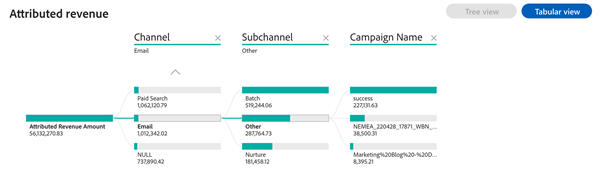

# Tablero de ingresos atribuidos {#attributed-revenue-dashboard}

El panel de control de ingresos atribuidos ofrece una perspectiva centrada en los ingresos directamente vinculados a sus iniciativas de marketing. Explore en profundidad cómo sus estrategias de marketing han sido fundamentales para sellar acuerdos.

Preguntas que el tablero responde:

¿Qué canales, subcanales o campañas tienen la clasificación más alta en términos de ingresos atribuidos?
¿Cuál es la cantidad total de nuestros ingresos atribuidos y el recuento de nuestras ofertas cerradas atribuidas?

<table style="table-layout:auto"> 
<tbody>
  <tr> 
   <th>Componente</th> 
   <th>Descripción</th>
   <th>Explorar los campos</th>
   <th>Tipo de datos</th>
   <th>Filtros</th>
  </tr>
  <tr>
    <td>Mosaico de ingresos atribuidos</td>
    <td>Ingresos totales atribuibles a las oportunidades "Cerradas ganadas" con puntos de contacto registrados.</td>
    <td rowspan="6"><li>Identificación de oportunidad</li>
<li>Nombre de la oportunidad</li>
<li>Fecha de creación de la oportunidad</li>
<li>Fecha de cierre de oportunidad</li>
<li>Está cerrado (S/N)</li>
<li>Está ganado (S/N)</li>
<li>Etapa actual</li>
<li>Modelo de atribución</li>
<li>Ingresos atribuidos</li>
<li>Ingresos realizados</li></td>
    <td rowspan="6">Fecha de cierre</td>
    <td rowspan="6"><li>Fecha</li>
<li>Modelo de atribución</li>
<li>Canal</li>
<li>Subcanal</li>
<li>Campaña</li>
<li>Segmentos</li></td>
  </tr>
  <tr>
    <td>Mosaico de ofertas atribuible</td>
    <td>Número total de ofertas "Ganadas cerradas" de oportunidades atribuibles.</td>
  </tr>
  <tr>
    <td>Ingresos atribuidos por canal a lo largo del tiempo</td>
    <td>Gráfico de barras apiladas que muestra los ingresos totales atribuidos, segmentados por canal asociado, para cada trimestre/mes.
     </td>
  </tr>
  <tr>
    <td>Tabla de ingresos atribuidos</td>
    <td>Ingresos atribuidos totales segmentados por canal, subcanal y campaña, presentados en formato de tabla y árbol.
     
     </td>
  </tr>
  </tr>
</tbody>
</table>
