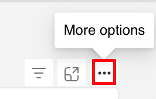

# Descubra los conceptos básicos del panel {#discover-dashboard-basics}

Este artículo le guiará a través de las funcionalidades básicas de la interfaz rediseñada, lo que garantiza que pueda acceder e interpretar sus datos sin esfuerzo. Explore la dinámica del panel de filtros y descubra las complejidades de nuestras funcionalidades de creación de informes mejoradas, como las funciones de taladro, el filtrado cruzado y la información sobre herramientas.

## Panel de filtro {#filter-pane}

Cada panel tiene una amplia gama de filtros, acompañados de los siguientes controles para una navegación y personalización sin problemas.

<table style="table-layout:auto"> 
 <tbody> 
  <tr> 
   <th>Nombre</th> 
   <th>Icono</th>
   <th>Descripción</th>
  </tr> 
  <tr> 
   <td>Botón Hamburguesa</td> 
   <td></td>
   <td>Cambie el panel de filtro a abierto o cerrado.</td>
  </tr>
  <tr> 
   <td>Restablecer</td> 
   <td></td>
   <td>Devolver filtros a la configuración predeterminada.</td>
  </tr>
   <tr> 
   <td>Filtros en Visual Studio</td> 
   <td></td>
   <td>Pase el ratón sobre la esquina superior derecha de un elemento visual y haga clic en el botón para ver sus filtros activos.</td>
  </tr>
 </tbody> 
</table>

## Capacidades de informes {#report-capabilities}

### Explorar en profundidad y hacia arriba {#drill-down-and-up}

* Pase el ratón sobre un objeto visual para identificar si tiene una jerarquía; la presencia de opciones de control de detalle en la barra de acciones así lo indica.

* Para activar el aumento de detalle, haga clic en la flecha hacia abajo, resaltada con un fondo gris. Para volver, utilice el icono de aumento de detalle.

Para explorar en profundidad un campo a la vez, active el icono de exploración en profundidad y seleccione un elemento visual, como una barra.

Utilice el icono desplegable de flecha doble para avanzar al siguiente nivel de jerarquía.

Utilice el icono de bifurcación para agregar un nivel de jerarquía adicional en la vista actual.

### Explorar en profundidad {#drill-through}

* Para explorar los datos detrás del elemento visual, haga clic con el botón derecho en el elemento visual y seleccione la opción &quot;obtención de detalles&quot;.

* Para exportar los datos subyacentes, pase el ratón sobre la esquina superior derecha de la página de obtención de detalles, haga clic en el botón &quot;más opciones&quot; y seleccione &quot;exportar datos&quot;.

* Para acercar una imagen o un mosaico específico, pase el ratón sobre la esquina superior derecha y seleccione el botón de &quot;enfoque&quot;.

### Filtrado cruzado {#cross-filtering}

De forma predeterminada, al seleccionar un valor o una etiqueta de eje en una visualización, se filtrarán otros elementos visuales en la página del informe, lo que garantiza que solo se muestren los datos filtrados relevantes.

### Mensajes emergentes {#tooltips}

La información sobre herramientas ofrece detalles adicionales acerca de los datos mostrados. Simplemente, pase el ratón sobre un elemento visual y aparecerá una información sobre herramientas contextual que proporciona perspectivas o explicaciones relacionadas con ese punto de datos específico.

