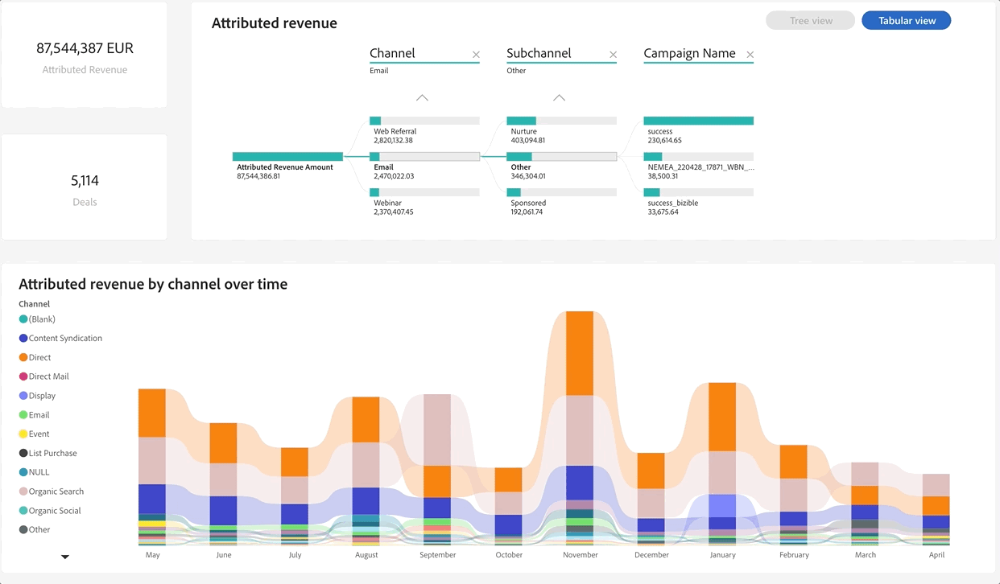

# Descubra los conceptos básicos del panel {#discover-dashboard-basics}

Este artículo le guiará a través de las funcionalidades básicas de la interfaz rediseñada, lo que garantiza que pueda acceder e interpretar sus datos sin esfuerzo. Explore la dinámica del panel de filtros y descubra las complejidades de nuestras funcionalidades de creación de informes mejoradas, como las funciones de taladro, el filtrado cruzado y la información sobre herramientas.

>[!NOTE]
>
>Este tablero está actualmente en versión beta. Durante esta fase de transición, se podrá acceder tanto a los paneles actuales como a los nuevos. El tablero actual quedará obsoleto una vez que hayamos realizado la transición completa y asegurado una funcionalidad óptima.

## Panel de filtro {#filter-pane}

Cada panel tiene una amplia gama de filtros, acompañados de los siguientes controles para una navegación y personalización sin problemas.

<table style="table-layout:auto"> 
 <tbody> 
  <tr> 
   <th>Nombre</th> 
   <th>Descripción</th>
  </tr> 
  <tr> 
   <td><b>Botón de alternancia de filtro</b></td>
   <td>Cambie el panel de filtro a abierto o cerrado.
   
</td>
  </tr>
  <tr> 
   <td><b>Barra de búsqueda</b></td>
   <td>Utilice la búsqueda de la parte superior del panel de filtros para buscar un filtro específico. Cada filtro también tiene su propia barra de búsqueda.
   
</td>
  </tr>
   <tr> 
   <td><b>Botón Borrar filtro</b></td>
   <td>Para borrar un filtro, haga clic en el icono de borrador situado en la esquina superior derecha de cada filtro.
   
</td>
  </tr>
  <tr> 
   <td><b>Botón Aplicar</b></td>
   <td>Haga clic en para confirmar e implementar los cambios de filtro en el panel.
   
</td>
  </tr>
 </tbody> 
</table>

## Filtros en Visual Studio {#filters-on-visual}

Pase el ratón por encima de la esquina superior derecha de una imagen para ver una lista de solo lectura de los filtros aplicados.

## Capacidades de informes {#report-capabilities}

### Explorar en profundidad y hacia arriba {#drill-down-and-up}

* Pase el ratón sobre un objeto visual para identificar si tiene una jerarquía; la presencia de opciones de control de detalle en la barra de acciones así lo indica.

* Para activar el aumento de detalle, haga clic en la flecha hacia abajo, resaltada con un fondo gris. Para volver, utilice el icono de aumento de detalle.

Para explorar en profundidad un campo a la vez, active el icono de exploración en profundidad y seleccione un elemento visual, como una barra.

Utilice el icono desplegable de flecha doble para avanzar al siguiente nivel de jerarquía.

Utilice el icono de bifurcación para agregar un nivel de jerarquía adicional en la vista actual.

### Explorar en profundidad {#drill-through}

Para explorar los datos detrás del elemento visual, haga clic con el botón derecho en el elemento visual y seleccione la opción &quot;obtención de detalles&quot;.

### Exportar datos {#export-data}

Para exportar los datos subyacentes de una imagen, pase el ratón sobre su esquina superior derecha. Haga clic en el botón &quot;más opciones&quot;, seleccione &quot;exportar datos&quot;, seleccione el formato que prefiera y haga clic en &quot;exportar&quot;.

### Modo de enfoque {#focus-mode}

Para acercar una imagen o un mosaico específico, pase el ratón sobre la esquina superior derecha y seleccione el botón de &quot;enfoque&quot;.

### Filtrado cruzado {#cross-filtering}

Si se selecciona un valor o una etiqueta de eje en una visualización, se filtrarán otros elementos visuales en la página del informe, lo que garantiza que solo se muestren los datos filtrados relevantes.

### Mensajes emergentes {#tooltips}

La información sobre herramientas ofrece detalles adicionales acerca de los datos mostrados. Simplemente, pase el ratón sobre un elemento visual y aparecerá una información sobre herramientas contextual que proporciona perspectivas o explicaciones relacionadas con ese punto de datos específico.

