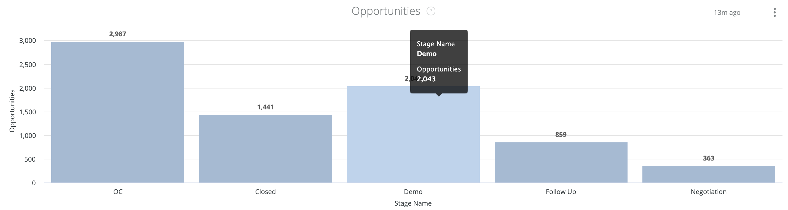

# Documentación del panel de Passport {#passport-dashboard-documentation}

El panel de Passport permite a los especialistas en marketing ver los posibles clientes/contactos y las oportunidades que han pasado por cada etapa de la canalización durante un período de tiempo determinado.

Este tablero tiene dos mosaicos:

* Oportunidades: Número de registros de oportunidad que pasan por cada etapa durante el lapso de tiempo determinado.
* Posibles clientes/Contactos: Número de registros de posible cliente o contacto que pasan por cada etapa durante el lapso de tiempo determinado.

>[!NOTE]
>
>En todos los tableros de Discover, solo se puede informar de un objeto de persona, ya sea posible Cliente o Contacto. Esto se configura en [!UICONTROL Configuración] > [!UICONTROL Informes] > [!UICONTROL Configuración de atribución] > [!UICONTROL Objeto de tablero predeterminado].

Este tablero admite los siguientes filtros (todos los filtros se aplican a ambos mosaicos):

* Fecha: seleccione el lapso de tiempo.
* Canal: filtre los registros por canales. Un registro está asociado a un canal si alguno de sus puntos de contacto está asociado al canal.
* Subcanal: filtre los registros por subcanales. Un registro está asociado a un subcanal si alguno de sus puntos de contacto está asociado al subcanal.
* Campaña: filtrar los registros por campañas. Un registro está asociado a una campaña si alguno de sus puntos de contacto está asociado a ella.
* Fuente de campaña: filtre los registros por fuentes de campaña. Las fuentes de campañas de ejemplo son Adwords, BingAds, Facebook, LinkedIn, etc. Un registro está asociado a un origen de campaña si alguno de sus puntos de contacto está asociado al origen de la campaña.
* Nombre de cuenta de CRM: filtre los registros por nombres de cuenta de CRM.
* Filtros de segmento: filtre los registros por segmentos personalizados. Un registro está asociado a un segmento si alguno de sus puntos de contacto está asociado a él.

En todos los filtros se utiliza la lógica &quot;Y&quot;.

>[!NOTE]
>
>Si un registro cambia de etapa en la fecha seleccionada, el registro se contabilizará para las etapas de y a y todas las etapas de paso.

## Oportunidades {#opportunities}

Los escenarios incluyen OC, etapas de canal seleccionadas en las fases de oportunidad abierta ([!UICONTROL Configuración] > [!UICONTROL CRM] > [!UICONTROL Asignación de fases]) y Ganar etapas de oportunidad ([!UICONTROL Configuración] > [!UICONTROL CRM] > [!UICONTROL Asignación de fases]).

>[!NOTE]
>
>En las etapas Ganadas, los recuentos de registros solo son para registros transferidos a la etapa durante el lapso de tiempo seleccionado.

Puede explorar en profundidad desde cada barra para ver los registros de oportunidad de cada etapa.

## Clientes potenciales/contactos {#leads-contacts}

Los escenarios incluyen FT, LC, etapas de canal seleccionadas en las fases de apertura de posibles clientes/contacto en la configuración - CRM - asignación de etapas y etapas de contacto/posible cliente convertidas en la configuración - CRM - asignación de etapas.

>[!NOTE]
>
>En las etapas convertidas, los recuentos de registros solo son para registros transferidos a la etapa durante el lapso de tiempo seleccionado.

Puede explorar en profundidad desde cada barra para ver los registros de posible cliente/contacto de cada etapa.
