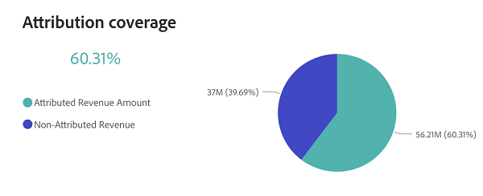

# Panel de información general de ingresos {#revenue-overview-dashboard}

El panel Información general de ingresos proporciona información sobre los ingresos totales derivados de su CRM, lo que arroja luz sobre el papel de las estrategias de marketing. Ofrece una visión general de cómo el marketing influye en los ingresos generales y contribuye al cierre exitoso de las ofertas.

Preguntas que el tablero responde:

* ¿Qué porcentaje de nuestros ingresos se puede atribuir a nuestros esfuerzos de marketing?
* ¿Qué porcentaje de nuestros acuerdos &quot;Cerrados ganados&quot; se ha visto influido por nuestros esfuerzos de marketing?

<table style="table-layout:auto"> 
<tbody>
  <tr> 
   <th>Componente</th> 
   <th>Descripción</th>
   <th>Explorar los campos</th>
   <th>Tipo de fecha</th>
   <th>Filtros</th>
  </tr>
  <tr>
    <td>Mosaico de ingresos totales</td>
    <td>Ingresos totales procedentes de CRM, incluidos los ingresos atribuidos.</td>
    <td rowspan="6"><li>Identificación de oportunidad</li>
<li>Nombre de la oportunidad</li>
<li>Fecha de creación de la oportunidad</li>
<li>Fecha de cierre de oportunidad</li>
<li>Está cerrado (S/N)</li>
<li>Está ganado (S/N)</li>
<li>Etapa actual</li>
<li>Ingresos</li></td>
    <td rowspan="6">Fecha de cierre</td>
    <td rowspan="6">Fecha</td>
  </tr>
  <tr>
    <td>Mosaico de ofertas totales</td>
    <td>Número total de ofertas marcadas como "Cerradas ganadas" en CRM.</td>
  </tr>
  <tr>
    <td>Mosaico de ingresos atribuidos</td>
    <td>Ingresos totales atribuibles a las oportunidades "Cerradas ganadas" con puntos de contacto registrados.</td>
  </tr>
  <tr>
    <td>Mosaico de ofertas atribuible</td>
    <td>Número total de ofertas "Ganadas cerradas" de oportunidades atribuibles.</td>
  </tr>
  <tr>
    <td>Gráfico de ingresos y de ingresos atribuidos</td>
    <td>Este gráfico de barras de series temporales en paralelo proporciona una vista completa de la cobertura de atribución al yuxtaponer los ingresos totales con los ingresos atribuidos.
     </td>
  </tr>
  <tr>
    <td>Gráfico de cobertura de atribución</td>
    <td>Este gráfico circular proporciona una clara comparación visual entre los ingresos atribuidos y los no atribuidos. El pastel cubre los ingresos totales.
     
    </td>
  </tr>
</tbody>
</table>

>[!MORELIKETHIS]
>
>[Descubra los conceptos básicos del panel](/help/marketo-measure-discover-ui/dashboards/discover-dashboard-basics.md){target="_blank"}
