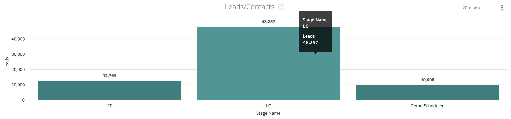

# Documentación del tablero de pasaporte {#passport-dashboard-documentation}

El panel Passport permite a los especialistas en marketing ver los posibles clientes/contactos y las oportunidades que han pasado por cada fase de la canalización durante un lapso de tiempo determinado.

Este tablero tiene dos mosaicos:

* Oportunidades: el número de registros de oportunidad pasados por cada fase durante el lapso de tiempo determinado.
* Posibles clientes/contactos: número de registros de posibles clientes o contactos que han pasado por cada fase durante el lapso de tiempo especificado.

>[!NOTE]
>
>En todos los paneles de Discover, solo se puede crear un informe de un objeto de persona, ya sea un posible cliente o un contacto. Esto se establece en [!UICONTROL Configuración] > [!UICONTROL Informes] > [!UICONTROL Configuración de atribución] > [!UICONTROL Objeto de panel predeterminado].

Este panel admite los siguientes filtros (todos los filtros se aplican a ambos mosaicos):

* Fecha: seleccione el lapso de tiempo.
* Channel: filtre los registros por canales. Un registro se asocia a un canal si alguno de sus puntos de contacto está asociado al canal.
* Subchannel: filtre los registros por subcanales. Un registro se asocia a un subcanal si alguno de sus puntos de contacto está asociado al subcanal.
* Campaign: filtre los registros por campañas. Un registro se asocia a una campaña si alguno de sus puntos de contacto está asociado a la campaña.
* Fuente de campaña: filtre los registros por fuentes de campaña. Las fuentes de campaña de ejemplo son AdWords, BingAds, Facebook, LinkedIn, etc. Un registro está asociado a una fuente de campaña si alguno de sus puntos de contacto está asociado a la fuente de campaña.
* CRM Account Name: filtre los registros por nombres de cuenta de CRM.
* Filtros de segmentos: filtre los registros por segmentos personalizados. Un registro se asocia a un segmento si alguno de sus puntos de contacto está asociado al segmento.

En todos los filtros se utiliza la lógica &quot;Y&quot;.

>[!NOTE]
>
>Si un registro cambia de fase en la fecha seleccionada, se contará el registro para las fases desde y hasta, y todas las fases de paso a través.

## Oportunidades {#opportunities}

Las fases incluyen OC, las fases de canal seleccionadas en las fases de oportunidad abierta ([!UICONTROL Configuración] > [!UICONTROL CRM] > [!UICONTROL Asignación de etapas]) y Fases de oportunidad ganadas ([!UICONTROL Configuración] > [!UICONTROL CRM] > [!UICONTROL Asignación de etapas]).

>[!NOTE]
>
>En las fases ganadas, los recuentos de registros solo se aplican a los registros transferidos a la fase durante el lapso de tiempo seleccionado.

Puede explorar en profundidad cada barra para ver los registros de oportunidad de cada etapa.

## Clientes potenciales/contactos {#leads-contacts}

Las etapas incluyen FT, LC, etapas de canal seleccionadas en Abrir etapas de cliente potencial/contacto en Configuración - CRM - Asignación de etapas y etapas de cliente potencial/contacto convertidas en Configuración - CRM - Asignación de etapas.

>[!NOTE]
>
>En las fases convertidas, los recuentos de registros solo se aplican a los registros transferidos al escenario durante el lapso de tiempo seleccionado.

Puede explorar en profundidad cada barra para ver los registros del posible cliente/contacto de cada etapa.
