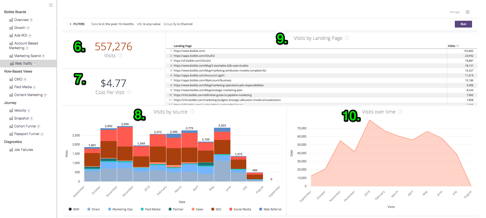
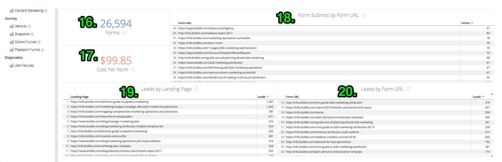
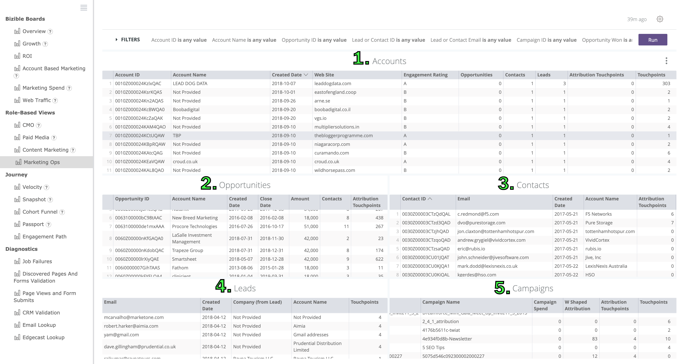

# Definiciones y enciclopedia {#definitions-and-encyclopedia}

A continuación se ofrece una descripción general de los diferentes tableros y mosaicos presentes en la plataforma Discover, así como los filtros dentro de esos tableros. Dentro de la captura de pantalla de cada Tablero hay varios mosaicos de números, cuyas definiciones se pueden encontrar en la sección de ese Tablero a continuación.

**[!DNL Marketo Measure]Tableros**

Información general

Crecimiento

ROI de anuncios

Marketing basado en la cuenta

Gastos de marketing

Tráfico web

**Vistas basadas en roles**

CMO

Medios pagados

Marketing de contenido

Operaciones de marketing

**Recorrido**

Velocidad

Instantánea

Canal de Passport

Ruta de participación

## [!DNL Marketo Measure] Tableros {#marketo-measure-boards}

### Información general {#overview}

La Información general ofrece al usuario una visión general del rendimiento del equipo de marketing en cuanto a su impacto en los ingresos, los gastos y el ROI.

**Filtros**

El tipo de fecha es Fecha de cierre

La fecha corresponde a los últimos 12 meses completos

El modelo de atribución tiene forma de W

La métrica es Ingresos

El Dimension es el canal

El canal es igual a __

El subcanal es igual a __

Campaign es igual a __

Categorías

**Ingresos**

`1.` Importe total de ingresos de oportunidades ganadas cerradas, según el modelo de atribución.

Haga clic en Mostrar detalles y explore los datos visualizándolos como una visualización y una tabla.

**Información general**

`2.` Mediante el menú desplegable Métrica del menú Filtros, este gráfico muestra los ingresos / ingresos de canalización / gastos / ofertas / oportunidades / posibles clientes / contactos atribuidos a cada canal, mostrados a lo largo del tiempo.

**Gasto**

`3.` La cantidad total de gasto registrado tanto de los costes de API como de los costes autoinformados acumulados al nivel de canal más alto.

Haga clic en Mostrar detalles y explore los datos visualizándolos como una visualización y una tabla.

**ROI**

`4.` Mediante el menú desplegable Dimension del menú Filtros, se muestra cuánto retorno de la inversión se atribuyó a cada canal/subcanal/campaña/cuenta/grupo de anuncios/anunciante/creativo/palabra clave/ubicación/sitio en función del modelo de atribución durante todo el intervalo de fechas seleccionado.

**Resumen de ROI**

Mediante el menú desplegable Dimension del menú Filtros, se muestra cuánto se atribuyeron los ingresos, el gasto y el retorno de la inversión a cada canal/subcanal/campaña/cuenta/grupo de anuncios/anunciante/creativo/palabra clave/ubicación/sitio en función del modelo de atribución durante todo el intervalo de fechas seleccionado.

**Acuerdos**

`5.` Número total de oportunidades ganadas cerradas, según el recuento del modelo de atribución. Si se selecciona el tipo de fecha &quot;Fecha de punto de contacto&quot;, es posible realizar recuentos parciales porque es posible excluir algunos puntos de contacto dentro de una oportunidad mediante este tipo de fecha.

Haga clic en Mostrar detalles y explore los datos visualizándolos como una visualización y una tabla.

**Coste por acuerdo**

`6.` El gasto total dividido por el número total de ofertas, proporcionando un coste promedio que se necesita para adquirir una oportunidad ganada cerrada.

**Ingresos de canalización**

`7.` Ingresos potenciales totales de cualquier oportunidad abierta, lo que significa que no se trata de una oportunidad perdida cerrada o ganada cerrada. Los ingresos se basan en el modelo de atribución seleccionado.

Haga clic en Mostrar detalles y explore los datos visualizándolos como una visualización y una tabla.

**Tamaño del acuerdo**

`8.` Cantidad promedio de una oportunidad ganada cerrada.

**Resumen de canal**

`9`. Mediante el menú desplegable Métrica del menú Filtros, se trata de una lista de canales en función de cuántos ingresos/ingresos de canalización/gastos/ofertas/oportunidades/posibles clientes/contactos se atribuyeron a cada canal, ordenados por el más alto en función del modelo de atribución seleccionado.

**Resumen de subcanales**

`10.` Mediante el menú desplegable Métrica del menú Filtros, se trata de una lista de subcanales en función de cuántos ingresos/ingresos de canalización/gastos/ofertas/oportunidades/posibles clientes/contactos se atribuyeron a cada subcanal, ordenados por el más alto en función del modelo de atribución seleccionado.

**Resumen de campaña**

`11.` Mediante el menú desplegable Métrica del menú Filtros, se trata de una lista de campañas en función de cuántos ingresos / ingresos de canalización / gastos / ofertas / oportunidades / posibles clientes / contactos se atribuyeron a cada campaña, ordenada por el más alto en función del modelo de atribución seleccionado.

### Crecimiento {#growth}

El crecimiento permite al experto en marketing ver lo que ha generado en todos los ámbitos, desde posibles clientes hasta oportunidades e ingresos. Es una vista rápida de todas las canalizaciones y de cómo han funcionado a lo largo del tiempo.

**Filtros**

El tipo de fecha es Touchpoint Date

La fecha corresponde a los últimos 12 meses completos

El modelo de atribución tiene forma de W

Agrupar por ninguno

El canal es igual a __

El subcanal es igual a __

Campaign es igual a __

Categorías

**Ingresos**

`1.` Importe total de ingresos de oportunidades ganadas cerradas, según el modelo de atribución.

Haga clic en Mostrar detalles y explore los datos visualizándolos como una visualización y una tabla.

**Ingresos con el tiempo**

`2.` Cantidad total de ingresos de oportunidades ganadas cerradas, basada en el modelo de atribución que muestra la tendencia en un lapso de tiempo específico. Utilice el filtro Agrupar por para cambiar la pila por canal, subcanal, campaña, cuenta, grupo de publicidad, anuncio, anunciante, creativo, palabra clave, ubicación, sitio.

Profundice para ver los datos desde una dimensión de fecha más pequeña.

**Acuerdos**

`3.` Número total de oportunidades ganadas cerradas, según el recuento del modelo de atribución.

Haga clic en Mostrar detalles y explore los datos visualizándolos como una visualización y una tabla.

**Acuerdos a lo largo del tiempo**

`4.` Número total de oportunidades ganadas cerradas, basadas en el modelo de atribución que muestra la tendencia en un lapso de tiempo específico. Utilice el filtro Agrupar por para cambiar la pila por canal, subcanal, campaña, cuenta, grupo de publicidad, anuncio, anunciante, creativo, palabra clave, ubicación, sitio.

Profundice para ver los datos desde una dimensión de fecha más pequeña.

**Ingresos de canalización**

`5.` Ingresos potenciales totales de cualquier oportunidad abierta, lo que significa que no se trata de una oportunidad perdida cerrada o ganada cerrada. Los ingresos se basan en el modelo de atribución seleccionado.

Haga clic en Mostrar detalles y explore los datos visualizándolos como una visualización y una tabla.

**Ingresos de canalización a lo largo del tiempo**

`6.` Ingresos potenciales totales de cualquier oportunidad abierta, basados en el modelo de atribución que muestra la tendencia en un lapso de tiempo específico. Utilice el filtro Agrupar por para cambiar la pila por canal, subcanal, campaña, cuenta, grupo de publicidad, anuncio, anunciante, creativo, palabra clave, ubicación, sitio.

Profundice para ver los datos desde una dimensión de fecha más pequeña.

**Posibles clientes**

`7.` Número total de posibles clientes, según el modelo de atribución. Si se selecciona el tipo de fecha &quot;Fecha de punto de contacto&quot;, es posible realizar recuentos parciales porque es posible excluir algunos puntos de contacto dentro de un registro de posible cliente mediante este tipo de fecha. Si se aplica un modelo de atribución más allá de la forma de U, el recuento de la forma de U se utiliza para los modelos en forma de W, en forma de W y personalizados.

Haga clic en Mostrar detalles y explore los datos visualizándolos como una visualización y una tabla.

**Posibles clientes con el tiempo**

`8.` Número total de posibles clientes, según el modelo de atribución que muestra la tendencia en un período de tiempo específico. Utilice el filtro Agrupar por para cambiar la pila por canal, subcanal, campaña, cuenta, grupo de publicidad, anuncio, anunciante, creativo, palabra clave, ubicación, sitio.

Profundice para ver los datos desde una dimensión de fecha más pequeña.

**Contactos**

`9.` Número total de contactos, según el modelo de atribución. Si se selecciona el tipo de fecha &quot;Fecha de punto de contacto&quot;, es posible realizar recuentos parciales porque es posible excluir algunos puntos de contacto dentro de un registro de contacto mediante este tipo de fecha. Si se aplica un modelo de atribución más allá de la forma de U, el recuento de la forma de U se utiliza para los modelos en forma de W, en forma de W y personalizados.

Haga clic en Mostrar detalles y explore los datos visualizándolos como una visualización y una tabla.

**Contactos a lo largo del tiempo**

`10.` Número total de contactos, según el modelo de atribución que muestra la tendencia en un período de tiempo específico. Utilice el filtro Agrupar por para cambiar la pila por canal, subcanal, campaña, cuenta, grupo de publicidad, anuncio, anunciante, creativo, palabra clave, ubicación, sitio.

Profundice para ver los datos desde una dimensión de fecha más pequeña.

**Oportunidades**

`11.` Número total de oportunidades, según el modelo de atribución. Si se selecciona el tipo de fecha &quot;Fecha de punto de contacto&quot;, es posible realizar recuentos parciales porque es posible excluir algunos puntos de contacto dentro de un registro de oportunidad utilizando este tipo de fecha.

Haga clic en Mostrar detalles y explore los datos visualizándolos como una visualización y una tabla.

**Oportunidades con el tiempo**

`12.` Número total de oportunidades, según el modelo de atribución que muestra la tendencia en un período de tiempo específico. Utilice el filtro Agrupar por para cambiar la pila por canal, subcanal, campaña, cuenta, grupo de publicidad, anuncio, anunciante, creativo, palabra clave, ubicación, sitio.

Profundice para ver los datos desde una dimensión de fecha más pequeña.

**Visitas**

`13.` Número total de visitas al sitio rastreadas en todos los visitantes conocidos y anónimos.

Haga clic en Mostrar detalles y explore los datos visualizándolos como una visualización y una tabla.

(Aparecerá como 0 si esta función está deshabilitada).

**Visitas con el tiempo**

`14.` Número total de visitas al sitio rastreadas que muestran la tendencia durante un período de tiempo específico. Utilice el filtro Agrupar por para cambiar la pila por canal, subcanal, campaña, cuenta, grupo de publicidad, anuncio, anunciante, creativo, palabra clave, ubicación, sitio.

Profundice para ver los datos desde una dimensión de fecha más pequeña.

(Esta opción aparecerá vacía si esta característica está deshabilitada).

**Visitas únicas**

`15.` Número total de visitas únicas al sitio rastreadas en todos los visitantes conocidos y anónimos.

Haga clic en Mostrar detalles y explore los datos visualizándolos como una visualización y una tabla.

(Aparecerá como 0 si esta función está deshabilitada).

**Visitas únicas a lo largo del tiempo**

`16.` Número total de visitas al sitio únicas rastreadas que muestran la tendencia en un período de tiempo específico. Utilice el filtro Agrupar por para cambiar la pila por canal, subcanal, campaña, cuenta, grupo de publicidad, anuncio, anunciante, creativo, palabra clave, ubicación, sitio.

Profundice para ver los datos desde una dimensión de fecha más pequeña.

(Esta opción aparecerá vacía si esta característica está deshabilitada).

**Forms**

`17.` Número total de formularios enviados entre todos los visitantes conocidos y anónimos.

Haga clic en Mostrar detalles y explore los datos visualizándolos como una visualización y una tabla.

(Aparecerá como 0 si esta función está deshabilitada).

**Forms con el tiempo**

`18.` Número total de formularios enviados que muestran la tendencia en un período de tiempo específico. Utilice el filtro Agrupar por para cambiar la pila por canal, subcanal, campaña, cuenta, grupo de publicidad, anuncio, anunciante, creativo, palabra clave, ubicación, sitio.

Profundice para ver los datos desde una dimensión de fecha más pequeña.

(Esta opción aparecerá vacía si esta característica está deshabilitada).

### ROI de anuncios {#ads-roi}

El ROI de los anuncios ofrece a los administradores de medios de pago una visión de sus esfuerzos de marketing, lo que les da una perspectiva del rendimiento de su campaña y del rendimiento de la palabra clave.

**Filtros**

El tipo de fecha es Fecha de cierre

La fecha corresponde a los últimos 12 meses completos

El modelo de atribución tiene forma de W

El canal es igual a __

El subcanal es igual a __

Campaign es igual a __

Categorías

**Resumen de ROI de Campaign**

`1.` Una lista de campañas en función de los ingresos, el gasto y el retorno de la inversión atribuidos a cada campaña, ordenadas por los ingresos más altos según el modelo de atribución seleccionado.

**Resumen de ROI creativo**

`2.` Una lista de creativos basada en la cantidad de ingresos, gastos y ROI atribuidos a cada creativo, ordenados por los ingresos más altos según el modelo de atribución seleccionado.

**Resumen de ROI de palabras clave**

`3.` Una lista de palabras clave basadas en la cantidad de ingresos, gastos y ROI atribuidos a cada palabra clave, ordenadas por los ingresos más altos según el modelo de atribución seleccionado.

### Marketing basado en la cuenta {#account-based-marketing}

El marketing basado en cuentas ofrece a las empresas que utilizan ABM la capacidad de rastrear sus esfuerzos hacia sus cuentas de destinatario y la cantidad de participación que han visto en su marketing.

**Filtros**

El tipo de fecha es Touchpoint Date

La fecha corresponde a los últimos 12 meses completos

El modelo de atribución es una atribución en forma de W

Agrupar por es un canal

Cuentas es igual a __

**Ingresos**

Importe total de ingresos de oportunidades ganadas cerradas, según el modelo de atribución.

Haga clic en Mostrar detalles y explore los datos visualizándolos como una visualización y una tabla.

**Ingresos de canalización**

Ingresos potenciales totales de cualquier oportunidad abierta, lo que significa que no se trata de una oportunidad perdida cerrada o ganada cerrada. Los ingresos se basan en el modelo de atribución seleccionado.

**Cantidad promedio de toques por cuenta**

El número promedio de puntos de contacto generados desde cada cuenta de CRM, por ID de cuenta.

**Posibles clientes coincidentes**

El número total de posibles clientes que coincidieron correctamente con una cuenta que usa la variable [!DNL Marketo Measure] Función de cliente potencial con cuenta, que utiliza algoritmos de coincidencia de sitio web, nombre de empresa y dominio de correo electrónico.

**Cuentas involucradas**

Número total de cuentas que recibieron un punto de contacto. Si se utiliza una lista de cuentas de destino, este es el subconjunto de cuentas de esa lista de cuentas de destino.

**Oportunidades involucradas**

Número total de oportunidades que recibieron un punto de contacto. Si se utiliza una lista de cuentas de destino, este es el subconjunto de oportunidades de esa lista de cuentas de destino.

**Personas comprometidas**

Número total de personas (posibles clientes y contactos por direcciones de correo electrónico) que recibieron un punto de contacto. Si se utiliza una lista de cuentas de destino, este es el subconjunto de personas de esa lista de cuentas de destino.

**Puntos de contacto con el tiempo**

Número total de puntos de contacto registrados durante el período de tiempo especificado. Si se utiliza una lista de cuentas de destino, este es el subconjunto de cuentas de esa lista de cuentas de destino.

**Cuentas tocadas a lo largo del tiempo (gráfico)**

Número total de cuentas que recibieron un punto de contacto por mes durante el período de tiempo especificado con la opción de agrupar los resultados por canal, subcanal, campaña, cuenta, grupo de publicidad, anuncio, anunciante, creativo, palabra clave, ubicación o sitio. Si se utiliza una lista de cuentas de destino, este es el subconjunto de cuentas de esa lista de cuentas de destino.

**Cuentas por recuento de Touchpoint**

Por ID de cuenta y Nombre de cuenta, el número total de puntos de contacto de cada cuenta.

**Recuento de Touchpoint**

El número de puntos de contacto atribuidos a cada dimensión, donde la dimensión se puede cambiar mediante el filtro Agrupar por como: Ninguno/Canal/Subcanal/Campaña/Cuenta/Anunciante/Anuncio/Creativo/Grupo de publicidad/Palabra clave/Ubicación/Sitio.

### Gastos de marketing {#marketing-spend}

El gasto en marketing muestra a los especialistas en marketing la cantidad que han invertido durante un periodo de tiempo para que puedan rastrear el gasto por mes y por canal.

**Filtros**

El tipo de fecha es Touchpoint Date

La fecha corresponde a los últimos 12 meses completos

Modelo de atribución

Agrupar por es igual a Canal

El canal es igual a __

El subcanal es igual a __

Campaign es igual a __

**Ingresos**

Importe total de ingresos de oportunidades ganadas cerradas, según el modelo de atribución.

Haga clic en Mostrar detalles y explore los datos visualizándolos como una visualización y una tabla.

**Gasto**

La cantidad total de gasto registrado tanto de los costes de API como de los costes autoinformados acumulados al nivel de canal más alto.

Haga clic en Mostrar detalles y explore los datos visualizándolos como una visualización y una tabla.

**ROI**

El ROI calculado (retorno de la inversión) a partir de los ingresos totales (del modelo de atribución seleccionado) y el gasto total.

**Gasto (gráfico)**

La cantidad total de gasto registrado que muestra la tendencia en un período de tiempo específico. Utilice el filtro Agrupar por para cambiar la pila por Ninguno, Canal, Subcanal, Campaña, Cuenta, Grupo de publicidad, Anunciante, Creativo, Palabra clave, Ubicación, Sitio.

Dado que el gasto no se registra en todos los niveles, es posible que los totales no coincidan con cada selección de &quot;Agrupar por&quot;. Por ejemplo, el total de todas las campañas no será igual al total de todos los subcanales.

**Gasto + ROI**

Muestra la cantidad de gasto de marketing por mes junto con el ROI en el eje Y derecho.

**Gasto por canal**

Una lista de canales en función de la cantidad registrada para cada canal, ordenada por el gasto más alto.

**Gasto por subcanal**

Una lista de subcanales en función de la cantidad registrada para cada subcanal, ordenada por el gasto más alto.

**Gasto por campaña**

Una lista de campañas basada en la cantidad registrada para cada campaña, ordenada por el gasto más alto. Las campañas constan de una lista completa de campañas que incluyen valores utm_campaign de Vistas de página.

### Tráfico web {#web-traffic}

La vista Tráfico web permite a los especialistas en marketing realizar un seguimiento de la actividad de su sitio web y medir el tráfico de los visitantes conocidos y anónimos del sitio.

**Filtros**

El tipo de fecha es Touchpoint Date

La fecha corresponde a los últimos 12 meses completos

El modelo de atribución es una atribución en forma de W

La URL es igual a __

Agrupar por es Ninguno

La métrica es Visitas

El canal es igual a __

El subcanal es igual a __

Campaign es igual a __

**Visitas únicas**

Número total de visitas únicas al sitio rastreadas en todos los visitantes conocidos y anónimos.

Haga clic en Mostrar detalles y explore los datos visualizándolos como una visualización y una tabla.

**Visitas**

Número total de visitas al sitio rastreadas en todos los visitantes conocidos y anónimos.

Haga clic en Mostrar detalles y explore los datos visualizándolos como una visualización y una tabla.

**Coste Por Visita Única**

El gasto total dividido por el número total de visitas únicas, proporcionando el coste por tasa de visita única.

**Costo por visita**

El gasto total dividido por el número total de visitas, proporcionando la tasa de coste por visita.

**Ingresos por visita única**

Promedio calculado de ingresos cerrados por visita única al sitio por visitantes conocidos y anónimos.

**Ingresos por visita**

Promedio calculado de ingresos cerrados por visita al sitio por visitantes conocidos y anónimos.

**Vistas de página**

Número total de páginas y vistas rastreadas entre todos los visitantes conocidos y anónimos.

Haga clic en Mostrar detalles y explore los datos visualizándolos como una visualización y una tabla.

**Forms**

Número total de formularios enviados entre todos los visitantes conocidos y anónimos.

Haga clic en Mostrar detalles y explore los datos visualizándolos como una visualización y una tabla.

**Información general**

Mediante el menú desplegable Métrica del menú Filtros, este gráfico muestra los ingresos / ingresos de la canalización / gastos / ofertas / oportunidades / posibles clientes / contactos / clics / impresiones / visitas / visitas únicas / vistas de página / formularios atribuidos a cada dimensión, mostrados a lo largo del tiempo. Los Dimension pueden cambiarse de Ninguno a Canal/Subcanal/Campaña/Cuenta/Anunciante/Anuncio/Creativo/Grupo de anuncios/Palabra clave/Ubicación/Sitio.

**Resumen de tráfico web**

Por dirección URL, ver el número de vistas de página, visitas, visitas únicas y envíos de formularios que se acreditan a cada uno.

**Resumen de referente**

El número de visitas a la página y las visitas únicas procedentes de cada dirección URL de referencia.

**Visitas únicas por origen**

En el menú desplegable Agrupar por del menú Filtros, vea el origen de los Visitantes únicos del sitio. Cambie el grupo por: Canal, Subcanal, Campaña, Cuenta, Grupo de publicidad, Anunciante, Creativo, Palabra clave, Ubicación, Sitio.

**Visitas por origen**

En el menú desplegable Agrupar por del menú Filtros, vea el origen de los Visitantes del sitio. Cambie el grupo por: Canal, Subcanal, Campaña, Cuenta, Grupo de publicidad, Anunciante, Creativo, Palabra clave, Ubicación, Sitio.

**Posibles clientes por página de aterrizaje**

Una lista de páginas de aterrizaje en función del número de posibles clientes que se generaron a partir de cada página de aterrizaje, ordenadas por el mayor número de posibles clientes.

**Posibles clientes por URL de formulario**

Una lista de direcciones URL de formulario basada en el número de posibles clientes generados a partir de cada dirección URL, ordenada por el mayor número de posibles clientes.

## Vistas basadas en roles {#role-based-views}

### CMO {#cmo}

Las vistas de CMO proporcionan a la CMO una visión de alto nivel del rendimiento del equipo de marketing en cuanto a su impacto en los ingresos, los gastos y el ROI.

**Filtros**

El tipo de fecha es Fecha de cierre

La fecha corresponde a los últimos 12 meses completos

El modelo de atribución tiene forma de W

El canal es igual a __

El subcanal es igual a __

Campaign es igual a __

La métrica es Ingresos

Categorías

**Ingresos**

`1.` Importe total de ingresos de oportunidades ganadas cerradas, según el modelo de atribución.

Haga clic en Mostrar detalles y explore los datos visualizándolos como una visualización y una tabla.

**Información general**

`2.` Mediante el menú desplegable Métrica del menú Filtros, este gráfico muestra los ingresos / ingresos de canalización / gastos / ofertas / oportunidades / posibles clientes / contactos atribuidos a cada canal, mostrados a lo largo del tiempo.

**Gasto**

`3.` La cantidad total de gasto registrado tanto de los costes de API como de los costes autoinformados acumulados al nivel de canal más alto.

Haga clic en Mostrar detalles y explore los datos visualizándolos como una visualización y una tabla.

**ROI**

`4.` El ROI calculado (retorno de la inversión) a partir de los ingresos totales (del modelo de atribución seleccionado) y el gasto total.

**Acuerdos**

`5.` Número total de oportunidades ganadas cerradas, según el recuento del modelo de atribución. Si se selecciona el tipo de fecha &quot;Fecha de punto de contacto&quot;, es posible realizar recuentos parciales porque es posible excluir algunos puntos de contacto dentro de una oportunidad mediante este tipo de fecha.

Haga clic en Mostrar detalles y explore los datos visualizándolos como una visualización y una tabla.

**Coste por acuerdo**

`6.` El gasto total dividido por el número total de ofertas, proporcionando un coste promedio que se necesita para adquirir una oportunidad ganada cerrada.

**Ingresos de canalización**

`7.` Ingresos potenciales totales de cualquier oportunidad abierta, lo que significa que no se trata de una oportunidad perdida cerrada o ganada cerrada. Los ingresos se basan en el modelo de atribución seleccionado.

Haga clic en Mostrar detalles y explore los datos visualizándolos como una visualización y una tabla.

**Tamaño del acuerdo**

`8.` Cantidad promedio de una oportunidad ganada cerrada.

**Resumen de canal**

`9.` Mediante el menú desplegable Métrica del menú Filtros, se trata de una lista de canales en función de cuántos ingresos/ingresos de canalización/gastos/ofertas/oportunidades/posibles clientes/contactos se atribuyeron a cada canal, ordenados por el más alto en función del modelo de atribución seleccionado.

**Resumen de subcanales**

`10.` Mediante el menú desplegable Métrica del menú Filtros, se trata de una lista de subcanales en función de cuántos ingresos/ingresos de canalización/gastos/ofertas/oportunidades/posibles clientes/contactos se atribuyeron a cada subcanal, ordenados por el más alto en función del modelo de atribución seleccionado.

**Resumen de campaña**

`11.` Mediante el menú desplegable Métrica del menú Filtros, se trata de una lista de campañas en función de cuántos ingresos / ingresos de canalización / gastos / ofertas / oportunidades / posibles clientes / contactos se atribuyeron a cada campaña, ordenada por el más alto en función del modelo de atribución seleccionado.

### Medios pagados {#paid-media}

Los paneles de medios de pago proporcionan a los administradores de medios de pago (o similares) un vistazo a su rendimiento de medios de pago. Poder ver cuánto se sirvió en los canales relevantes y cuánta demanda se generó de sus esfuerzos. Todas las métricas se extraen de integraciones de medios de pago.

**Filtros**

El tipo de fecha es Touchpoint Date

La fecha corresponde a los últimos 12 meses completos

El modelo de atribución tiene forma de W

La métrica es Ingresos

El Dimension es el canal

El canal es igual a __

El subcanal es igual a __

Campaign es igual a __

Categorías

**Ingresos**

`1.` Importe total de ingresos de oportunidades ganadas cerradas, según el modelo de atribución.

Haga clic en Mostrar detalles y explore los datos visualizándolos como una visualización y una tabla.

**Gasto**

`2.` La cantidad total de gasto registrado tanto de los costes de API como de los costes autoinformados acumulados al nivel de canal más alto.

Haga clic en Mostrar detalles y explore los datos visualizándolos como una visualización y una tabla.

**ROI**

`3.` El ROI calculado (retorno de la inversión) a partir de los ingresos totales (del modelo de atribución seleccionado) y el gasto total.

**Ingresos de canalización**

`4.` Ingresos potenciales totales de cualquier oportunidad abierta, lo que significa que no se trata de una oportunidad perdida cerrada o ganada cerrada. Los ingresos se basan en el modelo de atribución seleccionado.

Haga clic en Mostrar detalles y explore los datos visualizándolos como una visualización y una tabla.

**Información general**

`5.` Mediante el menú desplegable Métrica del menú Filtros, este gráfico muestra los ingresos/ingresos de la canalización/gastos/ofertas/oportunidades/posibles clientes/contactos/visitas/visitas únicas/impresiones/clics/formularios a lo largo del tiempo.

**Impresiones**

`6.` Número total de impresiones servidas desde todas las cuentas de anuncios conectadas.

Haga clic en Mostrar detalles y explore los datos visualizándolos como una visualización y una tabla.

**CPM**

`7.` El gasto total de las impresiones servidas dividido por el total de impresiones (dividido por 1000), proporcionando la tasa de CPM.

**Clics**

`8.` Número total de clics seguidos de todas las cuentas de anuncios conectadas.

Haga clic en Mostrar detalles y explore los datos visualizándolos como una visualización y una tabla.

**CPC**

`9.` El gasto total de los clics rastreados dividido por el total de clics, proporcionando la tasa CPC.

**Posibles clientes**

`10.` Número total de posibles clientes creados en CRM.

**Coste por posible cliente**

`11.` El gasto total de los posibles clientes creados dividido por el total de clics, proporcionando la tasa de CPL.

**Visitas**

`12.` Número total de visitas al sitio rastreadas en todos los visitantes conocidos y anónimos.

Haga clic en Mostrar detalles y explore los datos visualizándolos como una visualización y una tabla.

**Visitas únicas**

`13.` Número total de visitas únicas al sitio rastreadas en todos los visitantes conocidos y anónimos.

Haga clic en Mostrar detalles y explore los datos visualizándolos como una visualización y una tabla.

**Resumen de tráfico web**

Con el selector de dimensiones del menú Filtros, cambie entre Canal, Subcanal, Campaña, Cuenta, Grupo de publicidad, Anunciante, Creativo, Palabra clave, Ubicación, Sitio y vea el número de vistas de página, visitas, visitas únicas y envíos de formularios que se acreditan a cada uno.

**Resumen de canalización de posibles clientes**

Con el selector de dimensiones del menú Filtros, cambie entre Canal, Subcanal, Campaña, Cuenta, Grupo de publicidad, Anunciante, Creativo, Palabra clave, Ubicación, Sitio y vea el número de posibles clientes o contactos atribuidos a cada uno, según el modelo de atribución seleccionado.

**Resumen de canalización de oportunidades**

Con el selector de dimensiones en el menú Filtros, cambie entre Canal, Subcanal, Campaña, Cuenta, Grupo de publicidad, Anunciante, Creativo, Palabra clave, Ubicación, Sitio y vea el número de oportunidades, Ofertas, Ingresos de canalización, Gasto, ROI e Ingresos atribuidos a cada uno, según el modelo de atribución seleccionado.

### Marketing de contenido {#content-marketing}

El panel Marketing de contenido permite a los especialistas en marketing de contenido ver el rendimiento de su contenido de marketing, desde cuántas visitas generaron hasta cuántos ingresos se cerraron. Visualizarlo por todo el contenido o reducirlo a partes específicas del contenido o páginas.

Filtros

El tipo de fecha es Touchpoint Date

La fecha corresponde a los últimos 12 meses completos

El modelo de atribución tiene forma de W

La página de aterrizaje es igual a __

El canal es igual a __

El subcanal es igual a __

Campaign es igual a __

Categorías

**Ingresos totales**

`1.` La cantidad total de ingresos de oportunidades ganadas cerradas solo de fuentes digitales, según el modelo de atribución.

Haga clic en Mostrar detalles y explore los datos visualizándolos como una visualización y una tabla.

**Páginas de destino por ingresos**

`2.` Una lista de páginas de aterrizaje basada en la cantidad de ingresos atribuidos a cada página de aterrizaje, ordenada por los ingresos más altos según el modelo de atribución seleccionado.

**Ingresos totales de la canalización**

`3.` Los ingresos potenciales totales de cualquier oportunidad abierta solo de fuentes digitales, lo que significa que no se trata de una oportunidad perdida cerrada o ganada cerrada. Los ingresos se basan en el modelo de atribución seleccionado.

Haga clic en Mostrar detalles y explore los datos visualizándolos como una visualización y una tabla.

**Páginas de destino por ingresos de canalización**

`4.` Una lista de páginas de aterrizaje en función de cuántos ingresos de canalización se atribuyeron a cada página de aterrizaje, ordenados por la mayor cantidad de ingresos de canalización según el modelo de atribución seleccionado.

**Oportunidades totales**

`5.` Número total de oportunidades solo a partir de fuentes digitales, según el modelo de atribución.

Haga clic en Mostrar detalles y explore los datos visualizándolos como una visualización y una tabla.

**Páginas de aterrizaje por recuento de oportunidades**

`6.` Una lista de páginas de aterrizaje en función de cuántas oportunidades se atribuyeron a cada página de aterrizaje, ordenadas por el número más alto de oportunidades según el modelo de atribución seleccionado.

**Forms**

`7.` Número total de formularios enviados en todas las páginas rastreadas.

**Direcciones URL de formulario principales por envío de formulario**

`8.` Una lista de direcciones URL de formularios basada en el número de formularios enviados en cada dirección URL, ordenada por el número más elevado de formularios enviados en una página.

**URL de formularios por canal**

`9.` Las 10 direcciones URL de formularios principales agrupadas por el canal que impulsa la visita.

Haga clic en Mostrar detalles y explore los datos visualizándolos como una visualización y una tabla.

**Visitas únicas**

`10.` Número total de visitas únicas al sitio rastreadas en todos los visitantes conocidos y anónimos.

Profundice para ver las visitas únicas al sitio rastreadas por mes.

**Páginas de aterrizaje principales por visitas únicas**

`11.` Una lista de páginas de aterrizaje basada en el número de visitas únicas a cada página de aterrizaje, ordenadas por las páginas con la mayor cantidad de visitas únicas.

Profundice para ver las visitas únicas por mes a la dirección URL seleccionada.

**Visitas**

`12.` Número total de visitas al sitio rastreadas en todos los visitantes conocidos y anónimos.

**Páginas de aterrizaje principales por visitas**

`13.` Una lista de páginas de aterrizaje basada en el número de visitas iniciales a cada página de aterrizaje, ordenadas por las páginas con el mayor número de visitas.

**Posibles clientes**

`14.` Número total de posibles clientes, según el modelo de atribución. Si se selecciona el tipo de fecha &quot;Fecha de punto de contacto&quot;, es posible realizar recuentos parciales porque es posible excluir algunos puntos de contacto dentro de un registro de posible cliente mediante este tipo de fecha. Si se aplica un modelo de atribución más allá de la forma de U, el recuento de la forma de U se utiliza para los modelos en forma de W, en forma de W y personalizados.

Haga clic en Mostrar detalles y explore los datos visualizándolos como una visualización y una tabla.

**Páginas de aterrizaje por recuento de posibles clientes**

`15.` Una lista de direcciones URL de página en función del número de posibles clientes creados a partir de cada dirección URL, ordenadas por las páginas con la mayor cantidad de posibles clientes.

### Operaciones de marketing {#marketing-ops}

Validación y diagnóstico [!DNL Marketo Measure] datos con una visibilidad completa de los puntos de contacto individuales.

**Filtros**

ID de cuenta

Nombre de la cuenta

Identificación de oportunidad

Cliente potencial o identificación del contacto

Cliente potencial o correo electrónico del contacto

ID de campaña

Oportunidad ganada (S/N)

Fecha de creación de la oportunidad

Fecha de cierre de la oportunidad

Fecha de Touchpoint

Modelo de atribución

**Exploraciones en profundidad**

Detalles de la oportunidad

Detalles de contacto

Detalles de cliente potencial

Detalles de Puntos de contacto de atribución

Detalles del Touchpoint

**Cuentas**

`1.` Lista de todas las cuentas con puntos de contacto. La información de cada cuenta incluye la clasificación de la participación, el número de oportunidades, el número de contactos, el número de posibles clientes, el número de puntos de contacto de atribución y el número de puntos de contacto.

Haga clic en los números agregados para explorar en profundidad los detalles de los datos base.

**Oportunidades**

`2.` Lista de todas las oportunidades con puntos de contacto de atribución. La información de cada oportunidad incluye la cantidad de oportunidad, el número de contactos y el número de puntos de contacto de atribución.

Haga clic en los números agregados para explorar en profundidad los detalles de los datos base.

**Contactos**

`3.` Lista de todos los contactos con puntos de contacto. La información de cada contacto incluye el número de puntos de contacto de atributos y el número de puntos de contacto

Haga clic en los números agregados para explorar en profundidad los detalles de los datos base.

**Posibles clientes**

`4.` Lista de todos los posibles clientes con puntos de contacto. La información de cada posible cliente incluye un número de puntos de contacto.

Haga clic en los números agregados para explorar en profundidad los detalles de los datos base.

**Campañas**

`5.` Lista de todas las campañas con puntos de contacto. La información de cada campaña incluye el gasto de campaña, la cantidad de atributos, el número de puntos de contacto de atribución y el número de puntos de contacto.

Haga clic en los números agregados para explorar en profundidad los detalles de los datos base.

**Preguntas frecuentes sobre Marketing Ops**

**P: ¿Por qué existen los filtros &quot;ID de cuenta&quot; y &quot;Nombre de cuenta&quot;?**

R: Aunque los ID de cuenta son únicos, no es necesario que los nombres de cuenta lo sean. Por ejemplo, podría haber creado varias cuentas diferentes para cada unidad de negocio dentro de una compañía empresarial. Aunque el uso del nombre de cuenta puede ser más intuitivo, para asegurarse de que está filtrando para una cuenta específica, es posible que desee utilizar el ID de cuenta.

**P: Si filtro por ID de cuenta, ¿se filtrarán todas las tablas por?**

R: Sí, aplicará el filtro a cada mosaico del tablero. Por ejemplo, si aplicara un filtro de cuenta para &quot;Microsoft&quot; en el mosaico &quot;Oportunidades&quot;, solo vería oportunidades relacionadas con Microsoft.

**P: ¿Qué es la columna &quot;Clasificación de la participación&quot;?**

R: La clasificación de participación se extrae del [!DNL Marketo Measure] Puntuación de participación de cuenta predictiva, que está disponible en [!DNL Marketo Measure] Nivel 2. Si no lo tiene, este campo se mostrará como nulo.

**P: ¿Puedo cambiar la forma en que se ordena la tabla?**

R: Sí, si hace clic en cualquiera de los encabezados de columna, se ordenará la tabla. Si vuelve a hacer clic en el mismo encabezado, se invertirá el modo en que se ordena la tabla.

**P: ¿Puedo exportar los datos de?**

R: Sí, al pasar el ratón por encima del título del mosaico (por ejemplo, &quot;Cuentas&quot;), haga clic en los tres puntos verticales de la esquina superior derecha. Esto le permite descargar los datos de ese mosaico en los siguientes formatos: TXT, CSV, XLS, JSON, HTML y Markdown.

**P: ¿Puedo ver más allá de 500 filas de datos?**

R: El mosaico se limita a mostrar 500 filas a la vez, pero puede exportar los datos y elegir &quot;Todos los resultados&quot; para ver más de 500 filas mostradas.

## Camino {#journey}

### Velocidad de ventas {#sales-velocity}

La velocidad de ventas permite a los especialistas en marketing y ventas ver la rapidez con la que sus clientes potenciales se mueven a través del canal y averiguar qué canales tienen un tiempo de conversión más rápido (o más lento).

**Filtros**

La fecha corresponde a los últimos 12 meses completos

Ganado es Sí

La fase es igual a __

El canal es igual a __

El subcanal es igual a __

**Velocidad (días)**

`1.` Promedio de días que las oportunidades están en su ciclo de ventas, desde el primer contacto anónimo hasta el cierre de oportunidad.

**Oportunidades activas**

`2.` Número total de oportunidades de cualquier oportunidad abierta, lo que significa que no se trata de una oportunidad perdida cerrada o ganada cerrada.

**Tamaño medio de la oferta**

`3.` Cantidad promedio de una oportunidad ganada cerrada.

**Tasa de victorias**

`4.` Número total de oportunidades ganadas cerradas dividido por el número total de oportunidades perdidas cerradas y ganadas cerradas, mostrando el porcentaje de tasa de ganancia.

**Velocidad de oportunidad por canal**

`5.` Promedio de días que las oportunidades están en su ciclo por fase, agrupadas por canal de marketing y que muestran el tiempo que se tarda en pasar a la siguiente fase. Las fases que aparecen aquí son fases de hito (FT, LC, OC) y fases personalizadas.

**Velocidad del posible cliente por canal**

`6.` Cantidad promedio de días que los posibles clientes están en su ciclo por fase antes de convertirse en un contacto, oportunidad o cuenta, agrupados por canal de marketing y que muestran el tiempo que tarda en pasar a la siguiente fase. Las fases que aparecen aquí son fases de hito (FT, LC) y fases personalizadas.

**Velocidad promedio de oportunidad**

`7.` Promedio de días que las oportunidades están en su ciclo por etapa, lo que muestra el tiempo que se tarda en pasar a la siguiente etapa. Las fases que aparecen aquí son fases de hito (FT, LC, OC) y fases personalizadas. Los números aquí reflejan el tiempo por etapa en el gráfico Velocidad de oportunidad por canal anterior.

**Velocidad promedio del posible cliente**

`8.` Cantidad promedio de días que los posibles clientes están en su ciclo por fase antes de convertirse en un contacto, oportunidad o cuenta, lo que muestra el tiempo que se tarda en pasar a la siguiente fase. Las fases que aparecen aquí son fases de hito (FT, LC) y fases personalizadas. Los números aquí reflejan el tiempo por etapa en el gráfico Velocidad del posible cliente por canal de arriba.

**Velocidad de oportunidad con el tiempo**

`9.` Promedio de días que las oportunidades están en su ciclo por etapa con una tendencia en el tiempo.

**Velocidad del posible cliente con el tiempo**

`10.` El número promedio de días que los posibles clientes están en su ciclo por etapa con una tendencia en el tiempo.

### Instantánea {#snapshot}

La instantánea ofrece a los especialistas en marketing una vista de toda la canalización en cualquier momento dado. Se agrega una sola fecha al filtro para mostrar el estado de su canalización en esa fecha.

Filtros

La fecha es el 1 de enero de 2018

Clientes potenciales o contactos

**Instantánea de cliente potencial/contacto**

`1.` El número de registros de posibles clientes o contactos que se encontraban en cada fase en la fecha seleccionada.

**Instantánea de cliente potencial/contacto (Tabla)**

`2.` El número de registros de posibles clientes o contactos que se encontraban en cada fase en la fecha seleccionada.

**Instantánea de oportunidad**

`3.` El número de registros de oportunidad que estaban en cada fase en la fecha seleccionada.

**Instantánea de oportunidad (Tabla)**

`4.` El número de registros de oportunidad que estaban en cada fase en la fecha seleccionada.

### Pasaporte {#passport}

El Passport es la nueva vista de cascada de demanda desde el [!DNL Marketo Measure] Tablero de ROI, donde cada etapa muestra el número de registros en cada etapa y el total de registros que han pasado por cada etapa.

**Filtros**

El tipo de fecha es Touchpoint Date

La fecha corresponde a los últimos 12 meses completos

El modelo de atribución tiene forma de W

El canal es igual a __

El subcanal es igual a __

Campaign es igual a __

Categorías

**Pasaporte de contacto/posible cliente**

`1.` &amp; `2.` Cada fase muestra el número de registros en cada fase de estado de posible cliente o de contacto y el total de registros que han pasado por cada fase.

**Pasaporte de oportunidad**

`3.` Cada fase muestra el número de registros en cada fase de oportunidad y el total de registros que han pasado por cada fase.

### Ruta de participación {#engagement-path}

Comprenda cómo los posibles clientes, los contactos, las oportunidades y las cuentas se relacionan desde el primer contacto hasta el cierre.

**Filtros**

Nombre/ID de la cuenta

ID de posible cliente/correo electrónico

ID de contacto/correo electrónico

Modelo de atribución

Tipo de evento

Posición del Buyer Touchpoint

Posición del Buyer Attribution Touchpoint

Fecha de Touchpoint

Correo electrónico de Touchpoint del usuario

Tipo de instancia de interacción de marketing

Canal

Medio

Fuente web

Primera interacción con la persona (S/N)

Ingresos atribuidos

**Recorrido de eventos**

Lista de todos los eventos con detalles de punto de contacto asociados e ingresos atribuidos.

Haga clic en Tipo de evento para explorar en profundidad y ver los detalles del evento.

**Preguntas frecuentes sobre ruta de participación**

**P: ¿Cómo puedo ver el recorrido de una sola persona?**

R: Usando el filtro &quot;ID/correo electrónico del posible cliente&quot; o &quot;ID/correo electrónico del contacto&quot;, establezca el filtro en &quot;contiene&quot; [dirección de email]&#39; y, a continuación, haga clic en &#39;Ejecutar.&#39;

**P: ¿A qué afecta el filtro &quot;Modelo de atribución&quot;?**

R: El filtro del modelo de atribución afectará a la columna Ingresos atribuidos

**P: ¿Qué es el filtro &quot;Tipo de contacto de marketing&quot;?**

R: El &quot;Tipo de contacto de marketing&quot; es el tipo de participación, que puede incluir visita web, formulario web, chat web, correo electrónico, llamada, mensaje izquierdo o CRM (es decir, abono a campaña para canales sin conexión)

**P: ¿Cómo puedo filtrar todas las sesiones web de la recorrido?**

R: Usando el filtro &quot;Tipo de contacto de marketing&quot;, establezca el filtro en &quot;No contiene visita web&quot; O &quot;contiene&quot; [todos los tipos de contacto excepto visita web]y, a continuación, haga clic en &quot;Ejecutar&quot;

**P: ¿Puedo exportar los datos de?**

R: Sí, al pasar el ratón por encima de la tabla &quot;Recorrido de eventos&quot;, haga clic en los tres puntos verticales de la esquina superior derecha. Esto le permite descargar los datos en los siguientes formatos: TXT, CSV, XLS, JSON, HTML y Markdown.

**P: ¿Puedo cambiar la forma en que se ordena la tabla?**

R: Sí, si hace clic en cualquiera de los encabezados de columna, se ordenará la tabla. Si vuelve a hacer clic en el mismo encabezado, se invertirá el modo en que se ordena la tabla. De forma predeterminada, las tablas se ordenan por Fecha de punto de contacto empezando por la más antigua.

**P: ¿Puedo ver más allá de 500 filas de datos?**

R: El mosaico se limita a mostrar 500 filas a la vez, pero puede exportar los datos y elegir &quot;Todos los resultados&quot; para ver más de 500 filas mostradas.
