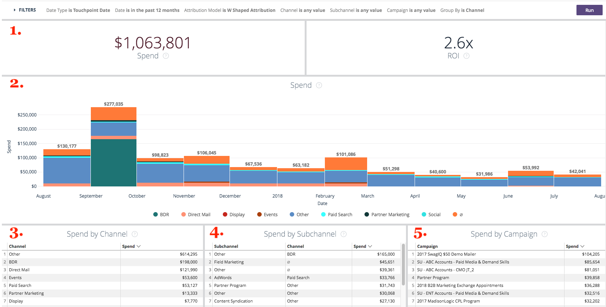
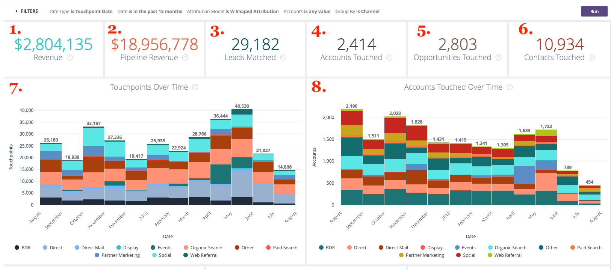

# Obtención de detalles {#drill-throughs}

El [!DNL Marketo Measure Discover] La experiencia de permite a los clientes explorar en profundidad el conjunto de datos que más les importa. Sobre determinadas medidas en [!DNL Marketo Measure Discover]Sin embargo, los clientes pueden hacer clic en un mosaico y explorar más información sobre esa métrica.

A continuación se muestra una lista de paneles y mosaicos que contienen obtención de detalles y la experiencia que un usuario debería esperar al obtener detalles. Tenga en cuenta que los filtros globales del panel persisten al explorar en profundidad.

## Información general {#overview}

**Ingresos**

Definición: Ingresos totales por mes mediante un gráfico de barras y una tabla. A partir de ahí, es posible explorar un solo mes o dividir un mes por semana, día u hora.

**Ingresos (gráfico)**

Definición: Ingresos totales por mes mediante un gráfico de barras y una tabla. Como el mosaico principal ya es un gráfico de barras, explorar en profundidad Mostrar detalles solo mostrará un mes.

_Profundizar en: Ingresos totales por mes desglosados por semana o fecha._

**Gasto**

Definición: Gasto total por mes mediante un gráfico de barras y una tabla. A partir de ahí, es posible explorar un solo mes o dividir un mes por semana, día u hora.

**Acuerdos**

Definición: Número total de ofertas por mes a través del gráfico de barras y la tabla. A partir de ahí, es posible explorar un solo mes o dividir un mes por semana, día u hora.

**Ingresos de canalización**

Definición: Ingresos totales de la canalización por mes a través de un gráfico de barras y una tabla. A partir de ahí, es posible explorar un solo mes o dividir un mes por semana, día u hora.

**Resumen de ROI**

Definición: Ingresos o gastos totales de cada canal por mes a través de un gráfico de barras y una tabla. A partir de ahí, es posible profundizar en esa fila durante un solo mes o desglosar un mes por semana, día u hora.

**Coste por acuerdo**

Definición: gasto total dividido por el número total de ofertas, lo que proporciona el coste medio necesario para adquirir una oportunidad ganada cerrada. A partir de ahí, es posible profundizar en esa fila durante un solo mes o desglosar un mes por semana, día u hora.

**Canales por ingresos**

Definición: Ingresos totales de cada canal por mes a través de un gráfico de barras y una tabla. A partir de ahí, es posible profundizar en esa fila durante un solo mes o desglosar un mes por semana, día u hora.

**Subcanales por ingresos**

Definición: Ingresos totales de cada subcanal por mes a través de un gráfico de barras y una tabla. A partir de ahí, es posible profundizar en esa fila durante un solo mes o desglosar un mes por semana, día u hora.

**Campañas por ingresos**

Definición: Ingresos totales de cada campaña por mes a través de un gráfico de barras y una tabla. A partir de ahí, es posible profundizar en esa fila durante un solo mes o desglosar un mes por semana, día u hora.

**Resumen del acuerdo**

Definición: Recuento total de gastos o transacciones de cada canal por mes a través de un gráfico de barras y una tabla. A partir de ahí, es posible profundizar en esa fila durante un solo mes o desglosar un mes por semana, día u hora.

## Crecimiento {#growth}

**Ingresos totales**

Definición: Ingresos totales por mes mediante un gráfico de barras y una tabla. A partir de ahí, es posible explorar un solo mes o dividir un mes por semana, día u hora.

**Ingresos con el tiempo**

Definición: Ingresos totales por mes mediante un gráfico de barras y una tabla. Como el mosaico principal ya es un gráfico, explorar en profundidad Mostrar detalles solo mostrará un mes.

_Ingresos totales por mes desglosados por semana o fecha._

**Ofertas totales**

Definición: Número total de ofertas por mes a través del gráfico de barras y la tabla. A partir de ahí, es posible explorar un solo mes o dividir un mes por semana, día u hora.

**Acuerdos a lo largo del tiempo**

Definición: Número total de ofertas por mes a través del gráfico de barras y la tabla. Como el mosaico principal ya es un gráfico, explorar en profundidad Mostrar detalles solo mostrará un mes.

_Número total de ofertas por mes desglosadas por semana o fecha._

**Ingresos totales de la canalización**

Definición: Ingresos totales de la canalización por mes a través de un gráfico de barras y una tabla. A partir de ahí, es posible explorar un solo mes o dividir un mes por semana, día u hora.

**Ingresos de canalización a lo largo del tiempo**

Definición: Ingresos totales de la canalización por mes a través de un gráfico de barras y una tabla. Como el mosaico principal ya es un gráfico, explorar en profundidad Mostrar detalles solo mostrará un mes.

_Ingresos totales de la canalización por mes desglosados por semana o fecha._

**Posibles clientes totales**

Definición: Clientes potenciales totales por mes a través de un gráfico de barras y una tabla. A partir de ahí, es posible explorar un solo mes o dividir un mes por semana, día u hora.

**Posibles clientes con el tiempo**

Definición: Clientes potenciales totales por mes a través de un gráfico de barras y una tabla. Como el mosaico principal ya es un gráfico, explorar en profundidad Mostrar detalles solo mostrará un mes.

_Clientes potenciales totales por mes desglosados por semana o fecha._

**Contactos totales**

Definición: Total de contactos por mes mediante gráfico de barras y tabla. A partir de ahí, es posible explorar un solo mes o dividir un mes por semana, día u hora.

**Contactos a lo largo del tiempo**

Definición: Total de contactos por mes mediante gráfico de barras y tabla. Como el mosaico principal ya es un gráfico, explorar en profundidad Mostrar detalles solo mostrará un mes.

_Total de contactos por mes desglosados por semana o fecha._

**Oportunidades totales**

Definición: oportunidades totales por mes mediante un gráfico de barras y una tabla. A partir de ahí, es posible explorar un solo mes o dividir un mes por semana, día u hora.

**Oportunidades con el tiempo**

Definición: oportunidades totales por mes mediante un gráfico de barras y una tabla. Como el mosaico principal ya es un gráfico, explorar en profundidad Mostrar detalles solo mostrará un mes.

_Oportunidades totales por mes desglosadas por semana o fecha._

**Visitas únicas**

Definición: Número total de vistas de página por mes a través de un gráfico de barras y una tabla. A partir de ahí, es posible explorar un solo mes o dividir un mes por semana, día u hora.

**Visitas únicas a lo largo del tiempo**

Definición: número total de visitas únicas que muestran la tendencia en un período de tiempo específico. Utilice el filtro Agrupar por para cambiar la pila por canal, subcanal, campaña, cuenta, grupo de publicidad, anuncio, anunciante, creativo, palabra clave, ubicación y sitio. Esta opción aparecerá vacía si se desactiva esta función.

**Visitas**

Definición: Número total de visitas al sitio por mes mediante un gráfico de barras y una tabla. A partir de ahí, es posible explorar un solo mes o dividir un mes por semana, día u hora.

**Visitas con el tiempo**

Definición: número total de visitas al sitio rastreadas que muestran la tendencia durante un período de tiempo específico. Utilice el filtro Agrupar por para cambiar la pila por canal, subcanal, campaña, cuenta, grupo de publicidad, anuncio, anunciante, creativo, palabra clave, ubicación y sitio. Esta opción aparecerá vacía si se desactiva esta función.

**Forms**

Definición: Número total de envíos de formularios por mes a través de un gráfico de barras y una tabla. A partir de ahí, es posible explorar un solo mes o dividir un mes por semana, día u hora.

**Forms con el tiempo**

Definición: número total de formularios enviados que muestran la tendencia en un período de tiempo específico. Utilice el filtro Agrupar por para cambiar la pila por canal, subcanal, campaña, cuenta, grupo de publicidad, anuncio, anunciante, creativo, palabra clave, ubicación y sitio. Esta opción aparecerá vacía si se desactiva esta función.

## Gastos {#spend}

**Gasto**

Definición: Gasto total por mes mediante un gráfico de barras y una tabla. A partir de ahí, es posible explorar un solo mes o dividir un mes por semana, día u hora.

**Gasto (gráfico)**

Definición: Gasto total por mes mediante un gráfico de barras y una tabla. Como el mosaico principal ya es un gráfico, explorar en profundidad Mostrar detalles solo mostrará un mes.

_Gasto total por mes desglosado por semana, fecha u hora. El tiempo es posible para pasar desde [!DNL Marketo Measure] descarga el gasto real por minuto desde nuestras conexiones de anuncios._

**Gasto por canal**

Definición: Gasto total de cada canal por mes a través de un gráfico de barras y una tabla. A partir de ahí, es posible profundizar en esa fila durante un solo mes o desglosar un mes por semana, día u hora.

**Gasto por subcanal**

Definición: Gasto total de cada subcanal por mes a través de un gráfico de barras y una tabla. A partir de ahí, es posible profundizar en esa fila durante un solo mes o desglosar un mes por semana, día u hora.

**Gasto por campaña**

Definición: gasto total de cada campaña por mes a través de un gráfico de barras y una tabla. A partir de ahí, es posible profundizar en esa fila durante un solo mes o desglosar un mes por semana, día u hora.

## Velocidad de ventas {#sales-velocity}

**Velocidad (días)**

Definición: Cantidad media de días que las oportunidades están en su ciclo de ventas, desde el primer contacto anónimo hasta el cierre de oportunidad.

**Oportunidades activas**

Definición: Número total de oportunidades de cualquier oportunidad abierta, lo que significa que no se trata de una oportunidad perdida cerrada o ganada cerrada.

**Tamaño del acuerdo**

Definición: Cantidad promedio de una oportunidad ganada cerrada.

**Tasa de victorias**

Definición: Número total de oportunidades Cerradas Ganadas dividido por el número total de oportunidades Cerradas Perdidas y Cerradas Ganadas.

**Velocidad de oportunidad por canal**

Definición: Número promedio de días que las oportunidades están en su ciclo por fase, agrupadas por canal de marketing y que muestran el tiempo que tarda en pasar a la siguiente fase. Las fases que aparecen aquí son fases de hito (FT, LC, OC) y fases personalizadas.

**Velocidad del posible cliente por canal**

Definición: Número promedio de días que los posibles clientes están en su ciclo por fase antes de convertirse en un contacto, oportunidad o cantidad, agrupados por el canal de marketing y que muestran el tiempo que se tarda en pasar a la siguiente fase. Las fases que aparecen aquí son fases de hito (FT, LC) y fases personalizadas.

**Velocidad promedio de oportunidad**

Definición: Número promedio de días que las oportunidades están en su ciclo por etapa, lo que muestra el tiempo que se tarda en pasar a la siguiente etapa. Las fases que aparecen aquí son fases de hito (FT, LC, OC) y fases personalizadas. los números aquí reflejan el tiempo por etapa en la velocidad de la oportunidad según el gráfico del canal.

**Velocidad promedio del posible cliente**

Definición: Número promedio de días que los posibles clientes están en su ciclo por etapa antes de convertirse en un contacto, oportunidad o cantidad, lo que muestra el tiempo que tarda en pasar a la siguiente etapa. Las fases que aparecen aquí son fases de hito (FT, LC) y fases personalizadas. los números aquí reflejan el tiempo por etapa en la velocidad del posible cliente según el gráfico de canal.

**Velocidad de oportunidad con el tiempo**

Definición: Número promedio de días que las oportunidades están en su ciclo por etapa con una tendencia en el tiempo.

**Velocidad del posible cliente con el tiempo**

Definición: Número promedio de días que los posibles clientes están en su ciclo por etapa con una tendencia en el tiempo.

## Marketing basado en la cuenta {#account-based-marketing}

**Ingresos totales**

Definición: Ingresos totales por mes mediante un gráfico de barras y una tabla. A partir de ahí, es posible explorar un solo mes o dividir un mes por semana, día u hora.

**Ingresos totales de la canalización**

Definición: Ingresos totales de la canalización por mes a través de un gráfico de barras y una tabla. A partir de ahí, es posible explorar un solo mes o dividir un mes por semana, día u hora.

**Posibles clientes coincidentes**

Definición: Número total de posibles clientes que coinciden correctamente con una cuenta.

**Cuentas tocadas**

Definición: Número total de cuentas que recibieron un punto de contacto.

**Oportunidades tocadas**

Definición: Una lista de ID de oportunidad con su ID de cuenta correspondiente

**Contactos tocados**

Definición: Una lista de ID de contacto con su ID de cuenta correspondiente

**Puntos de contacto a lo largo del tiempo (gráfico)**

Definición: una lista de puntos de contacto del mes seleccionado.

_El número de puntos de contacto tocados desglosados por semana, fecha u hora._

**Cuentas tocadas a lo largo del tiempo (gráfico)**

Definición: una lista de ID de cuenta del mes seleccionado.

_El número de cuentas tocadas desglosadas por semana, fecha u hora._

## Análisis web {#web-analytics}

**Visitas únicas**

Definición: Número total de visitas al sitio únicas por mes a través de un gráfico de barras y una tabla. A partir de ahí, es posible explorar un solo mes o dividir un mes por semana, día u hora.

**Coste Por Visita Única**

Definición: gasto total dividido por el número total de visitas únicas. A partir de ahí, es posible explorar un solo mes o dividir un mes por semana, día u hora.

**Visitas únicas por página de aterrizaje**

Definición: una lista de páginas de aterrizaje en función del número de visitantes únicos de cada dirección URL.

**Visitas únicas por origen**

Definición: una vista de los orígenes de los visitantes únicos del sitio.

**Visitas únicas a lo largo del tiempo**

Definición: número total de visitas únicas rastreadas, que muestran una tendencia en un lapso de tiempo específico.

**Visitas**

Definición: Número total de visitas al sitio por mes mediante un gráfico de barras y una tabla. A partir de ahí, es posible explorar un solo mes o dividir un mes por semana, día u hora.

**Costo por visita**

Definición: gasto total dividido por el número total de visitas.

**Visitas por página de aterrizaje**

Definición: una lista de páginas de aterrizaje en función del número de visitas a cada dirección URL.

**Visitas por origen**

Definición: Origen de los visitantes del sitio. Se puede modificar por canal, subcanal, campaña, cuenta, grupo de publicidad, anuncio, anunciante, creativo, palabra clave, ubicación y sitio.

**Visitas con el tiempo**

Definición: número total de visitas rastreadas, que muestran la tendencia en un lapso de tiempo específico. A partir de ahí, es posible explorar un solo mes o dividir un mes por semana, día u hora.

**Vistas de página**

Definición: Número total de vistas de página por mes a través de un gráfico de barras y una tabla. A partir de ahí, es posible explorar un solo mes o dividir un mes por semana, día u hora.

**Costo por vista de página**

Definición: gasto total dividido por el número total de vistas de página rastreadas.

**Vistas de página por direcciones URL**

Definición: Una lista de direcciones URL de página basada en el número de vistas de página de cada dirección URL.

**Vistas de página con el tiempo**

Definición: Total de vistas de página por mes mediante un gráfico de barras y una tabla. Como el mosaico principal ya es un gráfico, explorar en profundidad Mostrar detalles solo mostrará un mes.

_Total de vistas de página por mes desglosadas por semana, fecha u hora._

**Forms con el tiempo**

Definición: número total de formularios rastreados, que muestran la tendencia en un lapso de tiempo específico.

**Forms**

Definición: Número total de envíos de formularios por mes a través de un gráfico de barras y una tabla. A partir de ahí, es posible explorar un solo mes o dividir un mes por semana, día u hora.

**Costo por formulario**

Definición: Gasto total dividido por el total de formularios enviados.

**Envíos de formularios por URL del formulario**

Definición: una lista de direcciones URL de formulario basada en el número enviado en cada dirección URL.

**Posibles clientes por página de aterrizaje**

Definición: una lista de páginas de aterrizaje en función del número de posibles clientes que se generaron a partir de cada página de aterrizaje.

**Posibles clientes por URL de formulario**

Definición: una lista de direcciones URL de formulario basada en el número de posibles clientes generados a partir de cada dirección URL.

## CMO {#cmo}

**Ingresos**

Definición: Ingresos totales por mes mediante un gráfico de barras y una tabla. A partir de ahí, es posible explorar un solo mes o dividir un mes por semana, día u hora.

**Ingresos (gráfico)**

Definición: Ingresos totales por mes mediante un gráfico de barras y una tabla. Como el mosaico principal ya es un gráfico de barras, explorar en profundidad Mostrar detalles solo mostrará un mes.

_Ingresos totales por mes desglosados por semana o fecha._

**Gasto**

Definición: Gasto total por mes mediante un gráfico de barras y una tabla. A partir de ahí, es posible explorar un solo mes o dividir un mes por semana, día u hora.

**ROI**

Definición: El retorno calculado de la inversión a partir de los ingresos totales y el gasto total (según el modelo de atribución).

**Acuerdos**

Definición: Número total de ofertas por mes a través del gráfico de barras y la tabla. A partir de ahí, es posible explorar un solo mes o dividir un mes por semana, día u hora.

**Coste por acuerdo**

Definición: Gasto total dividido por el número total de ofertas, proporcionando el coste medio que se necesita para adquirir una oportunidad ganada cerrada.

**Ingresos de canalización**

Definición: Ingresos totales de la canalización por mes a través de un gráfico de barras y una tabla. A partir de ahí, es posible explorar un solo mes o dividir un mes por semana, día u hora.

**Tamaño del acuerdo**

Definición: Cantidad promedio de una oportunidad ganada cerrada.

**Canales por ingresos**

Definición: Ingresos totales de cada canal por mes a través de un gráfico de barras y una tabla. A partir de ahí, es posible profundizar en esa fila durante un solo mes o desglosar un mes por semana, día u hora.

**Subcanales por ingresos**

Definición: Ingresos totales de cada subcanal por mes a través de un gráfico de barras y una tabla. A partir de ahí, es posible profundizar en esa fila durante un solo mes o desglosar un mes por semana, día u hora.

**Campañas por ingresos**

Definición: Ingresos totales de cada campaña por mes a través de un gráfico de barras y una tabla. A partir de ahí, es posible profundizar en esa fila durante un solo mes o desglosar un mes por semana, día u hora.

**Resumen de ROI**

Definición: Ingresos o gastos totales de cada canal por mes a través de un gráfico de barras y una tabla. A partir de ahí, es posible profundizar en esa fila durante un solo mes o desglosar un mes por semana, día u hora.

**Resumen del acuerdo**

Definición: Recuento total de gastos o transacciones de cada canal por mes a través de un gráfico de barras y una tabla. A partir de ahí, es posible profundizar en esa fila durante un solo mes o desglosar un mes por semana, día u hora.

## Marketing de contenido {#content-marketing}

**Ingresos totales**

Definición: Ingresos totales por mes mediante un gráfico de barras y una tabla. A partir de ahí, es posible explorar un solo mes o dividir un mes por semana, día u hora.

**Páginas de destino por ingresos**

Definición: Ingresos totales de cada página de aterrizaje a través de un gráfico de barras y una tabla. A partir de ahí, es posible profundizar en esa fila durante un solo mes o desglosar un mes por semana, día u hora.

**Ingresos totales de la canalización**

Definición: Ingresos totales de la canalización por mes a través de un gráfico de barras y una tabla. A partir de ahí, es posible explorar un solo mes o dividir un mes por semana, día u hora.

**Páginas de destino por ingresos de canalización**

Definición: Ingresos totales de la canalización desde cada página de aterrizaje a través de un gráfico de barras y una tabla. A partir de ahí, es posible profundizar en esa fila durante un solo mes o desglosar un mes por semana, día u hora.

**Oportunidades totales**

Definición: Número total de oportunidades por mes a través de un gráfico de barras y una tabla. A partir de ahí, es posible explorar un solo mes o dividir un mes por semana, día u hora.

**Páginas de aterrizaje por recuento de oportunidades**

Definición: Número total de oportunidades de cada página de aterrizaje a través de un gráfico de barras y una tabla. A partir de ahí, es posible profundizar en esa fila durante un solo mes o desglosar un mes por semana, día u hora.

**Total de Forms**

Definición: Número total de formularios por mes a través de un gráfico de barras y una tabla. A partir de ahí, es posible explorar un solo mes o dividir un mes por semana, día u hora.

**URL del formulario principal por envíos de formularios**

Definición: Número total de formularios de cada URL de formulario a través de un gráfico de barras y una tabla. A partir de ahí, es posible profundizar en esa fila durante un solo mes o desglosar un mes por semana, día u hora.

**URL de formularios por canal**

Definición: Número total de formularios enviados desde la URL del formulario por mes a través de un gráfico de barras y una tabla. A partir de ahí, es posible profundizar en esa fila durante un solo mes o desglosar un mes por semana, día u hora.

**Visitas únicas**

Definición: número total de visitas únicas al sitio, rastreadas entre todos los visitantes conocidos y anónimos. Profundice para ver las visitas únicas al sitio rastreadas por mes.

**Páginas de aterrizaje principales por visitas únicas**

Definición: una lista de páginas de aterrizaje en función del número de visitas únicas a cada página de aterrizaje. Profundice para ver las visitas únicas por mes a la dirección URL seleccionada.

**Visitas**

Definición: número total de visitas al sitio rastreadas en todos los visitantes conocidos y anónimos. Profundice para ver las visitas al sitio rastreadas por mes.

**Páginas de aterrizaje principales por visitas**

Definición: una lista de páginas de aterrizaje basada en el número de visitas iniciales a cada página de aterrizaje. Profundice para ver las visitas por mes a la dirección URL seleccionada.

**Posibles clientes totales**

Definición: Número total de posibles clientes por mes a través de un gráfico de barras y una tabla. A partir de ahí, es posible explorar un solo mes o dividir un mes por semana, día u hora.

**Páginas de aterrizaje por recuento de posibles clientes**

Definición: Número total de posibles clientes de cada página de aterrizaje mediante un gráfico de barras y una tabla. A partir de ahí, es posible profundizar en esa fila durante un solo mes o desglosar un mes por semana, día u hora.

## Medios pagados {#paid-media}

**Impresiones**

Definición: Número total de impresiones por mes a través de un gráfico de barras y una tabla. A partir de ahí, es posible explorar un solo mes o dividir un mes por semana, día u hora.

**CPM**

Definición: gasto total de las impresiones servidas dividido por el total de impresiones.

**Clics**

Definición: Número total de clics por mes a través de un gráfico de barras y una tabla. A partir de ahí, es posible explorar un solo mes o dividir un mes por semana, día u hora.

**CPC**

Definición: Gasto total de los clics rastreados dividido por el total de clics.

**Posibles clientes**

Definición: Número total de posibles clientes según el modelo de atribución.

**CPL**

Definición: gasto total de los posibles clientes creados dividido por el total de clics, lo que proporciona la tasa de CPL.

**Visitas**

Definición: Número total de visitas al sitio por mes mediante un gráfico de barras y una tabla. A partir de ahí, es posible explorar un solo mes o dividir un mes por semana, día u hora.

**Vistas de página**

Definición: Número total de vistas de página por mes a través de un gráfico de barras y una tabla. A partir de ahí, es posible explorar un solo mes o dividir un mes por semana, día u hora.

**Resumen de campañas**

Definición: lista de campañas en función de cuántos ingresos, gastos, ofertas y oportunidades se atribuyeron a cada campaña, ordenadas por la más alta según el modelo de atribución seleccionado.

**Resumen de publicidad**

Definición: una lista de anuncios basada en la cantidad de ingresos/ingresos de canalización/gastos/ofertas/oportunidades atribuidas a cada anuncio, y basada en el modelo de atribución seleccionado.

**Resumen de palabras clave**

Definición: una lista de palabras clave basadas en la cantidad de ingresos/ingresos de canalización/gastos/ofertas/oportunidades atribuidas a cada palabra clave, según el modelo de atribución seleccionado.

**Campañas por ROI**

Definición: una lista de campañas basadas en el ROI calculado para cada campaña, ordenadas por el ROI más alto. Profundice para ver los ingresos o los gastos por mes de la campaña seleccionada.

**Anuncios por ROI**

Definición: Una lista de anuncios basada en el ROI calculado para cada anuncio, ordenada por el ROI más alto. Profundice para ver los ingresos o los gastos por mes del anuncio seleccionado.

**Palabras clave por ROI**

Definición: Una lista de palabras clave basada en el ROI calculado para cada palabra clave, ordenada por el ROI más alto. Profundice para ver los ingresos o los gastos por mes de la palabra clave seleccionada.
