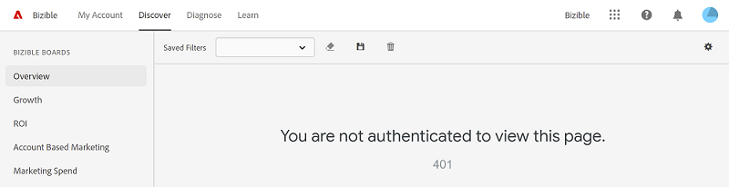

# Preguntas frecuentes {#faq}

[!DNL Marketo Measure Discover]: Preguntas más frecuentes.

**¿Cómo se guardan los filtros en un informe?**

Al igual que hoy, los resultados de la consulta se guardan en la dirección URL y se pueden guardar o compartir con la dirección URL copiada.

**¿Cómo utilizo intervalos de fechas preestablecidos como el año pasado o el trimestre actual?**

Ahora, en lugar de utilizar intervalos de fechas preestablecidos, se ha agregado flexibilidad de fechas. Puede seguir configurando Año pasado, pero tiene la opción de seleccionar Último 1 año, que son los últimos 365 días a partir de hoy, o Último 1 año completo, que es el último año completo del 1/1 al 31/12. Otros buenos usos del nuevo selector de fechas es establecer un intervalo de fechas relativo, lo que tenderá a proporcionar un intervalo de tiempo móvil para una fecha móvil.

**¿Cómo obtengo datos de CPL o CPC?**

Estas métricas solo se pueden encontrar en el tablero Medios de pago.

**¿Por qué no muestra Vistas de página en el panel de crecimiento?**

Una de las características del tablero de crecimiento es que no puede agrupar los gráficos de tendencias por una dimensión, como Canal o Campaña. No tenemos esos datos disponibles en el nivel de vista de página, ya que las vistas de página no siempre tienen una fuente como canal o campaña, porque se producen en mitad de las visitas web. Utilice medios de pago o tráfico web para ver los datos de vistas de página.

**Al cambiar la agrupación, los totales no siempre equivalen a la misma cantidad. ¿Por qué?**

No existen valores para cada jerarquía de datos porque la jerarquía no siempre es un flujo de corte claro. Por ejemplo, independientemente de si los costes se informan automáticamente o se importan desde un proveedor de publicidad, el coste total del canal 1 podría ser de 10 000 $, pero por campaña individual, solo se informó de un total de 5 500 $, por lo que cuando la agrupación cambie entre el canal y la campaña, los totales variarán.

**¿Qué es &quot;coincide con un atributo de usuario&quot; en los operadores de filtro?**

Los atributos de usuario se aplican a usuarios como ID empresarial, nombre o apellidos, pero como nuestros usuarios son usted (nuestros clientes) y no sus clientes, los atributos de usuario no se pueden utilizar en [!DNL Marketo Measure Discover] experiencia. No dude en ignorar esta opción. Estamos trabajando para mejorar la experiencia de filtrado personalizado que eliminará los filtros que no se aplican a nuestros clientes.

**¿Por qué algunos intervalos de fechas predeterminados pasan por el primero del mes siguiente?**

Aunque el intervalo de fechas no siempre es intuitivo, la interfaz de usuario del filtro predeterminado tiene el texto útil &quot;antes&quot; que corresponde con la fecha de finalización, por lo que esto debería ayudarle a recordarle que la fecha de finalización que utiliza debe ser 1 día fuera del intervalo deseado.

**¿Qué modelo de atribución se utiliza para posibles clientes y contactos?**

Los puntos de contacto del comprador asignados a los posibles clientes y contactos se miden hasta el contacto de creación de posibles clientes, por lo que se recomiendan los modelos de primer contacto, creación de posibles clientes y forma de U. Si cambia el modelo de atribución a Forma de W o Ruta completa, se aplica automáticamente un modelo en forma de U a los posibles clientes y contactos.

**¿Por qué mis mosaicos Visitas, Visitas únicas y Forms están en blanco en el panel de crecimiento?**

Si estos mosaicos aparecen como 0 o en blanco en la vista, significa que los mosaicos no están aprovisionados para la cuenta. Póngase en contacto con su administrador de éxito si tiene alguna pregunta al respecto.

**Para los posibles clientes a lo largo del tiempo y los contactos a lo largo del tiempo, ¿cuál es la referencia del recuento?**

Utiliza los recuentos de puntos de contacto, distribuidos por el modelo de atribución seleccionado. Será el total de posibles clientes y recuentos distribuidos a lo largo del tiempo. No es un recuento único.

**¿El gráfico de direcciones URL de formularios por canal en el marketing de contenido muestra visitas web o rellenos de formularios?**

Solo se rastrean en los rellenos de formulario.

**¿Cuál es el beneficio de Discover sobre Measure?**

[!DNL Marketo Measure Discover] proporciona una mejor funcionalidad, como obtención de detalles, y un mejor filtrado, como Subcanales y Canales. También pondremos el sol en Measure en algún momento en 2019.

**En Measure, pude filtrar por grupo de anuncios y cuenta cuando se filtra en cuentas de publicidad. ¿Cómo puedo ver esto en Discover?**

Esto solo estará disponible con el tablero de medios de pago.

**¿En qué se diferencia el canal de cohorte del canal de pasaporte?**

El canal de cohorte le permite observar la tasa de conversión del canal de ventas y medir el impacto entre etapas. Puede seleccionar la etapa que desea medir mediante los filtros, lo que le permite ver la tasa de conversión de esa etapa a todas las etapas posteriores. El panel Passport muestra todos los posibles clientes/contactos y oportunidades que han pasado por cada fase de la canalización en un lapso de tiempo determinado.

**¿Cómo se determina el contenido en el tablero de medios de pago?**

En cada uno de los mosaicos del tablero, agregamos un filtro para incluir solo datos en los que tenemos un proveedor de publicidad conocido de Facebook, Google, Bing, LinkedIn o Doubleclick, ya que nuestra integración nos permite extraer los datos de publicidad de esas fuentes. Además, agregamos un nombre difuso que coincide con los Canales y Subcanales de visualización, Búsqueda de pago, Social de pago, PPC, SEM, Móvil de pago, Twitter de pago, Adroll, Terminus, Madison Logic, Madisonlogic y Demandbase.

**¿Cuál es la diferencia entre visitas y visitas únicas?**

Las visitas únicas son un subconjunto de las visitas. Mientras que las visitas se contabilizan como una suma de cada visita al sitio, las visitas únicas son cookies únicas de esas visitas al sitio. Una persona puede contabilizar varias visitas únicas si regresa con un identificador de cookie diferente.

**¿Touchpoint cuenta el recuento de puntos de contacto del comprador o puntos de contacto de atribución del comprador?**

Es un recuento de lo que consideramos puntos de contacto &quot;sin procesar&quot;, o &quot;puntos de contacto del usuario&quot;, donde es un agregado de ambos, además de toques que no resultaron en un punto de contacto en el posible cliente/contacto u oportunidad.

**Cuando filtro por dirección URL, ¿por qué los mosaicos Costo por solo muestran 0,00 $?**

Este es el comportamiento esperado debido a que no tenemos costes segmentados por URL, por lo que no es aplicable en ese escenario.

**¿Por qué no aparecen todas las opciones de Segmento para mis filtros de Categoría?**

Solo los segmentos que tengan registros válidos asignados a ellos se mostrarán en el filtro Segmentos. Por ejemplo, si no hay registros con el segmento &quot;Otro&quot;, entonces &quot;Otro&quot; no aparecerá como opción.

**Does [!DNL Marketo Measure Discover] ¿admite el conjunto de caracteres GB18030?**

Discover utiliza herramientas de terceros y no admite el conjunto de caracteres GB18030 en este momento.

**Al cargar Discover, ¿por qué veo un error 401 que indica &quot;No está autenticado para ver esta página&quot;?**

[!DNL Marketo Measure Discover] requiere cookies de terceros para mostrarse correctamente. Para usar Discover, habilite las cookies de terceros en el explorador y actualice la página.

>[!NOTE]
>
>Algunos exploradores, como Chrome en Incognito, deshabilitan las cookies de terceros de forma predeterminada.

