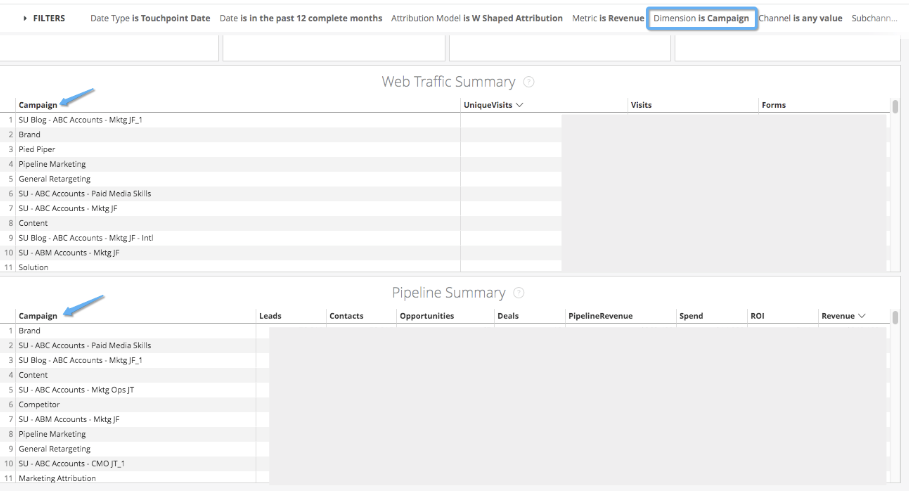

# Filtros {#filters}

Obtenga más información sobre los diferentes filtros disponibles en Discover y cómo puede utilizarlos.

>[!NOTE]
>
>Los operadores &quot;coincide con un atributo de usuario&quot; y &quot;coincide (avanzado)&quot; dentro de los filtros de Discover son puramente administrativos y se pueden ignorar sin problemas.

**ID de cuenta**

_Se utiliza en: Marketing basado en cuentas_

Seleccione o pegue una serie de ID de cuenta de CRM para filtrar los resultados. Los ID de cuenta proporcionan más exclusividad que el nombre de cuenta, ya que los nombres pueden ser iguales.

**Nombre de cuenta**

_Se utiliza en: Marketing basado en cuentas_

Seleccione o pegue una serie de nombres de cuenta del CRM para filtrar los resultados. Las cadenas pueden tener duplicados, por lo que es posible tener varios &quot;[!DNL Marketo Measure]&quot; cuentas por ejemplo. Si en este caso se necesita una sola cuenta, utilice el filtro ID de cuenta en su lugar.

**Modelo de atribución**

_Se utiliza en: Información general, Gasto en marketing, ROI de anuncios, Marketing basado en cuentas, Tráfico web, CMO, Medios de pago, Marketing de contenido, Passport_

Elija un solo modelo de atribución para aplicar al tablero: Primer contacto, Contacto de creación de posibles clientes, Forma de U, Forma de W, Ruta completa o Modelo personalizado. La ruta completa y el modelo personalizado no están disponibles en todos los niveles.

**Campaña**

_Se utiliza en: Información general, Crecimiento, ROI de la publicidad, Tráfico web, CMO, Medios de pago, Marketing de contenido, Pasaporte_

Filtre el tablero por uno o varios nombres de campaña. Los operadores proporcionan al filtro una flexibilidad adicional, como el uso de los operadores &quot;contiene&quot; o &quot;comienza con&quot;. Si se ha aplicado un filtro de canal o subcanal, la lista de campañas que aparecen será un subconjunto de los filtros aplicados.

**Categoría 1-10**

_Se utiliza en: Información general, Crecimiento, ROI de anuncios, CMO, Medios de pago, Marketing de contenido, Velocidad, Instantánea, Canal de cohorte, Pasaporte_

Aplique filtros de segmento al tablero mediante las categorías y los segmentos que ha creado en [!DNL Marketo Measure] Configuración. La lista de Categorías que ha creado aparecerá en el menú de filtros, por lo que, si no se ha configurado ninguna Categoría, no habrá ningún filtro de Categoría en el menú. Las categorías de segmentos no están disponibles en todos los niveles y el número de categorías disponibles varía también según el nivel.

**Canal**

_Se utiliza en: Información general, Crecimiento, Gasto en marketing, ROI de anuncios, Tráfico web, CMO, Medios de pago, Marketing de contenido, Velocidad, Pasaporte_

Filtre el tablero por uno o varios canales. Los operadores proporcionan al filtro una flexibilidad adicional, como el uso de los operadores &quot;contiene&quot; o &quot;comienza con&quot;. Una vez introducido un canal, los valores que se muestran en los filtros Subcanal y Campaña procederán del filtro de subcanal aplicado.

**Fase de cohorte**

_Se utiliza en: Canal de cohorte_

Seleccione la fase de la que desea ver una cohorte. El escenario que seleccione aparecerá en la parte superior del canal, con todas las conversiones fluyendo hacia abajo desde la parte superior.

**Fecha**

_Se utiliza en: Información general, Crecimiento, Gasto en marketing, ROI de anuncios, Marketing basado en cuentas, Tráfico web, CMO, Medios de pago, Marketing de contenido, Velocidad, Instantánea, Canal de cohorte, Pasaporte_

Seleccione un intervalo de fechas para filtrar los datos en los tableros, utilizando operadores de fechas flexibles como &quot;está en el intervalo&quot;, &quot;está en el año&quot; o &quot;está antes&quot;, por ejemplo. La excepción es Instantánea, donde se selecciona una sola fecha para ver una instantánea de los datos.

**Tipo de fecha**

_Se utiliza en: Información general, Crecimiento, Gasto en marketing, ROI de anuncios, Marketing basado en cuentas, Tráfico web, CMO, Medios de pago, Marketing de contenido, Pasaporte_

Elija el tipo de fecha que desea utilizar, asociada al filtro Fecha. El tipo de fecha predeterminado varía según el tablero. La fecha de punto de contacto hace referencia a la fecha en la que se produjo la actividad de marketing, la fecha de creación es la fecha en la que se creó el posible cliente, el contacto o la oportunidad en CRM y la fecha de cierre es la fecha en la que se cerró la oportunidad.

**Dimension**

_Se utiliza en: Medios de pago_

Dimension es similar a la función Agrupar por, excepto que se utiliza en el tablero de medios de pago de una manera ligeramente diferente. En lugar de apilar un gráfico, Dimension cambia las líneas del gráfico Información general y del objeto inicial de las tablas.

De forma predeterminada, el Dimension se establece en Subcanal y se puede cambiar a:

* Ninguno: muestra todo en acumulado sin desglose
* Canal: enumera los datos por canal de marketing
* Subcanal: enumera los datos por subcanal de marketing
* Campaign: enumera los datos por campaña
* Cuenta: enumera los datos por cuenta. Se aplica a [!DNL AdWords], [!DNL Bing], y [!DNL Facebook].
* Grupo de publicidad: enumera los datos por grupo de publicidad. Se aplica a [!DNL AdWords], [!DNL Bing], y [!DNL Facebook].
* Anuncio: enumera los datos por anuncio. Se aplica a los anuncios de Doubleclick, por lo que si no se utiliza Doubleclick, no aparecerá ningún resultado
* Anunciante: enumera los datos por anunciante. Se aplica al anunciante de Doubleclick, por lo que si no se utiliza Doubleclick, no aparecerá ningún resultado
* Creativo: enumera los datos por creativo. Se aplica a [!DNL AdWords], [!DNL Bing], y [!DNL Facebook].
* Palabra clave: enumera los datos por palabra clave. Se aplica a [!DNL AdWords], [!DNL Bing], y [!DNL Facebook].
* Ubicación: enumera los datos por ubicación. Se aplica a las ubicaciones de Doubleclick, por lo que si no se utiliza Doubleclick, no aparecerá ningún resultado
* Sitio: enumera los datos por sitio. Se aplica a los sitios de Doubleclick, por lo que si no se utiliza Doubleclick, no aparecerá ningún resultado

**Agrupar por**

_Se utiliza en: Información general, Crecimiento, Gasto en marketing, Marketing basado en cuentas, Tráfico web, CMO_

Ajusta los gráficos para cambiar la dimensión que se está apilando y agrupando. De forma predeterminada, Agrupar por está establecido en Canal y se puede cambiar a:

* Ninguno: muestra todo en acumulado sin desglose
* Canal: agrupa los datos por canal de marketing
* Subcanal: agrupa los datos por subcanal de marketing
* Campaign: agrupa los datos por campaña
* Cuenta: agrupa los datos por cuenta. Se aplica a [!DNL AdWords], [!DNL Bing], y [!DNL Facebook].
* Grupo de publicidad: agrupa los datos por grupo de publicidad. Se aplica a [!DNL AdWords], [!DNL Bing], y [!DNL Facebook].
* Anuncio: agrupa los datos por anuncio. Se aplica a los anuncios de Doubleclick, por lo que si no se utiliza Doubleclick, no aparecerá ningún resultado
* Anunciante: Agrupa los datos por anunciante. Se aplica al anunciante de Doubleclick, por lo que si no se utiliza Doubleclick, no aparecerá ningún resultado
* Creativo: agrupa los datos por creativo. Se aplica a [!DNL AdWords], [!DNL Bing], y [!DNL Facebook].
* Palabra clave: Agrupa los datos por palabra clave. Se aplica a [!DNL AdWords], [!DNL Bing], y [!DNL Facebook].
* Ubicación: agrupa los datos por ubicación. Se aplica a las ubicaciones de Doubleclick, por lo que si no se utiliza Doubleclick, no aparecerá ningún resultado
* Sitio: agrupa los datos por sitio. Se aplica a los sitios de Doubleclick, por lo que si no se utiliza Doubleclick, no aparecerá ningún resultado

**Página de aterrizaje**

_Se utiliza en: Marketing de contenido_

Explore en profundidad el rendimiento de una sola página de aterrizaje o quizás de páginas de aterrizaje que contengan una determinada palabra, como &quot;blog&quot;.

**Métrica**

_Se utiliza en: Información general, Tráfico web, CMO, Medios de pago, Marketing de contenido_

Existen dos selectores de métricas diferentes que se utilizan en distintos tableros. El selector de métricas cambia la medida en un gráfico, de modo que puede cambiar entre la visualización de ingresos o gastos o impresiones, por ejemplo.

En los tableros Información general y CMO, hay una lista abreviada de valores relacionados con las métricas de ROI:

* Ingresos
* Gastos
* Tratos
* Ingresos del canal
* Oportunidades
* Contactos
* Clientes potenciales

En los tableros Tráfico web, Medios de pago y Marketing de contenido, existe una lista más larga de valores relacionados con las métricas de ROI y de canal:

* Ingresos
* Gastos
* Tratos
* Ingresos del canal
* Oportunidades
* Contactos
* Clientes potenciales
* Clics
* impresiones
* Visitas
* Visitas únicas
* Vistas de páginas
* Formularios

**Fase**

_Se utiliza en: Velocidad_

De forma predeterminada, el panel Velocidad muestra los tiempos de todas las etapas, pero para profundizar en una etapa específica, utilice el filtro Fase para seleccionar la etapa.

**Subcanal**

_Se utiliza en: Información general, Crecimiento, Gasto en marketing, ROI de anuncios, Tráfico web, CMO, Medios de pago, Marketing de contenido, Pasaporte_

Filtre el tablero por uno o varios subcanales. Los operadores proporcionan al filtro una flexibilidad adicional, como el uso de los operadores &quot;contiene&quot; o &quot;comienza con&quot;. Si se ha aplicado un filtro de canal, la lista de subcanales que aparecen será un subconjunto de los filtros aplicados. Una vez introducido un subcanal, los valores que se muestran en los filtros de campaña proceden del filtro de subcanal aplicado.

**URL**

_Se utiliza en: Tráfico web_

Explore en profundidad el tráfico de una sola dirección URL o quizás direcciones URL que contengan una determinada palabra, como &quot;producto&quot;.

**Won**

_Se utiliza en: Velocidad_

De forma predeterminada, el tablero de Velocity informa solo de las oportunidades ganadas cerradas, pero ajuste este filtro para ver la velocidad de las oportunidades ganadas cerradas o perdidas cerradas.
