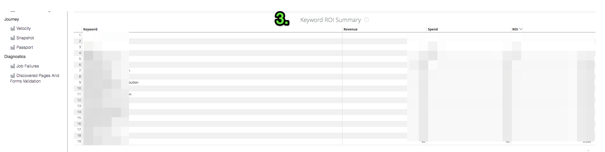
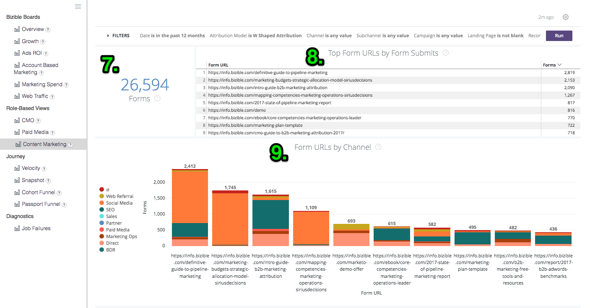

# Definiciones y enciclopedia {#definitions-and-encyclopedia}

A continuación se ofrece una descripción general de los diferentes tableros y mosaicos presentes en la plataforma de Discover, así como los filtros de dichos tableros. Dentro de la captura de pantalla de cada Consejo hay varios mosaicos, cuyas definiciones se pueden encontrar en la sección de ese Consejo que aparece a continuación.

**[!DNL Marketo Measure]Tableros**

Resumen

Crecimiento

ROI de anuncios

Marketing basado en la cuenta

Gastos de marketing

Tráfico web

**Vistas basadas en roles**

CMO

Medios pagos

Marketing de contenido

Operaciones de marketing

**Camino**

Velocidad

Instantánea

Canal de pasaporte

Ruta de participación

## [!DNL Marketo Measure] Tableros {#marketo-measure-boards}

### Resumen {#overview}

La información general ofrece al usuario una visión general del rendimiento del equipo de marketing en cuanto a su impacto en los ingresos, los gastos y el ROI.

**Filtros**

El tipo de fecha es la fecha de cierre

La fecha se encuentra en los últimos 12 meses completos

El modelo de atribución tiene forma de W

La métrica es ingresos

El Dimension es Canal

El canal es igual a __

El subcanal es igual a __

La campaña es igual a __

Categorías

**Ingresos**

`1.` El importe total de ingresos procedentes de las oportunidades de Closed Won, basado en el modelo de atribución.

Haga clic en Mostrar detalles y explore los datos visualizándolos como una visualización y una tabla.

**Resumen**

`2.` Con la lista desplegable Métrica del menú Filtros , este gráfico muestra los ingresos/ingresos de la canalización/gastos/ofertas/posibles clientes/contactos atribuidos a cada canal, y se muestra a lo largo del tiempo.

**Gastos**

`3.` La cantidad total de gastos registrados, tanto de costes de API como de costes informados por sí mismos, se acumulan en el nivel de canal más alto.

Haga clic en Mostrar detalles y explore los datos visualizándolos como una visualización y una tabla.

**Retorno de la inversión**

`4.` Con el uso de la lista desplegable Dimensiones del menú Filtros, esto muestra cuánto ROI se atribuyó a cada canal, subcanal, campaña, cuenta grupo de anuncio, anuncio, anunciante, creativo, palabra clave, publicación o sitio según el modelo de atribución durante el intervalo de fechas entero seleccionado.

**Resumen del ROI**

Con el menú desplegable Dimension del menú Filtros , se muestra la cantidad de ingresos, gastos y ROI que se atribuyeron a cada canal / subcanal / campaña / cuenta / grupo de anuncios / anuncio / anunciante / creativo / palabra clave / ubicación / sitio en función del modelo de atribución durante todo el intervalo de fechas seleccionado.

**Tratos**

`5.` Número total de oportunidades de Closed Won, según el recuento del modelo de atribución. Si se selecciona el tipo de fecha &quot;Fecha de punto de contacto&quot;, es posible realizar recuentos parciales porque es posible excluir algunos puntos de contacto dentro de una oportunidad mediante este tipo de fecha.

Haga clic en Mostrar detalles y explore los datos visualizándolos como una visualización y una tabla.

**Costo por trato**

`6.` El gasto total dividido por el número total de ofertas, lo que proporciona un costo promedio que se necesita para adquirir una oportunidad cerrada ganada.

**Ingresos del canal**

`7.` El total de ingresos potenciales de cualquier oportunidad abierta, lo que significa que no está cerrada perdida ni cerrada ganada. Los ingresos se basan en el modelo de atribución seleccionado.

Haga clic en Mostrar detalles y explore los datos visualizándolos como una visualización y una tabla.

**Tamaño del trato**

`8.` Cantidad promedio de una oportunidad de Closed Won.

**Resumen del canal**

`9`. Con la lista desplegable Métrica del menú Filtros , se trata de una lista de canales basada en la cantidad de ingresos/ingresos por canalización/gasto/ofertas/oportunidades/posibles clientes/contactos que se atribuyeron a cada canal, ordenados por el más alto según el modelo de atribución seleccionado.

**Resumen de subcanal**

`10.` Con la lista desplegable Métrica del menú Filtros , se trata de una lista de subcanales basada en la cantidad de ingresos/ingresos por canalización/gasto/ofertas/oportunidades/posibles clientes/contactos que se atribuyeron a cada subcanal, ordenados por el más alto según el modelo de atribución seleccionado.

**Resumen de la campaña**

`11.` Con la lista desplegable Métrica del menú Filtros , se trata de una lista de campañas en función de la cantidad de ingresos/ingresos por canalización/gasto/ofertas/oportunidades/posibles clientes/contactos que se atribuyeron a cada campaña, ordenados por el valor más alto según el modelo de atribución seleccionado.

### Crecimiento {#growth}

El crecimiento permite que el especialista en marketing vea lo que ha generado en todos los ámbitos, desde posibles clientes hasta contactos y oportunidades hasta ingresos. Es una vista rápida de toda la canalización y de su rendimiento a lo largo del tiempo.

**Filtros**

El tipo de fecha es el punto de contacto

La fecha se encuentra en los últimos 12 meses completos

El modelo de atribución tiene forma de W

Agrupar por Ninguno

El canal es igual a __

El subcanal es igual a __

La campaña es igual a __

Categorías

**Ingresos**

`1.` El importe total de ingresos procedentes de las oportunidades de Closed Won, basado en el modelo de atribución.

Haga clic en Mostrar detalles y explore los datos visualizándolos como una visualización y una tabla.

**Ingresos a lo largo del tiempo**

`2.` El importe total de los ingresos procedentes de las oportunidades de ganancia cerrada, basado en el modelo de atribución que muestra la tendencia a lo largo de un período de tiempo específico. Utilice el filtro Agrupar por para cambiar la pila por canal, subcanal, campaña, cuenta, grupo de publicidad, anuncio, anunciante, creativo, palabra clave, ubicación, sitio.

Profundice para ver los datos desde una dimensión de fecha más pequeña.

**Tratos**

`3.` Número total de oportunidades de Closed Won, según el recuento del modelo de atribución.

Haga clic en Mostrar detalles y explore los datos visualizándolos como una visualización y una tabla.

**Ofertas a lo largo del tiempo**

`4.` El número total de oportunidades de ganancia cerrada, según el modelo de atribución que muestra la tendencia a lo largo de un lapso de tiempo específico. Utilice el filtro Agrupar por para cambiar la pila por canal, subcanal, campaña, cuenta, grupo de publicidad, anuncio, anunciante, creativo, palabra clave, ubicación, sitio.

Profundice para ver los datos desde una dimensión de fecha más pequeña.

**Ingresos del canal**

`5.` El total de ingresos potenciales de cualquier oportunidad abierta, lo que significa que no está cerrada perdida ni cerrada ganada. Los ingresos se basan en el modelo de atribución seleccionado.

Haga clic en Mostrar detalles y explore los datos visualizándolos como una visualización y una tabla.

**Ingresos de canalización a lo largo del tiempo**

`6.` El total de ingresos potenciales de cualquier oportunidad abierta, basado en el modelo de atribución que muestra la tendencia a lo largo de un lapso de tiempo específico. Utilice el filtro Agrupar por para cambiar la pila por canal, subcanal, campaña, cuenta, grupo de publicidad, anuncio, anunciante, creativo, palabra clave, ubicación, sitio.

Profundice para ver los datos desde una dimensión de fecha más pequeña.

**Leads**

`7.` El número total de posibles clientes, según el modelo de atribución. Si se selecciona el tipo de fecha &quot;Fecha de punto de contacto&quot;, es posible realizar recuentos parciales porque es posible excluir algunos puntos de contacto dentro de un registro de posible cliente con este tipo de fecha. Si se aplica un modelo de atribución más allá de Forma de U, el recuento Forma de U se utiliza para Forma de W, Forma de W y Modelo personalizado.

Haga clic en Mostrar detalles y explore los datos visualizándolos como una visualización y una tabla.

**Posibles clientes con el tiempo**

`8.` El número total de posibles clientes, según el modelo de atribución que muestra la tendencia a lo largo de un período de tiempo específico. Utilice el filtro Agrupar por para cambiar la pila por canal, subcanal, campaña, cuenta, grupo de publicidad, anuncio, anunciante, creativo, palabra clave, ubicación, sitio.

Profundice para ver los datos desde una dimensión de fecha más pequeña.

**Contactos**

`9.` El número total de contactos, según el modelo de atribución. Si se selecciona el tipo de fecha &quot;Fecha de punto de contacto&quot;, es posible realizar recuentos parciales porque es posible excluir algunos puntos de contacto dentro de un registro de contacto utilizando este tipo de fecha. Si se aplica un modelo de atribución más allá de Forma de U, el recuento Forma de U se utiliza para Forma de W, Forma de W y Modelo personalizado.

Haga clic en Mostrar detalles y explore los datos visualizándolos como una visualización y una tabla.

**Contactos a lo largo del tiempo**

`10.` El número total de contactos, según el modelo de atribución que muestra la tendencia a lo largo de un período de tiempo específico. Utilice el filtro Agrupar por para cambiar la pila por canal, subcanal, campaña, cuenta, grupo de publicidad, anuncio, anunciante, creativo, palabra clave, ubicación, sitio.

Profundice para ver los datos desde una dimensión de fecha más pequeña.

**Oportunidades**

`11.` Número total de oportunidades, según el modelo de atribución. Si se selecciona el tipo de fecha &quot;Fecha de punto de contacto&quot;, es posible realizar recuentos parciales porque es posible excluir algunos puntos de contacto dentro de un registro de oportunidad con este tipo de fecha.

Haga clic en Mostrar detalles y explore los datos visualizándolos como una visualización y una tabla.

**Oportunidades a lo largo del tiempo**

`12.` Número total de oportunidades, según el modelo de atribución que muestra la tendencia a lo largo de un período de tiempo específico. Utilice el filtro Agrupar por para cambiar la pila por canal, subcanal, campaña, cuenta, grupo de publicidad, anuncio, anunciante, creativo, palabra clave, ubicación, sitio.

Profundice para ver los datos desde una dimensión de fecha más pequeña.

**Visitas**

`13.` Número total de visitas al sitio rastreadas en todos los visitantes conocidos y anónimos.

Haga clic en Mostrar detalles y explore los datos visualizándolos como una visualización y una tabla.

(Esta aparecerá como 0 si esta función está deshabilitada).

**Visitas a lo largo del tiempo**

`14.` Número total de visitas al sitio rastreadas mostrando la tendencia a lo largo de un período de tiempo específico. Utilice el filtro Agrupar por para cambiar la pila por canal, subcanal, campaña, cuenta, grupo de publicidad, anuncio, anunciante, creativo, palabra clave, ubicación, sitio.

Profundice para ver los datos desde una dimensión de fecha más pequeña.

(Esta opción aparecerá vacía si se desactiva esta función).

**Visitas únicas**

`15.` Número total de visitas únicas al sitio rastreadas en todos los visitantes conocidos y anónimos.

Haga clic en Mostrar detalles y explore los datos visualizándolos como una visualización y una tabla.

(Esta aparecerá como 0 si esta función está deshabilitada).

**Visitas únicas a lo largo del tiempo**

`16.` Número total de visitas únicas al sitio rastreadas mostrando la tendencia a lo largo de un período de tiempo específico. Utilice el filtro Agrupar por para cambiar la pila por canal, subcanal, campaña, cuenta, grupo de publicidad, anuncio, anunciante, creativo, palabra clave, ubicación, sitio.

Profundice para ver los datos desde una dimensión de fecha más pequeña.

(Esta opción aparecerá vacía si se desactiva esta función).

**Formularios**

`17.` Número total de formularios enviados en todos los visitantes conocidos y anónimos.

Haga clic en Mostrar detalles y explore los datos visualizándolos como una visualización y una tabla.

(Esta aparecerá como 0 si esta función está deshabilitada).

**Forms a lo largo del tiempo**

`18.` Número total de formularios enviados que muestran la tendencia a lo largo de un período de tiempo específico. Utilice el filtro Agrupar por para cambiar la pila por canal, subcanal, campaña, cuenta, grupo de publicidad, anuncio, anunciante, creativo, palabra clave, ubicación, sitio.

Profundice para ver los datos desde una dimensión de fecha más pequeña.

(Esta opción aparecerá vacía si se desactiva esta función).

### ROI de anuncios {#ads-roi}

El retorno de la inversión de los anuncios proporciona a los administradores de medios de pago una visión de sus esfuerzos de marketing, lo que les proporciona una perspectiva del rendimiento de sus campañas en relación con el rendimiento de las palabras clave.

**Filtros**

El tipo de fecha es la fecha de cierre

La fecha se encuentra en los últimos 12 meses completos

El modelo de atribución tiene forma de W

El canal es igual a __

El subcanal es igual a __

La campaña es igual a __

Categorías

**Resumen del ROI de campaña**

`1.` Una lista de campañas en función de la cantidad de ingresos, gastos y ROI atribuidos a cada campaña, ordenados según los ingresos más altos según el modelo de atribución seleccionado.

**Resumen del ROI de creativo**

`2.` Lista de elementos creativos en función de la cantidad de ingresos, gastos y ROI atribuidos a cada elemento creativo, ordenados según los ingresos más altos según el modelo de atribución seleccionado.

**Resumen del ROI de palabra clave**

`3.` Una lista de palabras clave basada en la cantidad de ingresos, gastos y ROI atribuidos a cada palabra clave, ordenados según los ingresos más altos según el modelo de atribución seleccionado.

### Marketing basado en la cuenta {#account-based-marketing}

El marketing basado en cuentas proporciona a las empresas que utilizan ABM la capacidad de realizar un seguimiento de sus esfuerzos hacia sus cuentas de destino y la participación que han visto en su marketing.

**Filtros**

El tipo de fecha es el punto de contacto

La fecha se encuentra en los últimos 12 meses completos

El modelo de atribución es atribución en forma de W

Agrupar por es el canal

Las cuentas son iguales a __

**Ingresos**

El importe total de ingresos procedentes de las oportunidades de Closed Won, basado en el modelo de atribución.

Haga clic en Mostrar detalles y explore los datos visualizándolos como una visualización y una tabla.

**Ingresos del canal**

El total de ingresos potenciales de cualquier oportunidad abierta, lo que significa que no está cerrada perdida ni cerrada ganada. Los ingresos se basan en el modelo de atribución seleccionado.

**Cantidad promedio de toques por cuenta**

Número promedio de puntos de contacto generados desde cada cuenta de CRM, por ID de cuenta.

**Clientes potenciales coincidentes**

El número total de posibles clientes que se compararon correctamente con una cuenta usando la variable [!DNL Marketo Measure] Característica de cliente potencial a cuenta , que utiliza algoritmos de coincidencia de sitio web, nombre de la empresa y dominio de correo electrónico.

**Cuentas comprometidas**

Número total de cuentas que recibieron cualquier punto de contacto. Si se utiliza una lista de cuentas de destino, se trata del subconjunto de cuentas de esa lista de cuentas de destino.

**Oportunidades participantes**

Número total de oportunidades que recibieron cualquier punto de contacto. Si se utiliza una lista de cuentas de destino, este es el subconjunto de oportunidades de esa lista de cuentas de destino.

**Personas participantes**

Número total de personas (posibles clientes y contactos por direcciones de correo electrónico) que recibieron cualquier punto de contacto. Si se utiliza una lista de cuentas de destino, se trata del subconjunto de personas de esa lista de cuentas de destino.

**Touchpoints en el tiempo**

El número total de puntos de contacto registrados durante el período de tiempo especificado. Si se utiliza una lista de cuentas de destino, se trata del subconjunto de cuentas de esa lista de cuentas de destino.

**Cuentas afectadas a lo largo del tiempo (gráfico)**

El número total de cuentas que recibieron cualquier punto de contacto por mes durante el período de tiempo especificado con la opción de agrupar los resultados por Canal, Subcanal, Campaña, Cuenta, Grupo de anuncios, Anuncio, Anunciante, Creativo, Palabra clave, Ubicación o Sitio. Si se utiliza una lista de cuentas de destino, se trata del subconjunto de cuentas de esa lista de cuentas de destino.

**Cuentas por conteo de Touchpoint**

Por ID de cuenta y Nombre de cuenta, el número total de puntos de contacto de cada cuenta.

**Conteo de Touchpoints**

El número de puntos de contacto atribuidos a cada dimensión, donde la dimensión puede cambiarse con el filtro Agrupar por como: Ninguno / Canal / Subcanal / Campaña / Cuenta / Anunciante / Anuncio / Creativo / Grupo de anuncios / Palabra clave / Colocación / Sitio.

### Gastos de marketing {#marketing-spend}

Los gastos de marketing muestran a los especialistas en marketing cuánto han invertido durante un período de tiempo para que puedan rastrear los gastos por mes y por canal.

**Filtros**

El tipo de fecha es el punto de contacto

La fecha se encuentra en los últimos 12 meses completos

Modelo de atribución

Agrupar por es igual a Canal

El canal es igual a __

El subcanal es igual a __

La campaña es igual a __

**Ingresos**

El importe total de ingresos procedentes de las oportunidades de Closed Won, basado en el modelo de atribución.

Haga clic en Mostrar detalles y explore los datos visualizándolos como una visualización y una tabla.

**Gastos**

La cantidad total de gastos registrados, tanto de costes de API como de costes informados por sí mismos, se acumulan en el nivel de canal más alto.

Haga clic en Mostrar detalles y explore los datos visualizándolos como una visualización y una tabla.

**Retorno de la inversión**

El ROI calculado (rendimiento del capital invertido) de los ingresos totales (del modelo de atribución seleccionado) y los gastos totales.

**Gasto (gráfico)**

Cantidad total de gasto registrado que muestra la tendencia a lo largo de un período de tiempo específico. Utilice el filtro Agrupar por para cambiar la pila por Ninguno, Canal, Subcanal, Campaña, Cuenta, Grupo de anuncios, Anuncio, Anunciante, Creativo, Palabra clave, Colocación, Sitio.

Como el gasto no se registra en todos los niveles, es posible que los totales no sean iguales a cada selección de &quot;Agrupar por&quot;. Por ejemplo, el total de todas las campañas no será igual al total de todos los subcanales.

**Gasto + ROI**

Muestra la cantidad de gasto en marketing por mes junto con el ROI en el eje y derecho.

**Gastos por canal**

Una lista de canales basada en la cantidad de informes para cada canal, ordenada por el gasto más alto.

**Gastos por subcanal**

Una lista de subcanales basada en la cantidad de informes para cada subcanal, ordenada por el gasto más alto.

**Gastos por campaña**

Una lista de campañas en función de la cantidad de informes obtenidos para cada campaña, ordenadas por el gasto más alto. Las campañas constan de una lista completa de campañas que incluyen valores utm_campaign de Vistas de página.

### Tráfico web {#web-traffic}

La vista Tráfico web permite a los especialistas en marketing realizar un seguimiento de la actividad en su sitio web, midiendo el tráfico tanto de visitantes conocidos como anónimos del sitio.

**Filtros**

El tipo de fecha es el punto de contacto

La fecha se encuentra en los últimos 12 meses completos

El modelo de atribución es atribución en forma de W

La dirección URL es igual a __

Agrupar por es Ninguno

La métrica es Visitas

El canal es igual a __

El subcanal es igual a __

La campaña es igual a __

**Visitas únicas**

Número total de visitas únicas al sitio rastreadas en todos los visitantes conocidos y anónimos.

Haga clic en Mostrar detalles y explore los datos visualizándolos como una visualización y una tabla.

**Visitas**

Número total de visitas al sitio rastreadas en todos los visitantes conocidos y anónimos.

Haga clic en Mostrar detalles y explore los datos visualizándolos como una visualización y una tabla.

**Costo por visita única**

El gasto total dividido por la cantidad total de visitas únicas, que proporciona el costo por tasa de visita única.

**Costo por visita**

El gasto total dividido por el número total de visitas, que proporciona el costo por tasa de visita.

**Ingresos por visita única**

El promedio calculado de ingresos cerrados por visita única al sitio por parte de visitantes conocidos y anónimos.

**Ingresos por visita**

El promedio calculado de ingresos cerrados por visita al sitio por visitantes conocidos y anónimos.

**Vistas de páginas**

Número total de vistas de páginas rastreadas en todos los visitantes conocidos y anónimos.

Haga clic en Mostrar detalles y explore los datos visualizándolos como una visualización y una tabla.

**Formularios**

Número total de formularios enviados en todos los visitantes conocidos y anónimos.

Haga clic en Mostrar detalles y explore los datos visualizándolos como una visualización y una tabla.

**Resumen**

Con el menú desplegable Métrica del menú Filtros , este gráfico muestra los ingresos/ingresos de la canalización/gastos/ofertas/posibles clientes/contactos/clics/impresiones/visitas/visitas únicas/vistas de página/formularios atribuidos a cada dimensión y mostrados a lo largo del tiempo. Los Dimension se pueden cambiar de Ninguno a Canal / Subcanal / Campaña / Cuenta / Anunciante / Anuncio / Creativo / Grupo de anuncios / Palabra clave / Colocación / Sitio.

**Resumen de tráfico web**

Por dirección URL, vea el número de vistas de página, visitas, visitas únicas y envíos de formularios que se acreditan a cada una.

**Resumen del remitente**

Número de visitas a la página y de visitas únicas provenientes de cada URL de referencia.

**Visitas únicas por fuente**

Mediante el menú desplegable Agrupar por del menú Filtros , vea la fuente de los visitantes únicos del sitio. Cambie el grupo por: Canal, Subcanal, Campaña, Cuenta, Grupo De Publicidad, Anunciante, Creativo, Palabra Clave, Colocación, Sitio.

**Visitas por fuente**

Mediante el menú desplegable Agrupar por del menú Filtros , vea el origen de los visitantes del sitio. Cambie el grupo por: Canal, Subcanal, Campaña, Cuenta, Grupo De Publicidad, Anunciante, Creativo, Palabra Clave, Colocación, Sitio.

**Clientes potenciales por página de destino**

Una lista de páginas de aterrizaje basada en el número de posibles clientes generados a partir de cada página de aterrizaje, ordenada según la mayor cantidad de posibles clientes.

**Clientes potenciales por URL de formulario**

Una lista de direcciones URL de formulario basadas en el número de posibles clientes generados a partir de cada dirección URL, ordenadas según el número máximo de posibles clientes.

## Vistas basadas en roles {#role-based-views}

### CMO {#cmo}

Las vistas de CMO ofrecen a la CMO una visión de alto nivel del rendimiento del equipo de marketing en cuanto a su impacto en los ingresos, los gastos y el ROI.

**Filtros**

El tipo de fecha es la fecha de cierre

La fecha se encuentra en los últimos 12 meses completos

El modelo de atribución tiene forma de W

El canal es igual a __

El subcanal es igual a __

La campaña es igual a __

La métrica es ingresos

Categorías

**Ingresos**

`1.` El importe total de ingresos procedentes de las oportunidades de Closed Won, basado en el modelo de atribución.

Haga clic en Mostrar detalles y explore los datos visualizándolos como una visualización y una tabla.

**Resumen**

`2.` Con la lista desplegable Métrica del menú Filtros , este gráfico muestra los ingresos/ingresos de la canalización/gastos/ofertas/posibles clientes/contactos atribuidos a cada canal, y se muestra a lo largo del tiempo.

**Gastos**

`3.` La cantidad total de gastos registrados, tanto de costes de API como de costes informados por sí mismos, se acumulan en el nivel de canal más alto.

Haga clic en Mostrar detalles y explore los datos visualizándolos como una visualización y una tabla.

**Retorno de la inversión**

`4.` El ROI calculado (rendimiento del capital invertido) de los ingresos totales (del modelo de atribución seleccionado) y los gastos totales.

**Tratos**

`5.` Número total de oportunidades de Closed Won, según el recuento del modelo de atribución. Si se selecciona el tipo de fecha &quot;Fecha de punto de contacto&quot;, es posible realizar recuentos parciales porque es posible excluir algunos puntos de contacto dentro de una oportunidad mediante este tipo de fecha.

Haga clic en Mostrar detalles y explore los datos visualizándolos como una visualización y una tabla.

**Costo por trato**

`6.` El gasto total dividido por el número total de ofertas, lo que proporciona un costo promedio que se necesita para adquirir una oportunidad cerrada ganada.

**Ingresos del canal**

`7.` El total de ingresos potenciales de cualquier oportunidad abierta, lo que significa que no está cerrada perdida ni cerrada ganada. Los ingresos se basan en el modelo de atribución seleccionado.

Haga clic en Mostrar detalles y explore los datos visualizándolos como una visualización y una tabla.

**Tamaño del trato**

`8.` Cantidad promedio de una oportunidad de Closed Won.

**Resumen del canal**

`9.` Con la lista desplegable Métrica del menú Filtros , se trata de una lista de canales basada en la cantidad de ingresos/ingresos por canalización/gasto/ofertas/oportunidades/posibles clientes/contactos que se atribuyeron a cada canal, ordenados por el más alto según el modelo de atribución seleccionado.

**Resumen de subcanal**

`10.` Con la lista desplegable Métrica del menú Filtros , se trata de una lista de subcanales basada en la cantidad de ingresos/ingresos por canalización/gasto/ofertas/oportunidades/posibles clientes/contactos que se atribuyeron a cada subcanal, ordenados por el más alto según el modelo de atribución seleccionado.

**Resumen de la campaña**

`11.` Con la lista desplegable Métrica del menú Filtros , se trata de una lista de campañas en función de la cantidad de ingresos/ingresos por canalización/gasto/ofertas/oportunidades/posibles clientes/contactos que se atribuyeron a cada campaña, ordenados por el valor más alto según el modelo de atribución seleccionado.

### Medios pagos {#paid-media}

Los tableros de medios pagados proporcionan a los administradores de medios pagados (o similares) un vistazo a su rendimiento de medios de pago. Poder ver cuánto se sirvió en los canales relevantes y cuánta demanda se generó de sus esfuerzos. Todas las métricas se extraen de integraciones de medios de pago.

**Filtros**

El tipo de fecha es el punto de contacto

La fecha se encuentra en los últimos 12 meses completos

El modelo de atribución tiene forma de W

La métrica es ingresos

El Dimension es Canal

El canal es igual a __

El subcanal es igual a __

La campaña es igual a __

Categorías

**Ingresos**

`1.` El importe total de ingresos procedentes de las oportunidades de Closed Won, basado en el modelo de atribución.

Haga clic en Mostrar detalles y explore los datos visualizándolos como una visualización y una tabla.

**Gastos**

`2.` La cantidad total de gastos registrados, tanto de costes de API como de costes informados por sí mismos, se acumulan en el nivel de canal más alto.

Haga clic en Mostrar detalles y explore los datos visualizándolos como una visualización y una tabla.

**Retorno de la inversión**

`3.` El ROI calculado (rendimiento del capital invertido) de los ingresos totales (del modelo de atribución seleccionado) y los gastos totales.

**Ingresos del canal**

`4.` El total de ingresos potenciales de cualquier oportunidad abierta, lo que significa que no está cerrada perdida ni cerrada ganada. Los ingresos se basan en el modelo de atribución seleccionado.

Haga clic en Mostrar detalles y explore los datos visualizándolos como una visualización y una tabla.

**Resumen**

`5.` Con la lista desplegable Métrica del menú Filtros , este gráfico muestra los ingresos/ingresos de la canalización/gastos/ofertas/posibles clientes/contactos/visitas/visitas únicas/impresiones/clics/formularios a lo largo del tiempo.

**Impresiones**

`6.` El número total de impresiones servidas desde todas las cuentas de anuncios conectados.

Haga clic en Mostrar detalles y explore los datos visualizándolos como una visualización y una tabla.

**CPM**

`7.` El gasto total de las impresiones servidas dividido por el total de impresiones (dividido por 1000), proporcionando la tasa de CPM.

**de clics**

`8.` El número total de clics rastreados desde todas las cuentas de anuncios conectados.

Haga clic en Mostrar detalles y explore los datos visualizándolos como una visualización y una tabla.

**CPC**

`9.` El gasto total de los clics rastreados dividido por el total de clics, proporcionando la tasa de CPC.

**Leads**

`10.` El número total de posibles clientes creados en CRM.

**Costo por cliente potencial**

`11.` El gasto total de los posibles clientes creados dividido por el total de clics, proporcionando la tasa CPL.

**Visitas**

`12.` Número total de visitas al sitio rastreadas en todos los visitantes conocidos y anónimos.

Haga clic en Mostrar detalles y explore los datos visualizándolos como una visualización y una tabla.

**Visitas únicas**

`13.` Número total de visitas únicas al sitio rastreadas en todos los visitantes conocidos y anónimos.

Haga clic en Mostrar detalles y explore los datos visualizándolos como una visualización y una tabla.

**Resumen de tráfico web**

Mediante el selector de dimensiones del menú Filtros, cambie entre Canal, Subcanal, Campaña, Cuenta, Grupo de anuncios, Anuncio, Anunciante, Creativo, Palabra clave, Colocación, Sitio y vea la cantidad de vistas de página, visitas, visitas únicas y envíos de formularios que se acreditan a cada uno.

**Resumen de proceso de cliente potencial**

Con el selector de dimensiones en el menú Filtros, cambie entre Canal, Subcanal, Campaña, Cuenta, Grupo de anuncios, Anuncio, Anunciante, Creativo, Palabra clave, Colocación, Sitio y vea el número de posibles clientes o contactos atribuidos a cada uno, según el modelo de atribución seleccionado.

**Resumen de la oportunidad del proceso**

Mediante el selector de dimensiones del menú Filtros, cambie entre Canal, Subcanal, Campaña, Cuenta, Grupo de anuncios, Anuncio, Anunciante, Creativo, Palabra clave, Colocación, Sitio y vea el número de oportunidades, Ofertas, Ingresos de canalización, Gasto, ROI e Ingresos atribuidos a cada uno, según el modelo de atribución seleccionado.

### Marketing de contenido {#content-marketing}

El tablero Marketing de contenido permite a los especialistas en marketing de contenido ver el rendimiento de su contenido de marketing, desde cuántas visitas generaron hasta cuántos ingresos se cerraron. Puede verlo por todo el contenido o reducirlo a fragmentos de contenido o páginas específicos.

Filtros

El tipo de fecha es el punto de contacto

La fecha se encuentra en los últimos 12 meses completos

El modelo de atribución tiene forma de W

La página de aterrizaje es igual a __

El canal es igual a __

El subcanal es igual a __

La campaña es igual a __

Categorías

**Ingresos totales**

`1.` El importe total de los ingresos procedentes de las oportunidades de Closed Won solo procedentes de fuentes digitales, según el modelo de atribución.

Haga clic en Mostrar detalles y explore los datos visualizándolos como una visualización y una tabla.

**Páginas de destino por ingresos**

`2.` Una lista de páginas de aterrizaje en función de la cantidad de ingresos que se atribuyeron a cada página de aterrizaje, ordenadas por los ingresos más altos según el modelo de atribución seleccionado.

**Total de ingresos por proceso**

`3.` El total de ingresos potenciales de cualquier oportunidad abierta solo de fuentes digitales, lo que significa que no está cerrada perdida ni cerrada ganada. Los ingresos se basan en el modelo de atribución seleccionado.

Haga clic en Mostrar detalles y explore los datos visualizándolos como una visualización y una tabla.

**Páginas de destino por ingresos por proceso**

`4.` Una lista de páginas de aterrizaje en función de la cantidad de ingresos de canalización que se atribuyeron a cada página de aterrizaje, ordenada según la mayor cantidad de ingresos de canalización según el modelo de atribución seleccionado.

**Total de oportunidades**

`5.` Número total de oportunidades de fuentes digitales únicamente, según el modelo de atribución.

Haga clic en Mostrar detalles y explore los datos visualizándolos como una visualización y una tabla.

**Páginas de destino por conteo de oportunidades**

`6.` Una lista de páginas de aterrizaje en función de cuántas oportunidades se atribuyeron a cada página de aterrizaje, ordenadas por el número más alto de oportunidades en función del modelo de atribución seleccionado.

**Formularios**

`7.` Número total de formularios enviados en todas las páginas rastreadas.

**Direcciones URL de formulario principales por envío de formulario**

`8.` Una lista de direcciones URL de formulario basada en el número de formularios enviados en cada dirección URL, ordenados según el número máximo de formularios enviados en una página.

**URL de formularios por canal**

`9.` Las 10 direcciones URL de formulario principales agrupadas por el canal que dirige la visita.

Haga clic en Mostrar detalles y explore los datos visualizándolos como una visualización y una tabla.

**Visitas únicas**

`10.` Número total de visitas únicas al sitio rastreadas en todos los visitantes conocidos y anónimos.

Profundice para ver las visitas únicas al sitio rastreadas por mes.

**Primeras páginas de destino por visitas únicas**

`11.` Una lista de páginas de aterrizaje basada en el número de visitas únicas a cada página de aterrizaje, ordenadas por páginas con el mayor número de visitas únicas.

Profundice para ver las visitas únicas por mes a la dirección URL seleccionada.

**Visitas**

`12.` Número total de visitas al sitio rastreadas en todos los visitantes conocidos y anónimos.

**Primeras páginas de destino por visitas**

`13.` Una lista de páginas de aterrizaje basada en el número de visitas iniciales a cada página de aterrizaje, ordenadas por páginas con el mayor número de visitas.

**Leads**

`14.` El número total de posibles clientes, según el modelo de atribución. Si se selecciona el tipo de fecha &quot;Fecha de punto de contacto&quot;, es posible realizar recuentos parciales porque es posible excluir algunos puntos de contacto dentro de un registro de posible cliente con este tipo de fecha. Si se aplica un modelo de atribución más allá de Forma de U, el recuento Forma de U se utiliza para Forma de W, Forma de W y Modelo personalizado.

Haga clic en Mostrar detalles y explore los datos visualizándolos como una visualización y una tabla.

**Páginas de destino por conteo de cliente potencial**

`15.` Una lista de direcciones URL de página en función del número de posibles clientes creados a partir de cada dirección URL, ordenadas por páginas con la mayor cantidad de posibles clientes.

### Operaciones de marketing {#marketing-ops}

Validar y diagnosticar [!DNL Marketo Measure] datos con visibilidad completa de puntos de contacto individuales.

**Filtros**

Identificación de la cuenta

Nombre de la cuenta

Identificación de oportunidad

Cliente potencial o identificación del contacto

Cliente potencial o correo electrónico del contacto

Identificación de la campaña

Ganancia de oportunidad (S/N)

Fecha de creación de la oportunidad

Fecha de cierre de la oportunidad

Fecha de Touchpoint

Modelo de atribución

**Exploración en profundidad**

Detalles de la oportunidad

Detalles de contacto

Detalles de cliente potencial

Detalles de Puntos de contacto de atribución

Detalles del Touchpoint

**Cuentas**

`1.` Lista de todas las cuentas con puntos de contacto. La información de cada cuenta incluye la puntuación de participación, el número de oportunidades, el número de contactos, el número de posibles clientes, el número de puntos de contacto de atribución y el número de puntos de contacto.

Haga clic en los números agregados para explorar en profundidad los detalles de los datos base.

**Oportunidades**

`2.` Lista de todas las oportunidades con puntos de contacto de atribución. La información de cada oportunidad incluye la cantidad de oportunidad, el número de contactos y el número de puntos de contacto de atribución.

Haga clic en los números agregados para explorar en profundidad los detalles de los datos base.

**Contactos**

`3.` Lista de todos los contactos con puntos de contacto. La información de cada contacto incluye el número de puntos de contacto de atributos y el número de puntos de contacto

Haga clic en los números agregados para explorar en profundidad los detalles de los datos base.

**Leads**

`4.` Lista de todos los posibles clientes con puntos de contacto. La información de cada posible cliente incluye el número de puntos de contacto.

Haga clic en los números agregados para explorar en profundidad los detalles de los datos base.

**Campañas**

`5.` Lista de todas las campañas con puntos de contacto. La información de cada campaña incluye el gasto en campañas, la cantidad de atributos, el número de puntos de contacto de atribución y el número de puntos de contacto.

Haga clic en los números agregados para explorar en profundidad los detalles de los datos base.

**Preguntas frecuentes sobre las operaciones de marketing**

**P: ¿Por qué hay un filtro de &quot;ID de cuenta&quot; y &quot;Nombre de cuenta&quot;?**

A: Aunque los ID de cuenta son únicos, los nombres de cuenta no tienen por qué serlo. Por ejemplo, podría haber creado varias cuentas diferentes para cada unidad de negocio dentro de una empresa. Aunque el uso del nombre de cuenta puede ser más intuitivo, para asegurarse de que está filtrando para una cuenta específica, es posible que desee utilizar el ID de cuenta.

**P: Si filtro por ID de cuenta, ¿se filtrarán todas las tablas por?**

A: Sí, aplicará el filtro a cada mosaico del tablero. Por ejemplo, si su aplicación fuera para aplicar un filtro de cuenta para &quot;Microsoft&quot;, en el mosaico &quot;Oportunidades&quot; solo verá oportunidades relacionadas con Microsoft.

**P: ¿Qué es la columna &quot;Clasificación de participación&quot;?**

A: La clasificación de participación extrae de la variable [!DNL Marketo Measure] Puntuación de participación de cuenta predictiva, que está disponible en [!DNL Marketo Measure] Nivel 2. Si no lo tiene, este campo se mostrará como nulo.

**P: ¿Puedo cambiar cómo se ordena la tabla?**

A: Sí, si hace clic en cualquiera de los encabezados de columna, ordenará la tabla. Si vuelve a hacer clic en el mismo encabezado, se invertirá la forma en que se ordena la tabla.

**P: ¿Puedo exportar los datos?**

A: Sí, al pasar el ratón por encima del título del mosaico (p. ej., &quot;Cuentas&quot;), haga clic en los tres puntos verticales de la esquina superior derecha. Esto le permitirá descargar los datos de ese mosaico en los siguientes formatos: TXT, CSV, XLS, JSON, HTML y Markdown.

**P: ¿Puedo ver más de 500 filas de datos?**

A: El mosaico se limita a mostrar 500 filas a la vez, pero puede exportar los datos y elegir &quot;Todos los resultados&quot; para ver más de 500 filas mostradas.

## Camino {#journey}

### Velocidad de ventas {#sales-velocity}

La velocidad de ventas permite a los especialistas en marketing y ventas ver con qué rapidez se mueven sus clientes potenciales a través del canal y averiguar qué canales tienen un tiempo de conversión más rápido (o más lento).

**Filtros**

La fecha se encuentra en los últimos 12 meses completos

Won es Sí

El escenario es igual a __

El canal es igual a __

El subcanal es igual a __

**Velocidad (días)**

`1.` Número promedio de días que las oportunidades están en su ciclo de ventas, desde el primer contacto anónimo hasta el cierre de la oportunidad.

**Oportunidades activas**

`2.` El número total de oportunidades de cualquier oportunidad abierta, lo que significa que no está cerrada perdida ni cerrada ganada.

**Tamaño del trato promedio**

`3.` Cantidad promedio de una oportunidad de Closed Won.

**Índice de ganancias**

`4.` El número total de oportunidades de Closed Won dividido por el número total de oportunidades de Closed Lost y Closed Won, mostrando el porcentaje de la tasa de ganancias.

**Velocidad de oportunidad por canal**

`5.` Número promedio de días en los que las oportunidades están en su ciclo por fase, agrupadas por canal de marketing y mostrando el tiempo que se tarda en progresar hasta la siguiente etapa. Las etapas que aparecen aquí son etapas de hitos (FT, LC, OC) y etapas personalizadas.

**Velocidad de cliente potencial por canal**

`6.` El número promedio de días que los posibles clientes están en su ciclo por etapa antes de convertirse en un contacto, oportunidad o cuenta, agrupados por el canal de marketing y mostrando el tiempo que se tarda en avanzar a la siguiente etapa. Las etapas que aparecen aquí son etapas de hitos (FT, LC) y etapas personalizadas.

**Velocidad de oportunidad promedio**

`7.` Número promedio de días que las oportunidades están en su ciclo por etapa, mostrando el tiempo que se tarda en avanzar a la siguiente etapa. Las etapas que aparecen aquí son etapas de hitos (FT, LC, OC) y etapas personalizadas. Los números aquí indicados reflejan el tiempo por etapa en el gráfico de Velocity de oportunidad por canal anterior.

**Velocidad del cliente potencial promedio**

`8.` Número promedio de días que los posibles clientes están en su ciclo por etapa antes de convertirse en un contacto, oportunidad o cuenta, mostrando el tiempo que se tarda en avanzar a la siguiente etapa. Las etapas que aparecen aquí son etapas de hitos (FT, LC) y etapas personalizadas. Los números aquí indicados reflejan el tiempo por etapa en el gráfico Velocidad de posibles clientes por canal anterior.

**Velocidad de oportunidad a lo largo del tiempo**

`9.` Número promedio de días en que las oportunidades están en su ciclo por etapa con una tendencia a lo largo del tiempo.

**Velocidad de posibles clientes a lo largo del tiempo**

`10.` Número promedio de días que los posibles clientes están en su ciclo por fase con una tendencia a lo largo del tiempo.

### Instantánea {#snapshot}

La instantánea proporciona a los especialistas en marketing una vista de toda la canalización en un momento dado. Se agrega una sola fecha al filtro para mostrar el aspecto que tenía la canalización en esa fecha.

Filtros

La fecha es 2018-01-01

Clientes potenciales o contactos

**Cliente potencial/Instantánea de contacto**

`1.` Número de registros de posible cliente o contacto que estaban en cada etapa en la fecha seleccionada.

**Instantánea de posible cliente/contacto (Tabla)**

`2.` Número de registros de posible cliente o contacto que estaban en cada etapa en la fecha seleccionada.

**Instantánea de oportunidad**

`3.` Número de registros de oportunidad que estaban en cada etapa en la fecha seleccionada.

**Instantánea de oportunidad (Tabla)**

`4.` Número de registros de oportunidad que estaban en cada etapa en la fecha seleccionada.

### Pasaporte {#passport}

El pasaporte es la nueva vista de cascada de la demanda de [!DNL Marketo Measure] Tablero de ROI, en el que cada etapa muestra el número de registros de cada etapa y el total de registros que han pasado por cada etapa.

**Filtros**

El tipo de fecha es el punto de contacto

La fecha se encuentra en los últimos 12 meses completos

El modelo de atribución tiene forma de W

El canal es igual a __

El subcanal es igual a __

La campaña es igual a __

Categorías

**Pasaporte de posible cliente/contacto**

`1.` &amp; `2.` Cada etapa muestra el número de registros en cada etapa de estado de posible cliente o de contacto y el total de registros que han pasado por cada etapa.

**Passport de oportunidad**

`3.` Cada etapa muestra el número de registros en cada fase de oportunidad y el total de registros que han pasado por cada fase.

### Ruta de participación {#engagement-path}

Comprender cómo los posibles clientes, contactos, oportunidades y cuentas se involucran desde el primer toque hasta el cierre.

**Filtros**

Nombre/ID de la cuenta

Identificación/email del cliente potencial

Identificación/email del contacto

Modelo de atribución

Tipo de evento

Posición del Buyer Touchpoint

Posición del Buyer Attribution Touchpoint

Fecha de Touchpoint

Correo electrónico de Touchpoint del usuario

Tipo de instancia de interacción de marketing

Canal

Media

Fuente web

Primera interacción con la persona (S/N)

Ingresos atribuidos

**Es camino de eventos**

Lista de todos los eventos con detalles de puntos de contacto asociados e ingresos atribuidos.

Haga clic en Tipo de evento para explorar en profundidad los detalles del evento.

**Preguntas frecuentes sobre la ruta de participación**

**P: ¿Cómo puedo ver el recorrido de una sola persona?**

A: Mediante el filtro &quot;ID de posible cliente/correo electrónico&quot; o &quot;ID de contacto/correo electrónico&quot;, establezca el filtro en &quot;contiene&quot; [dirección de correo electrónico]&#39; y, a continuación, haga clic en &#39;Ejecutar&#39;.

**P: ¿A qué afecta el filtro &quot;Modelo de atribución&quot;?**

A: El filtro del modelo de atribución afectará a la columna &quot;Ingresos atribuidos&quot;

**P: ¿Qué es el filtro &quot;Tipo de contacto de marketing&quot;?**

A: El tipo de participación es &quot;Tipo de contacto de marketing&quot;, que puede incluir visitas web, formularios web, chat web, correo electrónico, llamada, mensaje izquierdo o CRM (es decir, pertenencia a campañas para canales sin conexión)

**P: ¿Cómo filtro todas las sesiones web del recorrido?**

A: Con el filtro &quot;Tipo de contacto de marketing&quot;, establezca el filtro en &quot;no contiene visita web&quot; O &quot;contiene&quot; [todos los tipos de contacto excepto Visita web]y, a continuación, haga clic en Ejecutar

**P: ¿Puedo exportar los datos?**

A: Sí, al pasar el ratón por encima de la tabla &quot;Recorrido de eventos&quot;, haga clic en los tres puntos verticales de la esquina superior derecha. Esto le permitirá descargar los datos en los siguientes formatos: TXT, CSV, XLS, JSON, HTML y Markdown.

**P: ¿Puedo cambiar cómo se ordena la tabla?**

A: Sí, si hace clic en cualquiera de los encabezados de columna, ordenará la tabla. Si vuelve a hacer clic en el mismo encabezado, se invertirá la forma en que se ordena la tabla. De forma predeterminada, las tablas se ordenan por fecha de punto de contacto empezando por la más antigua.

**P: ¿Puedo ver más de 500 filas de datos?**

A: El mosaico se limita a mostrar 500 filas a la vez, pero puede exportar los datos y elegir &quot;Todos los resultados&quot; para ver más de 500 filas mostradas.
