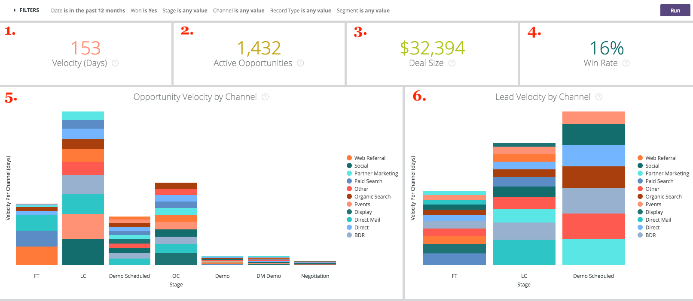

# Profundidad {#drill-throughs}

La variable [!DNL Marketo Measure Discover] experiencia permite a los clientes explorar en profundidad el conjunto de datos que más les interesa. Sobre determinadas medidas [!DNL Marketo Measure Discover], los clientes pueden hacer clic en un mosaico y explorar más sobre esa métrica.

A continuación, se muestra una lista de paneles y mosaicos que contienen obtención de detalles y la experiencia que un usuario debe esperar al explorar en profundidad. Tenga en cuenta que los filtros globales del panel persisten al explorar en profundidad.

## Resumen {#overview}

**Ingresos**

Definición: Ingresos totales por mes mediante gráfico de barras y tabla. A partir de ahí, es posible explorar en profundidad un solo mes o salir de un mes a una semana, un día o una hora.

**Ingresos (gráfico)**

Definición: Ingresos totales por mes mediante gráfico de barras y tabla. Como el mosaico principal ya es un gráfico de barras, al explorar Mostrar detalles solo se mostrará un mes.

_Profundizar en: Ingresos totales por mes desglosados por semana o fecha._

**Gastos**

Definición: Gasto total por mes mediante gráfico de barras y tabla. A partir de ahí, es posible explorar en profundidad un solo mes o salir de un mes a una semana, un día o una hora.

**Tratos**

Definición: Número total de ofertas por mes mediante gráfico de barras y tabla. A partir de ahí, es posible explorar en profundidad un solo mes o salir de un mes a una semana, un día o una hora.

**Ingresos del canal**

Definición: Total de ingresos de la canalización por mes mediante gráfico de barras y tabla. A partir de ahí, es posible explorar en profundidad un solo mes o salir de un mes a una semana, un día o una hora.

**Resumen del ROI**

Definición: Total de ingresos o gastos de cada canal por mes mediante gráfico de barras y tabla. A partir de ahí, es posible explorar en profundidad esa fila para un solo mes o salir de un mes a una semana, un día o una hora.

**Costo por trato**

Definición: El gasto total dividido por el número total de ofertas, lo que proporciona el costo promedio necesario para adquirir una oportunidad cerrada y ganada. A partir de ahí, es posible explorar en profundidad esa fila para un solo mes o salir de un mes a una semana, un día o una hora.

**Canales por ingresos**

Definición: Ingresos totales de cada canal por mes mediante gráfico de barras y tabla. A partir de ahí, es posible explorar en profundidad esa fila para un solo mes o salir de un mes a una semana, un día o una hora.

**Subcanales por ingresos**

Definición: Ingresos totales de cada subcanal por mes mediante gráfico de barras y tabla. A partir de ahí, es posible explorar en profundidad esa fila para un solo mes o salir de un mes a una semana, un día o una hora.

**Campañas por ingresos**

Definición: Ingresos totales de cada campaña por mes mediante gráfico de barras y tabla. A partir de ahí, es posible explorar en profundidad esa fila para un solo mes o salir de un mes a una semana, un día o una hora.

**Resumen de ofertas**

Definición: Recuento total de gastos o transacciones de cada canal por mes mediante gráfico de barras y tabla. A partir de ahí, es posible explorar en profundidad esa fila para un solo mes o salir de un mes a una semana, un día o una hora.

## Crecimiento {#growth}

**Ingresos totales**

Definición: Ingresos totales por mes mediante gráfico de barras y tabla. A partir de ahí, es posible explorar en profundidad un solo mes o salir de un mes a una semana, un día o una hora.

**Ingresos a lo largo del tiempo**

Definición: Ingresos totales por mes mediante gráfico de barras y tabla. Como el mosaico principal ya es un gráfico, explorar en profundidad Mostrar detalles mostrará solo un mes.

_Ingresos totales por mes desglosados por semana o fecha._

**Total de tratos**

Definición: Número total de ofertas por mes mediante gráfico de barras y tabla. A partir de ahí, es posible explorar en profundidad un solo mes o salir de un mes a una semana, un día o una hora.

**Ofertas a lo largo del tiempo**

Definición: Número total de ofertas por mes mediante gráfico de barras y tabla. Como el mosaico principal ya es un gráfico, explorar en profundidad Mostrar detalles mostrará solo un mes.

_Número total de ofertas por mes desglosadas por semana o fecha._

**Total de ingresos por proceso**

Definición: Total de ingresos de la canalización por mes mediante gráfico de barras y tabla. A partir de ahí, es posible explorar en profundidad un solo mes o salir de un mes a una semana, un día o una hora.

**Ingresos de canalización a lo largo del tiempo**

Definición: Total de ingresos de la canalización por mes mediante gráfico de barras y tabla. Como el mosaico principal ya es un gráfico, explorar en profundidad Mostrar detalles mostrará solo un mes.

_Ingresos totales de la canalización por mes desglosados por semana o fecha._

**Total de leads**

Definición: Total de posibles clientes por mes mediante gráfico de barras y tabla. A partir de ahí, es posible explorar en profundidad un solo mes o salir de un mes a una semana, un día o una hora.

**Posibles clientes con el tiempo**

Definición: Total de posibles clientes por mes mediante gráfico de barras y tabla. Como el mosaico principal ya es un gráfico, explorar en profundidad Mostrar detalles mostrará solo un mes.

_Total de posibles clientes por mes desglosados por semana o fecha._

**Contactos totales**

Definición: Total de contactos por mes mediante gráfico de barras y tabla. A partir de ahí, es posible explorar en profundidad un solo mes o salir de un mes a una semana, un día o una hora.

**Contactos a lo largo del tiempo**

Definición: Total de contactos por mes mediante gráfico de barras y tabla. Como el mosaico principal ya es un gráfico, explorar en profundidad Mostrar detalles mostrará solo un mes.

_Total de contactos por mes desglosados por semana o fecha._

**Total de oportunidades**

Definición: Total de oportunidades por mes mediante gráfico de barras y tabla. A partir de ahí, es posible explorar en profundidad un solo mes o salir de un mes a una semana, un día o una hora.

**Oportunidades a lo largo del tiempo**

Definición: Total de oportunidades por mes mediante gráfico de barras y tabla. Como el mosaico principal ya es un gráfico, explorar en profundidad Mostrar detalles mostrará solo un mes.

_Total de oportunidades por mes desglosado por semana o fecha._

**Visitas únicas**

Definición: Número total de vistas de página por mes mediante gráfico de barras y tabla. A partir de ahí, es posible explorar en profundidad un solo mes o salir de un mes a una semana, un día o una hora.

**Visitas únicas a lo largo del tiempo**

Definición: Número total de visitas únicas que muestran la tendencia a lo largo de un período de tiempo específico. Utilice el filtro Agrupar por para cambiar la pila por Canal, Subcanal, Campaña, Cuenta, Grupo de anuncios, Anuncio, Anunciante, Creativo, Palabra clave, Colocación y Sitio. Esto aparecerá vacío si esta función está deshabilitada.

**Visitas**

Definición: Número total de visitas al sitio por mes mediante gráfico de barras y tabla. A partir de ahí, es posible explorar en profundidad un solo mes o salir de un mes a una semana, un día o una hora.

**Visitas a lo largo del tiempo**

Definición: Número total de visitas al sitio rastreadas mostrando la tendencia a lo largo de un período de tiempo específico. Utilice el filtro Agrupar por para cambiar la pila por Canal, Subcanal, Campaña, Cuenta, Grupo de anuncios, Anuncio, Anunciante, Creativo, Palabra clave, Colocación y Sitio. Esto aparecerá vacío si esta función está deshabilitada.

**Formularios**

Definición: Número total de envíos de formularios por mes mediante gráfico de barras y tabla. A partir de ahí, es posible explorar en profundidad un solo mes o salir de un mes a una semana, un día o una hora.

**Forms a lo largo del tiempo**

Definición: Número total de formularios enviados que muestran la tendencia a lo largo de un período de tiempo específico. Utilice el filtro Agrupar por para cambiar la pila por Canal, Subcanal, Campaña, Cuenta, Grupo de anuncios, Anuncio, Anunciante, Creativo, Palabra clave, Colocación y Sitio. Esto aparecerá vacío si esta función está deshabilitada.

## Gastos {#spend}

**Gastos**

Definición: Gasto total por mes mediante gráfico de barras y tabla. A partir de ahí, es posible explorar en profundidad un solo mes o salir de un mes a una semana, un día o una hora.

**Gasto (gráfico)**

Definición: Gasto total por mes mediante gráfico de barras y tabla. Como el mosaico principal ya es un gráfico, explorar en profundidad Mostrar detalles mostrará solo un mes.

_Gasto total por mes desglosado por semana, fecha u hora. El tiempo es posible para gastar desde [!DNL Marketo Measure] descarga el gasto real por minuto desde nuestras conexiones de anuncios._

**Gastos por canal**

Definición: Gasto total de cada canal por mes mediante gráfico de barras y tabla. A partir de ahí, es posible explorar en profundidad esa fila para un solo mes o salir de un mes a una semana, un día o una hora.

**Gastos por subcanal**

Definición: Gasto total de cada subcanal por mes mediante gráfico de barras y tabla. A partir de ahí, es posible explorar en profundidad esa fila para un solo mes o salir de un mes a una semana, un día o una hora.

**Gastos por campaña**

Definición: Gasto total de cada campaña por mes mediante gráfico de barras y tabla. A partir de ahí, es posible explorar en profundidad esa fila para un solo mes o salir de un mes a una semana, un día o una hora.

## Velocidad de ventas {#sales-velocity}

**Velocidad (días)**

Definición: Número promedio de días en los que las oportunidades están en su ciclo de ventas, desde el primer contacto anónimo hasta el cierre de la oportunidad.

**Oportunidades activas**

Definición: El número total de oportunidades de cualquier oportunidad abierta, lo que significa que no está cerrada perdida ni cerrada ganada.

**Tamaño del trato**

Definición: Cantidad promedio de una oportunidad de Closed Won.

**Índice de ganancias**

Definición: El número total de oportunidades de Closed Won dividido por el número total de oportunidades de Closed Lost y Closed Won.

**Velocidad de oportunidad por canal**

Definición: Número promedio de días en los que las oportunidades están en su ciclo por fase, agrupadas por canal de marketing y mostrando el tiempo que se tarda en progresar hasta la siguiente etapa. Las etapas que aparecen aquí son etapas de hitos (FT, LC, OC) y etapas personalizadas.

**Velocidad de cliente potencial por canal**

Definición: Número promedio de días que los posibles clientes están en su ciclo por etapa antes de convertirse en un contacto/oportunidad/cantidad, agrupados por el canal de marketing y mostrando el tiempo que se tarda en progresar hasta la siguiente etapa. Las etapas que aparecen aquí son etapas de hitos (FT, LC) y etapas personalizadas.

**Velocidad de oportunidad promedio**

Definición: Número promedio de días que las oportunidades están en su ciclo por etapa, mostrando el tiempo que se tarda en avanzar a la siguiente etapa. Las etapas que aparecen aquí son etapas de hitos (FT, LC, OC) y etapas personalizadas. los números aquí reflejan el tiempo por etapa en el gráfico Velocidad de oportunidad del canal .

**Velocidad del cliente potencial promedio**

Definición: Número promedio de días que los posibles clientes están en su ciclo por etapa antes de convertirse en un contacto/oportunidad/cantidad, mostrando el tiempo que se tarda en avanzar a la siguiente etapa. Las etapas que aparecen aquí son etapas de hitos (FT, LC) y etapas personalizadas. los números aquí reflejan el tiempo por etapa en el gráfico Velocidad de posible cliente por canal.

**Velocidad de oportunidad a lo largo del tiempo**

Definición: Número promedio de días en que las oportunidades están en su ciclo por etapa con una tendencia a lo largo del tiempo.

**Velocidad de posibles clientes a lo largo del tiempo**

Definición: Número promedio de días que los posibles clientes están en su ciclo por fase con una tendencia a lo largo del tiempo.

## Marketing basado en la cuenta {#account-based-marketing}

**Ingresos totales**

Definición: Ingresos totales por mes mediante gráfico de barras y tabla. A partir de ahí, es posible explorar en profundidad un solo mes o salir de un mes a una semana, un día o una hora.

**Total de ingresos por proceso**

Definición: Total de ingresos de la canalización por mes mediante gráfico de barras y tabla. A partir de ahí, es posible explorar en profundidad un solo mes o salir de un mes a una semana, un día o una hora.

**Clientes potenciales coincidentes**

Definición: Número total de posibles clientes que coinciden con una cuenta.

**Cuentas afectadas**

Definición: Número total de cuentas que recibieron cualquier punto de contacto.

**Oportunidades afectadas**

Definición: Una lista de ID de oportunidad con su ID de cuenta correspondiente

**Contactos tocados**

Definición: Una lista de ID de contacto con su ID de cuenta correspondiente

**Puntos de contacto a lo largo del tiempo (gráfico)**

Definición: Una lista de puntos de contacto del mes seleccionado.

_Número de puntos de contacto tocados desglosados por semana, fecha o hora._

**Cuentas afectadas a lo largo del tiempo (gráfico)**

Definición: Una lista de identificadores de cuenta del mes seleccionado.

_Número de cuentas que se han desglosado por semana, fecha u hora._

## Web Analytics {#web-analytics}

**Visitas únicas**

Definición: Número total de visitas únicas al sitio por mes mediante gráfico de barras y tabla. A partir de ahí, es posible explorar en profundidad un solo mes o salir de un mes a una semana, un día o una hora.

**Costo por visita única**

Definición: Total de gastos dividido por el número total de visitas únicas. A partir de ahí, es posible explorar en profundidad un solo mes o salir de un mes a una semana, un día o una hora.

**Visitas únicas por página de aterrizaje**

Definición: Una lista de páginas de aterrizaje basada en el número de visitantes únicos de cada dirección URL.

**Visitas únicas por fuente**

Definición: Una vista de las fuentes de los visitantes únicos del sitio.

**Visitas únicas en el tiempo**

Definición: Número total de visitas únicas rastreadas, que muestran una tendencia a lo largo de un lapso de tiempo específico.

**Visitas**

Definición: Número total de visitas al sitio por mes mediante gráfico de barras y tabla. A partir de ahí, es posible explorar en profundidad un solo mes o salir de un mes a una semana, un día o una hora.

**Costo por visita**

Definición: El gasto total dividido por el número total de visitas.

**Visitas por página de aterrizaje**

Definición: Una lista de páginas de aterrizaje basada en el número de visitas a cada dirección URL.

**Visitas por fuente**

Definición: Fuente de visitantes del sitio. Se puede modificar mediante Canal, Subcanal, Campaña, Cuenta, Grupo de publicidad, Anunciante, Creativo, Palabra clave, Colocación y Sitio.

**Visitas en el tiempo**

Definición: El número total de visitas de las que se ha hecho un seguimiento, mostrando la tendencia a lo largo de un lapso de tiempo específico. A partir de ahí, es posible explorar en profundidad un solo mes o salir de un mes a una semana, un día o una hora.

**Vistas de páginas**

Definición: Número total de vistas de página por mes mediante gráfico de barras y tabla. A partir de ahí, es posible explorar en profundidad un solo mes o salir de un mes a una semana, un día o una hora.

**Costo por vista de página**

Definición: El gasto total dividido por la cantidad total de vistas de página rastreadas.

**Vistas de página por direcciones URL**

Definición: Una lista de direcciones URL de página en función del número de vistas de página desde cada dirección URL.

**Vistas de página a lo largo del tiempo**

Definición: Total de vistas de página por mes mediante gráfico de barras y tabla. Como el mosaico principal ya es un gráfico, explorar en profundidad Mostrar detalles mostrará solo un mes.

_Total de vistas de página por mes, desglosado por semana, fecha u hora._

**Forms con el tiempo**

Definición: Número total de formularios rastreados, que muestran la tendencia a lo largo de un lapso de tiempo específico.

**Formularios**

Definición: Número total de envíos de formularios por mes mediante gráfico de barras y tabla. A partir de ahí, es posible explorar en profundidad un solo mes o salir de un mes a una semana, un día o una hora.

**Costo por formulario**

Definición: El gasto total dividido por el total de formularios enviados.

**Envíos de formulario por dirección URL del formulario**

Definición: Una lista de direcciones URL de formulario basada en el número de direcciones URL enviadas en cada dirección URL.

**Clientes potenciales por página de destino**

Definición: Una lista de páginas de aterrizaje basada en el número de posibles clientes generados a partir de cada página de aterrizaje.

**Clientes potenciales por URL de formulario**

Definición: Una lista de direcciones URL de formulario basada en el número de posibles clientes generados a partir de cada dirección URL.

## CMO {#cmo}

**Ingresos**

Definición: Ingresos totales por mes mediante gráfico de barras y tabla. A partir de ahí, es posible explorar en profundidad un solo mes o salir de un mes a una semana, un día o una hora.

**Ingresos (gráfico)**

Definición: Ingresos totales por mes mediante gráfico de barras y tabla. Como el mosaico principal ya es un gráfico de barras, al explorar Mostrar detalles solo se mostrará un mes.

_Ingresos totales por mes desglosados por semana o fecha._

**Gastos**

Definición: Gasto total por mes mediante gráfico de barras y tabla. A partir de ahí, es posible explorar en profundidad un solo mes o salir de un mes a una semana, un día o una hora.

**Retorno de la inversión**

Definición: El rendimiento calculado de la inversión con respecto a los ingresos totales y el gasto total (según el modelo de atribución).

**Tratos**

Definición: Número total de ofertas por mes mediante gráfico de barras y tabla. A partir de ahí, es posible explorar en profundidad un solo mes o salir de un mes a una semana, un día o una hora.

**Costo por trato**

Definición: El gasto total dividido por el número total de ofertas, lo que proporciona el costo promedio que se necesita para adquirir una oportunidad cerrada ganada.

**Ingresos del canal**

Definición: Total de ingresos de la canalización por mes mediante gráfico de barras y tabla. A partir de ahí, es posible explorar en profundidad un solo mes o salir de un mes a una semana, un día o una hora.

**Tamaño del trato**

Definición: Cantidad promedio de una oportunidad ganada cerrada.

**Canales por ingresos**

Definición: Ingresos totales de cada canal por mes mediante gráfico de barras y tabla. A partir de ahí, es posible explorar en profundidad esa fila para un solo mes o salir de un mes a una semana, un día o una hora.

**Subcanales por ingresos**

Definición: Ingresos totales de cada subcanal por mes mediante gráfico de barras y tabla. A partir de ahí, es posible explorar en profundidad esa fila para un solo mes o salir de un mes a una semana, un día o una hora.

**Campañas por ingresos**

Definición: Ingresos totales de cada campaña por mes mediante gráfico de barras y tabla. A partir de ahí, es posible explorar en profundidad esa fila para un solo mes o salir de un mes a una semana, un día o una hora.

**Resumen del ROI**

Definición: Total de ingresos o gastos de cada canal por mes mediante gráfico de barras y tabla. A partir de ahí, es posible explorar en profundidad esa fila para un solo mes o salir de un mes a una semana, un día o una hora.

**Resumen de ofertas**

Definición: Recuento total de gastos o transacciones de cada canal por mes mediante gráfico de barras y tabla. A partir de ahí, es posible explorar en profundidad esa fila para un solo mes o salir de un mes a una semana, un día o una hora.

## Marketing de contenido {#content-marketing}

**Ingresos totales**

Definición: Ingresos totales por mes mediante gráfico de barras y tabla. A partir de ahí, es posible explorar en profundidad un solo mes o salir de un mes a una semana, un día o una hora.

**Páginas de destino por ingresos**

Definición: Ingresos totales de cada página de aterrizaje mediante gráfico de barras y tabla. A partir de ahí, es posible explorar en profundidad esa fila para un solo mes o salir de un mes a una semana, un día o una hora.

**Total de ingresos por proceso**

Definición: Total de ingresos de la canalización por mes mediante gráfico de barras y tabla. A partir de ahí, es posible explorar en profundidad un solo mes o salir de un mes a una semana, un día o una hora.

**Páginas de destino por ingresos por proceso**

Definición: Ingresos totales de canalización de cada página de aterrizaje mediante gráfico de barras y tabla. A partir de ahí, es posible explorar en profundidad esa fila para un solo mes o salir de un mes a una semana, un día o una hora.

**Total de oportunidades**

Definición: Número total de oportunidades por mes mediante gráfico de barras y tabla. A partir de ahí, es posible explorar en profundidad un solo mes o salir de un mes a una semana, un día o una hora.

**Páginas de destino por conteo de oportunidades**

Definición: Número total de oportunidades de cada página de aterrizaje mediante gráfico de barras y tabla. A partir de ahí, es posible explorar en profundidad esa fila para un solo mes o salir de un mes a una semana, un día o una hora.

**Total de formularios**

Definición: Número total de formularios por mes mediante gráfico de barras y tabla. A partir de ahí, es posible explorar en profundidad un solo mes o salir de un mes a una semana, un día o una hora.

**Dirección URL del formulario principal por envíos de formulario**

Definición: Número total de formularios de cada URL de formulario mediante gráfico de barras y tabla. A partir de ahí, es posible explorar en profundidad esa fila para un solo mes o salir de un mes a una semana, un día o una hora.

**URL de formularios por canal**

Definición: Número total de formularios enviados desde la dirección URL del formulario por mes mediante gráfico de barras y tabla. A partir de ahí, es posible explorar en profundidad esa fila para un solo mes o salir de un mes a una semana, un día o una hora.

**Visitas únicas**

Definición: Número total de visitas únicas al sitio rastreadas en todos los visitantes conocidos y anónimos. Profundice para ver las visitas únicas al sitio rastreadas por mes.

**Primeras páginas de destino por visitas únicas**

Definición: Una lista de páginas de aterrizaje basada en el número de visitas únicas a cada página de aterrizaje. Profundice para ver las visitas únicas por mes a la dirección URL seleccionada.

**Visitas**

Definición: Número total de visitas al sitio rastreadas en todos los visitantes conocidos y anónimos. Profundice para ver las visitas del sitio rastreadas por mes.

**Primeras páginas de destino por visitas**

Definición: Una lista de páginas de aterrizaje basada en el número de visitas iniciales a cada página de aterrizaje. Profundice para ver las visitas por mes a la dirección URL seleccionada.

**Total de leads**

Definición: Número total de posibles clientes por mes mediante gráfico de barras y tabla. A partir de ahí, es posible explorar en profundidad un solo mes o salir de un mes a una semana, un día o una hora.

**Páginas de destino por conteo de cliente potencial**

Definición: Número total de posibles clientes de cada página de aterrizaje mediante gráfico de barras y tabla. A partir de ahí, es posible explorar en profundidad esa fila para un solo mes o salir de un mes a una semana, un día o una hora.

## Medios pagos {#paid-media}

**Impresiones**

Definición: Número total de impresiones por mes mediante gráfico de barras y tabla. A partir de ahí, es posible explorar en profundidad un solo mes o salir de un mes a una semana, un día o una hora.

**CPM**

Definición: El gasto total de las impresiones servidas dividido por el total de impresiones.

**de clics**

Definición: Número total de clics por mes mediante gráfico de barras y tabla. A partir de ahí, es posible explorar en profundidad un solo mes o salir de un mes a una semana, un día o una hora.

**CPC**

Definición: El gasto total de los clics rastreados dividido por el total de clics.

**Leads**

Definición: Número total de posibles clientes en función del modelo de atribución.

**CPL**

Definición: El gasto total de los posibles clientes creados dividido por el total de clics, proporcionando la tasa CPL.

**Visitas**

Definición: Número total de visitas al sitio por mes mediante gráfico de barras y tabla. A partir de ahí, es posible explorar en profundidad un solo mes o salir de un mes a una semana, un día o una hora.

**Vistas de páginas**

Definición: Número total de vistas de página por mes mediante gráfico de barras y tabla. A partir de ahí, es posible explorar en profundidad un solo mes o salir de un mes a una semana, un día o una hora.

**Resumen de campañas**

Definición: Lista de campañas basada en la cantidad de ingresos/gastos/ofertas/oportunidades que se atribuyeron a cada campaña, ordenadas por el valor más alto según el modelo de atribución seleccionado.

**Resumen del anuncio**

Definición: Una lista de anuncios basada en la cantidad de ingresos/ingresos por canalización/gastos/ofertas/oportunidades que se atribuyeron a cada anuncio, según el modelo de atribución seleccionado.

**Resumen de palabra clave**

Definición: Una lista de palabras clave basada en la cantidad de ingresos/ingresos por canalización/gastos/ofertas/oportunidades que se atribuyeron a cada palabra clave, según el modelo de atribución seleccionado.

**Campañas por ROI**

Definición: Una lista de campañas basadas en el ROI calculado para cada campaña, ordenadas por el ROI más alto. Profundice para ver los ingresos o los gastos por mes de la campaña seleccionada.

**Anuncios por ROI**

Definición: Una lista de anuncios basados en el ROI calculado para cada anuncio, ordenados por el ROI más alto. Profundice para ver los ingresos o los gastos por mes de la publicidad seleccionada.

**Palabras clave por ROI**

Definición: Una lista de palabras clave basada en el ROI calculado para cada palabra clave, ordenadas por el ROI más alto. Profundice para ver los ingresos o los gastos por mes de la palabra clave seleccionada.
