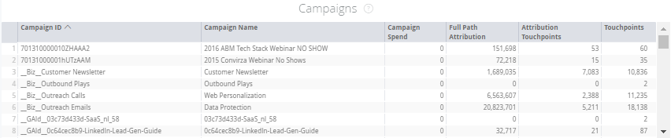

# Mosaicos de operaciones de marketing {#marketing-ops-tiles}

Las operaciones de marketing le permiten validar y diagnosticar [!DNL Marketo Measure] datos con visibilidad completa de puntos de contacto individuales por posibles clientes, contactos, cuentas, campañas y oportunidades.

<table> 
 <colgroup> 
  <col> 
  <col> 
  <col> 
  <col> 
  <col> 
  <col> 
  <col> 
  <col> 
  <col> 
  <col> 
  <col> 
  <col> 
  <col> 
 </colgroup> 
 <tbody> 
  <tr> 
   <td> </td> 
   <td>
<strong>Identificación de la cuenta</strong>
</td> 
   <td>
<strong>Nombre de la cuenta</strong>
</td> 
   <td>
<strong>Opt ID</strong>
</td> 
   <td>
<strong>Nombre de la opción</strong>
</td> 
   <td>
<strong>Cliente potencial o identificación del contacto</strong>
</td> 
   <td>
<strong>Cliente potencial o correo electrónico del contacto</strong>
</td> 
   <td>
<strong>Identificación de la campaña</strong>
</td> 
   <td>
<strong>Oportunidad ganada</strong>
</td> 
   <td>
<strong>Fecha de creación de la opción</strong>
</td> 
   <td>
<strong>Fecha de cierre de la opción</strong>
</td> 
   <td>
<strong>Fecha de Touchpoint</strong>
</td> 
   <td>
<strong>Modelo de atribución</strong>
</td> 
  </tr> 
  <tr> 
   <td>
<strong>Cuentas</strong>
</td> 
   <td><strong>X</strong></td> 
   <td><strong>X</strong></td> 
   <td><strong>X</strong></td> 
   <td><strong>X</strong></td> 
   <td><strong>X</strong></td> 
   <td> </td> 
   <td><strong>X</strong></td> 
   <td><strong>X</strong></td> 
   <td><strong>X</strong></td> 
   <td><strong>X</strong></td> 
   <td><strong>X</strong></td> 
   <td><strong>X</strong></td> 
  </tr> 
  <tr> 
   <td>
<strong>Oportunidad</strong>
</td> 
   <td><strong>X</strong></td> 
   <td><strong>X</strong></td> 
   <td><strong>X</strong></td> 
   <td><strong>X</strong></td> 
   <td><strong>X</strong></td> 
   <td> </td> 
   <td><strong>X</strong></td> 
   <td><strong>X</strong></td> 
   <td><strong>X</strong></td> 
   <td><strong>X</strong></td> 
   <td><strong>X</strong></td> 
   <td><strong>X</strong></td> 
  </tr> 
  <tr> 
   <td>
<strong>Contactos</strong>
</td> 
   <td><strong>X</strong></td> 
   <td><strong>X</strong></td> 
   <td><strong>X</strong></td> 
   <td><strong>X</strong></td> 
   <td><strong>X</strong></td> 
   <td><strong>X</strong></td> 
   <td><strong>X</strong></td> 
   <td><strong>X</strong></td> 
   <td><strong>X</strong></td> 
   <td><strong>X</strong></td> 
   <td><strong>X</strong></td> 
   <td><strong>X</strong></td> 
  </tr> 
  <tr> 
   <td>
<strong>Leads</strong>
</td> 
   <td><strong>X</strong></td> 
   <td><strong>X</strong></td> 
   <td><strong>X*</strong></td> 
   <td><strong>X*</strong></td> 
   <td><strong>X</strong></td> 
   <td><strong>X</strong></td> 
   <td><strong>X</strong></td> 
   <td><strong>X*</strong></td> 
   <td><strong>X*</strong></td> 
   <td><strong>X*</strong></td> 
   <td><strong>X</strong></td> 
   <td><strong>X</strong></td> 
  </tr> 
  <tr> 
   <td>
<strong>Campañas</strong>
</td> 
   <td><strong>X</strong></td> 
   <td><strong>X</strong></td> 
   <td><strong>X</strong></td> 
   <td><strong>X</strong></td> 
   <td><strong>X</strong></td> 
   <td> </td> 
   <td><strong>X</strong></td> 
   <td><strong>X</strong></td> 
   <td><strong>X</strong></td> 
   <td><strong>X</strong></td> 
   <td><strong>X</strong></td> 
   <td><strong>X</strong></td> 
  </tr> 
 </tbody> 
</table>

## Mosaico de la cuenta {#account-tile}

Muestra los siguientes datos relacionados con las cuentas especificadas.

**Las cuentas deben tener datos de Touchpoint (solo aplicable si tiene habilitado ABM)**

-ID de cuenta: ID de cuenta en CRM

-Nombre de la cuenta: Nombre de cuenta en CRM

-Fecha de creación: Fecha de creación de la cuenta en CRM

* Desglose: Consulte Fecha de creación por hora, minuto, hora

-Sitio Web: Valor encontrado en el campo Sitio web de la cuenta

-Clasificación de participación: Puntuación de participación predictiva (PES) rellenada por [!DNL Marketo Measure]^1

-Oportunidades: Número de oportunidades conectadas a la cuenta

* Desglose: Consulte los detalles de las oportunidades asociadas

-Contactos: Número de contactos enumerados en esta cuenta

* Desglose: Ver detalles de los contactos asociados

-Posibles clientes: Número de posibles clientes asignados a esta cuenta mediante la asignación de posibles clientes a cuentas^1

* Desglose: Consulte los detalles de los posibles clientes asignados a la cuenta

-Puntos de contacto de atribución: Número de puntos de contacto de atribución del comprador para la cuenta

* Desglose: Consulte Detalles del punto de contacto de atribución del comprador (ID, correo electrónico, fecha del punto de contacto, nombre de la cuenta, campaña, canal, subcanal, tipo de contacto de marketing, modelo de atribución)

-Touchpoints: Número de puntos de contacto que los contactos de esta cuenta tienen^2

* Desglose: Consulte Puntos de contacto en los detalles de puntos de contacto de la cuenta (ID, correo electrónico, fecha de punto de contacto, nombre de cuenta, campaña, canal, subcanal, tipo de contacto de marketing).

>[!NOTE]
>
>Si tiene ABM, mostrará los touchpoints relacionados con los posibles clientes asignados a través de la asignación de posibles clientes a cuentas.

## Mosaico de oportunidades {#opportunity-tile}

Muestra los siguientes datos relacionados con las oportunidades especificadas.

-ID de oportunidad: ID de oportunidad en CRM

-Nombre de oportunidad: Nombre de oportunidad en CRM

-Nombre de la cuenta: Nombre de cuenta asociado a la oportunidad

-Fecha de creación: Fecha de creación de la oportunidad en CRM

Desglose: Consulte Fecha de creación por hora, minuto, hora

-Cerrar fecha: Fecha de cierre de la oportunidad en CRM

Desglose: Consulte Cerrar fecha por hora, minuto, hora

-Importe: La cantidad total de la oportunidad

-Contactos: Número de contactos asociados a la oportunidad

Desglose: Ver detalles de los contactos asociados

-Puntos de contacto de atribución: Número de puntos de contacto de atribución del comprador relacionados

Desglose: Consulte Detalles del punto de contacto de atribución del comprador (ID, correo electrónico, fecha del punto de contacto, nombre de la cuenta, campaña, canal, subcanal, tipo de contacto de marketing, modelo de atribución)

## Mosaico Contactos {#contacts-tile}

Muestra los siguientes datos relacionados con los contactos especificados.

-ID de contacto: ID de contacto en CRM

-Correo electrónico: Dirección de correo electrónico del registro de contacto

-Fecha de creación: Fecha de creación del contacto en CRM

* Desglose: Consulte Fecha de creación por hora, minuto, hora

-Nombre de la cuenta: Nombre de cuenta asociado al contacto

-Puntos de contacto de atribución: Número de puntos de contacto de atribución del comprador para el contacto

* Desglose: Consulte Detalles del punto de contacto de atribución del comprador (ID, correo electrónico, fecha del punto de contacto, nombre de la cuenta, campaña, canal, subcanal, tipo de contacto de marketing, modelo de atribución)

-Touchpoints: Número de puntos de contacto del comprador para el contacto

* Desglose: Consulte Contactos en los detalles de puntos de contacto de la cuenta (ID, correo electrónico, fecha de punto de contacto, nombre de la cuenta, campaña, canal, subcanal, tipo de contacto de marketing)

## Mosaico de posibles clientes {#leads-tile}

Muestra los siguientes datos relacionados con los posibles clientes especificados.

-ID de posible cliente: ID de posible cliente en CRM

-Correo electrónico: Dirección de correo electrónico del registro de posibles clientes

-Fecha de creación: Cuando se creó el posible cliente en CRM

* Desglose: Consulte Fecha de creación por hora, minuto, hora

-Empresa (de Plomo): La empresa que aparece en el registro de CRM rellenada por el cliente

-Nombre de la cuenta: El nombre de la cuenta [!DNL Marketo Measure] rellena en función de la asignación de posibles clientes a cuentas

-Touchpoints: Número de puntos de contacto asociados al posible cliente

* Desglose: Consulte Contactos en los detalles de puntos de contacto de la cuenta (ID, correo electrónico, fecha de punto de contacto, nombre de la cuenta, campaña, canal, subcanal, tipo de contacto de marketing)

## Mosaico de campañas {#campaigns-tile}

Muestra los siguientes datos relacionados con las campañas especificadas.

-ID de campaña: ID de campaña en CRM

-Nombre de campaña: Nombre de campaña en CRM

-Gasto en campañas: El gasto [!DNL Marketo Measure] se ha registrado asociado a la campaña

-Modelo de atribución: Esto mostrará la atribución adecuada en función del modelo seleccionado

-Puntos de contacto de atribución: Número de puntos de contacto de atribución de comprador asociados a la campaña o campañas

* Desglose: Consulte Detalles del punto de contacto de atribución del comprador (ID, correo electrónico, fecha del punto de contacto, nombre de la cuenta, campaña, canal, subcanal, tipo de contacto de marketing, modelo de atribución)

-Touchpoints: Número de touchpoints asociados a las campañas

* Desglose: Consulte Contactos en los detalles de puntos de contacto de la cuenta (ID, correo electrónico, fecha de punto de contacto, nombre de la cuenta, campaña, canal, subcanal, tipo de contacto de marketing)
