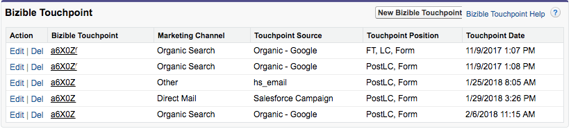

# Puntos de contacto de PostLC y participación de posibles clientes {#postlc-touchpoints-and-lead-engagement}

[!DNL Marketo Measure] Los puntos de contacto de creación posterior al posible cliente (PostLC) están disponibles para los clientes que utilizan modelos de atribución multitáctil (forma W y posteriores). Cuando un posible cliente o contacto vuelve a su sitio web y continúa rellenando formularios, estos envíos de formularios se registrarán como puntos de contacto de PostLC. Estos puntos de contacto le permiten ver qué contenido está impulsando a los posibles clientes a seguir interactuando con el sitio mucho después de su primera conversión. Los puntos de contacto de PostLC comparten el crédito de atribución con todos los puntos de contacto intermedios dentro de una oportunidad; el 10 % del crédito de atribución se asigna a los puntos de contacto intermedios y se distribuye equitativamente entre todos los toques.

Puede ajustar el número de puntos de contacto PostLC que se mostrarán en [!DNL SFDC]. Normalmente, recomendamos insertar hasta cinco puntos de contacto PostLC; cada punto de contacto ocupa 1 KB en [!DNL SFDC].

>[!NOTE]
>
>Las instrucciones para ajustar la configuración del punto de contacto PostLC se encuentran al final de este artículo.

Los puntos de contacto de PostLC son dinámicos. Como posible cliente o contacto sigue enviando formularios PostLC, [!DNL Marketo Measure] actualizará los puntos de contacto PostLC en su CRM para mostrarle sus envíos de formularios más recientes. Específicamente, si ha establecido un límite de 5 puntos de contacto PostLC, [!DNL Marketo Measure] siempre presione el 5 _más reciente_ puntos de contacto con su CRM.  En este ejemplo, esta cuenta ha establecido su límite de PostLC en cuatro puntos de contacto. Este posible cliente ya ha alcanzado el número máximo de puntos de contacto PostLC que puede tener en su CRM. El último contacto con PostLC fue el 6/2/2018. Si esta persona rellenara otro formulario al día siguiente, [!DNL Marketo Measure] eliminará el primer punto de contacto PostLC a partir del 9/11/2017 para añadir el último punto de contacto a partir del 7/2/2018.

>[!NOTE]
>
>[!DNL Marketo Measure] solo actualizará los puntos de contacto de PostLC en el posible cliente o contacto, y no actualizará los puntos de contacto de atribución de PostLC en una oportunidad. Todos los puntos de contacto PostLC relevantes en un contacto se incluirán en la oportunidad.

## Cómo cambiar la configuración de PostLC Touchpoint {#how-to-change-postlc-touchpoint-settings}

Para ajustar la configuración del punto de contacto PostLC para sus posibles clientes o contactos, siga las instrucciones a continuación.

**Posibles clientes**

1. Inicie sesión en su [!DNL Marketo Measure] cuenta en [experience.adobe.com/marketo-measure](https://experience.adobe.com/marketo-measure){target="_blank"} y vaya a [!UICONTROL Configuración].

1. En CRM, seleccione **[!UICONTROL Posibles clientes]**.

1. Introduzca el número de puntos de contacto postLC que desee insertar en sus posibles clientes y haga clic en **[!UICONTROL Guardar]**.

   

**Contactos**

1. Inicie sesión en su [!DNL Marketo Measure] cuenta en [experience.adobe.com/marketo-measure](https://experience.adobe.com/marketo-measure){target="_blank"} y vaya a [!UICONTROL Configuración].

1. En CRM, seleccione **[!UICONTROL Contactos]**.

1. Introduzca el número de puntos de contacto postLC que desee insertar en sus Contactos y haga clic en **[!UICONTROL Guardar]**.

   
