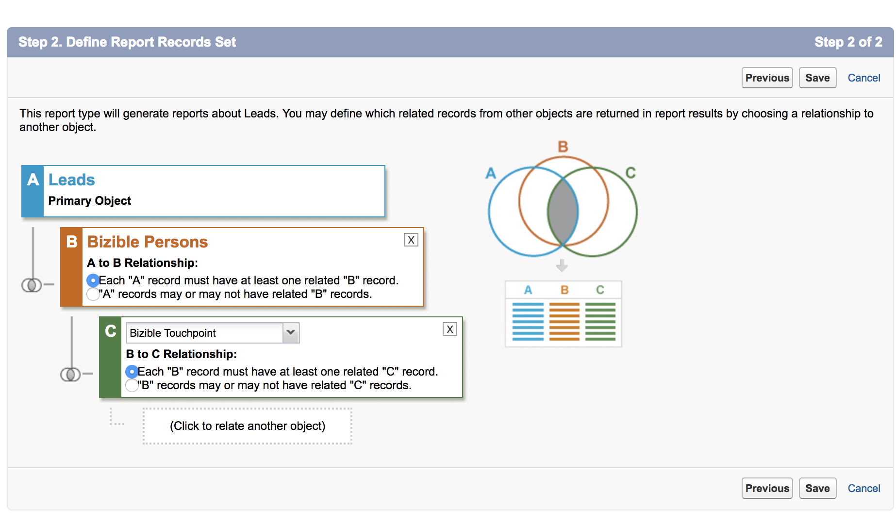
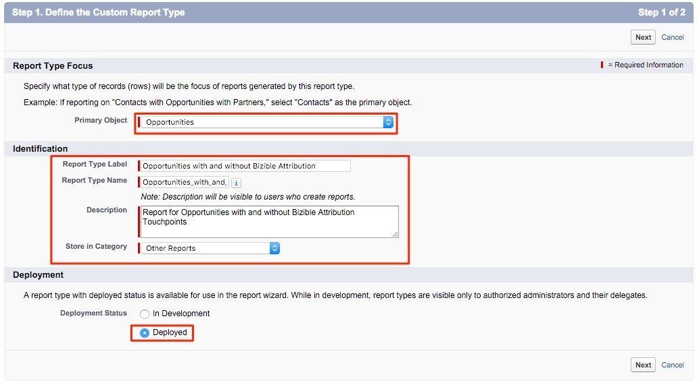
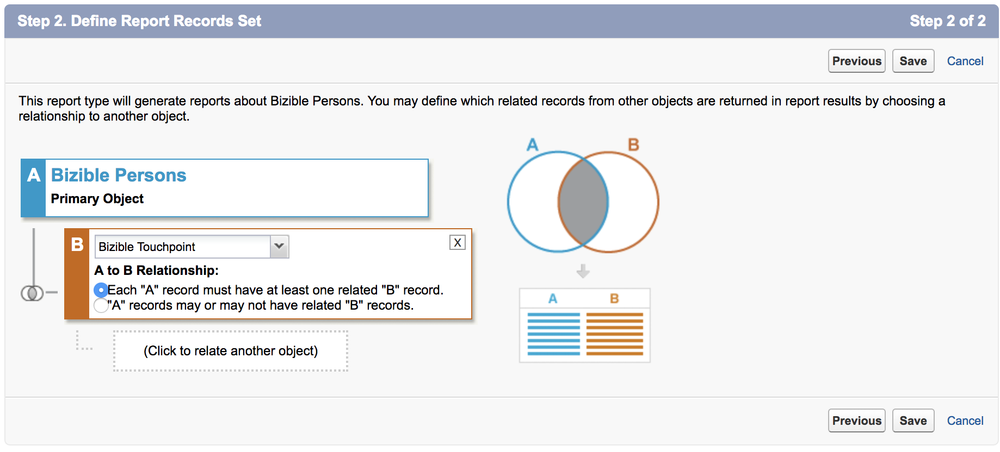
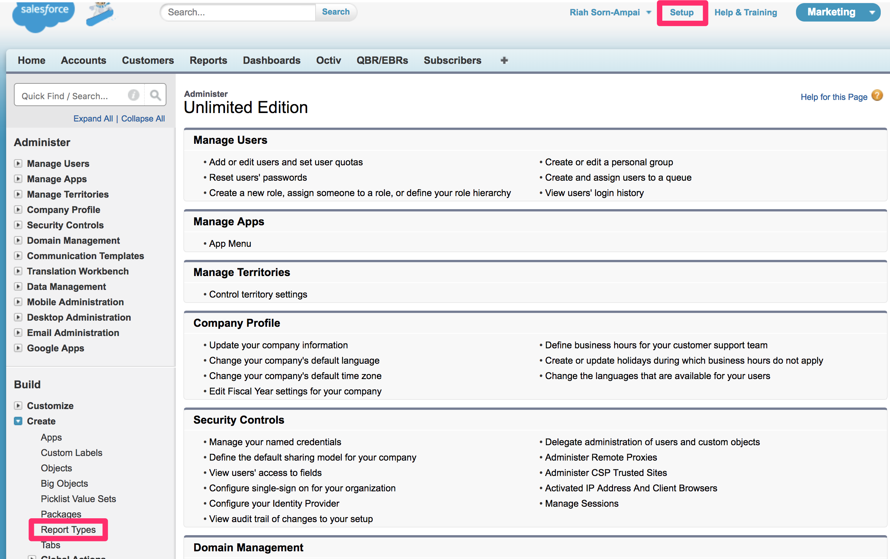
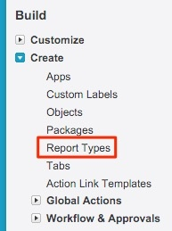
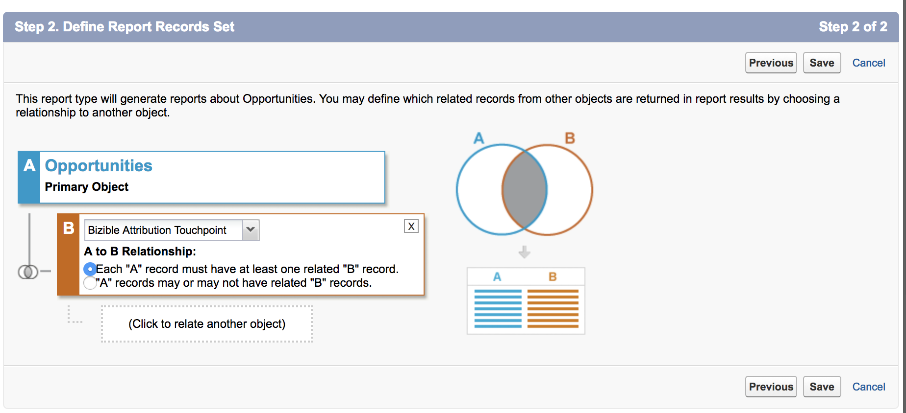

# Creando tipos de informe [!DNL Marketo Measure] personalizados {#creating-custom-marketo-measure-report-types}

>[!NOTE]
>
>Puede ver instrucciones que especifican &quot;[!DNL Marketo Measure]&quot; en la documentación, pero aún así ve &quot;[!DNL Bizible]&quot; en su CRM. Estamos trabajando para que se actualice y el cambio de marca se reflejará pronto en su CRM.

Aprenda a crear tipos de informes personalizados [!DNL Marketo Measure] [!DNL Salesforce]. Hay tres tipos de informes diferentes que recomendamos crear: Posibles clientes con puntos de contacto del comprador (personalizado), [!DNL Marketo Measure] persona con puntos de contacto del comprador (personalizado), Oportunidades con Buyer Attribution Touchpoint (personalizado).

## Posibles clientes con puntos de contacto del comprador (personalizado) {#leads-with-buyer-touchpoints-custom}

1. Vaya a **[!UICONTROL Configuración]** > **[!UICONTROL Compilación]** > **[!UICONTROL Tipos de informes]** > **[!UICONTROL Nuevos tipos de informes personalizados]**.

   

1. Defina el Tipo de informe personalizado.

   * [!UICONTROL Enfoque de tipo de informe] > [!UICONTROL [!UICONTROL Objeto principal]]: posible cliente
   * Identificación > [!UICONTROL Etiqueta de tipo de informe]: posibles clientes con puntos de contacto del comprador (personalizado)
   * [!UICONTROL Almacenar en categoría]: otros informes
   * [!UICONTROL Implementación] > [!UICONTROL Estado de implementación]: implementado

   

1. Definir las relaciones de objetos.

   * Relacione el objeto de posible cliente (A) con el objeto de persona [!DNL Marketo Measure] (B) y, a continuación, con el objeto de Buyer Touchpoint (C)
   * Asegúrese de que &quot;[!UICONTROL Cada registro A/B debe tener al menos un registro B/C]&quot; seleccionado
   * [!UICONTROL Guardar]

   

## [!DNL Marketo Measure] persona con puntos de contacto de comprador (personalizado) {#marketo-measure-person-with-buyer-touchpoints-custom}

1. Vaya a **[!UICONTROL Configuración]** > **[!UICONTROL Compilación]** > **[!UICONTROL Tipos de informes]** > **[!UICONTROL Nuevos tipos de informes personalizados]**.

   

1. Defina el Tipo de informe personalizado.

   * [!UICONTROL Enfoque de tipo de informe] > [!UICONTROL Objeto principal]: [!DNL Marketo Measure] personas
   * [!UICONTROL Identificación] > [!UICONTROL Etiqueta de tipo de informe]: [!DNL Marketo Measure] persona con puntos de contacto de comprador (personalizada)
   * [!UICONTROL Almacenar en categoría]: otros informes
   * [!UICONTROL Implementación] > [!UICONTROL Estado de implementación]: implementado

   

1. Definir las relaciones de objetos.

   * Relacionar el objeto de persona [!DNL Marketo Measure] (A) con el objeto de Buyer Touchpoint (B)
   * Asegúrese de que &quot;[!UICONTROL Cada registro A debe tener al menos un registro B]&quot; seleccionado
   * [!UICONTROL Guardar]

   

## Oportunidades con Buyer Attribution Touchpoint (personalizado) {#opportunities-with-buyer-attribution-touchpoint-custom}

1. Vaya a **[!UICONTROL Configuración]** > **[!UICONTROL Compilación]** > **[!UICONTROL Tipos de informes]** > **[!UICONTROL Nuevos tipos de informes personalizados]**.

   

1. Defina el Tipo de informe personalizado.

   * [!UICONTROL Enfoque del tipo de informe] > [!UICONTROL Objeto principal]: Oportunidades
   * [!UICONTROL Identificación] > [!UICONTROL Etiqueta de tipo de informe]: oportunidades con Buyer Attribution Touchpoint (personalizado)
   * [!UICONTROL Almacenar en categoría]: otros informes
   * [!UICONTROL Implementación] > [!UICONTROL Estado de implementación]: implementado

   

1. Definir las relaciones de objetos.

   * Relacione el objeto Oportunidades (A) con el objeto Buyer Attribution Touchpoint (B)
   * Asegúrese de que &quot;[!UICONTROL Cada registro A debe tener al menos un registro B]&quot; seleccionado
   * [!UICONTROL Guardar]

   

## Adición de campos personalizados a tipos de informes personalizados {#adding-custom-fields-to-custom-report-types}

1. Una vez creados los informes, se le redirigirá a una descripción general del tipo de informe. Haga clic en **[!UICONTROL Editar diseño]**.

   

1. Asegúrese de que los campos personalizados que desee agregar al informe aparezcan en la sección Propiedades de diseño de campo. Si desea agregar otros campos, use la opción &quot;[!UICONTROL Agregar campos relacionados mediante la búsqueda]&quot;.

   
