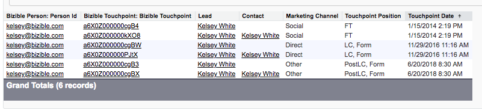

# Habilitación del permiso para editar posibles clientes convertidos {#enabling-the-permission-to-edit-converted-leads}

Obtenga información sobre cómo habilitar el permiso para editar registros de posibles clientes convertidos en [!DNL Salesforce]. [!DNL Marketo Measure] tiene la capacidad de insertar datos en los distintos objetos de Salesforce. Al insertar posibles clientes en, descubrimos que, en algunos casos, es posible que tengamos que volver a insertar un registro de posibles clientes que ya se haya convertido. Para que podamos insertar datos en esos registros, el usuario con el que estamos conectados debe tener permiso para ver y editar posibles clientes convertidos en el nivel de perfil.

1. Vaya a [!UICONTROL Configuración] y expanda la agrupación [!UICONTROL Administrar usuarios] para seleccionar perfiles.

   

1. Seleccione el perfil del usuario al que estamos conectados.

1. Busque el permiso para ver y editar posibles clientes convertidos.

   

1. Marque la casilla para permitir ver y editar posibles clientes convertidos.

   

¡Y has terminado!
