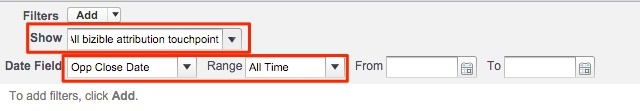
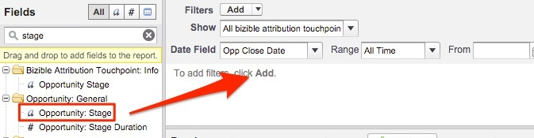
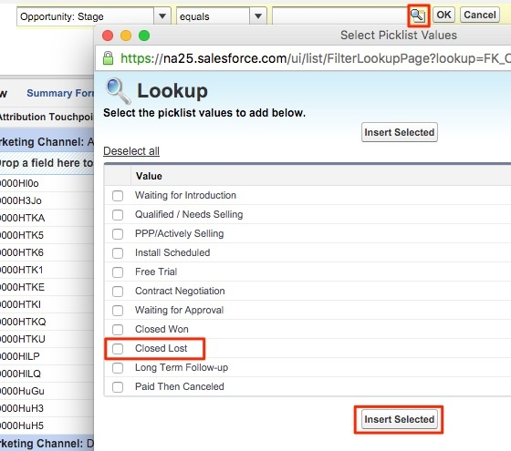

# Oportunidades perdidas cerradas por canal de marketing {#closed-lost-opportunities-by-marketing-channel}

Aunque este informe puede depender de las etapas de oportunidad, revelará qué canales de marketing contribuyeron a oportunidades que no se cerraron.

1. Haga clic en **[!UICONTROL Informes]** en Salesforce y seleccione **[!UICONTROL Nuevo informe]**.

   

1. En Buscar rápidamente, escriba &quot;Atribución Bizible&quot; y seleccione la opción **[!UICONTROL Punto de contacto de atribución Bizible con Oportunidad]** tipo de informe y, a continuación, seleccione **[!UICONTROL Crear]**.

   

1. A partir de la parte superior del informe, mostrar &quot;[!UICONTROL Todos los puntos de contacto de atribución Bizible]&quot; y ajuste el campo de fecha según el periodo en el que desee crear el informe. En nuestro ejemplo, estamos viendo Todo el tiempo. Además, cambie el formato de informe de Tabla a Resumen.

   

   

1. Ahora, agregaremos campos al informe. En la búsqueda rápida de la izquierda, escriba &quot;Canal de marketing&quot; y agréguelo a la agrupación de resumen del informe.

   

1. A continuación, agregaremos un filtro para ver solo las opciones perdidas cerradas. En la búsqueda rápida de la izquierda, busque el campo &quot;Etapa&quot; y arrástrelo al área de filtro.

   

1. A partir de ahí, usted seleccionará la lupa para elegir cualquier escenario que utilice para las oportunidades &quot;Cerradas perdidas&quot;. En nuestro caso, usaremos el nombre estándar &quot;Cerrado Perdido&quot;.

   

1. ¡Ahora, adelante y ejecute el informe!

   Este es un informe de Oportunidades resumido por Canal de marketing que mide las oportunidades perdidas en sus canales. Este informe permite comprender qué canales tienen un rendimiento inferior. No dude en agregar filtros o campos sobre los que desee informar.

>[!MORELIKETHIS]
>
>[[!DNL Marketo Measure] Universidad: Informes adicionales de SFDC](https://universityonline.marketo.com/courses/bizible-fundamentals-bizible-102/#/page/5c5cb68dfb384d0c9fb96cd0)
