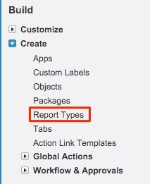

# Informe de posibles clientes con puntos de contacto del comprador {#leads-with-buyer-touchpoints-report}

>[!NOTE]
>
>Puede ver instrucciones que especifican &quot;[!DNL Marketo Measure]&quot; en nuestra documentación, pero aún así ver &quot;[!DNL Bizible]&quot; en su CRM. Estamos trabajando para que esto se actualice y el cambio de marca se reflejará pronto en su CRM.

De serie, dispone de muchas funciones de creación de informes al alcance de la mano cuando se trata de [!DNL Marketo Measure], pero hay algunos tipos de informes adicionales que recomendamos crear. Obtenga información sobre la creación de un tipo de informe de posibles clientes con puntos de contacto de comprador que se incluye a continuación.

1. Vaya a la opción Configuración dentro de [!DNL Salesforce]. Desde allí, expanda la agrupación &quot;Crear&quot; y seleccione **[!UICONTROL Tipos de informes]**.

   

1. Select **[!UICONTROL Nuevo tipo de informe personalizado]**.

   

1. Establezca el objeto principal como &quot;Posibles clientes&quot; y dentro de la entrada &quot;Etiqueta de tipo de informe&quot; &quot;Posibles clientes con puntos de contacto del comprador - Inclusivo&quot;. Almacene el informe en la categoría &quot;Posibles clientes&quot; y cambie el estado de implementación a **[!UICONTROL Implementado]**. A continuación, seleccione **[!UICONTROL Siguiente]**.

   

1. Para las relaciones de objeto, seleccione la opción **[!DNL Marketo Measure]Personas** como el objeto secundario. Seleccione la relación de A a B como: &quot;Cada registro &#39;A&#39; debe tener al menos un registro &#39;B&#39; relacionado.&quot; A partir de ahí, relacionará el objeto &quot;Punto de contacto del comprador&quot; y seleccionará la misma relación entre los objetos B y C.

   

1. Guarde y empiece a crear algunos informes.
