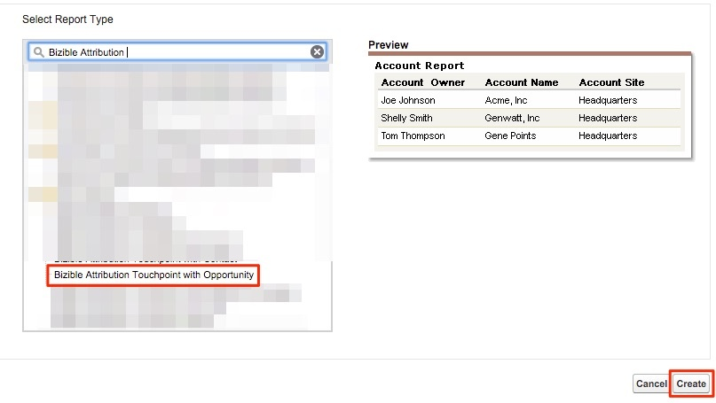

# Oportunidades por canal de marketing {#opportunities-by-marketing-channel}

Este informe muestra el número de oportunidades que generan sus canales de marketing; incluye todas las oportunidades. Sin embargo, puede filtrar este informe para analizar tipos específicos de oportunidades.

1. Haga clic en **[!UICONTROL Informes]** en Salesforce y seleccione **[!UICONTROL Nuevo informe]**.

1. En la búsqueda rápida escriba en &quot;Atribución Bizible&quot; y seleccione la **[!UICONTROL Punto de contacto de atribución Bizible con oportunidad]** Tipo de informe y seleccione **[!UICONTROL Crear]**.

   

1. Desde la parte superior del informe, mostrar **[!UICONTROL Todos los puntos de contacto de atribución Bizible]** y ajuste el campo de fecha según el periodo de tiempo sobre el que desee informar. En nuestro ejemplo, estamos mirando Todo el tiempo. Además, cambie el formato del informe de [!UICONTROL Tabular] hasta **[!UICONTROL Resumen]**.

   

1. Ahora, se agregarán campos al informe. En la búsqueda rápida de la izquierda, escriba &quot;Canal de marketing&quot; y agréguelo a la agrupación Resumen del informe.

   

1. Ahora, ejecute el informe y analice.

   Este es un informe de oportunidades resumido por canal de marketing. Este informe se centra en todas las aplicaciones, pero no dude en filtrar según la fase o el tipo de oportunidad. Además, no dude en agregar cualquier campo del que desee informar.

>[!MORELIKETHIS]
>
>[[!DNL Marketo Measure] Tutorials: Informes de SFDC de Stock](https://experienceleague.adobe.com/en/docs/marketo-measure-learn/tutorials/onboarding/marketo-measure-102/stock-salesforce-reports){target="_blank"}
