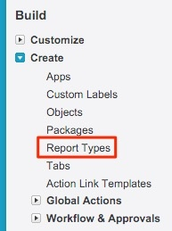
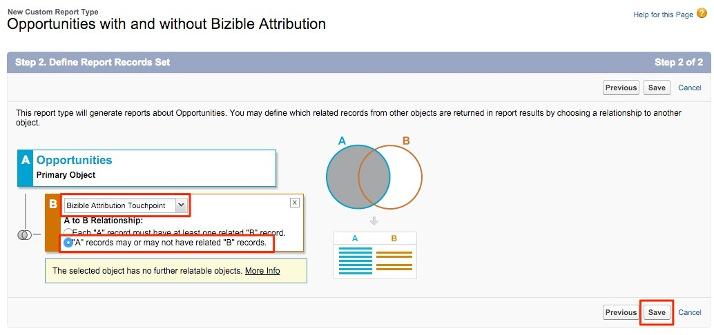

# Informes sobre oportunidades con o sin puntos de contacto de atribución de comprador {#reporting-on-opportunities-with-or-without-buyer-attribution-touchpoints}

>[!NOTE]
>
>Puede que vea instrucciones que especifican &quot;[!DNL Marketo Measure]&quot; en nuestra documentación, pero seguirá viendo &quot;Bizible&quot; en su CRM. Estamos trabajando para que se actualice y el cambio de marca se reflejará pronto en su CRM.

Crea un nuevo tipo de informe para incluir todas las oportunidades con o sin puntos de contacto de atribución de comprador.

1. Vaya a **[!UICONTROL Configuración]** > **[!UICONTROL Crear]** > **[!UICONTROL Tipos de informes]**.

   

1. Seleccione **[!UICONTROL Nuevo tipo de informe personalizado]**.

   

1. Establecer el objeto principal como &quot;[!UICONTROL Oportunidades]&quot;.

   * Asigne un nombre a la etiqueta de tipo de informe como: &quot;Oportunidades con o sin atribución de comprador&quot;.
   * Utilice el mismo nombre para el Nombre del tipo de informe. Dentro de la entrada de descripción, &quot;Oportunidades con o sin puntos de contacto de atribución de comprador&quot;.
   * Guarde el informe dentro de &quot;[!UICONTROL Otro]&quot; y establezca el informe en &quot;[!UICONTROL Implementado]&quot;.

   

1. A partir de ahí, vinculará el objeto de oportunidades al objeto de puntos de contacto de atribución del comprador. Asegúrese de elegir el botón &quot;&#39;A&#39; registros pueden o no tener registros &#39;B&#39; relacionados.&quot; Haga clic en **[!UICONTROL Guardar]** cuando termine.

   

>[!MORELIKETHIS]
>
>[[!DNL Marketo Measure] Tutoriales: Informes adicionales de SFDC](https://experienceleague.adobe.com/es/docs/marketo-measure-learn/tutorials/onboarding/marketo-measure-102/addtional-salesforce-reports)
