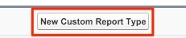

# Tipo de informe de contactos sin oportunidades {#report-type-for-contacts-without-opportunities}

>[!NOTE]
>Puede ver instrucciones que especifican &quot;[!DNL Marketo Measure]&quot; en la documentación, pero aún así ve &quot;[!DNL Bizible]&quot; en su CRM. Estamos trabajando para que se actualice y el cambio de marca se reflejará pronto en su CRM.

Para informar sobre contactos con puntos de contacto del comprador que no están asociados a una oportunidad, debe crear un tipo de informe personalizado.

1. Vaya a **[!UICONTROL Configuración]** > **[!UICONTROL Crear]** > **[!UICONTROL Tipos de informes]**.

   

1. Seleccione **[!UICONTROL Nuevo tipo de informe personalizado]**.

   

1. Establece el [!UICONTROL objeto principal] como &quot;[!UICONTROL Contactos]&quot;. Asigne un nombre a la etiqueta de tipo de informe como &quot;Contactos con puntos de contacto del comprador&quot;. Utilice el mismo nombre para el Nombre del tipo de informe. Dentro de la entrada de descripción, &quot;Contactos con puntos de contacto del comprador&quot;. Guarde el informe dentro de &quot;[!UICONTROL Otro]&quot; y establezca el informe en &quot;[!UICONTROL Implementado]&quot;.

   

1. A partir de ahí, vinculará el objeto Contactos al objeto Puntos de contacto del comprador. Asegúrese de elegir el botón &quot;Cada registro &quot;A&quot; debe tener al menos un registro &quot;B&quot; relacionado.&quot;

   

1. Haga clic en **[!UICONTROL Guardar]** y listo.
