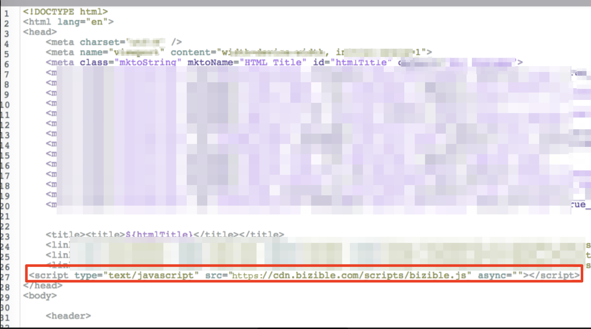

# Agregando [!DNL Marketo Measure] a las páginas de aterrizaje de Marketo {#adding-marketo-measure-to-marketo-landing-pages}

Aprenda a agregar el seguimiento a [!DNL Marketo Engage] páginas de aterrizaje, ya que requieren una administración adicional. [!DNL Marketo Measure] JavaScript debe estar configurado tanto en la página de aterrizaje como en el propio formulario [!DNL Marketo Engage]. Para ello, debe cargar el JavaScript [!DNL Marketo Measure] en [!DNL Marketo Engage], tal como se explica en las siguientes instrucciones.

>[!NOTE]
>
>Si está implementando JavaScript a través de un proveedor de administración de etiquetas como [!DNL Google Tag Manager], no necesita agregar manualmente el JS [!DNL Marketo Measure] a [!DNL Marketo Engage].

## Cómo agregar el script [!DNL Marketo Measure] a las páginas de aterrizaje [!DNL Marketo Engage] {#how-to-add-marketo-measure-script-to-marketo-engage-landing-pages}

1. Inicie sesión en su cuenta de [!DNL Marketo Engage].
1. Seleccione la página de aterrizaje y haga clic en **[!UICONTROL Editar borrador]**.
1. Arrastre el cursor en el elemento HTML.
1. Escriba el JavaScript [!DNL Marketo Measure] en la sección [!UICONTROL head]:

   ``

Ejemplo en la captura de pantalla siguiente

1. Haga clic en **[!UICONTROL Guardar]**.

   

## Notas adicionales {#additional-notes}

* Es posible que ya tenga otros fragmentos de código de seguimiento, como un código [!DNL Google Analytics]. No hay problema con esto, asegúrese de separarlos con punto y coma `;` y un solo espacio. Un ejemplo de cómo se vería esto es:

`; `

* Es probable que tenga varias plantillas de página de aterrizaje en uso. Asegúrese de agregar el código a todas las plantillas que tengan formularios.

* En ocasiones, cuando edita la plantilla para páginas de aterrizaje, debe volver a aprobar las páginas en las que utiliza la página de aterrizaje. Este artículo explica [cómo realizar la aprobación masiva](https://experienceleague.adobe.com/docs/marketo/using/product-docs/demand-generation/landing-pages/landing-page-actions/approve-multiple-landing-pages-at-once.html){target="_blank"}.
