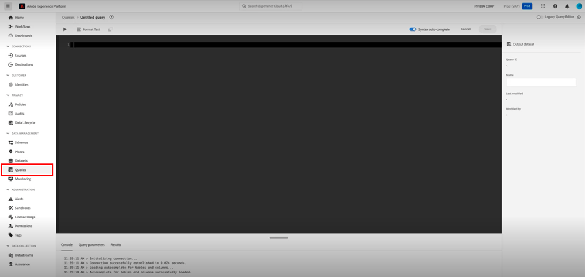

# [!DNL Marketo Measure]Guía de implementación de Ultimate {#marketo-measure-ultimate-implementation-guide}

Este artículo sirve como guía de implementación para Marketo Measure Ultimate, con pasos y perspectivas claros para garantizar una integración y utilización exitosas.

## Diferencias principales del uso de Ultimate con respecto a los niveles estándar {#main-differences-when-using-ultimate-over-standard-tiers}

Importación de datos B2B a través de AEP: se espera que los especialistas en marketing traigan sus datos B2B (por ejemplo: cuenta, oportunidad, contacto, posible cliente, campaña, miembro de la campaña, actividad) a través de AEP. Realiza la ingesta desde casi cualquier fuente de datos y desde varias fuentes de datos del mismo tipo para incorporar todos los datos para la atribución.

* Se utiliza con casi cualquier CRM, no solo con Salesforce y Dynamics.
* Conecte varias instancias de CRM y/o instancias de MAP a una instancia de Marketo Measure.
* Incluya datos de participación y registro de seminarios web de terceros.

Las conexiones directas de CRM y Marketo Engage ya no están disponibles en Ultimate. 

* Ultimate no devuelve los datos al CRM. Los clientes pueden consumir datos del almacén de datos.
* Los especialistas en marketing seguirán trayendo datos de Ad Platform a través de conexiones directas y rastreando actividades web a través del JavaScript de Marketo Measure.

A los usuarios de Ultimate se les suministrará AEP. Si ya tienen AEP, no volveremos a suministrar una nueva instancia.

* La versión de AEP suministrada incluirá todos los conectores de origen, el modelado de datos de esquema, los conjuntos de datos, el servicio de consultas ad hoc y un destino solo para Marketo Measure.

Obtenga más información sobre [Marketo Measure Ultimate](/help/marketo-measure-ultimate/marketo-measure-ultimate-overview.md){target="_blank"}.

## Esquemas y conjuntos de datos {#schemas-and-datasets}

>[!NOTE]
>
>Desproteja [Bloques de creación de un esquema](https://experienceleague.adobe.com/docs/experience-platform/xdm/schema/composition.html?lang=es#building-blocks-of-a-schema){target="_blank"} para obtener una descripción general de los esquemas, las clases y los grupos de campos.

**Esquema XDM = Clase + Grupo de campos de esquema&#42;**

* Los campos obligatorios no se pueden cambiar. Los clientes pueden crear y añadir campos personalizados según sea necesario.
* Ejemplo de nombre de campo basado en jerarquía: accountOrganization.annualRevenue.amount

&#42; _Un esquema consta de una clase y cero o más grupos de campos de esquema. Esto significa que podría componer un esquema del conjunto de datos sin utilizar grupos de campos._

[Información general sobre conjuntos de datos](https://experienceleague.adobe.com/docs/experience-platform/catalog/datasets/overview.html?lang=es){target="_blank"}: todos los datos introducidos correctamente en AEP se conservan dentro del lago de datos como conjuntos de datos. Un conjunto de datos es una construcción de almacenamiento y administración para una colección de datos, normalmente una tabla, que contiene un esquema (columnas) y campos (filas).

## Creación de un esquema {#creating-a-schema}

Recomendamos utilizar una utilidad de generación automática para crear 10 esquemas B2B estándar.

* Los pasos para descargar y configurar la utilidad [los puede encontrar aquí](https://experienceleague.adobe.com/docs/experience-platform/sources/connectors/adobe-applications/marketo/marketo-namespaces.html?lang=es#set-up-b2b-namespaces-and-schema-auto-generation-utility){target="_blank"}.

Para los que tengan un _**derecho de CDP**_: cree esquemas en la página Orígenes.

* Desde un origen, seleccione Añadir datos > Usar plantillas

* Seleccione una cuenta y todas las plantillas B2B para crear 10 esquemas B2B estándar.

## Flujos de datos {#dataflows}

[Información general de flujos de datos](https://experienceleague.adobe.com/docs/experience-platform/dataflows/home.html?lang=es){target="_blank"}

**Pasos para crear un flujo de datos:**

1. Seleccione un origen.
1. Seleccione una cuenta existente o cree una cuenta.
1. Seleccione un tipo de datos de la lista de tipos disponibles para importarlo desde el origen.
1. Seleccione el conjunto de datos existente o cree uno nuevo.
1. Asigne los campos del origen al esquema.

   >[!NOTE]
   >
   >* Si asigna un tipo de esquema a otro idéntico, se realizará automáticamente.
   >* También puede importar la asignación desde otro flujo del sistema.
   >* Puede asignar un campo de origen a varios campos de destino, pero no puede hacer lo contrario.
   >* Puede crear campos calculados ([Funciones de asignación de preparación de datos](https://experienceleague.adobe.com/docs/experience-platform/data-prep/functions.html?lang=es){target="_blank"}).

   >[!CAUTION]
   >
   >* Puede editar un flujo de datos, pero los datos no se rellenan cuando se cambia una asignación.
   >* Si un campo obligatorio es NULL, se rechazará todo el flujo.

   >[!NOTE]
   >
   >[Requisito de integridad de datos de Marketo Measure Ultimate](/help/marketo-measure-ultimate/data-integrity-requirement.md){target="_blank"}

1. Establezca una cadencia de carga de datos.
1. Revise y complete.
1. Consulte la página “Estado de la cuenta” en la configuración de la IU de Measure para ver el estado del flujo de datos.

**Monitorización:**

Página Orígenes > Flujos de datos para comprobar el estado de los flujos de datos

* Para ver los detalles de actividad de un conjunto de datos, simplemente haga clic en él.
* Para ver los errores de flujo de datos, seleccione un flujo de datos, elija una ejecución de flujo de datos y haga clic en &quot;Previsualización de diagnósticos de error&quot;.

## Inspección de datos {#data-inspection}

Opción 1: para ejecutar consultas directamente desde la interfaz de usuario, acceda a la pestaña Consultas en Administración de datos.

Opción 2: [Descargue y utilice PSQL](https://experienceleague.adobe.com/docs/experience-platform/query/clients/psql.html?lang=es){target="_blank"} (más rápido y fiable).

## Activación del conjunto de datos para Marketo Measure {#activate-dataset-for-marketo-measure}

Antes de empezar, vaya a la sección &quot;Experience Platform > Asignación de zona protegida&quot; en la configuración de la interfaz de usuario de Measure y asigne una zona protegida.

>[!CAUTION]
>
>Esto no se puede cambiar una vez seleccionado.

1. En AEP, vaya a “Destinos > Página de Marketo Measure” para exportar conjuntos de datos.
1. Configure el destino.
1. Active el conjunto de datos.
1. Consulte la página “Estado de la cuenta” en la configuración de la IU de Measure para ver el estado del flujo de datos.

>[!NOTE]
>
>* Los datos de una entidad determinada (por ejemplo, cuenta) de una fuente de datos determinada solo pueden entrar en un conjunto de datos. Cada conjunto de datos solo puede incluirse en un flujo de datos. Las infracciones detendrán el flujo de datos en el tiempo de ejecución.
>* Elimine todo el destino en AEP para eliminar datos en Measure. La deshabilitación solo detendrá las nuevas exportaciones de datos y conservará los datos antiguos.
>* La configuración de la medida será básicamente la misma, pero algunas partes, como la Asignación de fases, tendrán un aspecto diferente.
>* Un nuevo flujo de datos tarda unas horas en generar una ejecución de flujo y, a continuación, se produce a intervalos regulares por hora.

En Measure, la moneda predeterminada debe configurarse en la sección “Moneda”

* Si utiliza varias monedas, el esquema de tasa de conversión de moneda debe rellenarse en AEP para que lo leamos y utilicemos para las conversiones.

**Asignación de fases:**

No importamos automáticamente las fases de los datos de usuario, por lo que todas las fases deben asignarse manualmente.

* Se pueden asignar fases desde diferentes orígenes.

Si las fases no están asignadas, el sistema no funcionará porque no habrá ningún lugar adónde puedan ir los datos.

Si es cliente de Marketo Measure Ultimate y ha establecido su objeto de panel predeterminado como contacto, no utilice los dos campos siguientes específicos de posible cliente ([obtenga más información aquí](/help/marketo-measure-ultimate/data-integrity-requirement.md){target="_blank"}).

* b2b.personStatus
* b2b.isConverted

**Reglas de los miembros de la campaña:**

Debe elegir un conjunto de datos y establecer reglas para cada uno.

**Reglas de los eventos de la experiencia:**

Debe elegir un conjunto de datos y seleccionar tipos de actividades.

* Ya no se admiten actividades personalizadas.
* Si el cliente tiene actividades que no se ajustan a las opciones disponibles, sugerimos clasificarlas como “Momentos interesantes” y utilizar campos personalizados para distinguirlas.

**Canales sin conexión:**

* No aplicamos reglas de asignación de canales específicas para conjuntos de datos, por lo que sería global.
* Finalmente, tenemos que hacer coincidir tanto el tipo de campaña de CRM como el canal, pero por ahora, podemos asignar el nombre del canal a ambos campos como solución alternativa.
* **Reglas de canal: los datos rellenados no tendrán datos de transición de fase.**

La configuración de Touchpoint y del segmento sigue siendo la misma.
