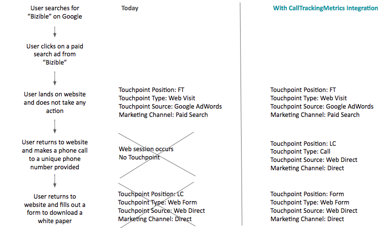

# Integración de seguimiento de llamadas {#call-tracking-integration}

Nuestra integración con [!DNL CallTrackingMetrics] está diseñado para combinar una sesión web con una llamada telefónica. Una llamada telefónica se trata como un envío de formulario a [!DNL Marketo Measure]. Atribuye crédito a una sesión web que, de lo contrario, solo se habría considerado una visita web porque no hubo envío real del formulario.

## Seguimiento de llamadas explicado {#call-tracking-explained}

&quot;Seguimiento de llamadas&quot; en el sentido general es un producto de compañías como [!DNL CallTrackingMetrics], [!DNL DiaglogTech], [!DNL Invoca], o [!DNL CallRail], por nombrar algunos. Los usuarios ven números de teléfono únicos en función de los diferentes canales de marketing o campañas de las que proceden. Esto permite a los especialistas en marketing ver el rendimiento de esos canales o campañas.

## Antes y después de {#before-and-after}

Consulte el diagrama de flujo siguiente para ver cómo [!DNL Marketo Measure] se utiliza para gestionar llamadas telefónicas sin una integración con CallTrackingMetrics. La llamada telefónica que se realizó no se rastreó, por lo que se vio como una sesión web y no se creó ningún punto de contacto para ella. No fue hasta la siguiente visita en la que el usuario completó un formulario que finalmente se rellenó un punto de contacto.

Con la integración, puede ver que la sesión web estaba realmente vinculada a una llamada telefónica. El siguiente relleno de formulario termina siendo un contacto PostLC y se sigue rastreando como parte del recorrido.

## Cómo funciona {#how-it-works}

CallTrackingMetrics tiene que hacer un poco de trabajo de desarrollo en su extremo para que esto funcione. Con el javascript que colocan en el sitio, CallTrackingMetrics puede obtener el _biz_uid del [!DNL Marketo Measure] cookie. Este &quot;[!DNL BizibleId]&quot; se almacena entonces mediante CallTrackingMetrics.

Cuando un visitante llega a su sitio y realiza una llamada telefónica, es tarea de CallTrackingMetrics insertar esos datos en [!DNL Salesforce]  Normalmente, una [!DNL Salesforce Task] se crea que rellena datos como número de teléfono, asunto, tipo y, ahora, el [!DNL BizibleId]

El [!DNL BizibleId] es un campo que se instala con la versión 6.7 o posterior de [!DNL Marketo Measure] Paquete de atribución de marketing.

A continuación se muestra un ejemplo de un registro Task con la variable [!DNL BizibleId] rellenado.

Cuándo [!DNL Marketo Measure] encuentra un registro Task con un conocido [!DNL BizibleId] valor rellenado, [!DNL Marketo Measure] puede asignar ese usuario a una sesión web con el mismo [!DNL BizibleId] y atribuyen esa sesión a una llamada telefónica en lugar de a una visita web.

## El Touchpoint {#the-touchpoint}

Cuándo [!DNL Marketo Measure] Podemos importar/descargar la tarea, procesamos ese detalle junto con la sesión web. En la mayoría de los casos, se puede combinar con un referente o anuncio. En el siguiente ejemplo, un visitante encontró el negocio a través de un anuncio de Google de pago e hizo una llamada telefónica.

El [!UICONTROL Touchpoint] El tipo &quot;Llamada&quot; se extrae de la tarea, de la captura de pantalla anterior, que también se rellena con CallTrackingMetrics cuando se crea la tarea.

## Informes {#reporting}

Valores de Touchpoint Type que [!DNL Marketo Measure] normalmente, los eventos push son visitas web, formularios web o chats web, pero en el caso de los puntos de contacto de CallTrackingMetrics, el tipo de punto de contacto será llamada telefónica. Esto ayuda a los especialistas en marketing a ver qué canales atraen la mayor cantidad de llamadas telefónicas y generan ingresos para su organización.

## Preguntas frecuentes {#faq}

**¿Por qué es mi visita web de tipo touchpoint?**

El tipo de punto de contacto se rellena desde el campo Task.Type. Si el campo Task.Type está en blanco, [!DNL Marketo Measure] establecerá automáticamente el Tipo de punto de contacto como Visita web. Una vez rellenado el campo Task.Type [!DNL Marketo Measure] leerá ese valor y rellenará el Tipo de punto de contacto en consecuencia.

**¿Qué otros campos rellena el punto de contacto desde la llamada telefónica?**

Tanto el Tipo de punto de contacto como el Medio contendrán los datos extraídos de Task.Type. El resto de los puntos de datos se extraen de los datos de seguimiento web y JavaScript.

**¿Por qué esta llamada de teléfono no está vinculada a una sesión web?**

En primer lugar, compruebe la Task para asegurarse de que haya un [!DNL BizibleId] rellenado. Si no hay ningún valor, no se creará ni se podrá crear un punto de contacto para él. Esto deberá escalarse con CallTrackingMetrics.

Si hay un valor, tenga en cuenta que solo consideramos que todas las sesiones web son de 30 minutos. Si se hizo clic en un anuncio de Google a las 12:17 p. m. (inicio de la sesión en el sitio web), pero la llamada telefónica no se produjo hasta la 1:05 p. m., no combinaremos la sesión web y la llamada telefónica. Más bien, [!DNL Marketo Measure] creará un elemento independiente [!DNL Salesforce Task] punto de contacto para rastrear la llamada telefónica, pero no tendrá datos de sesión web.

## Asociaciones {#partnerships}

[!DNL Marketo Measure] actualmente tiene un socio oficial de seguimiento de llamadas que ha pasado por el proceso de integración &quot;oficial&quot; con nosotros, que incluía marketing conjunto y formación sobre productos. Este socio es CallTrackingMetrics.
