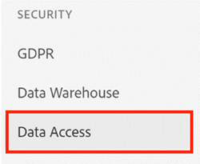
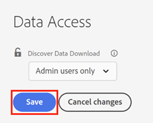

# Control de acceso de [!UICONTROL Descubrir descarga de datos] {#discover-data-download-access-control}

El control [!UICONTROL Descarga de datos de Discover] permite a los administradores de [!DNL Marketo Measure] establecer las directivas de descarga de datos para los paneles de Discover en función de los roles de los usuarios. El control cubre todas las acciones de descarga de datos en los paneles de Discover.

1. Haga clic en **[!UICONTROL Acceso a datos]** en [!UICONTROL Seguridad].

   

1. Haga clic en la lista desplegable y seleccione la opción adecuada para la consola.

   

   <table>
    <tr>
     <td><strong>Todos los usuarios</strong></td>
     <td>Todos los usuarios pueden descargar datos, incluidos los formatos PDF y CSV.</td>
    </tr>
    <tr>
     <td><strong>Solo usuarios administradores</strong></td>
     <td>Solo los usuarios administradores pueden descargar datos, incluidos los formatos PDF y CSV.</td>
    </tr>
    <tr>
     <td><strong>Ninguna</strong></td>
     <td>Nadie puede descargar datos, incluidos los formatos PDF y CSV.</td>
    </tr>
   </table>

1. Haga clic en **[!UICONTROL Guardar]** cuando termine.

   

>[!NOTE]
>
>Es posible que la configuración no surta efecto hasta que los usuarios hayan cerrado sesión y vuelto a iniciarla.
