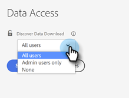

# [!UICONTROL Control de acceso de descarga de datos de Discover] {#discover-data-download-access-control}

[!UICONTROL Descarga de datos de Discover] el control habilita [!DNL Marketo Measure] Los administradores deben establecer las políticas de descarga de datos para los paneles de Discover en función de las funciones de los usuarios. El control cubre todas las acciones de descarga de datos en los paneles de Discover.

1. Clic **[!UICONTROL Acceso a datos]** bajo [!UICONTROL Seguridad].

   

1. Haga clic en la lista desplegable y seleccione la opción adecuada para la consola.

   

   <table>
    <tr>
     <td><strong>Todos los usuarios</strong></td>
     <td>Todos los usuarios pueden descargar datos, incluidos los formatos PDF y CSV.</td>
    </tr>
    <tr>
     <td><strong>Solo usuarios administradores</strong></td>
     <td>Solo los usuarios administradores pueden descargar datos, incluidos los formatos PDF y CSV.</td>
    </tr>
    <tr>
     <td><strong>Ninguno</strong></td>
     <td>Nadie puede descargar datos, incluidos los formatos PDF y CSV.</td>
    </tr>
   </table>

1. Clic **[!UICONTROL Guardar]** cuando termine.

   

>[!NOTE]
>
>Es posible que la configuración no surta efecto hasta que los usuarios hayan cerrado sesión y vuelto a iniciarla.
